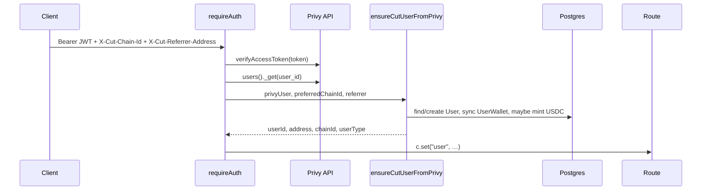
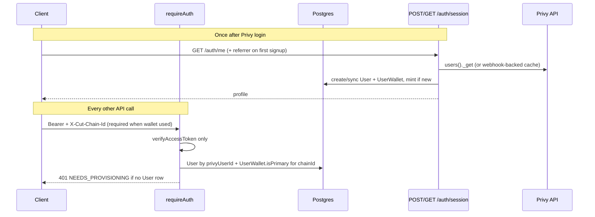

# Auth & Privy provisioning plan

How identity works today, what is risky, and a clean split between **authenticate** (every request) and **provision** (signup / wallet sync).

Related audit item: [SECURITY_AUDIT.md](./SECURITY_AUDIT.md) §6 — *Auth middleware provisions users and wallets on every request*.

---

## Current flow (as implemented)

### Every authenticated request

All routes using `requireAuth` or `optionalAuth` run the same path in `server/src/middleware/auth.ts`:



**Cost per request:** one Privy Management API fetch (`users()._get`) plus DB reads/writes for wallet sync.

### Client headers

From `client/src/contexts/AuthContext.tsx` and `client/src/utils/apiClient.ts`:

| Header | When sent | Server use |
|--------|-----------|------------|
| `Authorization: Bearer …` | Every authenticated call | JWT verify |
| `X-Cut-Chain-Id` | When wagmi chain is known | Wallet pick + `UserWallet.chainId` |
| `X-Cut-Referrer-Address` | While referral stored in sessionStorage | **New-user signup only** (but sent on all calls until `/auth/me` succeeds) |

After Privy login, the client loads the Cut profile via **`GET /api/auth/me`** (same middleware stack — so the first `/me` also provisions). Referrer header is cleared only after a successful `/me`.

### `ensureCutUserFromPrivy` (`server/src/lib/privyUserProvisioning.ts`)

Single function used for both **signup** and **every subsequent request**.

| Branch | Trigger | Side effects |
|--------|---------|--------------|
| **Existing user** | `User.privyUserId` match | Sync email from Privy; `syncUserWalletsForPrivyUser` (creates missing `UserWallet` rows, updates `isPrimary`) |
| **Wallet-first link** | `UserWallet` exists, no `privyUserId` yet | Attach `privyUserId`; sync email + wallets |
| **New user** | Neither | Validate referrer (if required); optional testnet USDC mint; create `User` + primary `UserWallet`; record referral metadata |

**Session address** returned to routes is from `pickEvmWallet(privyUser, preferredChainId)` — Privy linked accounts, **not** `UserWallet.isPrimary` in Postgres.

`pickEvmWallet` prefers smart wallet over EOA, and uses `X-Cut-Chain-Id` when it is Base (8453) or Base Sepolia (84532).

### `syncUserWalletsForPrivyUser` (runs on every request for existing users)

1. Collect all Base / Base Sepolia addresses from Privy (`collectCutEvmWalletLinks` — smart wallet duplicated per chain).
2. For each `(chainId, publicKey)`: `findUnique`; **create** if missing.
3. If address belongs to **another** user: **log warning and skip** (no 409).
4. Reset `isPrimary` on the chain; set primary to match `pickEvmWallet`.

### Where `c.get("user")` matters

| Field | Typical use |
|-------|-------------|
| `userId` | Almost all authz (lineups, leagues, contests, admin) |
| `address` | On-chain checks — e.g. `verifyPrimaryEntryOwner`, secondary participant recording |
| `chainId` | Chain-scoped wallet + contract reads |
| `userType` | Admin middleware |

On-chain join ownership compares `user.address` from middleware to `entryOwner()` on-chain — so a mismatch between Privy-picked address and DB primary wallet is a security/consistency bug, not just cosmetic.

### What already works well

- Privy JWT verification before any DB access.
- `PrivyWalletIdentityConflictError` → **403** when the same wallet is bound to a different Privy account (hard conflict on signup/link path).
- Referral errors use stable codes (`REFERRER_REQUIRED`, `REFERRER_NOT_IN_TREE`, etc.).
- Email uniqueness enforced on sync/signup.
- Test USDC mint gated: `ENABLE_TOKEN_MINTING=true` **and** Base Sepolia only.
- Backfill script: `server/src/scripts/syncUserWalletsFromPrivy.ts`.
- Client treats `/auth/me` as the session bootstrap and surfaces referral/signup errors clearly.

---

## Problems (why this is an audit item)

1. **Privy API on every request** — `users()._get` burns quota and adds latency; unrelated GETs (contest list, lineups) should not need fresh linked-account data.

2. **Wallet sync writes on every request** — `syncUserWalletsForPrivyUser` can INSERT/UPDATE even when nothing changed.

3. **Signup can happen on any route** — first authenticated hit to `/contests`, `/lineups`, etc. can create the user, not only `/auth/me`. Race: two parallel requests during first login.

4. **Session address ≠ DB source of truth** — middleware returns Privy-picked address; DB `UserWallet.isPrimary` may differ after silent skips.

5. **Silent wallet conflict** — if Privy reports an address already owned by another user, sync skips with a log; caller still gets an `address` from `pickEvmWallet` that may not exist as their wallet row.

6. **Referrer header on all requests** — harmless for existing users (ignored after user exists) but confusing; belongs only on provisioning.

7. **`X-Cut-Chain-Id` is optional in middleware** — defaults to Sepolia in wallet pick; client usually sends it, but wallet-sensitive routes do not require it.

---

## Target model

**Authenticate** on every request (cheap, read-mostly). **Provision** only at explicit entry points (signup, wallet sync).



### Design rules

| Concern | Rule |
|---------|------|
| **Who is logged in?** | JWT `user_id` → `User.id` via `User.privyUserId` (indexed). |
| **Which wallet?** | `UserWallet` where `userId` + `chainId` + `isPrimary = true`. Require `X-Cut-Chain-Id` on wallet-sensitive routes. |
| **Create user** | Only inside provisioning handler (`GET /auth/me` or dedicated `POST /auth/session`). |
| **Sync wallets** | Only in provisioning handler, optional `POST /auth/sync-wallets`, Privy webhook, or admin script — **not** middleware. |
| **Referrer** | Accept only on provisioning; ignore elsewhere. |
| **Test mint** | Only on new-user provisioning path (unchanged). |
| **Wallet conflict** | If Privy address ∈ another user → **409** `WALLET_OWNED_BY_OTHER_ACCOUNT`; do not silently skip. |
| **Missing user row** | Middleware returns **401** with code `NEEDS_PROVISIONING`; client calls `/auth/me`. |

### Proposed `ContextVariableMap.user`

Keep the same shape routes expect, but populate from DB:

```ts
{
  userId: string;      // User.id
  address: string;     // UserWallet.publicKey (primary for chainId)
  chainId: number;     // from X-Cut-Chain-Id (required when address needed)
  userType: string;
  privyUserId: string; // optional, for logging / sync endpoints
}
```

If no primary wallet for the requested chain → **409** `WALLET_NOT_PROVISIONED_FOR_CHAIN` (client re-runs `/auth/me` or switches chain).

---

## Implementation plan

### Phase 1 — Split read vs write (no behavior change yet)

**Goal:** Same external behavior, clearer modules.

| Task | File(s) |
|------|---------|
| Extract `resolveSessionUser({ privyUserId, chainId })` — DB only, returns `CutAuthUser` or null | `privyUserProvisioning.ts` |
| Rename/clarify `provisionUserFromPrivy` — current create/sync/mint/referral logic | `privyUserProvisioning.ts` |
| Unit tests: primary wallet selection, conflict detection | `privyUserProvisioning.test.ts` |

### Phase 2 — Middleware becomes read-only

**Goal:** Stop Privy `users()._get` and wallet writes in middleware.

| Task | Detail |
|------|--------|
| `authenticateRequest` | `verifyAccessToken` → `resolveSessionUser(access.user_id, chainId)` |
| Missing `User` | **401** `{ error, code: "NEEDS_PROVISIONING" }` |
| Missing primary wallet for chain | **409** `{ code: "WALLET_NOT_PROVISIONED_FOR_CHAIN" }` |
| Remove | `ensureCutUserFromPrivy` call from middleware |
| Remove | Referrer header parsing from middleware |

Wallet-sensitive routes should enforce `X-Cut-Chain-Id` (middleware or small helper used by contest/lineup/bets routes).

### Phase 3 — Single provisioning entry (`GET /auth/me`)

**Goal:** Only `/auth/me` (or new `POST /auth/session`) mutates identity.

| Task | Detail |
|------|--------|
| Before profile load | Call `provisionUserFromPrivy` (Privy `_get` + sync/create/mint) |
| Referrer header | Read only here |
| Response | Unchanged shape (`walletAddress`, `chainId`, …) |
| Client | Already calls `/auth/me` after login; on **401 NEEDS_PROVISIONING** from any route, retry `/auth/me` once |
| Client | Stop sending `X-Cut-Referrer-Address` except on the provisioning request (or first `/auth/me` only) |

Optional: **`POST /auth/sync-wallets`** — authenticated, re-runs wallet sync when user links a new account in Privy; client calls after Privy `linkWallet` events.

### Phase 4 — Harden conflicts and races

| Task | Detail |
|------|--------|
| Wallet owned by another user | Throw **409** in sync (replace silent skip) |
| Signup race | Wrap new-user create in transaction; rely on unique `User.privyUserId` and `UserWallet (chainId, publicKey)` |
| Session address | Always from DB primary wallet after Phase 2 |
| Align `verifyPrimaryEntryOwner` | Uses same primary wallet as middleware |

### Phase 5 — Optional: webhook + cache (ops scale)

| Task | Detail |
|------|--------|
| Privy webhook | `user.linked_account` → enqueue wallet sync job |
| Short TTL cache | Privy user object keyed by `privyUserId` for `/auth/me` only (e.g. 60s) to debounce rapid refreshes |
| Rate limit | `/auth/me` and `/auth/sync-wallets` per IP + per `privyUserId` |

Not required for correctness; reduces Privy API load after Phase 2.

---

## Route classification (after Phase 2)

| Needs | Routes | Middleware |
|-------|--------|------------|
| `userId` only | Most reads, admin (non-wallet), stream token | JWT + DB user |
| `userId` + primary wallet | Contest join, secondary participants, side bets, on-chain ownership | JWT + DB user + **required** `X-Cut-Chain-Id` |
| Provisioning | `GET /auth/me`, optional `POST /auth/sync-wallets` | JWT + Privy `_get` + writes |

`optionalAuth` routes (contest directory, lobby) continue to work with JWT + DB user when token present; no Privy fetch.

---

## Client changes (summary)

1. **`AuthContext`** — On 401 `NEEDS_PROVISIONING`, call `/auth/me` then retry once (or serialize: never call other APIs until `/me` completes — already mostly true).
2. **Referrer header** — Attach only to `/auth/me` (first successful provisioning), not `apiClient` globally.
3. **`X-Cut-Chain-Id`** — Always send when authenticated; use env target chain for `/auth/me` (already does via `getTargetChainIdFromEnv()`).
4. **After Privy link wallet** — Call `refreshUser()` / `/auth/sync-wallets` when UI detects new linked account.

---

## Testing checklist

- [ ] New signup via `/auth/me` only — referrer required when env says so
- [ ] Existing user: middleware hits DB only (mock Privy `_get` — should not be called)
- [ ] User without row: API returns `NEEDS_PROVISIONING` until `/me`
- [ ] Wallet conflict: 409, not silent skip
- [ ] Primary wallet on Sepolia vs Base: `X-Cut-Chain-Id` selects correct `UserWallet`
- [ ] Contest join: `user.address` matches DB primary and on-chain owner
- [ ] Parallel first-login requests: one user row, no duplicate wallets
- [ ] `syncUserWalletsFromPrivy.ts` still works for backfill

---

## Docs to update when implemented

- [spec/server/api.md](./spec/server/api.md) — auth errors (`NEEDS_PROVISIONING`, 409 codes); `X-Cut-Chain-Id` required where noted
- [spec/cross-layer.md](./spec/cross-layer.md) — identity sequence diagram (provision vs authenticate)
- [spec/server/architecture.md](./spec/server/architecture.md) — middleware table
- [SECURITY_AUDIT.md](./SECURITY_AUDIT.md) — mark §6 complete

---

## Suggested order relative to other audit work

This pairs well **before or alongside** rate limiting (audit §4): lighter middleware reduces per-request cost, making rate limits more effective.

Does **not** replace paymaster allowlisting or side-bet funding verification — those remain separate high-priority items.
