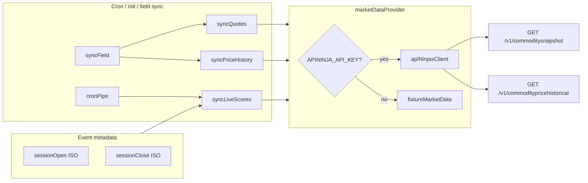

# Commodity Picks — API Ninjas integration plan

**Status:** Evaluation in progress — implementation deferred.

**Related:** [competition brief](docs/sports/commodities/competition-brief.md) · [data sources](docs/sports/commodities/data-sources.md) · [COMMODITIES_JOURNAL.md](COMMODITIES_JOURNAL.md) · [API Ninjas Commodity Price API](https://api-ninjas.com/api/commodityprice)

---

## Summary

Integrate API Ninjas Commodity Price API (paid tier) as the live market data source. Expand the catalog to all 30 API-supported commodities (drop nickel/lead/zinc), keep fixture fallback for offline dev, and wire snapshot + historical endpoints into the existing sync pipeline.

**Depends on:** Configurable session bounds (Phase A) — `metadata.commodities.sessionOpen` / `sessionClose` are authoritative for contest lifecycle. Phase B adds **intraday scoring** at those exact timestamps.

**Pool size:** 24 → **30** contracts. Roster stays **5 picks** (unchanged seed rules).

---

## Session bounds and data requirements

Each event stores ISO `sessionOpen` and `sessionClose` in `metadata.commodities` (set at init via `--open`/`--close` or env defaults). Contest activation/settlement already uses these timestamps.

| Concern | Phase A (shipped) | Phase B (this integration) |
|---------|-------------------|----------------------------|
| Lifecycle | `sessionOpen` → LIVE; `sessionClose` → COMPLETE | Unchanged |
| Scoring window | Anchor-date daily OHLC (fixture) | Intraday OHLC at session bounds |
| `openPrice` | Daily bar open for `sessionDate` | Price at/before `sessionOpen` |
| `currentPrice` (LIVE) | Daily bar close / quote | Snapshot `price` |
| `closePrice` (COMPLETE) | Daily bar close | Price at/before `sessionClose` |

API Ninjas `/v1/commoditypricehistorical` supports intraday OHLCV with `period` values `1m`, `5m`, `15m`, `30m`, `1h`, `4h`, `1d` and `start`/`end` Unix timestamps (Premium tier).

---

## Assumptions (paid tier)

- **Premium+** access: live prices, `/v1/commoditysnapshot`, `/v1/commoditypricehistorical` (including intraday periods)
- Auth via `APININJA_API_KEY` → header `X-Api-Key` (see `server/.env.example`)
- **Full API catalog:** use all 30 commodities API Ninjas supports
- Intraday historical covers arbitrary session windows (sub-day, full day, cross-midnight)

---

## Implementation tasks

- [ ] Expand catalog to all 30 API Ninjas commodities with `apiNinjaName` mapping (server + client + icons + brief); remove `NI` / `LED` / `ZNC`
- [ ] Create `apiNinjasClient.ts` with snapshot + historical fetch, USX normalization, caching, 429 backoff
- [ ] Add `selectHistoricalPeriod(sessionOpen, sessionClose)` — pick finest `period` that fits window (`1m`…`4h`, fallback `1d`)
- [ ] Add `resolveBarAtTimestamp(bars, targetUnix)` — nearest bar open/close for session boundary
- [ ] Create `marketDataProvider.ts` routing API vs fixture; shared `MarketQuote` / `SessionSnapshot` types
- [ ] Update `syncQuotes`, `syncPriceHistory`, `syncLiveScores` + dry-run field count (30) to use `marketDataProvider`
- [ ] Wire `syncLiveScores` to event metadata bounds (not anchor-date daily bar only)
- [ ] Extend `fixtureMarketData.ts` with timestamp-keyed synthetic bars for dev/CI when API key absent
- [ ] Update data-spike (`--live`), local-eval, `.env.example`; add API Ninjas docs
- [ ] Unit tests for client normalization, period selection, boundary price resolution, provider routing
- [ ] Update `data-sources.md`, `competition-brief.md` (pool size 30, intraday scoring), event runbook, journal

---

## Full 30-commodity catalog

`apiNinjaName` is the API `?name=` slug. `symbol` is our display/futures-style ticker. `externalId` = symbol without `=F`.

| # | Display name | `apiNinjaName` | `symbol` | Sector |
|---|--------------|----------------|----------|--------|
| 1 | Crude Oil | `crude_oil` | `CL=F` | energy |
| 2 | Brent Crude | `brent_crude_oil` | `BZ=F` | energy |
| 3 | Natural Gas | `natural_gas` | `NG=F` | energy |
| 4 | Heating Oil | `heating_oil` | `HO=F` | energy |
| 5 | Gasoline | `gasoline_rbob` | `RB=F` | energy |
| 6 | Gold | `gold` | `GC=F` | precious |
| 7 | Silver | `silver` | `SI=F` | precious |
| 8 | Platinum | `platinum` | `PL=F` | precious |
| 9 | Palladium | `palladium` | `PA=F` | precious |
| 10 | Micro Gold | `micro_gold` | `MGC=F` | precious |
| 11 | Micro Silver | `micro_silver` | `SIL=F` | precious |
| 12 | Copper | `copper` | `HG=F` | metals |
| 13 | Aluminum | `aluminum` | `ALI=F` | metals |
| 14 | Wheat | `wheat` | `ZW=F` | ag |
| 15 | Corn | `corn` | `ZC=F` | ag |
| 16 | Soybeans | `soybean` | `ZS=F` | ag |
| 17 | Soybean Oil | `soybean_oil` | `ZL=F` | ag |
| 18 | Soybean Meal | `soybean_meal` | `ZM=F` | ag |
| 19 | Lumber | `lumber` | `LBS=F` | ag |
| 20 | Lean Hogs | `lean_hogs` | `HE=F` | ag |
| 21 | Live Cattle | `live_cattle` | `LE=F` | ag |
| 22 | Feeder Cattle | `feeder_cattle` | `GF=F` | ag |
| 23 | Class III Milk | `class_3_milk` | `DC=F` | ag |
| 24 | Rice | `rough_rice` | `ZR=F` | ag |
| 25 | Oats | `oat` | `ZO=F` | ag |
| 26 | Cotton | `cotton` | `CT=F` | softs |
| 27 | Coffee | `coffee` | `KC=F` | softs |
| 28 | Sugar | `sugar` | `SB=F` | softs |
| 29 | Cocoa | `cocoa` | `CC=F` | softs |
| 30 | Orange Juice | `orange_juice` | `OJ=F` | softs |

**Removed:** Nickel (`NI`), Lead (`LED`), Zinc (`ZNC`).

**Files to update:** `server/src/sports/commodities/commodityCatalog.ts`, `client/src/sports/commodities/catalog.ts`, `docs/sports/commodities/competition-brief.md`, `client/src/sports/commodities/icons.tsx` (9 new icon keys), `server/src/scripts/commoditiesDryRun.ts` (`fieldCount !== 30`).

---

## Architecture



### New files (`server/src/sports/commodities/`)

| File | Role |
|------|------|
| `apiNinjasClient.ts` | Typed HTTP client (pattern: `server/src/sports/f1/openf1Client.ts`) |
| `marketDataProvider.ts` | Single entry point for sync modules; API vs fixture |
| `sessionScoring.ts` | Period selection + boundary price resolution from historical bars |

### Keep as fallback

`server/src/sports/commodities/fixtureMarketData.ts` — offline/CI when key is missing or `COMMODITIES_USE_FIXTURE_PRICES=true`. Extend with timestamp-keyed bars for intraday session windows.

---

## Catalog mapping

```ts
export type CommodityCatalogEntry = {
  displayName: string;
  symbol: string;        // e.g. CL=F → externalId CL
  apiNinjaName: string;  // e.g. crude_oil
  sector: CommoditySector;
  iconKey: string;
};
```

**Snapshot sync:** one `GET /v1/commoditysnapshot` returns all 30; index response by `value` slug and map to catalog rows.

---

## API client (`apiNinjasClient.ts`)

**Base URL:** `https://api.api-ninjas.com`

| Method | Endpoint | Used for |
|--------|----------|----------|
| `fetchCommoditySnapshot()` | `GET /v1/commoditysnapshot` | All 30 picker quotes in one call |
| `fetchCommodityHistorical(name, { period, start, end })` | `GET /v1/commoditypricehistorical` | Session boundary prices + 30-day sparklines |

**Historical `period` selection** (`sessionScoring.ts`):

| Session duration | Preferred `period` |
|------------------|-------------------|
| ≤ 1 hour | `1m` or `5m` |
| ≤ 4 hours | `15m` or `30m` |
| ≤ 1 day | `1h` or `4h` |
| Multi-day | `4h` or `1d` |

Pass `start` / `end` as Unix seconds from `metadata.commodities.sessionOpen` / `sessionClose`.

**Normalization** (`normalizeApiNinjaPrice`):

- `currency_unit === "USX"` → divide by 100 (major units for consistent % scoring)
- Optional `unit` on `CommodityParticipantMetadata` for future display
- Map to internal `MarketQuote` type

**Resilience:** snapshot cache 4 min; historical cache 1 hr per symbol+window; 429 backoff; missing symbol → DNP (0 points).

---

## Scoring model

Rule: **% return session open → current/close** (`packages/sport-commodities/src/live-scores.ts`).

| Phase | openPrice | currentPrice | closePrice |
|-------|-----------|--------------|------------|
| **LIVE** | Historical bar at `sessionOpen` (persist on first sync) | Snapshot `price` | `null` |
| **COMPLETE** | Stored `openPrice` | Snapshot `price` | Historical bar at `sessionClose` |

Boundary resolution: fetch intraday OHLCV for `[sessionOpen, sessionClose]`; use bar `open` at first bar ≥ open time; use bar `close` at last bar ≤ close time. If no exact bar, use nearest prior bar (document DNP policy if gap > one period).

**Sparklines:** separate daily `period=1d` fetch (30 points) for picker display — unchanged from original plan.

---

## Sync module changes

- `server/src/sports/commodities/syncQuotes.ts` — `marketDataProvider.getQuotes()` from snapshot
- `server/src/sports/commodities/syncPriceHistory.ts` — 30 daily historical fetches once/event (cached) for sparklines
- `server/src/sports/commodities/syncLiveScores.ts` — `getSessionSnapshots(sessionOpen, sessionClose)` with intraday boundary prices
- `server/src/sports/commodities/syncField.ts` — upsert 30 `EventParticipant` rows; store `apiNinjaName` on metadata

Log messages: `N/30` not `N/24`.

---

## Environment

```
APININJA_API_KEY=
COMMODITIES_USE_FIXTURE_PRICES=false
```

Session defaults (`COMMODITIES_SESSION_*`) remain env-only fallbacks when init omits `--open`/`--close`. Stored metadata bounds drive scoring window.

**Scripts:**

- `server/src/scripts/commoditiesDataSpike.ts` — `--live` validates 30/30
- `server/src/scripts/commoditiesLocalEval.ts` — refresh via API when key set

---

## Tests and docs

- `apiNinjasClient.test.ts` — USX normalization, snapshot indexing by `value`, historical date match
- `sessionScoring.test.ts` — period selection, boundary bar resolution, cross-midnight windows
- `marketDataProvider.test.ts` — API vs fixture routing
- Update `docs/sports/commodities/data-sources.md`, `docs/sports/commodities/competition-brief.md` (pool size 30, intraday scoring), event runbook, journal status

---

## Rollout checklist

1. Set `APININJA_API_KEY` in `server/.env`
2. `pnpm --filter server run script:commodities-data-spike -- --live 2025-06-27` — confirm 30/30
3. Init with custom window: `pnpm --filter server run service:init-event commodities 2025-06-27 --open 10:00 --close 14:00`
4. Confirm intraday scores match boundary prices (not daily bar)
5. `pnpm --filter server run script:commodities-local-eval` — re-init field + quotes
6. Browse picker — 30 candidates with live prices

**DB cleanup:** Orphaned participants (`NI`, `LED`, `ZNC`) remain inert; new rows upserted on field sync. Optional one-off delete of orphaned `Participant` rows.

---

## Out of scope

- Forward curve / contract endpoints (`/v1/commodityforwardcurve`)
- Free-tier workarounds (plan assumes paid)
- Price unit labels in UI (bushel vs barrel) — normalized numbers for now
- Changing roster from 5 picks (still 5 of 30)
