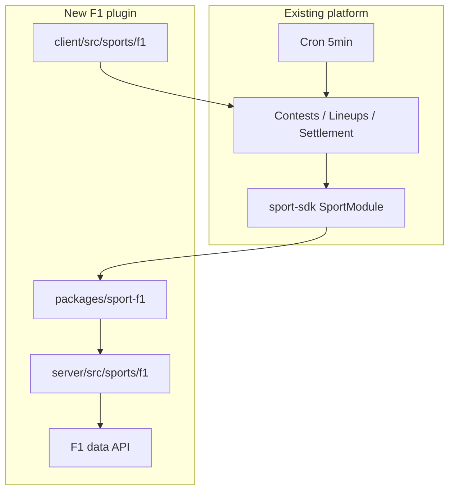

# F1 Expansion Plan

**Branch goal:** Prove the v4 platform supports more than one sport by shipping an F1 race-day plugin alongside PGA Golf.

**v1 scope:** Race day only — one `CompetitionEvent` per Grand Prix race (not qualifying, not full weekend). Users pick drivers from the race entry list; lineup scores sum driver points (finish position + fastest-lap bonus); higher total wins.

**Tracking docs:**

| File | Purpose |
|------|---------|
| [F1-EXPANSION-CHECKLIST.md](F1-EXPANSION-CHECKLIST.md) | Running list of resources and steps |
| [F1-EXPANSION-JOURNAL.md](F1-EXPANSION-JOURNAL.md) | Per-stage record of predicted vs actual needs |

---

## Goal

Ship a second sport plugin end-to-end: event init, field sync, live scoring via cron, lineup builder, leaderboard, and contest settlement — without changing contests, leagues, wallets, referrals, or on-chain contracts.

PGA Golf remains the reference implementation. F1 registers alongside it in server and client sport registries.

---

## v1 product shape

| Dimension | v1 decision |
|-----------|-------------|
| **Event unit** | Single race (Sunday main event) |
| **externalId** | `{year}-{circuit-slug}-gp` — e.g. `2026-monaco-gp` ([brief](docs/f1-competition-brief.md)) |
| **sportId** | `f1` |
| **Field size** | ~20 drivers per race |
| **Roster** | 4 drivers (mirror golf unless brief changes) |
| **Scoring** | Sum of driver `EventParticipant.total` — finish points + fastest-lap bonus baked into each driver's total |
| **Direction** | Higher wins |
| **Lifecycle** | `SCHEDULED` before race → `LIVE` from race start → `COMPLETE` after official classification |
| **Live sync** | 5-minute cron; position updates during race; points finalized at race end |
| **Tie-break** | Winning lineup total points (`{ type: "winningLineupPoints", value }`, range 1–120) |

---

## What reuses unchanged

The platform core is sport-agnostic. F1 plugs into existing infrastructure:

| Area | Location |
|------|----------|
| Data model | `server/prisma/schema.prisma` — `Sport`, `CompetitionEvent`, `Participant`, `EventParticipant`, `Lineup`, `Contest` |
| Cron pipeline | `server/src/services/cron/runSportEventPipeline.ts` — metadata → field → live scores → contest lineups |
| Scheduler | `server/src/cron/scheduler.ts` — loops all active events across sports every 5 min |
| Event init CLI | `pnpm run service:init-event <sportId> <externalId>` via `server/src/services/initEvent.ts` |
| Candidate API | `GET /sports/:sportId/events/:eventId/candidates` |
| Lineup flow | Create/validate/score/rank via `SportModule` |
| Contests & settlement | Rank entries, derive payouts, oracle + on-chain settle |
| Leagues | Cross-sport `UserGroup` — no sport field on league |
| Multi-sport picker | Appears when `sports.length > 1` (DB-driven `GET /sports`) |

See [spec/platform/README.md](spec/platform/README.md) for the full product model.

---

## What we build

Mirror golf's three-layer plugin split:

| Layer | Path | Role |
|-------|------|------|
| **Pure logic** | `packages/sport-f1/` | `SportModule` implementation — status, candidates, validation, scoring, ranking (no IO) |
| **Server IO** | `server/src/sports/f1/` | Prisma + external API handlers, sync scripts, `initEvent` |
| **Client UI** | `client/src/sports/f1/` | `SportUIPlugin` — candidate rows, participant detail, prediction field, event summary |

**Reference implementation (golf):**

| Layer | Path |
|-------|------|
| Package | `packages/sport-pga-golf/` |
| Server IO | `server/src/sports/pga-golf/` |
| Client UI | `client/src/sports/pga-golf/` |
| Server registry | `server/src/sports/registry.ts` |
| Client registry | `client/src/sports/registry.ts` |

**Plugin contracts:** `packages/sport-sdk/src/sport-module.ts`, `packages/sport-sdk/src/sport-ui-plugin.ts` — see [spec/platform/plugins.md](spec/platform/plugins.md).

---

## Phased stages

| Stage | Name | Entry | Exit criteria |
|-------|------|-------|---------------|
| **0** | Docs | Branch started | Three root MD files exist; journal Stage 0 entry written |
| **1** | Competition brief | Stage 0 complete | Filled brief from [fit-guide template](docs/new-competition-fit-guide.md#competition-brief-template); 12-row fit worksheet scored |
| **2** | Data spike | Brief approved | Chosen API; can fetch schedule, entry list, live/final results for one race |
| **3** | DB + seed | Data source chosen | `Sport` row (`f1`), `rosterRules` / `scoringRules` JSON, seed or migration |
| **4** | Server package | DB row exists | `packages/sport-f1/` implements `SportModule` pure logic with tests |
| **5** | Server IO | Package complete | Handlers, sync scripts, registry entry; `initEvent` CLI works |
| **6** | Client plugin | Server IO works | `SportUIPlugin` slots registered; sport hub and leaderboard render |
| **7** | Platform cleanup | Client renders | Multi-sport-safe prediction, event status, slot count from `rosterRules` |
| **8** | Dry run | Plugin wired | One real or historical race activated; cron updates scores; test contest settles |
| **9** | Ops runbook | Dry run passes | F1 activation runbook; optional event preview content |

Stage checkboxes live in [F1-EXPANSION-CHECKLIST.md](F1-EXPANSION-CHECKLIST.md). Stage findings live in [F1-EXPANSION-JOURNAL.md](F1-EXPANSION-JOURNAL.md).

---

## Open decisions

Resolved in [docs/f1-competition-brief.md](docs/f1-competition-brief.md) and [docs/f1-data-sources.md](docs/f1-data-sources.md).

| Topic | Status |
|-------|--------|
| **Data API** | OpenF1 primary; Jolpica for schedule/slug resolution |
| **Dry-run race** | `2024-british-gp` — meeting_key 1240, session_key 9558 |
| **Live races** | `OPENF1_API_TOKEN` required during live session window — evaluate before first live GP |

---

## Platform cleanup track

Golf-specific assumptions exist in platform paths. F1 can ship with workarounds, but Stage 7 cleans these for proper multi-sport UX. Parallel to plugin build — not blocking initial scaffold.

| File | Issue |
|------|-------|
| `client/src/lib/eventMetadata.ts` | Always uses `golfEventStatusFromMetadata` / golf status labels |
| `client/src/components/platform/SportPredictionField.tsx` | Falls back to golf winning-score slider when sport has no `PredictionField` |
| `client/src/lib/lineupApi.ts` | Uses `toGolfPrediction` for all lineup create/update |
| `client/src/components/lineup/LineupContestCard.tsx` | Imports golf prediction utils directly |
| `client/src/hooks/useLineupSlotEditor.ts` | Hardcoded `SLOT_COUNT = 4` (server validates from `rosterRules`; UI does not) |
| `server/src/services/lineups/createLineupForEvent.ts` | Uses `golfPredictionValue` |
| `server/src/services/lineups/updateLineupById.ts` | Uses `golfPredictionValue` |
| `server/src/utils/lineupValidation.ts` | Uses `golfPredictionValue` |
| `server/src/routes/contest.ts` | Uses `golfPredictionValue` for tie-break display |

**Direction:** Sport plugins expose prediction parsing; platform shell delegates to active sport module or UI plugin instead of importing `@cut/sport-pga-golf` directly.

---

## Out of scope (v1)

- Qualifying or sprint session scoring
- Full race weekend as one event
- Championship / season-long standings
- Prop bets / side bets
- Sub-minute live timing (websocket feed)
- Constructor picks or team-based rosters

---

## Reference docs

| Doc | Use when |
|-----|----------|
| [docs/new-competition-fit-guide.md](docs/new-competition-fit-guide.md) | Fit evaluation and competition brief template |
| [docs/competition-shape-ideas.md](docs/competition-shape-ideas.md) | F1 scored Strong fit as race weekend |
| [docs/platform-architecture.md](docs/platform-architecture.md) | Full platform model and schema |
| [spec/platform/README.md](spec/platform/README.md) | Product overview and add-sport checklist |
| [spec/platform/plugins.md](spec/platform/plugins.md) | `SportModule` / `SportUIPlugin` contracts |
| [spec/server/cron.md](spec/server/cron.md) | Cron pipeline behavior |
| [docs/event-activation-runbook.md](docs/event-activation-runbook.md) | Golf operator runbook |
| [docs/f1-event-activation-runbook.md](docs/f1-event-activation-runbook.md) | F1 operator runbook |

---

## Next action

**F1 v1 expansion complete.** Optional follow-ups: F1 email templates, event preview JSON pipeline, live OpenF1 token for race-day prod, grid position backfill.
