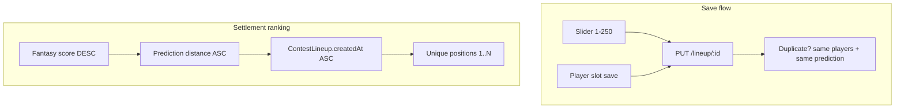

# Lineup Tie-Breaker (Contest Winning Score Prediction)

**Status:** Planned — implement **after** the existing contest-close work is complete.

## Temporary Storybook mockup (current branch)

The branch currently ships **visual-only placeholders** so the lineup editing UI can be reviewed in Storybook. This is not the real feature — return to this branch later and replace the mock with the full implementation described below.

| In place now | Replace with |
| --- | --- |
| `client/src/components/lineup/LineupWinningScoreSlider.tsx` — static slider + label (non-interactive, fixed value) | Wired slider with debounced save to `winningScorePrediction` on the lineup |
| `LineupContestCard` prop `showWinningScoreSliderPreview` (Storybook-only) | Always show slider when `canEditSlots`; remove preview prop |
| `PlayerDisplayRow` prop `preRoundLayout` passed from editable slots | Keep if still needed, or fold into normal pre-round detection once API/mock tournament state is correct |
| Stories: `Lineup/WinningScoreSlider`, `LineupContestCard/TieBreakerSliderPreview` | Extend with save/error/duplicate states |
| `LineupContestCard` root `bg-white` | Keep unless layout changes |

No database field, API changes, duplicate validation, or settlement tie-break logic exists on this branch yet.

---

## Summary

Add a `winningScorePrediction` field (1–250) to tournament lineups. Users set it via a slider on the editable lineup form. It represents their prediction of the **highest lineup score that will win the contest** (sum of 4 golfers’ Stableford points) — **not** the PGA tournament leader’s stroke total.

Duplicate lineups are defined by **player set + prediction**: same players with the same prediction is blocked; same players with a different prediction is allowed.

Tie-breaking uses a strict cascade so every lineup gets a unique rank — no shared positions or split payouts.

---

## Tie resolution (cascade — no remaining ties)

When ranking lineups in a contest, sort by:

1. **Fantasy score** (descending — highest wins)
2. **Prediction distance** — smallest `|winningScorePrediction − actualContestWinningScore|`, where `actualContestWinningScore = max(lineup scores in that contest)`
3. **Contest entry time** — earliest `ContestLineup.createdAt` wins (lineup entered into the contest first)

Every lineup receives a **unique position** (1, 2, 3, …). Remove shared-position / split-payout logic for tied fantasy scores.



---

## Implementation tasks

- [ ] Add `winningScorePrediction` to `TournamentLineup` schema + migration with 125–175 backfill; update `bootstrapTournamentLineups`
- [ ] Update `isDuplicateLineup` / `isDuplicateInContest` to compare player set + prediction; wire into lineup + contest routes
- [ ] Extend POST/PUT/GET lineup API and client types/mutations to read/write `winningScorePrediction`
- [ ] Add 1–250 slider to `LineupContestCard` Players tab; debounced save; integrate with `useLineupSlotEditor` duplicate checks
- [ ] Cascade tie-break in `updateContestLineups` + `settleContest`: score → prediction distance → `ContestLineup.createdAt`; unique positions only
- [ ] Update Storybook fixtures/stories, FAQ, and `spec/server` docs

---

## 1. Database

Add field to `TournamentLineup` in `server/prisma/schema.prisma`:

```prisma
winningScorePrediction Int?  // 1–250; required once lineup has players
```

- New migration under `server/prisma/migrations/`
- Backfill existing rows with a random int in **125–175** (150 ± 25) so legacy lineups have a value
- Update `spec/server/data-models.md`

Also set default on bootstrap in `server/src/services/bootstrapTournamentLineups.ts` when creating `"Lineup #1"`.

**Shared helper** (server): `randomWinningScorePrediction()` → `125 + Math.floor(Math.random() * 51)`.

---

## 2. Duplicate validation (players + prediction)

Today `server/src/utils/lineupValidation.ts` treats identical player sets as duplicates. Change to:

| Condition | Result |
| --- | --- |
| Same normalized player set **and** same `winningScorePrediction` | **Duplicate — reject** |
| Same player set, **different** prediction | **Allowed** |
| Empty player set (`length === 0`) | Never duplicate (unchanged) |

Update both:

- `isDuplicateLineup(...)` — add `winningScorePrediction` param; compare `(normalizePlayerSet + prediction)`
- `isDuplicateInContest(...)` — same change so two tournament lineups with identical rosters but different predictions can both enter a contest

Error message (client + server): *"You already have a lineup with these players and winning score prediction for this tournament"*

Wire into `server/src/routes/lineup.ts` POST/PUT and `server/src/routes/contest.ts` contest-entry path.

Update Zod in `server/src/schemas/lineup.ts` (`winningScorePrediction: z.number().int().min(1).max(250)`).

---

## 3. API changes

`server/src/routes/lineup.ts`:

- **POST** `/lineup/:tournamentId` — accept `winningScorePrediction`; if omitted, assign `randomWinningScorePrediction()`; validate 1–250
- **PUT** `/lineup/:lineupId` — accept optional `winningScorePrediction`; validate; persist alongside roster
- **GET** list + detail — include `winningScorePrediction` in formatted lineup objects (all three formatters in this file)

Request body shape:

```json
{ "players": ["..."], "name": "Lineup #1", "winningScorePrediction": 142 }
```

---

## 4. Client types + mutations

- Extend `TournamentLineup` in `client/src/types/player.ts` with `winningScorePrediction?: number`
- Extend `updateLineup` / `createLineup` in `client/src/hooks/useLineupMutations.ts` to pass `winningScorePrediction` in POST/PUT body
- Update `client/src/hooks/useLineupData.ts` signatures accordingly

---

## 5. UI — slider on editable lineup form

Primary surface: `client/src/components/lineup/LineupContestCard.tsx` **Players tab**, bottom of panel when `canEditSlots`:

- Label: e.g. **"Predicted winning lineup score"** with helper text explaining it breaks ties
- Native `<input type="range" min={1} max={250}>` + live numeric display
- Local state initialized from `lineup.tournamentLineup?.winningScorePrediction ?? defaultForLineup(lineupId)` where default uses the same 125–175 random logic (deterministic per lineup id in Storybook/tests to avoid flicker)
- **Debounced save** (~400ms) on slider change via `updateLineup(lineupId, currentPlayerIds, { winningScorePrediction })` — does not require re-picking players
- Show inline error if duplicate combo rejected

**Slot editor integration** in `client/src/hooks/useLineupSlotEditor.ts`:

- Accept `winningScorePrediction` + pass it on every roster save
- Update `checkForDuplicateLineup` to compare player set **and** prediction against other lineups’ `winningScorePrediction`

---

## 6. Ranking + settlement tie-break

**Contest winning score** = highest `ContestLineup.score` in the contest at time of ranking.

Replace tied-group / shared-position logic with a **single strict sort** across all contest lineups:

```typescript
function compareContestLineups(a, b, contestWinningScore): number {
  // 1. Fantasy score (desc)
  if (b.score !== a.score) return b.score - a.score;
  // 2. Prediction distance (asc)
  const distA = Math.abs(a.tournamentLineup.winningScorePrediction - contestWinningScore);
  const distB = Math.abs(b.tournamentLineup.winningScorePrediction - contestWinningScore);
  if (distA !== distB) return distA - distB;
  // 3. Contest entry time (asc — earliest wins)
  return a.createdAt.getTime() - b.createdAt.getTime();
}
```

Update:

- `server/src/services/updateContestLineups.ts` — sort per contest with cascade above; assign positions 1..N uniquely (remove while-loop tied groups)
- `server/src/services/contest/settleContest.ts` — same sort before payout allocation; each position maps to one entry (no pooled tie splits)

Helper in new `server/src/utils/lineupTiebreaker.ts` (or `lineupValidation.ts`):

```typescript
export function compareContestLineupRank(a, b, contestWinningScore: number): number { ... }
export function tiebreakerDistance(prediction: number, contestWinningScore: number): number {
  return Math.abs(prediction - contestWinningScore);
}
```

Include `winningScorePrediction` on `tournamentLineup` and `createdAt` on `ContestLineup` in settlement query includes.

**Edge case:** lineups missing `winningScorePrediction` (legacy) — treat as worst-case distance (e.g. `Infinity` or max distance 249) so entries with a prediction always rank ahead; entry-time tie-break still applies if both lack a prediction.

---

## 7. Storybook + docs + copy

- Update `client/src/test/fixtures/lineupContestCardMock.ts` and `client/.storybook/mocks/useLineupData.ts` with `winningScorePrediction`
- Add story variant showing slider in `LineupContestCard.stories.tsx`
- Update `client/src/pages/FAQPage.tsx` — replace “Tiebreakers are never used” / “ties split their share” with the cascade (prediction, then entry time); note every lineup gets a unique rank
- Update `spec/server/api.md` lineup POST/PUT docs

---

## Key files

| Layer | Files |
| --- | --- |
| Schema | `server/prisma/schema.prisma`, new migration |
| Validation | `server/src/utils/lineupValidation.ts` |
| API | `server/src/routes/lineup.ts`, `server/src/routes/contest.ts` |
| Ranking | `server/src/services/updateContestLineups.ts`, `server/src/services/contest/settleContest.ts` |
| Client UI | `LineupContestCard.tsx`, `useLineupSlotEditor.ts`, `useLineupMutations.ts` |
| Types | `client/src/types/player.ts` |

---

## Testing focus

- Server unit tests: duplicate logic (same players + same prediction blocked; same players + different prediction allowed)
- Server unit tests: tie-break ordering — same score + same prediction distance → earlier `ContestLineup.createdAt` ranks higher; verify unique positions
- Server unit tests: `settleContest` assigns one payout slot per position (no tie splits)
- Client: slot save + slider save both send prediction; duplicate error surfaces in modal and near slider
