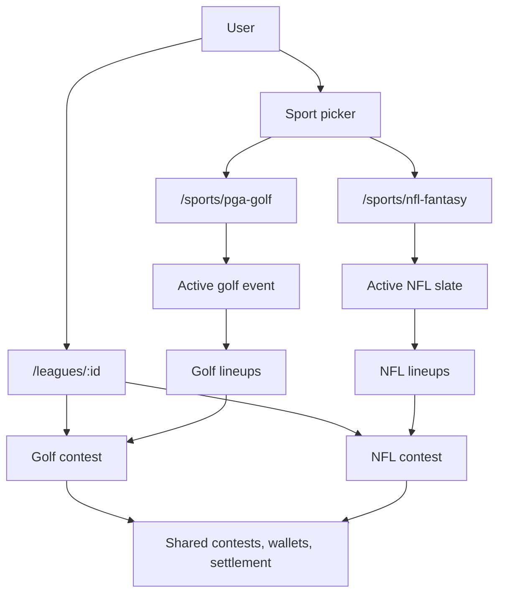
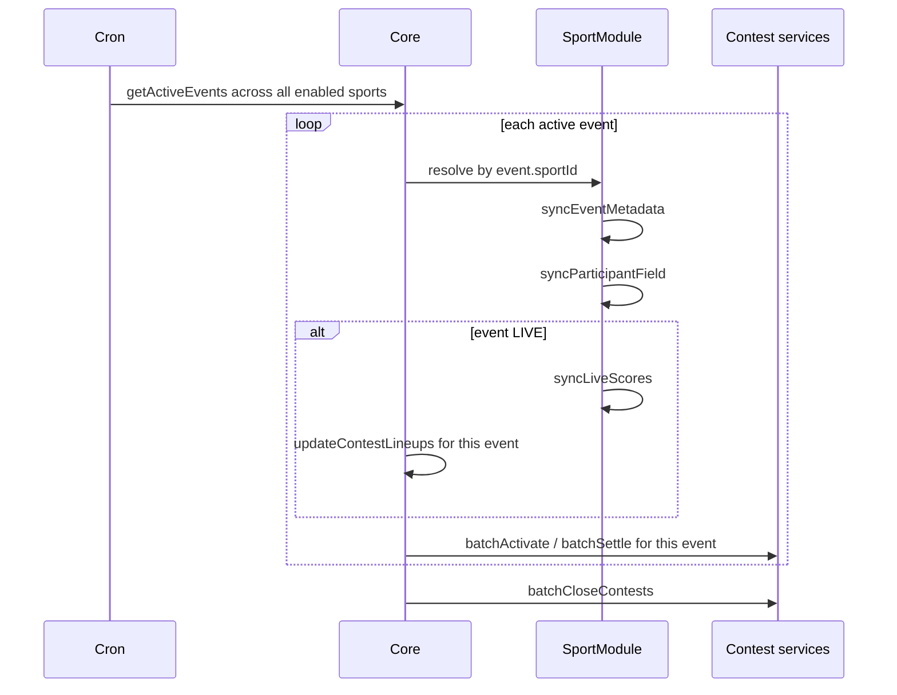

# Platform Architecture

Play The Cut is a single multi-sport competition platform. One app, one database, one deployment. Users pick a sport, build a lineup from that sport's candidate pool, and enter contests—public or within a league. The same account, wallet, and referral network work across every sport.

---

## Product model



| Concern | How it works |
|---------|--------------|
| **Sports** | Each sport is a registered plugin (PGA Golf, NFL Fantasy, etc.). The platform lists enabled sports; users switch via a sport picker in the nav. |
| **Active event** | One active event per sport at a time (e.g. this week's PGA tournament, this week's NFL slate). |
| **Lineups** | Event-scoped. A user builds a roster from that event's candidate pool, then enters it into one or more contests for that event. |
| **Contests** | Paid competitions tied to a single event. Lifecycle: `OPEN → ACTIVE → LOCKED → SETTLED → CLOSED`. On-chain via `ContestController`. |
| **Leagues** | Cross-sport social groups (`UserGroup`). No sport field on the league—a single league can host golf and NFL contests simultaneously. Sport is determined per contest via the event. |
| **Account** | One user, one wallet, one referral graph. Lineups and contest entries span sports under the same identity. |

---

## Architecture layers

### Core platform (sport-agnostic)

The platform owns everything that applies to any tournament-style competition:

- **Identity & social** — users, authentication (Privy), cross-sport leagues
- **Events** — schedule, status, one active event per sport
- **Lineups & entries** — roster assembly from a candidate pool; reusable across multiple contests for the same event
- **Contests** — lifecycle, settings, on-chain contracts, secondary prediction market
- **Ranking & settlement** — score aggregation, tie-breaking, payout derivation, oracle settlement, payout push, timeline snapshots
- **Cron** — loops all sports with active or recently completed events, dispatching each to its sport plugin
- **Wallets & payments** — ERC-20 deposits, ERC-1155 secondary shares, referral network, `OnchainPayment` indexing

### Sport plugins

Each sport is a self-contained module registered at server boot and mirrored on the client for UI. All enabled sports are always available in the single deployment.

A sport plugin owns:

- External data ingestion (field sync, live scores, withdrawals)
- Candidate pool and roster validation rules
- Scoring and lineup score aggregation
- Entry ranking and tie-breakers
- Contest lifecycle gates (when to activate, when to settle)
- Optional payout policy override
- Sport-specific UI components (candidate rows, scorecards, prediction inputs, event headers)

The first plugin is **PGA Golf**. Additional sports (NFL Fantasy, etc.) are new plugin packages—not forks of the platform.

### On-chain layer (unchanged)

Smart contracts remain sport-agnostic. Entries are opaque `uint256 entryId` values. The oracle pushes `winningEntries` and `payoutBps`; the contract handles accounting and payouts. No sport data lives on-chain.

---

## Data model

### Sport registry

```prisma
model Sport {
  id           String   @id      // "pga-golf"
  name         String              // "PGA Tour Fantasy"
  slug         String   @unique    // URL segment: "golf"
  isEnabled    Boolean  @default(true)
  rosterRules  Json                // { slotCount: 4, minPicks: 1, maxPicks: 4 }
  scoringRules Json                // { aggregation: "sum", direction: "higher_wins" }
  events       CompetitionEvent[]
}
```

### Events, participants, and lineups

| Model | Purpose |
|-------|---------|
| `CompetitionEvent` | A single competition instance for a sport (tournament, slate, race). `sportId`, `externalId`, `isActive`, `metadata` for sport-specific fields. |
| `Participant` | Global identity for a competitor (golfer, NFL player). `sportId`, `externalId`, `displayName`, `metadata`. |
| `EventParticipant` | A participant in a specific event with live scoring. `scoreData` (JSON), `total` (the number aggregated into lineups). |
| `Lineup` | A user's roster for one event. Optional `prediction` JSON for tie-breaking (golf: `{ type: "winningScore", value: 142 }`). |
| `LineupPick` | Junction: lineup slot → `EventParticipant`. |

### Contests and leagues

| Model | Purpose |
|-------|---------|
| `Contest` | Competition instance. `eventId` (determines sport), optional `userGroupId` (league scope). On-chain `address`, `settings`, `results`. |
| `ContestLineup` | A lineup entered into a contest. `score`, `position`, `entryId` (on-chain). |
| `ContestLineupTimeline` | Score/position snapshots over time. |
| `UserGroup` | League. **No sport field.** Hosts contests across any enabled sport. |
| `UserGroupMember` | League membership (`ADMIN` or `MEMBER`). |

### Two-layer entry model

```
Lineup (event-scoped roster)
  └── LineupPick[] → EventParticipant
        └── ContestLineup (per contest entry)
              └── Contest
```

A user builds one lineup for an event, then enters it into multiple contests (public and league) without rebuilding the roster.

---

## Cross-sport leagues

Leagues are sport-neutral containers. A friends group can run a golf pool and an NFL pool in the same league without creating separate groups.

**Rules:**

- League membership grants access to all contests where `contest.userGroupId = group.id`, regardless of sport.
- Each contest binds to exactly one `CompetitionEvent`; the event's `sportId` determines which sport plugin handles scoring and roster rules.
- Entering a contest requires a lineup for **that contest's event**—there is no cross-sport lineup.
- Creating a league contest: admin picks sport → event → contest settings → on-chain deploy.
- League detail UI groups contests by sport or event, with a sport badge on each contest card. Entry CTAs deep-link to `/sports/:sportId/lineup` for the relevant event.

---

## Sport plugin interface

Shared types and the plugin contract live in `packages/sport-sdk`. Server and client both depend on it.

```typescript
export interface RosterRules {
  slotCount: number;
  minPicks: number;
  maxPicks: number;
  allowDuplicates: boolean;
}

export interface Candidate {
  eventParticipantId: string;
  participantId: string;
  displayName: string;
  sortKeys: Record<string, number | string>;
  metadata: unknown;
}

export interface SportModule {
  readonly id: string;

  // Event lifecycle
  initEvent(externalId: string): Promise<void>;
  syncEventMetadata(eventId: string): Promise<void>;
  syncParticipantField(eventId: string): Promise<void>;
  syncLiveScores(eventId: string): Promise<void>;
  getEventStatus(eventId: string): Promise<"SCHEDULED" | "LIVE" | "COMPLETE">;

  // Candidates & rosters
  getCandidatePool(eventId: string): Promise<Candidate[]>;
  validateRoster(eventId: string, picks: string[], rules: RosterRules): Promise<ValidationResult>;
  handleWithdrawals?(eventId: string): Promise<void>;

  // Scoring
  aggregateLineupScore(eventId: string, eventParticipantIds: string[]): Promise<number>;
  rankEntries(entries: LineupEntryInput[]): RankedEntry[];

  // Contest lifecycle
  shouldActivateContest(eventStatus: string): boolean;
  shouldSettleContest(eventStatus: string): boolean;
  derivePayoutVector?(ranked: RankedEntry[], entryCount: number): PayoutVector;
}
```

Sport implementations live in dedicated packages (e.g. `packages/sport-pga-golf`, `packages/sport-nfl-fantasy`). The server registry resolves the correct module by `event.sportId`.

---

## Server pipeline

The cron job runs every five minutes and processes **all sports** with an active or recently completed event:



Core platform endpoints:

- `GET /sports` — list enabled sports
- `GET /sports/:sportId/events/active` — active event shell + live data
- `GET /sports/:sportId/events/:eventId/candidates` — candidate pool for lineup building
- `POST /lineups/:eventId` — create/update lineup (validates via sport plugin)
- Contest routes unchanged in shape; `eventId` replaces `tournamentId`

---

## Client architecture

### Routing

| Route | Scope |
|-------|-------|
| `/sports/:sportId` | Sport home — active event contest list (`SportHubPage`) |
| `/contest/:address` | Contest lobby (on-chain address in URL) |
| `/leagues/:id` | Cross-sport league — contests grouped by event |
| `/account` | Wallet, referrals, settings (sport-neutral) |

`/sports/:sportId/contests/:id` redirects to `/contest/:address`. Legacy `/user-groups/*` redirects to `/leagues/*`.

`SportContext` provides `sportId` from the URL (default `pga-golf`). Active event, roster rules, and UI plugin are resolved in hooks/components via `useActiveEventQuery` and `requireSportUIPlugin(sportId)`.

### Component layers

**Platform components** (sport-agnostic shell in `client/src/components/platform/`):

- `LineupSlotPicker` — N slots driven by sport `rosterRules`
- `CandidatePicker` — search and sort over `Candidate[]`
- `SportLineupPickRow` — single pick row in roster editor
- `SportEventHeader` / `SportEventContextBar` — event chrome
- `SportPredictionField` — delegates to plugin prediction input

Feature components in `contest/`, `lineup/`, `userGroup/` compose the shell for lobby, league, and list views. Many screens still consume legacy `Tournament` types via `golfEventAdapter` until Phase 10 cleanup.

**Sport UI plugins** (injected via registry):

```typescript
interface SportUIPlugin {
  CandidateRow: React.FC<CandidateRowProps>;
  ParticipantRow: React.FC<ParticipantRowProps>;
  ParticipantDetail: React.FC<ParticipantDetailProps>;
  PredictionField?: React.FC<PredictionProps>;
  EventSummary?: React.FC<{ event: CompetitionEvent }>;
}
```

Golf provides OWGR/DataGolf-ranked candidate rows, Stableford scorecards, and a winning-score prediction slider. NFL would provide position badges, projected points, and a different prediction input. The platform shell stays the same.

---

## Contest lifecycle and settlement

Contest lifecycle is sport-agnostic. The sport plugin only answers "should this contest activate?" and "should this contest settle?" based on event status.

**Settlement flow:**

1. Event completes → sport plugin finishes final scoring
2. Platform ranks all `ContestLineup` entries for contests on that event (via `sport.rankEntries`)
3. Platform derives payout vector (via `sport.derivePayoutVector` or default policy: 100% to 1st if fewer than 10 entries, else 70/20/10 for top 3)
4. Oracle calls `settleContest(winningEntries, payoutBps, ...)` on-chain
5. Oracle pushes primary and secondary payouts; indexes `OnchainPayment` rows
6. Users claim or receive pushed payouts

**Tie-breaker pattern** (platform-wide): score descending → prediction distance ascending → entry time ascending. The prediction field shape is sport-specific (golf: winning Stableford score; other sports define their own).

---

## Prop bets (optional per sport)

Side bets and prop markets are a separate plugin lane, not part of the core `SportModule`. Golf implements a `PropBetModule` for DataGolf parlays. Other sports opt in when needed.

```typescript
interface PropBetModule {
  ingestQuotes(lineupId: string): Promise<MarketSnapshot | null>;
  gradeTicket(ticket, results): "WON" | "LOST" | "VOID";
}
```

---

## Adding a new sport

A new sport requires:

1. A `Sport` row in the database (`isEnabled: true`)
2. A server plugin package implementing `SportModule`
3. A client `SportUIPlugin` registered in the sport picker
4. Schedule/event ingestion for that sport's events

It does **not** require changes to contests, leagues, on-chain contracts, wallets, settlement, or the referral network. An existing cross-sport league can immediately host contests for the new sport.

**Example — NFL Fantasy:**

| Concern | Implementation |
|---------|----------------|
| Event | Weekly slate (`externalId` = week ID) |
| Participants | NFL players with position, team, salary |
| Roster rules | 9 slots (QB/RB/RB/WR/WR/TE/FLEX/DST/K) |
| Scoring | Sum of fantasy points from `EventParticipant.scoreData` |
| UI | Jersey photos, position badges, projected points |

---

## Package structure

```
packages/
  sport-sdk/              # Shared types, SportModule interface, SportUIPlugin interface
  sport-pga-golf/         # Golf server plugin
  sport-nfl-fantasy/      # NFL server plugin (future)
  secondary-pricing/      # Bonding curve math (sport-agnostic)

server/
  src/sports/registry.ts       # SportModule registry
  src/sports/propBetRegistry.ts # PropBetModule registry
  src/routes/sports.ts         # GET /sports, active event, candidates
  src/routes/lineups.ts        # Lineup CRUD
  src/services/contest/        # Lifecycle + settlement
  src/cron/scheduler.ts        # Multi-sport pipeline + side-bet quotes

client/
  src/sports/registry.ts       # SportUIPlugin registry
  src/components/platform/     # Generic lineup/event shell
  src/sports/pga-golf/         # Golf-specific UI components
```

---

## What stays sport-agnostic

| Component | Why |
|-----------|-----|
| `ContestController` / `ContestFactory` | Entries are opaque IDs; payout vectors are generic |
| `packages/secondary-pricing` | Bonding curve math has no sport dependency |
| `UserGroup` / leagues | Cross-sport by design; sport flows through `Contest.eventId` |
| Wallet / Privy / on-chain payments | One wallet per user across all sports |
| Referral network | One graph per user; fees apply to any contest |
| `ContestLineup` / timeline | Stores aggregated score and position only |
| Tie-breaker comparator | Same comparison structure; prediction field is the sport-specific part |
