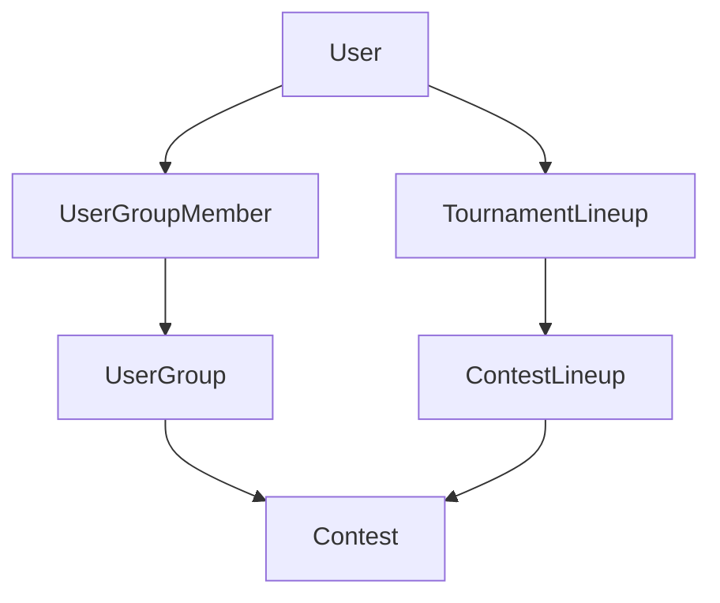
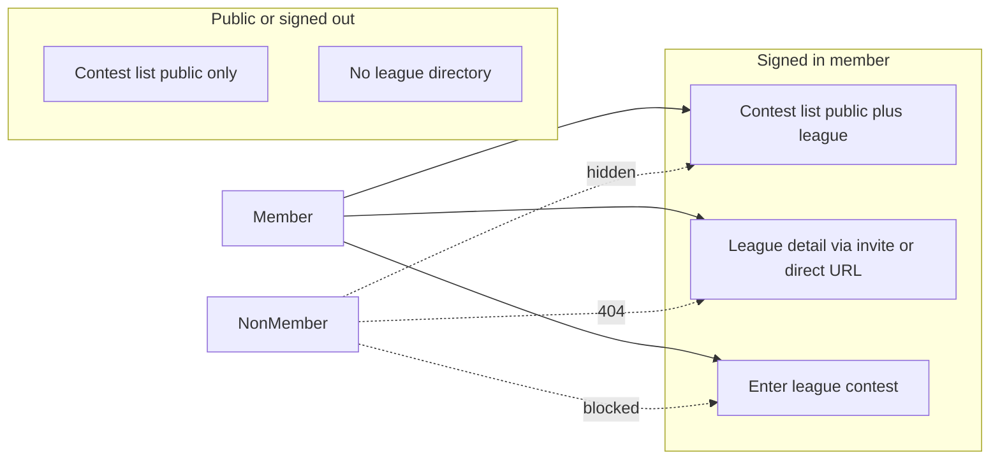

# Private Leagues (UserGroup)

Authoritative product and implementation spec for private user leagues. In code and APIs the entity is **UserGroup**; in UI copy it is **League**. Routes remain `/user-groups/*` for now.

## Naming

| Layer | Term |
|-------|------|
| User-facing copy | League |
| Prisma / API | `UserGroup`, `/api/userGroups` |
| URLs | `/user-groups`, `/user-groups/:id`, join path TBD (e.g. `/user-groups/join/:code`) |

## Current state

The app ships a partial **UserGroup** layer. It is not the legacy League/Team design (see deprecated section in [`.cursor/rules/prisma-database.mdc`](.cursor/rules/prisma-database.mdc)).

| Capability | Status |
|------------|--------|
| `UserGroup`, `UserGroupMember` (roles `ADMIN`, `MEMBER`) | Implemented |
| CRUD API (`server/src/routes/userGroup.ts`) | Implemented |
| Admin adds member by wallet address | Implemented |
| Contest `userGroupId`; non-members blocked on contest entry | Implemented |
| Client pages under `/user-groups` | Implemented; no main nav link (by design) |
| `requireUserGroupMember` middleware | Defined; not applied to read routes |
| Privacy, invite links, self-join | Not implemented |
| Group contests hidden from public lobby/list | Not implemented |
| Group detail readable by any authenticated user with ID | Gap |

**Contest visibility:** `Contest.settings` may include `contestType`, but create flow sets `"PUBLIC"` and the server does not enforce it. League privacy is defined by **`userGroupId` + membership**, not contest settings JSON alone.

## Target behavior

### League lifecycle

| Action | Actor | Behavior |
|--------|-------|----------|
| Create league | Signed-in user | Creator is `ADMIN`; league is private by default |
| Edit name / description | League `ADMIN` | Existing `PUT /api/userGroups/:id` |
| Delete league | League `ADMIN` | Existing `DELETE`; contests remain with `userGroupId` set null |
| View league | Members only | Non-members receive 404 (no ID enumeration) |
| List leagues | Member | `GET /api/userGroups` — membership-scoped only |
| Discover leagues | — | No public directory; members discover league contests on the main contest list when signed in |

### Membership

Primary v1 path: **invite link**. Secondary: admin add by wallet (existing).

| Action | Actor | Behavior |
|--------|-------|----------|
| Generate / rotate invite code | League `ADMIN` | Sets or replaces `UserGroup.inviteCode` |
| Share invite | Admin | Copy link with invite code to join route |
| Accept invite | Signed-in user | Self-join as `MEMBER` when code matches |
| Add by wallet | League `ADMIN` | User must already exist (registered wallet) |
| Leave | Member or `ADMIN` | Existing remove-member; last admin cannot be removed |
| Request-to-join, email invite | — | Out of v1 |

### Privacy layers

All four apply to v1:

1. **Hide group** — no listing or search for leagues the user does not belong to.
2. **Gate read** — `GET /userGroups/:id` and member list require membership; non-members get 404.
3. **Hide contests** — contests with `userGroupId` excluded from the contest list for unauthenticated callers and non-members. Signed-in members see their league contests merged into the main `/contests` list alongside public contests.
4. **Gate contest entry** — non-members cannot enter league contests (extend to all entry paths; align `GET /contests/:id` for league contests).

### Contests in a league

| Action | Actor | Behavior |
|--------|-------|----------|
| Create league contest | League `ADMIN` only | Sets `Contest.userGroupId`; caller must be league admin (exception to app-wide admin-only contest create) |
| View in contest list | Signed-in league members | Merged into main `/contests` list; deep link for non-member → 404 |
| Enter contest | League members | Membership check on join |
| League hub | Members | League detail lists contests (not only a count) |

## Implementation epics

### A — Data model

On `UserGroup`:

- `isPrivate` default `true`
- `inviteCode` — unique, opaque short code; admin can regenerate to rotate

### B — API authorization

- Apply `requireUserGroupMember` on group read routes.
- Join: `POST` with invite code (path TBD).
- Admin: generate or rotate `inviteCode`.
- Contests: filter list; gate `GET` by id; allow league `ADMIN` to `POST` contests when `userGroupId` is set.

Key files: `server/src/routes/userGroup.ts`, `server/src/middleware/userGroup.ts`, `server/src/routes/contest.ts`.

### C — Client UX

- **Contest list is the discovery surface** — no main-nav link to `/user-groups`. When signed in, `GET /contests` returns public contests plus league contests for groups the user belongs to; the existing `/contests` page shows them together.
- **Account panel** — secondary link in Account Information (same row pattern as Contest History): label left, `View my leagues...` → `/user-groups`
- Copy: League in UI where league context appears (e.g. contest cards, league admin pages); keep technical routes `/user-groups/*`
- League detail (`/user-groups/:id`): member management, invite UI, admin create contest — reachable via invite flow or direct URL, not global nav
- Join page for invite code
- Contest create: league picker for league admins only
- Contest list: refetch when auth state changes so login reveals league contests; optional league label on contest cards

Key files: `client/src/pages/UserGroup*.tsx`, `client/src/components/userGroup/*`, `client/src/components/contest/CreateContestForm.tsx`, contest lobby/list components.

### D — Email and growth (post-core)

- Optional invite email (v1.1)
- Wednesday reminder copy: “League” where groups are referenced (`docs/email-program.md`)
- Onboarding “Play with friends” after join flow (`spec/onboarding-content-plan.md`)

### E — Spec hygiene

- Update `spec/server/api.md` for `/api/userGroups` and invite endpoints when built.
- Cursor rule `prisma-database.mdc` documents UserGroup (done).

## Phases

**Phase 1 — Private by default (no invites)**  
Membership gates on reads; contest list/detail filtering (signed-in members see league contests on main contest list); league-admin contest create; copy updates; league contest list on detail page.

**Phase 2 — Invite links**  
`inviteCode` on `UserGroup`, join API, join page, admin invite UI.

**Phase 3 — Polish**  
Wallet add retained; invite emails; onboarding screen; admin dashboard filters.

## Out of scope (v1)

- Public league directory
- Request-to-join / approvals
- Season-long team-per-league fantasy (`TournamentLineup` is per tournament, not league-bound)
- On-chain league contracts
- Renaming `/user-groups` → `/leagues`
- `User.referralGroupId` (referral graph; unrelated)

## Open decisions

| Topic | Recommendation |
|-------|----------------|
| Non-member errors | 404 for leagues and league contests |
| Invite code format | Opaque cuid vs short human-readable code — decide in Phase 2 |
| Contest create | League `ADMIN` sufficient when `userGroupId` set (no app admin) |

## Acceptance criteria

- Signed-in members see league contests on the main contest list; signed-out users and non-members do not.
- Non-members cannot load league detail, members, or league contest by ID.
- Invite link → join → league contests appear on contest list; member can enter.
- League admin creates a league contest without app admin role.
- Admin can still add a member by wallet address.

## Relevant files

| Path | Role |
|------|------|
| `server/prisma/schema.prisma` | `UserGroup`, `UserGroupMember`, `Contest.userGroupId` |
| `server/src/routes/userGroup.ts` | League API |
| `server/src/middleware/userGroup.ts` | Membership middleware |
| `server/src/routes/contest.ts` | Contest + league integration |
| `client/src/pages/UserGroup*.tsx` | League pages |
| `client/src/components/userGroup/*` | League UI |
| `.cursor/rules/prisma-database.mdc` | Schema reference for agents |
