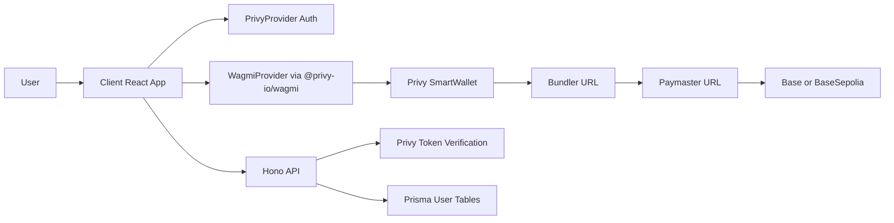

# Porto to Privy Migration (New Deploy)

## Scope

- Full replacement of Porto in both client and server.
- No backward compatibility, migration shims, or legacy user/account merge logic.
- Use Privy smart wallets with paymaster/bundler so bundled transactions are first-class.

## Target Architecture

## Phase 1: Privy Platform Setup

- Create Privy app and configure:
  - Login methods for launch (wallet/email/SMS as desired).
  - Supported chains: Base and Base Sepolia.
  - Smart wallet type and network-level bundler + paymaster URLs.
  - Gas sponsorship enabled for configured chains.
- Enable identity/access token strategy for backend authentication.

## Phase 2: Client Auth and Provider Rewire

- Replace Porto provider wiring in [client/src/App.tsx](/Users/mattlovan/Projects/personal/cut/client/src/App.tsx):
  - Add `PrivyProvider`.
  - Move wagmi provider to `@privy-io/wagmi` provider stack.
  - Keep `QueryClientProvider` placement compatible with Privy docs.
- Replace Porto wagmi config in [client/src/wagmi.ts](/Users/mattlovan/Projects/personal/cut/client/src/wagmi.ts):
  - Remove `porto(...)` connector and Porto `authUrl/merchantUrl` config.
  - Create config with `createConfig` from `@privy-io/wagmi` and Base/Base Sepolia transports.
- Replace auth context in [client/src/contexts/PortoAuthContext.tsx](/Users/mattlovan/Projects/personal/cut/client/src/contexts/PortoAuthContext.tsx):
  - New `AuthContext` backed by Privy auth state/hooks.
  - Preserve app-facing contract used by pages/components (`user`, `loading`, `logout`, settings updates).
- Update connection UI in [client/src/components/user/Connect.tsx](/Users/mattlovan/Projects/personal/cut/client/src/components/user/Connect.tsx):
  - Trigger Privy login/connect wallet flow.
  - Remove Porto-specific flow phases and error assumptions.

## Phase 3: Client Blockchain Bundling + Sponsorship

- Keep client-initiated transaction model with wagmi hooks.
- Validate and adapt bundling hooks:
  - [client/src/hooks/useBlockchainTransaction.ts](/Users/mattlovan/Projects/personal/cut/client/src/hooks/useBlockchainTransaction.ts)
  - [client/src/hooks/useTokenOperations.ts](/Users/mattlovan/Projects/personal/cut/client/src/hooks/useTokenOperations.ts)
  - [client/src/hooks/useContestFactory.ts](/Users/mattlovan/Projects/personal/cut/client/src/hooks/useContestFactory.ts)
- Ensure batched calls route through smart wallet + bundler path and receive sponsorship via configured paymaster.
- Add wallet selection handling where needed using Privy active-wallet APIs.

## Phase 4: Server Auth Replacement

- Replace JWT/Porto SIWE verification with Privy token verification in:
  - [server/src/middleware/auth.ts](/Users/mattlovan/Projects/personal/cut/server/src/middleware/auth.ts)
  - [server/src/routes/auth.ts](/Users/mattlovan/Projects/personal/cut/server/src/routes/auth.ts)
- New auth model:
  - Read `Authorization: Bearer <privy-token>` (or configured cookie mode).
  - Verify with `@privy-io/node`.
  - Resolve/create local `User` + `UserWallet` from Privy-linked wallet data for fresh users.
- Keep existing application endpoints (`/auth/me`, `/auth/update`, `/auth/settings`) with stable response shape for UI compatibility.

## Phase 5: Remove Porto and Legacy Sponsorship Code

- Delete Porto sponsorship route [server/src/routes/porto.ts](/Users/mattlovan/Projects/personal/cut/server/src/routes/porto.ts).
- Remove Porto route mount from [server/src/routes/api.ts](/Users/mattlovan/Projects/personal/cut/server/src/routes/api.ts).
- Remove Porto SIWE endpoints and Porto SDK usage from [server/src/routes/auth.ts](/Users/mattlovan/Projects/personal/cut/server/src/routes/auth.ts).
- Remove Porto dependencies from:
  - [client/package.json](/Users/mattlovan/Projects/personal/cut/client/package.json)
  - [server/package.json](/Users/mattlovan/Projects/personal/cut/server/package.json)
- Update required env vars in [server/src/index.ts](/Users/mattlovan/Projects/personal/cut/server/src/index.ts) and examples to Privy credentials + optional bundler/paymaster settings.

## Phase 6: Verification and Launch Readiness

- Functional checks:
  - Auth login/logout, protected routes, `/auth/me` hydration.
  - Chain selection/switching for Base + Base Sepolia.
  - Bundled contest/token operations execute through smart wallet.
  - Sponsored gas behavior verified on configured networks.
- Security checks:
  - Sponsorship abuse protections (limits/monitoring) aligned with Privy best practices.
- Deploy as new environment with new user base.

## Acceptance Criteria

- No `porto` imports remain in client/server runtime code.
- All auth-protected API routes use Privy-backed auth middleware.
- Core transaction flows (buy/sell/send/create contest) work with bundled calls.
- Sponsored transactions succeed with configured paymaster/bundler on target chains.
- App runs end-to-end in new deployment without legacy compatibility code.
