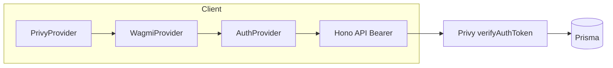
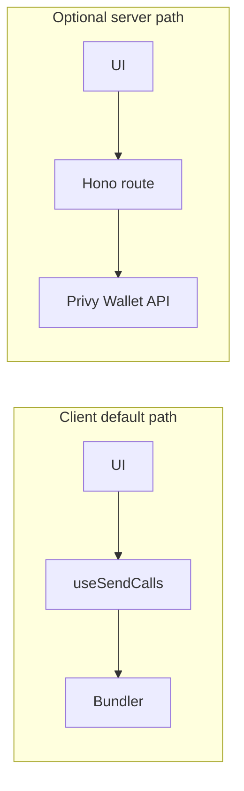

# Porto to Privy migration

Single plan for a **new deploy**: no Porto compatibility layer, no legacy user merge. Work below is the full scope; nothing here is implied as already done.

---

## 1. Principles

| Topic | Decision |
|-------|----------|
| **Auth** | Privy end-to-end (embedded wallet, external wallet, email/SMS—per dashboard). |
| **SIWE** | Not used. Remove `/auth/siwe/*`, `RelayClient` / `RelayActions`, and custom SIWE verification. |
| **Session** | Privy access tokens on the client; server verifies with `@privy-io/node`. Replace JWT-in-cookie after SIWE. |
| **Identity on API calls** | `Authorization: Bearer <privy-token>` via `getAccessToken()` from the new auth layer—not cookie-only `fetch`. |
| **Transactions** | Default: **client** `useSendCalls` + smart wallet + sponsorship. Optional later: Privy **server** Wallet API for selected flows. |

---

## 2. What exists today (Porto)

| Area | Today | Location |
|------|--------|----------|
| Wallet + wagmi | `porto(...)` connector, dialog UI, Base / Base Sepolia, `feeToken: USDC` | [client/src/wagmi.ts](client/src/wagmi.ts) |
| SIWE | `authUrl` → nonce / verify / logout | [client/src/wagmi.ts](client/src/wagmi.ts) |
| Connect + auth orchestration | `Hooks.useConnect`, `authFlow` / `startAuthFlow` | [client/src/contexts/PortoAuthContext.tsx](client/src/contexts/PortoAuthContext.tsx), [Connect.tsx](client/src/components/user/Connect.tsx) |
| App user/session UI | `PortoAuthProvider`: `/auth/me`, balances, chain lock, logout | [PortoAuthContext.tsx](client/src/contexts/PortoAuthContext.tsx) |
| Server SIWE | `RelayClient` + `RelayActions.verifySignature` | [server/src/routes/auth.ts](server/src/routes/auth.ts) |
| Session cookie | JWT `cutAuthToken` after SIWE | [auth.ts](server/src/routes/auth.ts), [middleware/auth.ts](server/src/middleware/auth.ts) |
| Gas sponsorship | `/api/porto/sponsor` + merchant keys; **allowlist** on `to` (factory, deposit manager, tokens, DB contests) | [server/src/routes/porto.ts](server/src/routes/porto.ts) |
| Batched calls | `useSendCalls` + `useWaitForCallsStatus` | [useBlockchainTransaction.ts](client/src/hooks/useBlockchainTransaction.ts) |
| Cron | Skips Porto routes | [server/src/cron-app.ts](server/src/cron-app.ts) |

---

## 3. Target state (Privy)

| Area | Target |
|------|--------|
| Wallet + wagmi | `PrivyProvider` + [`@privy-io/wagmi`](https://docs.privy.io) `createConfig`; Base + Base Sepolia. |
| Login / connect | Privy `login` + chain switch; no Porto `Hooks.useConnect`. |
| **Auth context** | **New module** (e.g. `AuthContext.tsx` / `AuthProvider` + `useAuth`) **replaces** [PortoAuthContext.tsx](client/src/contexts/PortoAuthContext.tsx). Composes `usePrivy`, wagmi (`useAccount`, `useSwitchChain`, `useDisconnect`), and Cut `user` from `/auth/me`. Uses `getAccessToken()` for every API request. Keeps the same **surface** the app needs: `user`, `loading`, `logout`, `updateUser`, `updateUserSettings`, `isAdmin`, `getCurrentUser`, token balances/metadata, `balancesLoading`, and an **`authFlow` / `startAuthFlow`** that maps to Privy login + network (Base vs Base Sepolia) instead of Porto. Logout: Privy `logout` + clear local user + React Query invalidation; avoid blanket cookie clearing unless a non-Privy cookie still requires it. |
| Server | Verify Privy tokens; **remove** SIWE routes and Porto relay; keep `/auth/me`, `/auth/update`, `/auth/settings` response shapes. |
| Sponsorship | Privy dashboard + policies; **re-express** [porto.ts](server/src/routes/porto.ts) allowlist (policies or **custom paymaster** if dynamic contest `to` cannot be expressed). |
| Fee token | Confirm in Privy / chain config (not Porto’s `feeToken` string). |
| Optional txs | [Server-side Wallet API](https://docs.privy.io/controls/authorization-keys/owners/configuration/user/server-transactions) only if needed later. |

**Call-site migration:** Rename `usePortoAuth` → `useAuth` (or keep a temporary alias during migration—prefer full rename). Update every importer: `Connect`, `ProtectedRoute`, `Navigation`, `Footer`, contest/lineup/user components, hooks, `DebugPage` (rename labels from “PortoAuth”), etc.

**Transaction default (optional fork later):**

---

## 4. Phase sequence

Phases are ordered for **dependency clarity**. **Client auth context (Bearer)** and **server token verification** must ship together so `/auth/me` works end-to-end.

| Phase | Focus |
|-------|--------|
| **A** | Privy dashboard: app, chains, smart wallet, bundler/paymaster, sponsorship, policies aligned with old allowlist; access tokens for backend. |
| **B** | Client shell: [App.tsx](client/src/App.tsx) — `PrivyProvider` → `QueryClientProvider` → `WagmiProvider` per Privy docs; [wagmi.ts](client/src/wagmi.ts) — `createConfig` from `@privy-io/wagmi`; `VITE_PRIVY_APP_ID`. |
| **C** | **Auth context + Connect:** new `AuthProvider` / `useAuth` replacing `PortoAuthContext`; [Connect.tsx](client/src/components/user/Connect.tsx) driven by Privy; all `usePortoAuth` imports updated. |
| **D** | Server auth: [middleware/auth.ts](server/src/middleware/auth.ts), [auth.ts](server/src/routes/auth.ts) — remove SIWE + Porto relay; `@privy-io/node` verification; `User` + `UserWallet` from Privy-linked wallets; Bearer aligned with Phase C. |
| **E** | Blockchain hooks: [useBlockchainTransaction.ts](client/src/hooks/useBlockchainTransaction.ts), [useTokenOperations.ts](client/src/hooks/useTokenOperations.ts), [useContestFactory.ts](client/src/hooks/useContestFactory.ts) under smart wallet + sponsorship. |
| **F** | Remove Porto: delete [porto.ts](server/src/routes/porto.ts), unmount `/porto`, remove `porto` + merchant env from client/server, copy updates (FAQ, Account, Debug). |
| **G** | Verification: login/logout, protected routes, chains, bundled flows, sponsored gas, abuse limits; new environment. |
| **H (optional)** | Server `sendTransaction` + `authorization_context` for chosen flows only. |

---

## 5. Risks

- **Sponsorship parity:** Today’s allowlist in [porto.ts](server/src/routes/porto.ts) is explicit; **every** batched `to` (including **new contest contracts**) must be covered by Privy policy or a custom paymaster / server-side guard.
- **Phase C + D coordination:** Until both the new auth context sends Bearer tokens and the server verifies them, `/auth/me` will fail—plan and test them as one integration slice.

---

## 6. Acceptance criteria

- [PortoAuthContext.tsx](client/src/contexts/PortoAuthContext.tsx) removed; **AuthProvider** / **useAuth** (or chosen names) in place; API calls authenticated with Privy access tokens (Bearer), not SIWE/JWT cookie flow.
- No `porto` usage in client or server runtime; no SIWE routes or Porto relay verification.
- `useAuth`-protected routes and middleware use Privy-backed identity.
- **Core flows:** buy / sell / send / create contest via bundled `useSendCalls` on the default path.
- Sponsored transactions succeed on target chains with configured paymaster/bundler.
- No legacy compatibility code required for this deploy.
