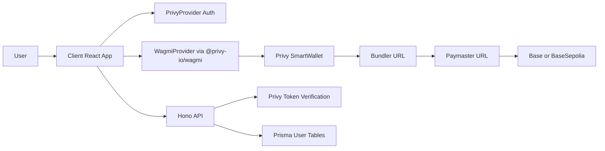
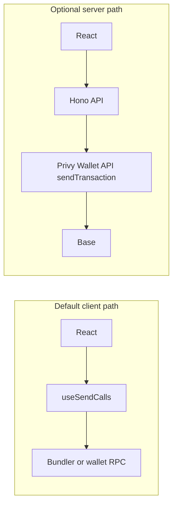

# Porto to Privy Migration (New Deploy)

## Auth decisions (locked)

- **Use Privy’s auth end-to-end** (embedded wallet, external wallet, email/SMS, etc.—per dashboard configuration).
- **SIWE is not a requirement.** Remove `/auth/siwe/*`, `RelayClient` / `RelayActions`, and Porto-specific SIWE verification. Do not re-implement a parallel SIWE layer.
- **Session model:** Privy access tokens verified with `@privy-io/node`; map linked wallet addresses to Prisma `User` / `UserWallet` on authenticated requests. Replace the current JWT-in-cookie flow that follows SIWE verify.

## Scope

- Full replacement of Porto in both client and server.
- No backward compatibility, migration shims, or legacy user/account merge logic.
- Use Privy smart wallets with paymaster/bundler so bundled transactions are first-class.

## What Porto provides today (feature inventory)

Concrete integration points in this codebase (not an exhaustive Porto product list).

| Area | What the app uses today | Where it lives |
|------|-------------------------|----------------|
| **Embedded / smart wallet + wagmi** | Single `porto(...)` connector; `Mode.dialog` UI; chains Base + Base Sepolia; `feeToken: "USDC"`. | [client/src/wagmi.ts](client/src/wagmi.ts) |
| **SIWE wired to your API** | Connector `authUrl` → nonce, verify, logout (to be **removed** in favor of Privy auth). | [client/src/wagmi.ts](client/src/wagmi.ts) |
| **Wallet connect hook** | `Hooks.useConnect` from `porto/wagmi` with `chainIds`. | [client/src/contexts/PortoAuthContext.tsx](client/src/contexts/PortoAuthContext.tsx) |
| **Server: SIWE verify** | `RelayClient.fromPorto` + `RelayActions.verifySignature` on SIWE messages. | [server/src/routes/auth.ts](server/src/routes/auth.ts) |
| **Server: session** | JWT in httpOnly cookie `cutAuthToken` after SIWE; user + `UserWallet` provisioning. | [server/src/routes/auth.ts](server/src/routes/auth.ts), [server/src/middleware/auth.ts](server/src/middleware/auth.ts) |
| **Gas sponsorship** | `merchantUrl` → `/api/porto/sponsor`: Porto `Route.merchant` + **allowlist**—only `to` addresses that are deposit manager, contest factory, payment/platform tokens, or contests in DB. | [server/src/routes/porto.ts](server/src/routes/porto.ts), [server/src/routes/api.ts](server/src/routes/api.ts) |
| **Client: batched calls** | `useSendCalls` + `useWaitForCallsStatus` (EIP-5792-style). | [client/src/hooks/useBlockchainTransaction.ts](client/src/hooks/useBlockchainTransaction.ts) |
| **App auth context** | `PortoAuthProvider`: `/auth/me` hydration, chain enforcement, ERC20 balances, logout. | [client/src/contexts/PortoAuthContext.tsx](client/src/contexts/PortoAuthContext.tsx) |

**Coupled behavior:** [server/src/cron-app.ts](server/src/cron-app.ts) avoids loading Porto routes; keep a clean split after migration so cron does not need sponsorship/auth routes.

## Privy equivalents (mapping)

| Need | Privy direction | Notes |
|------|-----------------|-------|
| Wallet + wagmi | `PrivyProvider` + [`@privy-io/wagmi`](https://docs.privy.io) | Replaces Porto connector and `Hooks.useConnect`; login via Privy APIs. |
| SIWE | **Dropped** | Privy login + access tokens via `@privy-io/node`; external wallets still go through Privy. |
| Server auth | `verifyAuthToken` / Privy Node SDK | Map verified identity to Prisma `User` + `UserWallet`. |
| Gas sponsorship | Dashboard + smart wallets; see [Privy gas docs](https://docs.privy.io/wallets/gas-and-asset-management/gas/overview) | Replaces `merchantUrl` + [server/src/routes/porto.ts](server/src/routes/porto.ts). **Re-express allowlist** as Privy policies or a **custom paymaster** if policies are insufficient (dynamic contest addresses). |
| USDC fee token | Privy / chain config | Not a direct `feeToken` string—confirm in dashboard for Base / Base Sepolia. |
| Batching | **Default:** client `useSendCalls` + sponsored smart wallet. **Optional:** [server-side transactions](https://docs.privy.io/controls/authorization-keys/owners/configuration/user/server-transactions) via Wallet API. | See “Transaction architecture” below. |

## Target architecture

## Transaction architecture: client vs server (optional fork)

This plan **defaults to client-initiated** transactions (smallest change vs [useBlockchainTransaction.ts](client/src/hooks/useBlockchainTransaction.ts)).

| Dimension | Client-initiated (Privy + wagmi) | Server-side (Privy Wallet API) |
|-----------|----------------------------------|--------------------------------|
| Code churn | Lower: keep existing hooks | Higher: new routes, calldata on server, client polls status |
| UX | User signs in wallet UI | Can simplify client; approval via Privy session / policies |
| Abuse / allowlist | Policies must constrain callees (as today) | Server can enforce allowlist before submit |

**Recommendation:** Ship auth + smart wallet + sponsorship on the **client `useSendCalls` path** first. Optionally move **selected** flows (e.g. high-value contest actions) to server `sendTransaction` with `authorization_context` if policies or UX warrant it.

## Phase 1: Privy Platform Setup

- Create Privy app and configure:
  - Login methods for launch (wallet / email / SMS as desired)—**no custom SIWE endpoints**.
  - Supported chains: Base and Base Sepolia.
  - Smart wallet type and network-level bundler + paymaster URLs.
  - Gas sponsorship for configured chains; **policies** that mirror the intent of [server/src/routes/porto.ts](server/src/routes/porto.ts) (deposit manager, factory, tokens, known contests).
- Enable identity / access token strategy for backend authentication.

## Phase 2: Client Auth and Provider Rewire

- Replace Porto provider wiring in [client/src/App.tsx](client/src/App.tsx):
  - Add `PrivyProvider`.
  - Move wagmi provider to `@privy-io/wagmi` provider stack.
  - Keep `QueryClientProvider` placement compatible with Privy docs.
- Replace Porto wagmi config in [client/src/wagmi.ts](client/src/wagmi.ts):
  - Remove `porto(...)` connector and Porto `authUrl/merchantUrl` config.
  - Create config with `createConfig` from `@privy-io/wagmi` and Base/Base Sepolia transports.
- Replace auth context in [client/src/contexts/PortoAuthContext.tsx](client/src/contexts/PortoAuthContext.tsx):
  - New context backed by Privy auth state/hooks.
  - Preserve app-facing contract (`user`, `loading`, `logout`, settings updates, balances where applicable).
  - Attach Privy access token to API requests per Privy’s recommended pattern (update `credentials` / `Authorization` vs legacy cookie-only flow).
- Update connection UI in [client/src/components/user/Connect.tsx](client/src/components/user/Connect.tsx):
  - Trigger Privy login/connect wallet flow.
  - Remove Porto-specific flow phases and error assumptions.

## Phase 3: Client Blockchain Bundling + Sponsorship

- **Default:** keep client-initiated transaction model with wagmi hooks.
- Validate and adapt bundling hooks:
  - [client/src/hooks/useBlockchainTransaction.ts](client/src/hooks/useBlockchainTransaction.ts)
  - [client/src/hooks/useTokenOperations.ts](client/src/hooks/useTokenOperations.ts)
  - [client/src/hooks/useContestFactory.ts](client/src/hooks/useContestFactory.ts)
- Ensure batched calls route through smart wallet + bundler and receive sponsorship.
- Add wallet selection handling where needed using Privy active-wallet APIs.

## Phase 4: Server Auth Replacement

- In [server/src/middleware/auth.ts](server/src/middleware/auth.ts) and [server/src/routes/auth.ts](server/src/routes/auth.ts):
  - **Remove** SIWE routes (`/siwe/nonce`, `/siwe/verify`, `/siwe/logout`) and Porto `RelayClient` / `RelayActions` usage.
  - Verify **Privy access tokens** with `@privy-io/node` (Bearer header and/or cookie—match client).
  - Resolve/create `User` + `UserWallet` from Privy user and linked wallet addresses.
- Keep existing application endpoints (`/auth/me`, `/auth/update`, `/auth/settings`) with stable response shape for UI compatibility.

## Phase 5: Remove Porto and Legacy Sponsorship Code

- Delete [server/src/routes/porto.ts](server/src/routes/porto.ts).
- Remove Porto route mount from [server/src/routes/api.ts](server/src/routes/api.ts).
- Remove Porto dependencies from [client/package.json](client/package.json) and [server/package.json](server/package.json).
- Update env examples and [server/src/index.ts](server/src/index.ts) for Privy credentials; drop `VITE_PORTO_*`, `MERCHANT_ADDRESS`, `MERCHANT_PRIVATE_KEY` and related Porto env vars.
- Update user-facing copy that references Porto (e.g. [client/src/pages/Account.tsx](client/src/pages/Account.tsx), [client/src/pages/FAQPage.tsx](client/src/pages/FAQPage.tsx), [client/src/pages/DebugPage.tsx](client/src/pages/DebugPage.tsx)).

## Phase 6: Verification and Launch Readiness

- Functional checks:
  - Auth login/logout, protected routes, `/auth/me` hydration.
  - Chain selection/switching for Base + Base Sepolia.
  - Bundled contest/token operations through smart wallet.
  - Sponsored gas on configured networks.
- Security checks:
  - Sponsorship abuse protections (limits/monitoring) per Privy best practices.
  - Confirm sponsorship policy covers all batched `to` addresses—including **dynamic contest contract** addresses—or compensate with custom paymaster / server-side checks.
- Deploy as new environment with new user base.

## Phase 7 (optional): Server-submitted transactions

- For chosen flows, add Hono routes that call Privy Wallet API (`sendTransaction` with `authorization_context`).
- Narrow client to HTTP + status polling for those flows only.

## Risks and open decisions

- **Sponsorship parity:** [server/src/routes/porto.ts](server/src/routes/porto.ts) allowlist is explicit; Privy policies must be validated for every contract `to` your batches hit. If the dashboard cannot express this, plan for a **custom paymaster** or **server-side submission** with explicit checks.
- **Identity transport:** Moving from JWT cookie after SIWE to Privy tokens may change how [client/src/contexts/PortoAuthContext.tsx](client/src/contexts/PortoAuthContext.tsx) sends credentials—follow Privy’s client SDK guidance.

## Acceptance Criteria

- No `porto` imports remain in client/server runtime code.
- No SIWE-specific routes or Porto relay verification remain; auth is Privy token–based.
- All auth-protected API routes use Privy-backed auth middleware.
- Core transaction flows (buy/sell/send/create contest) work with bundled calls on the default client path.
- Sponsored transactions succeed with configured paymaster/bundler on target chains.
- App runs end-to-end in new deployment without legacy compatibility code.
