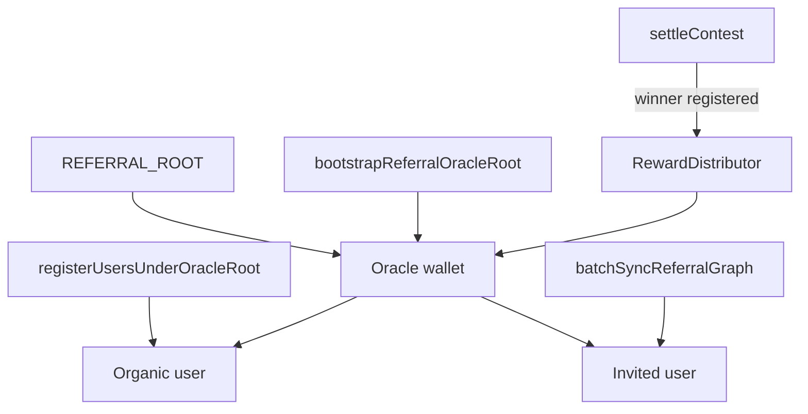

# Referral Graph Rollout

Roll out on-chain `ReferralGraph` sync on **Base Sepolia (84532)** using **Option B**: the **oracle wallet** is registered under `REFERRAL_ROOT`, and **every user** is in the tree — organic users on-chain under the oracle, invited users under their inviter (with heads under the oracle when needed). Contest settlement must route the referral-network fee through `RewardDistributor`; **`ReferralNetworkFeeToOracle` must not fire in normal operation**.

Fee economics and revenue: **[REFERRAL_NETWORK_REVENUE.md](REFERRAL_NETWORK_REVENUE.md)**.

## Referral policy (Option B)

| User | DB `referrerAddress` | On-chain parent | Settlement |
|------|----------------------|-----------------|------------|
| Oracle | `null` | `REFERRAL_ROOT` | N/A (not a typical winner) |
| Organic | `null` | Oracle wallet | Fee via distributor; anchor often oracle |
| Invited | Inviter wallet | Inviter (must be registered) | Fee shared up chain including oracle ancestor |

Users who already have an inviter in DB keep that parent on-chain. Multi-level invite chains are preserved.

**Production invariant:** `isRegistered(winnerWallet, referralGroupId) === true` before settlement on new contests.

**Safety net only:** If `getReferrer(winner)` is zero or `REFERRAL_ROOT`, the contract still transfers the fee to the oracle ([`ContestController`](contracts/lib/contestCatalyst/src/ContestController.sol)). Treat any such event as an ops/incident — not expected steady state.

## Architecture

| Layer | Detail |
|-------|--------|
| Ultimate root | Oracle wallet registered once with `REFERRAL_ROOT` as parent |
| Organic users | `register(wallet, oracle, groupId)` on backfill and at signup |
| Invited users | `register(wallet, referrer, groupId)` via sync job |
| Chain auth | Oracle in `_authorizedOracles` on graph + distributor |
| Env | `REFERRAL_GROUP_ID`, `REFERRAL_ORACLE_ROOT_ADDRESS` (oracle wallet on 84532) |

### Sepolia contract addresses

| Contract | Address (Base Sepolia) |
|----------|------------------------|
| ReferralGraph | `0xe86440c041028739995AF8E940DD327c99E234A5` |
| RewardDistributor | `0x68460F01c5b06b44caf4feB196b3a8c1ece9Dc4f` |

Legacy pair (pre–Phase 0): ReferralGraph `0xD11F317D12ECCd56926B2bDC3144dDA103BB1fd0`, RewardDistributor `0x344C21c7DAffB5Fb9442b27e1E53051aE7faf926`.

Sources: `server/src/contracts/sepolia.json`, `client/src/utils/contracts/sepolia.json`.

## Implementation tasks

- [x] Phase 0: Deploy ReferralGraph + RewardDistributor; sepolia configs + ABIs; verify oracle authorization
- [x] Phase 2c: `REFERRAL_ORACLE` defaults to deployer in deploy scripts + `contracts/env.example`
- [ ] Phase 1a: `REFERRAL_ORACLE_ROOT_ADDRESS` + `referralConfig` helper; `bootstrapReferralOracleRoot.ts`
- [ ] Phase 1b: `registerUsersUnderOracleRoot.ts` — all organic + chain heads under oracle (`--dry-run`)
- [ ] Phase 1c: `batchSyncReferralGraph` — BFS, defer, `referralGraphRegister`; `privyUserProvisioning` registers organic under oracle on signup
- [ ] Phase 1d: Pre-settlement `isRegistered(winner)` guard; monitor `ReferralNetworkFeeToOracle` = 0
- [ ] Phase 2: Ops runbook — bootstrap → register all → sync until clean → audit all wallets registered
- [ ] Phase 3: Update `spec/server/cron.md`

## Phase 0 — Fresh referral contracts on Base Sepolia

Phase 0 replaces the legacy ReferralGraph / RewardDistributor pair (`referralTree` **`0bb58f0`**). MockUSDC, PlatformToken, DepositManager, and ContestFactory are **not** redeployed.

### Phase 0 completion checklist

- [x] `Deploy_sepolia_referral.s.sol` added
- [x] New ReferralGraph and RewardDistributor deployed on 84532
- [x] `sepolia.json` (client + server) updated; ABIs copied
- [x] `isAuthorizedOracle(REFERRAL_ORACLE)` true on new graph (and distributor)

Deploy and verify steps: see Phase 0 sections in git history or [REFERRAL_NETWORK_REVENUE.md](REFERRAL_NETWORK_REVENUE.md) checklist.

## Phase 1 — Full tree under oracle

### 1a — Config and oracle root bootstrap

- `REFERRAL_ORACLE_ROOT_ADDRESS` in `server/.env.example` (oracle smart wallet on 84532, matches contest oracle / `ORACLE_ADDRESS`)
- `getReferralOracleRootAddress(chainId)` in [`referralConfig.ts`](server/src/lib/referralConfig.ts)
- **`bootstrapReferralOracleRoot.ts`**: `register(oracleWallet, REFERRAL_ROOT, groupId)` if not already registered

### 1b — Register all non-invited users under oracle

**Script:** `registerUsersUnderOracleRoot.ts`  
**npm:** `pnpm --filter server run script:register-users-under-oracle-root`  
**Flags:** `--dry-run`

Targets (84532 wallet, not yet `isRegistered`):

- Users with **no** `referrerAddress` (organic) → parent **oracle**
- **Chain heads** (others’ `referrerAddress` points at them, they have no DB referrer) → parent **oracle**

Does **not** change DB `referrerAddress` for organic users (still `null` for UI).

### 1c — Invite sync + signup

**`batchSyncReferralGraph.ts`:**

1. Pending: users with full invite referral fields and `referralOnchainTxHash IS NULL`
2. Defer if `referrerAddress` not `isRegistered`
3. BFS by `referredByUserId`
4. `referralGraphRegister()` in [`referralGraph.ts`](server/src/services/referral/referralGraph.ts) for single-wallet paths

**`privyUserProvisioning.ts`:** After creating a user **without** invite header, enqueue or call `register(newWallet, oracleWallet, groupId)` (and set `referralGroupId` / `referralChainId` on user if needed for sync bookkeeping).

### 1d — Settlement guards

- [`buildSettlementReferralArgs.ts`](server/src/services/contest/buildSettlementReferralArgs.ts): always sign when winner has valid anchor (non-zero, not `REFERRAL_ROOT`)
- Pre-settlement: reject or warn if winner not `isRegistered`
- Alert if `ReferralNetworkFeeToOracle` appears on new contest controllers

Contract fallback code remains; **do not rely on it** for revenue or indexing.

## Phase 2 — Execution runbook (Sepolia)

| Step | Action |
|------|--------|
| 1 | `REFERRAL_GROUP_ID` + `REFERRAL_ORACLE_ROOT_ADDRESS` in `server/.env` |
| 2 | Phase 0 complete |
| 3 | `script:bootstrap-referral-oracle-root` |
| 4 | `script:register-users-under-oracle-root -- --dry-run` → review |
| 5 | `script:register-users-under-oracle-root` |
| 6 | `service:batch-sync-referral-graph` until `failed: 0` and `deferred: 0` |
| 7 | Audit: all 84532 user wallets `isRegistered` |
| 8 | Test settlement → `ReferralNetworkFeeDistributed` only |

### Audit queries

- Wallets not `isRegistered` (must be empty before production settles)
- Pending invite sync count
- `ReferralNetworkFeeToOracle` logs (expect **none** on new contests)

## Phase 3 — Steady state

- Cron: `batchSyncReferralGraph` every 5 minutes
- New organic signup → register under oracle immediately or within one cron cycle
- New invited signup → existing invite resolution + sync
- All contest settlements on new graph → distributor path only
- See `SIMULATE_INVITE_REWARDS.md` for payment indexing shape

## Relevant files

| File | Purpose |
|------|---------|
| `server/src/scripts/bootstrapReferralOracleRoot.ts` | Oracle under `REFERRAL_ROOT` |
| `server/src/scripts/registerUsersUnderOracleRoot.ts` | Organic + heads under oracle |
| `server/src/services/batch/batchSyncReferralGraph.ts` | Invite sync, BFS, defer |
| `server/src/lib/referralConfig.ts` | Group id, graph addresses, oracle root |
| `server/src/lib/privyUserProvisioning.ts` | Organic on-chain register under oracle |
| `server/src/services/contest/buildSettlementReferralArgs.ts` | Signed referral payload |
| `REFERRAL_NETWORK_REVENUE.md` | Option B revenue model |
| `spec/server/cron.md` | Cron documentation |

## Risks and mitigations

| Risk | Mitigation |
|------|------------|
| Winner not registered before settle | Pre-settlement check; audit script |
| `ReferralNetworkFeeToOracle` fired | Alert; register missing wallet under oracle |
| Referrer not on-chain before invitee | BFS + defer; cron retries |
| Oracle root not bootstrapped | `bootstrapReferralOracleRoot` gate in runbook |
| Legacy contests on old graph | New contests only; old controllers keep old behavior |
| Organic user never registered | `registerUsersUnderOracleRoot` + signup hook |
