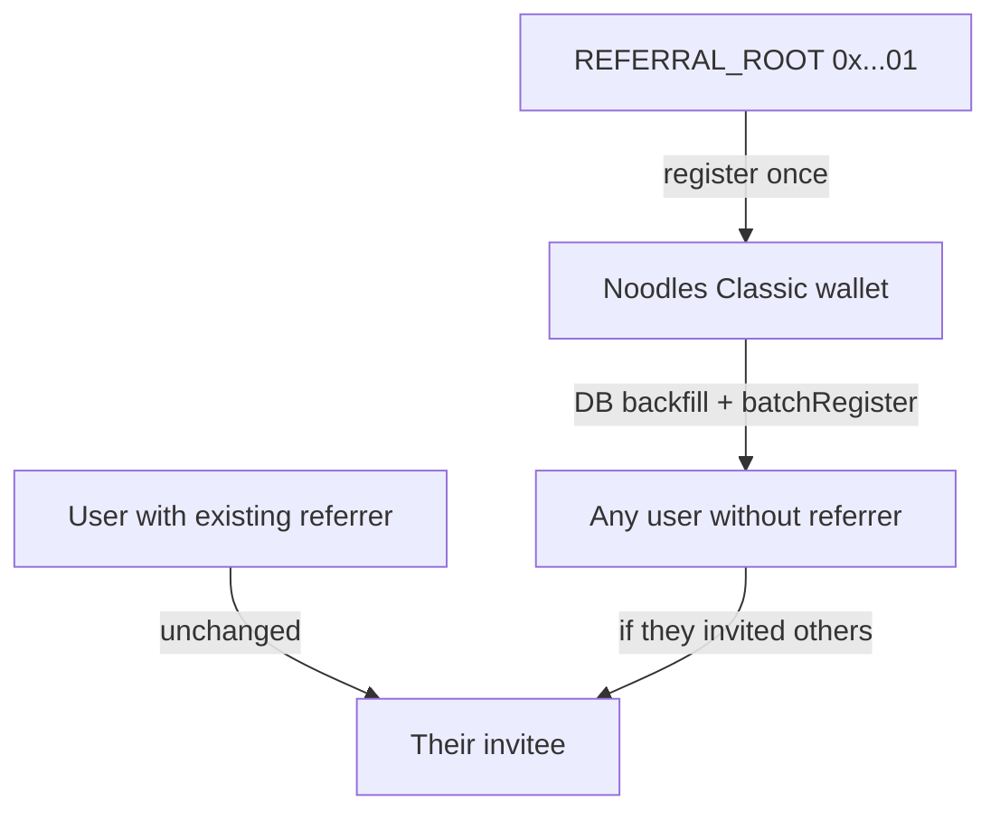

# Referral Graph Rollout

Roll out on-chain `ReferralGraph` sync on **Base Sepolia (84532)**: authorize the referral oracle, DB-backfill every user without a referrer to **Noodles Classic** (`mattlovan@gmail.com`), register the platform anchor under `REFERRAL_ROOT`, and run depth-safe batch sync until the existing userbase is mirrored on chain.

Users who already have a referrer keep their existing parent — existing multi-level chains are preserved.

## Architecture



| Layer | Detail |
|-------|--------|
| DB group | Single global `REFERRAL_GROUP_ID` via `server/src/lib/referralConfig.ts` |
| Platform root | Noodles Classic keeps `referrerAddress = null` in DB |
| Chain auth | Oracle wallet (`ORACLE_PRIVATE_KEY`) must be in `_authorizedOracles` on `ReferralGraph` — contract owner alone cannot call `batchRegister` |

### Sepolia contract addresses

| Contract | Address |
|----------|---------|
| ReferralGraph | `0xD11F317D12ECCd56926B2bDC3144dDA103BB1fd0` |
| RewardDistributor | `0x344C21c7DAffB5Fb9442b27e1E53051aE7faf926` |

Sources: `server/src/contracts/sepolia.json`, `client/src/utils/contracts/sepolia.json`.

## Implementation tasks

- [ ] Phase 0: Authorize oracle on ReferralGraph and RewardDistributor (Sepolia); verify `isAuthorizedOracle`
- [ ] Phase 1: Add `backfillReferralRoots.ts` — all users without a referrer on 84532 → Noodles Classic; `--dry-run` support
- [ ] Phase 2a: Add `REFERRAL_ROOT` constant and `referralGraphRegister()` in `server/src/services/referral/referralGraph.ts`
- [ ] Phase 2b: Harden `batchSyncReferralGraph` — register platform anchor under ROOT, depth order, defer when referrer not on-chain
- [ ] Phase 2c: Default `REFERRAL_ORACLE` to deployer in `Deploy_sepolia.s.sol` / `Deploy_base.s.sol` + `contracts/env.example`
- [ ] Phase 3: Execute runbook (dry-run backfill → live backfill → batch sync until clean)
- [ ] Phase 4: Update `spec/server/cron.md` with referral rollout runbook and script names

## Phase 0 — One-time on-chain setup

Run from repo root with `server/.env` loaded:

```bash
set -a && source server/.env && set +a

cast send 0xD11F317D12ECCd56926B2bDC3144dDA103BB1fd0 \
  "authorizeOracle(address)" \
  "$ORACLE_ADDRESS" \
  --rpc-url "$BASE_SEPOLIA_RPC_URL" \
  --private-key "$ORACLE_PRIVATE_KEY"

cast send 0x344C21c7DAffB5Fb9442b27e1E53051aE7faf926 \
  "authorizeOracle(address)" \
  "$ORACLE_ADDRESS" \
  --rpc-url "$BASE_SEPOLIA_RPC_URL" \
  --private-key "$ORACLE_PRIVATE_KEY"
```

Verify:

```bash
GRAPH=0xD11F317D12ECCd56926B2bDC3144dDA103BB1fd0
cast call $GRAPH "getAuthorizedOracles()(address[])" --rpc-url "$BASE_SEPOLIA_RPC_URL"
cast call $GRAPH "isAuthorizedOracle(address)(bool)" "$ORACLE_ADDRESS" --rpc-url "$BASE_SEPOLIA_RPC_URL"
```

Future deploys: set `REFERRAL_ORACLE` to the deployer/oracle address in `contracts/.env` so the constructor authorizes at deploy time (today defaults to `address(0)`).

## Phase 1 — DB backfill (all orphans → Noodles Classic)

**Script:** `server/src/scripts/backfillReferralRoots.ts`  
**npm:** `pnpm --filter server run script:backfill-referral-roots`  
**Flags:** `--dry-run` (report only, no writes)

### Anchor user

- Email: `mattlovan@gmail.com`
- Display name must contain `Noodles Classic`
- Must have a `UserWallet` on chain `84532`

### Backfill targets

Every user where:

- `referredByUserId IS NULL` and `referrerAddress IS NULL`
- `id != anchor.id`
- Has a `UserWallet` on chain `84532`

### Excluded (unchanged)

- Noodles Classic (anchor)
- Any user who already has `referredByUserId` or `referrerAddress`

### Fields set per target user

| Field | Value |
|-------|--------|
| `referredByUserId` | Noodles Classic `id` |
| `referrerAddress` | Noodles wallet on 84532 (`UserWallet.publicKey`, lowercase) |
| `referralGroupId` | `REFERRAL_GROUP_ID` from env |
| `referralChainId` | `84532` |
| `referralRecordedAt` | `now()` |
| `referralOnchainTxHash` | `null` (sync job fills) |

### Safety checks

- Abort if `REFERRAL_GROUP_ID` unset or invalid
- Abort if anchor wallet missing on 84532
- Skip (warn) users without a 84532 wallet; suggest `script:sync-user-wallets-from-privy` first
- Warn if existing referral rows use a different `referralGroupId` than env; do not overwrite those rows
- Log summary: updated, skipped (no wallet), skipped (anchor), already-has-referrer

## Phase 2 — On-chain sync hardening

### `referralGraph.ts`

- Export `REFERRAL_ROOT = 0x0000000000000000000000000000000000000001`
- Add `referralGraphRegister(chainId, graphAddr, user, referrer, groupId)` calling contract `register`

### `batchSyncReferralGraph.ts`

Current gaps:

- Platform root (no `referrerAddress`) never syncs
- Sibling batches fail with `ReferrerNotInTree` when parent is not on-chain yet
- No depth ordering

Target flow:

1. **Platform anchor:** If `REFERRAL_PLATFORM_ROOT_EMAIL` (default `mattlovan@gmail.com`) has a wallet on chain and is not `isRegistered`, call `register(anchorWallet, REFERRAL_ROOT, groupId)` and set `referralOnchainTxHash` (reuse `"already_registered"` sentinel).
2. **Pending users:** Same query as today — full referral fields and `referralOnchainTxHash IS NULL`.
3. **Defer, don’t fail:** Skip users whose `referrerAddress` is not yet `isRegistered` on chain; log `deferred` count.
4. **Depth order:** BFS sort by `referredByUserId` within same `referralChainId` + `referralGroupId`; process shallowest first.
5. Keep existing `isRegistered` short-circuit and `already_registered` DB marker.

**Manual sync:** `pnpm --filter server run service:batch-sync-referral-graph`

## Phase 3 — Execution runbook (Sepolia)

| Step | Action |
|------|--------|
| 1 | Confirm `REFERRAL_GROUP_ID` in `server/.env` matches referred users in DB |
| 2 | Complete Phase 0 oracle authorization |
| 3 | `pnpm --filter server run script:backfill-referral-roots -- --dry-run` → review |
| 4 | `pnpm --filter server run script:backfill-referral-roots` |
| 5 | `pnpm --filter server run service:batch-sync-referral-graph` |
| 6 | Repeat step 5 until `failed: 0` and `deferred: 0` |
| 7 | Spot-check `isRegistered` for anchor wallet and sample users |

### Audit queries

- Pending sync count (`referralOnchainTxHash IS NULL` with full referral fields)
- Users with null referrer remaining (expect anchor only)
- Users missing 84532 wallet
- Users with existing referrer (unchanged sanity check)

## Phase 4 — Steady state

- Cron runs `batchSyncReferralGraph` every 5 minutes at end of pipeline (`server/src/cron/scheduler.ts`)
- New signups via `server/src/lib/privyUserProvisioning.ts` → pending rows picked up within one cron cycle
- **Out of scope:** `RewardDistributor` integration for contest oracle-fee payouts — see `SIMULATE_INVITE_REWARDS.md`

## Relevant files

| File | Purpose |
|------|---------|
| `server/src/scripts/backfillReferralRoots.ts` | DB backfill all orphan users to anchor |
| `server/package.json` | `script:backfill-referral-roots`, `service:batch-sync-referral-graph` |
| `server/src/services/referral/referralGraph.ts` | `REFERRAL_ROOT`, `referralGraphRegister` |
| `server/src/services/batch/batchSyncReferralGraph.ts` | Anchor register, deferral, depth order |
| `server/src/lib/referralConfig.ts` | `REFERRAL_GROUP_ID`, graph address lookup |
| `server/src/lib/privyUserProvisioning.ts` | Signup referral capture |
| `contracts/script/Deploy_sepolia.s.sol` | Deploy ReferralGraph + RewardDistributor |
| `contracts/lib/referralTree/src/core/ReferralGraph.sol` | On-chain tree semantics |
| `spec/server/cron.md` | Cron pipeline documentation |

## Risks and mitigations

| Risk | Mitigation |
|------|------------|
| Noodles not found / no 84532 wallet | Fail fast; run `script:sync-user-wallets-from-privy` first |
| Mixed `referralGroupId` in DB | Normalize before backfill; script warns on mismatch |
| Users already under another referrer | Unchanged — multi-level chains preserved |
| Orphans with invitees | Level 1 under Noodles; invitees stay under them |
| Leaf orphans (no invitees) | Level 1 under Noodles after sync |
| Oracle not authorized | Phase 0 gate before any sync (`UnauthorizedOracle`) |
