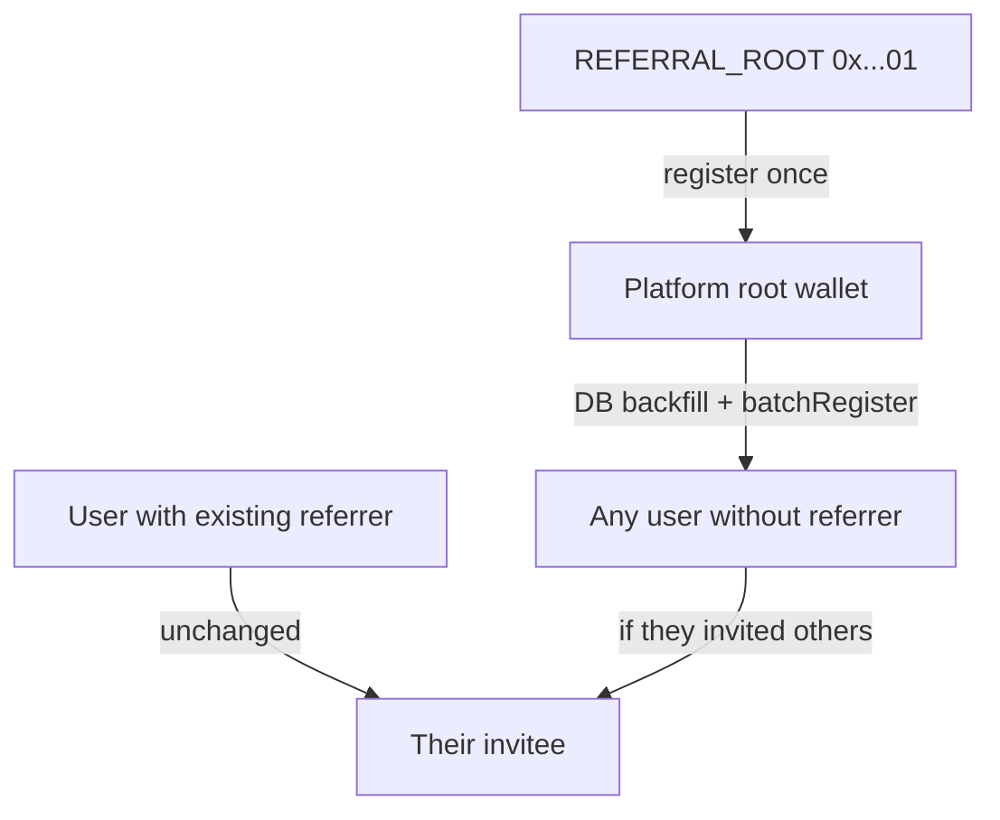

# Referral Graph Rollout

Roll out on-chain `ReferralGraph` sync on **Base Sepolia (84532)**: authorize the referral oracle, DB-backfill every user without a referrer to the **platform default referrer** (smart wallet in `REFERRAL_PLATFORM_ROOT_ADDRESS`), register that wallet on-chain under `REFERRAL_ROOT`, and run depth-safe batch sync until the existing userbase is mirrored on chain.

**Default referrer policy:** Every user who is not explicitly referred by someone else is referred by the platform root wallet — both for the one-time backfill and for all subsequent signups. Users who arrive via `?ref=` or `X-Cut-Referrer-Address` keep that referrer; everyone else gets the platform root as parent at account creation.

Users who already have a referrer keep their existing parent — existing multi-level chains are preserved.

## Architecture



| Layer | Detail |
|-------|--------|
| DB group | Single global `REFERRAL_GROUP_ID` via `server/src/lib/referralConfig.ts` |
| Platform root | Smart wallet in `REFERRAL_PLATFORM_ROOT_ADDRESS` — default referrer for all users without an explicit referrer |
| Platform root DB row | That wallet’s Cut user keeps `referrerAddress = null` (only user with no parent) |
| Chain auth | Oracle wallet (`ORACLE_PRIVATE_KEY`) must be in `_authorizedOracles` on `ReferralGraph` — contract owner alone cannot call `batchRegister` |

### Sepolia contract addresses

| Contract | Address |
|----------|---------|
| ReferralGraph | `0xD11F317D12ECCd56926B2bDC3144dDA103BB1fd0` |
| RewardDistributor | `0x344C21c7DAffB5Fb9442b27e1E53051aE7faf926` |

Sources: `server/src/contracts/sepolia.json`, `client/src/utils/contracts/sepolia.json`.

## Implementation tasks

- [ ] Phase 0: Authorize oracle on ReferralGraph and RewardDistributor (Sepolia); verify `isAuthorizedOracle`
- [ ] Phase 1: Add `backfillReferralRoots.ts` — all users without a referrer on 84532 → platform root wallet; `--dry-run` support
- [ ] Phase 1b: Default referrer at signup — update `privyUserProvisioning.ts` so new users without `X-Cut-Referrer-Address` are referred by `REFERRAL_PLATFORM_ROOT_ADDRESS` (not left null)
- [ ] Phase 1c: Add `REFERRAL_PLATFORM_ROOT_ADDRESS` to `referralConfig.ts` + `server/.env.example`; shared `resolvePlatformReferralAnchor()` helper
- [ ] Phase 2a: Add `REFERRAL_ROOT` constant and `referralGraphRegister()` in `server/src/services/referral/referralGraph.ts`
- [ ] Phase 2b: Harden `batchSyncReferralGraph` — register platform anchor under ROOT, depth order, defer when referrer not on-chain
- [ ] Phase 2c: Default `REFERRAL_ORACLE` to deployer in `Deploy_sepolia.s.sol` / `Deploy_base.s.sol` + `contracts/env.example`
- [ ] Phase 3: Execute runbook (dry-run backfill → live backfill → batch sync until clean)
- [ ] Phase 4: Update `spec/server/cron.md` with referral rollout runbook and script names

## Phase 0 — One-time on-chain setup

Run from repo root with `server/.env` loaded:

```bash
set -a && source server/.env && set +a

cast send 0xD11F317D12ECCd56926B2bDC3144dDA103BB1fd0 \
  "authorizeOracle(address)" \
  "$ORACLE_ADDRESS" \
  --rpc-url "$BASE_SEPOLIA_RPC_URL" \
  --private-key "$ORACLE_PRIVATE_KEY"

cast send 0x344C21c7DAffB5Fb9442b27e1E53051aE7faf926 \
  "authorizeOracle(address)" \
  "$ORACLE_ADDRESS" \
  --rpc-url "$BASE_SEPOLIA_RPC_URL" \
  --private-key "$ORACLE_PRIVATE_KEY"
```

Verify:

```bash
GRAPH=0xD11F317D12ECCd56926B2bDC3144dDA103BB1fd0
cast call $GRAPH "getAuthorizedOracles()(address[])" --rpc-url "$BASE_SEPOLIA_RPC_URL"
cast call $GRAPH "isAuthorizedOracle(address)(bool)" "$ORACLE_ADDRESS" --rpc-url "$BASE_SEPOLIA_RPC_URL"
```

Future deploys: set `REFERRAL_ORACLE` to the deployer/oracle address in `contracts/.env` so the constructor authorizes at deploy time (today defaults to `address(0)`).

## Phase 1 — DB backfill (all orphans → platform root)

**Script:** `server/src/scripts/backfillReferralRoots.ts`  
**npm:** `pnpm --filter server run script:backfill-referral-roots`  
**Flags:** `--dry-run` (report only, no writes)

### Platform root (env)

Configured via **`REFERRAL_PLATFORM_ROOT_ADDRESS`** — the smart wallet address of the default referrer (e.g. mattlovan’s Privy smart wallet on Base Sepolia).

Resolution:

1. Parse env as EVM address; normalize lowercase.
2. Look up `UserWallet` where `publicKey` matches and `chainId = 84532`.
3. Load owning `User` — that user is the anchor.
4. Abort if env unset, invalid address, or no matching wallet/user in DB.

The env var is the source of truth — not email or display name.

### Backfill targets

Every user where:

- `referredByUserId IS NULL` and `referrerAddress IS NULL`
- `id != anchor.userId`
- Has a `UserWallet` on chain `84532`

### Excluded (unchanged)

- Platform root user (owner of `REFERRAL_PLATFORM_ROOT_ADDRESS`)
- Any user who already has `referredByUserId` or `referrerAddress`

### Fields set per target user

| Field | Value |
|-------|--------|
| `referredByUserId` | Platform root user `id` |
| `referrerAddress` | `REFERRAL_PLATFORM_ROOT_ADDRESS` (lowercase) |
| `referralGroupId` | `REFERRAL_GROUP_ID` from env |
| `referralChainId` | `84532` |
| `referralRecordedAt` | `now()` |
| `referralOnchainTxHash` | `null` (sync job fills) |

### Safety checks

- Abort if `REFERRAL_GROUP_ID` or `REFERRAL_PLATFORM_ROOT_ADDRESS` unset or invalid
- Abort if platform root wallet not found in DB on 84532
- Skip (warn) users without a 84532 wallet; suggest `script:sync-user-wallets-from-privy` first
- Warn if existing referral rows use a different `referralGroupId` than env; do not overwrite those rows
- Log summary: updated, skipped (no wallet), skipped (anchor), already-has-referrer

## Default referrer at signup (ongoing)

After the one-time backfill, **every new user** who does not sign up with an explicit referrer is referred by `REFERRAL_PLATFORM_ROOT_ADDRESS` at account creation.

| Signup path | Referrer stored |
|-------------|-----------------|
| `?ref=0x…` / `X-Cut-Referrer-Address` | That wallet (validated via existing `resolveReferralForNewUser`) |
| No referrer header | `REFERRAL_PLATFORM_ROOT_ADDRESS` |
| New user’s wallet equals `REFERRAL_PLATFORM_ROOT_ADDRESS` | No referrer (`referrerAddress` stays null) |

### Implementation (`server/src/lib/privyUserProvisioning.ts`)

In `ensureCutUserFromPrivy`, when creating a new user and `normalizedReferrer` is absent:

1. Resolve platform anchor via shared `resolvePlatformReferralAnchor(chainId)` (reads `REFERRAL_PLATFORM_ROOT_ADDRESS`, looks up `UserWallet` + `User`).
2. Set referral fields with `referrerAddress = REFERRAL_PLATFORM_ROOT_ADDRESS` and `referredByUserId = anchor.userId`.
3. Do **not** apply default referrer when the new user’s signup wallet equals `REFERRAL_PLATFORM_ROOT_ADDRESS`.
4. `REFERRAL_REQUIRED_FOR_SIGNUP` remains independent: when `true`, signup without `?ref=` still fails before default-referrer logic runs.

Shared helper in `server/src/lib/referralConfig.ts`:

```ts
resolvePlatformReferralAnchor(chainId: number): {
  userId: string;
  walletAddress: `0x${string}`; // lowercase
}
```

Used by backfill script, sync job, and provisioning.

### Env

| Variable | Required | Purpose |
|----------|----------|---------|
| `REFERRAL_PLATFORM_ROOT_ADDRESS` | Yes | Smart wallet address of the platform default referrer |
| `REFERRAL_GROUP_ID` | Yes | Group id written on all referred users |

Example (`server/.env`):

```bash
REFERRAL_PLATFORM_ROOT_ADDRESS=0xYourMattlovanSmartWalletHere
REFERRAL_GROUP_ID=0xf3b2c5df2545cd4fdf6e6cca1ecc4e498cdd41a1b76137d88965df5bb7842611
```

## Phase 2 — On-chain sync hardening

### `referralGraph.ts`

- Export `REFERRAL_ROOT = 0x0000000000000000000000000000000000000001`
- Add `referralGraphRegister(chainId, graphAddr, user, referrer, groupId)` calling contract `register`

### `batchSyncReferralGraph.ts`

Current gaps:

- Platform root (no `referrerAddress`) never syncs
- Sibling batches fail with `ReferrerNotInTree` when parent is not on-chain yet
- No depth ordering

Target flow:

1. **Platform anchor:** If `REFERRAL_PLATFORM_ROOT_ADDRESS` is not `isRegistered` on chain, call `register(anchorWallet, REFERRAL_ROOT, groupId)` and set `referralOnchainTxHash` (reuse `"already_registered"` sentinel).
2. **Pending users:** Same query as today — full referral fields and `referralOnchainTxHash IS NULL`.
3. **Defer, don’t fail:** Skip users whose `referrerAddress` is not yet `isRegistered` on chain; log `deferred` count.
4. **Depth order:** BFS sort by `referredByUserId` within same `referralChainId` + `referralGroupId`; process shallowest first.
5. Keep existing `isRegistered` short-circuit and `already_registered` DB marker.

**Manual sync:** `pnpm --filter server run service:batch-sync-referral-graph`

## Phase 3 — Execution runbook (Sepolia)

| Step | Action |
|------|--------|
| 1 | Set `REFERRAL_PLATFORM_ROOT_ADDRESS` and confirm `REFERRAL_GROUP_ID` in `server/.env` |
| 2 | Complete Phase 0 oracle authorization |
| 3 | `pnpm --filter server run script:backfill-referral-roots -- --dry-run` → review |
| 4 | `pnpm --filter server run script:backfill-referral-roots` |
| 5 | `pnpm --filter server run service:batch-sync-referral-graph` |
| 6 | Repeat step 5 until `failed: 0` and `deferred: 0` |
| 7 | Spot-check `isRegistered` for anchor wallet and sample users |

### Audit queries

- Pending sync count (`referralOnchainTxHash IS NULL` with full referral fields)
- Users with null referrer remaining (expect platform root user only)
- Users missing 84532 wallet
- Users with existing referrer (unchanged sanity check)

## Phase 4 — Steady state

- Cron runs `batchSyncReferralGraph` every 5 minutes at end of pipeline (`server/src/cron/scheduler.ts`)
- New signups via `server/src/lib/privyUserProvisioning.ts`:
  - Explicit referrer → existing invite-link flow
  - No referrer → default to `REFERRAL_PLATFORM_ROOT_ADDRESS` (Phase 1b)
  - Pending rows picked up within one cron cycle
- No user should remain with null referrer except the platform root wallet owner
- **Out of scope:** `RewardDistributor` integration for contest oracle-fee payouts — see `SIMULATE_INVITE_REWARDS.md`

## Relevant files

| File | Purpose |
|------|---------|
| `server/src/scripts/backfillReferralRoots.ts` | DB backfill all orphan users to anchor |
| `server/package.json` | `script:backfill-referral-roots`, `service:batch-sync-referral-graph` |
| `server/src/services/referral/referralGraph.ts` | `REFERRAL_ROOT`, `referralGraphRegister` |
| `server/src/services/batch/batchSyncReferralGraph.ts` | Anchor register, deferral, depth order |
| `server/src/lib/referralConfig.ts` | `REFERRAL_GROUP_ID`, graph address lookup; shared anchor helper |
| `server/src/lib/privyUserProvisioning.ts` | Signup referral capture; default referrer when no `?ref=` |
| `contracts/script/Deploy_sepolia.s.sol` | Deploy ReferralGraph + RewardDistributor |
| `contracts/lib/referralTree/src/core/ReferralGraph.sol` | On-chain tree semantics |
| `spec/server/cron.md` | Cron pipeline documentation |

## Risks and mitigations

| Risk | Mitigation |
|------|------------|
| Platform root wallet not in DB on 84532 | Fail fast; ensure Cut user exists with that wallet (`script:sync-user-wallets-from-privy`) |
| `REFERRAL_PLATFORM_ROOT_ADDRESS` wrong or unset | Fail fast at backfill, sync, and signup |
| Mixed `referralGroupId` in DB | Normalize before backfill; script warns on mismatch |
| Users already under another referrer | Unchanged — multi-level chains preserved |
| Orphans with invitees | Level 1 under platform root; invitees stay under them |
| Leaf orphans (no invitees) | Level 1 under platform root after sync |
| New signups without invite link | Default to `REFERRAL_PLATFORM_ROOT_ADDRESS` at provisioning (Phase 1b) |
| Oracle not authorized | Phase 0 gate before any sync (`UnauthorizedOracle`) |
