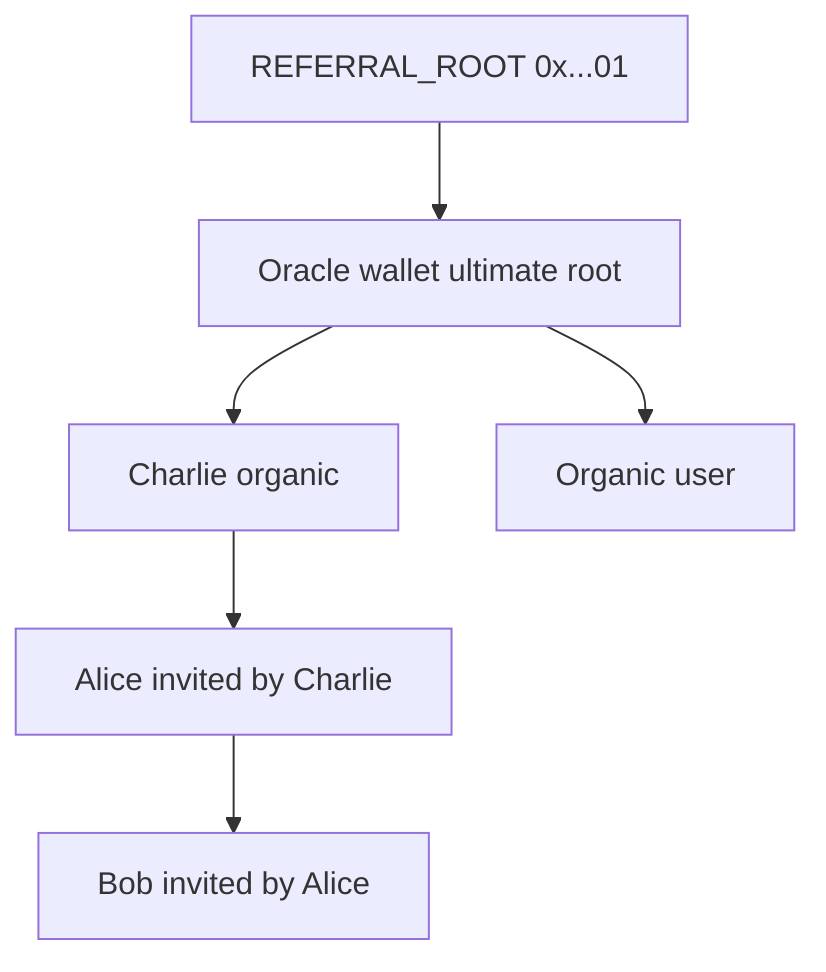

# Referral Network Revenue and Oracle Root Tree

**Decision: Option B** — the **contest oracle wallet** is the ultimate tree root under `REFERRAL_ROOT`. **Every Cut user** with a wallet on the contest chain is registered on `ReferralGraph` with parent = invite referrer when present, otherwise **parent = oracle**. The `ReferralNetworkFeeToOracle` settlement path is a **contract safety net only**; normal operations must register all users so fees always flow through `RewardDistributor` (geometric split up the chain, including the oracle as an ancestor).

Related: [REFERRAL_GRAPH_ROLLOUT.md](REFERRAL_GRAPH_ROLLOUT.md), [SIMULATE_INVITE_REWARDS.md](SIMULATE_INVITE_REWARDS.md), [ReferralNetworkIntegration.md](contracts/lib/contestCatalyst/ReferralNetworkIntegration.md).

---

## Target topology



| User type | On-chain parent | DB `referrerAddress` |
|-----------|-----------------|----------------------|
| Oracle | `REFERRAL_ROOT` | `null` (oracle user row) |
| Organic (no invite) | Oracle wallet | `null` (optional: mirror oracle for sync queries) |
| Invited | Inviter’s smart wallet | Inviter wallet (unchanged) |
| Invite chain head (has invitees, no inviter in DB) | Oracle wallet | `null` until backfill mirrors oracle for ops |

**Settlement invariant:** For every contest winner on chain `84532`, `getReferrer(winner, referralGroupId)` must be **non-zero** and **not** `REFERRAL_ROOT`. Then `ContestController` calls `distributeChainRewards` and **does not** emit `ReferralNetworkFeeToOracle`.

---

## Fee economics

At settlement (`referralNetworkBps` typically **500 = 5%**):

```text
referralFee = totalGross * referralNetworkBps / 10_000
```

Winners are paid from net pools. The full `referralFee` goes to `RewardDistributor`, which pays **up to 10 ancestors** starting at `payoutAnchor = getReferrer(winner, groupId)` (winner never paid).

| Concern | Behavior under Option B |
|---------|---------------------------|
| Same total fee as legacy oracle skim | Yes — 5% once at settlement |
| Oracle revenue when winner is organic child of oracle | Payout anchor may be oracle → oracle gets **100%** of fee via distributor (not fallback transfer) |
| Oracle revenue when winner has invite chain | Oracle receives geometric **ancestor** slice; referrers above winner share the rest |
| Legacy `claimOracleFee` | Removed on new controllers |

### Example: $10,000 gross TVL → $500 fee

| Winner tree (under oracle) | Paid wallets | Rough split |
|----------------------------|--------------|-------------|
| `Oracle → Winner` | Oracle only | **~$500 → oracle** (via distributor) |
| `Oracle → Alice → Winner` | Alice, Oracle | **~$312 Alice**, **~$188 oracle** |
| `Oracle → Charlie → Alice → Winner` | Alice, Charlie, Oracle | 3-way geometric split |

---

## Why register everyone (no fallback in production)

[`ContestController`](contracts/lib/contestCatalyst/src/ContestController.sol) sends the fee to the oracle when:

```solidity
payoutAnchor == address(0) || payoutAnchor == REFERRAL_ROOT
```

That path is correct for misconfiguration or a winner who never received a wallet registration, but **must not occur** for ordinary contests once rollout is complete.

| If winner not registered | Effect |
|--------------------------|--------|
| Production | Ops / monitoring failure — fix graph before next settlement |
| Contract | Oracle receives direct ERC20 transfer (bypasses referral indexing as `REFERRAL` chain payouts) |

**Ops goal:** `ReferralNetworkFeeToOracle` event count **zero** on new contests after bootstrap + sync.

**Server:** [`buildSettlementReferralArgs.ts`](server/src/services/contest/buildSettlementReferralArgs.ts) should always produce a signed payload when the winner is registered with a valid anchor. Pre-settlement check (recommended): `isRegistered(winner, groupId) === true`.

---

## Graph bootstrap and registration (Option B)

`REFERRAL_ROOT` = `0x0000000000000000000000000000000000000001`. Only addresses **other than** `REFERRAL_ROOT` receive distributor payouts.

### Bootstrap sequence

| Order | Action |
|-------|--------|
| 1 | `register(oracleWallet, REFERRAL_ROOT, groupId)` — once per graph deploy |
| 2 | Register **organic** users: `register(userWallet, oracleWallet, groupId)` for every user with 84532 wallet and no invite referrer |
| 3 | Register **invite chain heads** not yet on-chain: `register(headWallet, oracleWallet, groupId)` when head has invitees but no DB referrer |
| 4 | **Sync invitees** with BFS + defer: `batchSyncReferralGraph` for rows with `referrerAddress` set |
| 5 | Cron until all wallets `isRegistered`; alert on any user missing registration |

### Ongoing signup

| Signup | On-chain (before first contest entry) |
|--------|----------------------------------------|
| With `?ref=` | `register(newWallet, referrerWallet, groupId)` after referrer is on-chain |
| Without invite | `register(newWallet, oracleWallet, groupId)` — **required**, not optional |

Cron picks up rows that batch missed; provisioning may call register synchronously for faster path.

### DB vs on-chain

| Field | Organic user | Invited user |
|-------|--------------|--------------|
| `referrerAddress` | `null` (display: no human inviter) | Inviter wallet |
| `referredByUserId` | `null` | Set |
| On-chain parent | **Oracle** | Inviter wallet |

On-chain parent is authoritative for settlement; DB stays human-readable (organic does not show oracle as “invited by” in product UI unless product chooses otherwise).

---

## Implementation artifacts

| Artifact | Purpose |
|----------|---------|
| `REFERRAL_ORACLE_ROOT_ADDRESS` | Oracle wallet on chain (same as contest `oracle` / `REFERRAL_ORACLE`); env in `server/.env.example` |
| `server/src/scripts/bootstrapReferralOracleRoot.ts` | Step 1: register oracle under `REFERRAL_ROOT` if needed |
| `server/src/scripts/registerUsersUnderOracleRoot.ts` | Steps 2–3: all organic + heads under oracle; `--dry-run` |
| `batchSyncReferralGraph.ts` | Step 4: invite rows, BFS, defer |
| `privyUserProvisioning.ts` | Register organic users under oracle on create |
| Pre-settlement guard | Fail or block settle if winner not `isRegistered` |
| Monitoring | Alert on `ReferralNetworkFeeToOracle` |

---

## Graph setup checklist (Base Sepolia)

Prerequisites: [Phase 0](REFERRAL_GRAPH_ROLLOUT.md) complete, `REFERRAL_GROUP_ID` matches contests.

1. Set `REFERRAL_ORACLE_ROOT_ADDRESS` (= authorized oracle wallet).
2. Run `bootstrapReferralOracleRoot`.
3. Run `registerUsersUnderOracleRoot` (all existing 84532 wallets).
4. Run `service:batch-sync-referral-graph` until `deferred: 0`, `failed: 0`.
5. Audit: every active user wallet `isRegistered(groupId)`.
6. Settlement test: confirm `ReferralNetworkFeeDistributed` only (no `ReferralNetworkFeeToOracle`).
7. New contests use `sepolia.json` distributor + graph addresses.

---

## Revenue summary

- Platform (oracle) is **always** in the ancestor chain for every user attached under Option B.
- **Organic winners** pay the full referral fee to the oracle through the distributor (single-ancestor case).
- **Invited winners** share the fee with referrers; oracle still earns a decay-weighted slice when depth ≥ 2.
- **No separate “oracle fallback” revenue path** in steady state — same token flow, correct event type, full indexer support for referral chain payouts.

---

## Declined alternatives

| Option | Status |
|--------|--------|
| A — Invite-only graph, oracle fallback for unregistered winners | **Declined** |
| C — Separate platform treasury root (not oracle) | **Declined** |

---

## Implementation order

1. Env + `referralConfig` helper: resolve oracle root address for chain.
2. `bootstrapReferralOracleRoot.ts` + `registerUsersUnderOracleRoot.ts`.
3. Harden `batchSyncReferralGraph` (defer + BFS).
4. `privyUserProvisioning`: register organic signups under oracle.
5. Pre-settlement `isRegistered` check + monitoring.
6. Ops runbook on Sepolia (bootstrap → register all → sync loop → audit).
