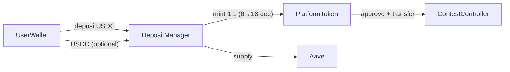
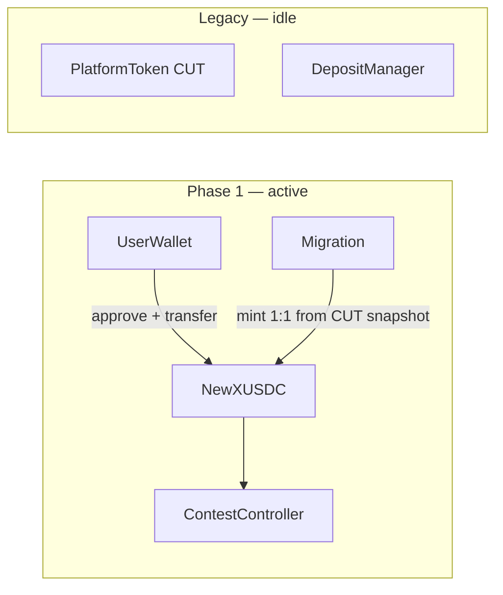

# Remove platformToken — Use xUSDC Directly (Base Sepolia)

Move the app to **xUSDC** ([`MockUSDC`](contracts/src/mocks/MockUSDC.sol), 6 decimals) on **Base Sepolia** in **two phases**: first redeploy xUSDC, mirror user CUT balances, and point the client at the new token; then delete the CUT/DepositManager conversion layer and related UI (cold paths after Phase 1).

ContestController already supports any ERC20 — Phase 1 is mostly a new token address + balance migration; Phase 2 is cleanup of ~30 files that assumed the two-token model.

## Scope

| In scope | Out of scope |
| --- | --- |
| **Base Sepolia** (chain id `84532`) — the only chain in use today | **Base mainnet** — not used; no live users or treasury |
| [`sepolia.json`](client/src/utils/contracts/sepolia.json) on client and server | [`base.json`](client/src/utils/contracts/base.json), [`Deploy_base.s.sol`](contracts/script/Deploy_base.s.sol), `scripts/base/` — repo/testing artifacts only; update only if keeping configs in sync |
| Phase 1: redeploy xUSDC + balance migration + client switch | Phase 2: CUT/DepositManager removal and conversion cleanup |
| xUSDC mint migration via token owner | Canonical mainnet USDC, treasury transfers, or non-mintable production stablecoins |
| Default env: `VITE_TARGET_CHAIN=testnet`, server Sepolia RPC | Mainnet RPC, canonical Base USDC (`0x8335…`) |

## Current Architecture



Today the app uses a **two-token model**:

- **xUSDC** (`paymentTokenAddress`, 6 decimals, `MockUSDC` on Sepolia) — test stablecoin, only used via `DepositManager` buy/sell
- **CUT** (`platformTokenAddress`, 18 decimals) — in-app currency; passed as `paymentToken` when creating contests

Key evidence: [`CreateContestForm.tsx`](client/src/components/contest/CreateContestForm.tsx) passes `platformTokenAddress` (not USDC) to `ContestFactory.createContest`, and deposit amounts use `1e18`.

## Target Architecture (end state — after Phase 2)


- No `PlatformToken`, no `DepositManager`, no Aave integration
- Users fund wallet with xUSDC directly (minted for test); contests hold and settle xUSDC
- All amounts in **6 decimals** (`$10` → `10_000_000` wei)

**Phase 1** reaches the same user-facing flow (approve + transfer new xUSDC) while legacy contracts and conversion code remain in the repo unused.

**Migration note:** Already-deployed Sepolia contests have CUT baked into their constructor — they cannot be migrated on-chain. Only **new** contests use xUSDC. Existing contests run to completion or are handled separately on testnet.

---

## Phased rollout

### Phase 1 — New xUSDC live (users keep balances)

**Goal:** Fresh `MockUSDC` deployment, 1:1 balance replication from CUT, client and server use the **new** `paymentTokenAddress` for all new activity. Old CUT / DepositManager contracts and conversion code can remain deployed and in the repo but are no longer on the hot path.



| Area | Phase 1 work |
| --- | --- |
| Contracts | Redeploy `MockUSDC` and `ContestFactory` on Base Sepolia; update `sepolia.json` `paymentTokenAddress` and `contestFactoryAddress`. New contests are created via the **new** factory with **new** xUSDC as `paymentToken`. Do **not** decommission old CUT/DepositManager or the old factory yet. |
| Balances | Snapshot every wallet’s CUT `balanceOf`; batch-mint equivalent xUSDC on the **new** contract ([`mintUserTokens.ts`](server/src/services/mintUserTokens.ts) / batch script, idempotent per user). |
| Client | Switch spend/create flows to new `paymentTokenAddress` and `contestFactoryAddress`: approve + transfer xUSDC, `1e6` deposits, new contests via **new** factory. Per-contest formatting still respects on-chain `paymentToken()` for old CUT contests. |
| Server | New contest creation uses `1e6` / `parseUnits(..., 6)` when payment token is xUSDC; oracle/settlement unchanged (reads `paymentToken()` per contest). |
| Intentionally deferred | Removing DepositManager swap hooks, dual-balance checks, Buy/Sell/CUT pages, `platformTokenAddress` in config, deploy-script cuts for PlatformToken/DepositManager. |

After Phase 1, users hold spendable xUSDC on the new contract; new entries and contests do not call DepositManager or mint CUT.

### Phase 2 — Remove conversion layer (dead code)

**Goal:** Delete CUT↔xUSDC conversion paths, platform-token config, and DepositManager/PlatformToken deploy artifacts. Nothing here should run in production once Phase 1 ships.

| Area | Phase 2 work |
| --- | --- |
| Contracts | Update `Deploy_sepolia.s.sol` to drop `PlatformToken`, `DepositManager`, `setDepositManager`; remove `platformTokenAddress`, `depositManagerAddress`, `aavePoolAddress` from `sepolia.json`. |
| Client | Remove swap layer in hooks, `convertPaymentToPlatformTokens` / `combinedSpendableWei`, Buy/Sell/CUT UI, PlatformToken/DepositManager ABIs, global 18-dec assumptions where only xUSDC remains. |
| Server | Remove `getPlatformTokenAddress()`, CUT admin multicalls, any remaining 18-dec defaults for platform-only paths. |
| Ops | Archive DepositManager scripts; trim deploy artifact copy list. |

Old CUT contests may still exist on-chain until they finish; UI keeps per-contest decimals from `paymentToken()` — no need to keep conversion helpers for that.

---

## Contract Changes

### Phase 1 — Redeploy xUSDC

| Component | Action |
| --- | --- |
| `MockUSDC.sol` (xUSDC) | Redeploy on Base Sepolia; set new address as `paymentTokenAddress` in `sepolia.json` (client + server). Update mint scripts / `mintUserTokens.ts` to the new owner + address. |
| `ContestFactory` | Redeploy alongside xUSDC; set new address as `contestFactoryAddress` in `sepolia.json`. All **new** contests go through this factory with new xUSDC as `paymentToken`. |
| `PlatformToken`, `DepositManager`, old factory | Leave old deployments on-chain; no new traffic after client/config switch |

### Phase 2 — Remove / stop deploying

| Component | Location | Action |
| --- | --- | --- |
| `PlatformToken.sol` | [`contracts/lib/yieldToken/src/PlatformToken.sol`](contracts/lib/yieldToken/src/PlatformToken.sol) | Remove from deploy |
| `DepositManager.sol` | [`contracts/lib/yieldToken/src/DepositManager.sol`](contracts/lib/yieldToken/src/DepositManager.sol) | Remove from deploy |
| `MockUSDC.sol` (xUSDC) | [`contracts/src/mocks/MockUSDC.sol`](contracts/src/mocks/MockUSDC.sol) | Keep — sole payment token on Base Sepolia |

### No changes needed (already token-agnostic)

[`ContestController.sol`](contracts/lib/contestCatalyst/src/ContestController.sol) and [`ContestFactory.sol`](contracts/lib/contestCatalyst/src/ContestFactory.sol) accept any ERC20 as `paymentToken`. Pass the xUSDC (`MockUSDC`) address at creation time.

### Deploy script changes

**Phase 1:** Deploy `MockUSDC` + `ContestFactory` (e.g. via [`Deploy_sepolia.s.sol`](contracts/script/Deploy_sepolia.s.sol) or a slim migration script); write new `paymentTokenAddress` and `contestFactoryAddress` to `sepolia.json`.

**Phase 2:** Update [`Deploy_sepolia.s.sol`](contracts/script/Deploy_sepolia.s.sol) for ongoing deploys — `MockUSDC` + `ContestFactory` only; drop `PlatformToken`, `DepositManager`, `setDepositManager`. [`Deploy_base.s.sol`](contracts/script/Deploy_base.s.sol) remains an optional artifact.

### Config JSON updates (Sepolia — active)

Files: [`client/src/utils/contracts/sepolia.json`](client/src/utils/contracts/sepolia.json), [`server/src/contracts/sepolia.json`](server/src/contracts/sepolia.json).

| Phase | `sepolia.json` |
| --- | --- |
| **1** | Update `paymentTokenAddress` and `contestFactoryAddress` to new deployments; keep `platformTokenAddress` / `depositManagerAddress` until Phase 2 if anything still references legacy contest tooling |
| **2** | Remove `platformTokenAddress`, `depositManagerAddress`, `aavePoolAddress` |

`base.json` (client + server) — optional artifact sync in Phase 2 only.

### Ops scripts

| Phase | Scripts |
| --- | --- |
| **1** | `mintPaymentToken.js`, balance-migration batch — target **new** xUSDC address |
| **2** | Archive `depositUSDC.js`, `checkPlatformTokenBalance.js`, `emergencyWithdrawAll.js`; update [`scripts/deploy.js`](scripts/deploy.js) ABI copy list |

---

## Server Changes (small surface area)

Server contest/oracle flows **already read `paymentToken()` from each contest contract** — they never mint or route through CUT.

### Phase 1

- Update `paymentTokenAddress` and `contestFactoryAddress` in `sepolia.json`; point [`mintUserTokens.ts`](server/src/services/mintUserTokens.ts) at new xUSDC
- [`server/src/routes/contest.ts`](server/src/routes/contest.ts) — use `1e6` / `parseUnits(..., 6)` for **new** contests using xUSDC (see decimal section)
- Balance migration batch (CUT snapshot → mint on new xUSDC)

### Phase 2

- [`server/src/lib/contractAddresses.ts`](server/src/lib/contractAddresses.ts) — remove `getPlatformTokenAddress()`
- Contract JSON — remove `platformTokenAddress`, `depositManagerAddress`
- Admin: xUSDC-only `balanceOf`; drop CUT multicall

### Decimal conversion

[`server/src/routes/contest.ts`](server/src/routes/contest.ts) line 425 hard-codes 18-decimal scaling:

```typescript
const primaryDepositAmountWei = BigInt(
  Math.floor(settings.primaryDeposit * 1e18),
).toString();
```

Change to `1e6` (or use `parseUnits(settings.primaryDeposit, 6)`).

| Phase | Files |
| --- | --- |
| **1** | [`contest.ts`](server/src/routes/contest.ts) `1e18` → `1e6` for new xUSDC contests |
| **2** | [`secondarySharePrice.ts`](server/src/lib/secondarySharePrice.ts), [`packages/secondary-pricing/`](packages/secondary-pricing/) — re-base 18-dec assumptions if still global |

### Unchanged

- Contest settlement (`settleContest.ts`), payout push (`pushContestPayouts.ts`), lock/close/activate — all use on-chain `paymentToken()` dynamically
- `OnchainPayment` ledger — generic `tokenAddress` + `amountWei`; no schema change

### User balance migration (CUT → new xUSDC) — Phase 1

Replicate each user’s CUT balance on the **new** xUSDC contract before the client switches `paymentTokenAddress`. No manual sell/withdraw.

| Step | Detail |
| --- | --- |
| Snapshot | For every user wallet, read on-chain CUT (`platformToken`) `balanceOf` at a fixed block or migration timestamp |
| Convert | Map 1:1 on dollar value: CUT uses 18 decimals, xUSDC (`MockUSDC`) uses 6 — e.g. `100 CUT` → `100_000_000` xUSDC wei (`parseUnits(balance, 6)` from the human-readable CUT amount) |
| Credit | Mint xUSDC to the user’s wallet via `MockUSDC` owner — one-time ops via [`mintPaymentToken.js`](scripts/sepolia/mintPaymentToken.js); audit in **Phase 1a — execution log** below |
| Verify | Reconcile: CUT balance (human) ≈ xUSDC balance (human); log mint tx hashes; skip or flag zero-balance users |
| Comms | Notify test users balances were mirrored to the new xUSDC contract |

All steps run on **Base Sepolia** only.

**Phase 2:** Decommission old CUT/DepositManager contracts and remove Buy/Sell once nothing references them.

---

## Phase 1a — execution log (Base Sepolia)

One-time migration completed **2026-06-01**. Runbook: deploy [`Deploy_sepolia_mock_usdc.s.sol`](contracts/script/Deploy_sepolia_mock_usdc.s.sol) (same pattern as [`Deploy_sepolia_referral.s.sol`](contracts/script/Deploy_sepolia_referral.s.sol)), snapshot CUT for `userType = USER`, mint via [`mintPaymentToken.js`](scripts/sepolia/mintPaymentToken.js) with explicit `PAYMENT_TOKEN_ADDRESS`, update `paymentTokenAddress` in client + server `sepolia.json`. **Stop before** ContestFactory redeploy and client spend-path changes.

### Deployment

| Field | Value |
| --- | --- |
| Chain | Base Sepolia (`84532`) |
| Deploy script | `contracts/script/Deploy_sepolia_mock_usdc.s.sol` |
| Deployer / owner | `0xbe18962D9C9dA9681b6EF29df03055A3F329f352` |
| **New** `paymentTokenAddress` (MockUSDC) | [`0x6662473494b64c6aec18E703E839AF26d371f570`](https://sepolia.basescan.org/address/0x6662473494b64c6aec18E703E839AF26d371f570) |
| **Retired** `paymentTokenAddress` | `0xfa9FD8B813867eE95aE6F1551A62ef3AC5881B0C` (on-chain unchanged; config no longer references) |
| `platformTokenAddress` (unchanged) | `0xDe8B71D94d686E2B28d910AD87a4d2d72A289ADd` |
| `snapshotBlock` | `42280774` |
| `contestFactoryAddress` (unchanged this step) | `0x1B28BBCAB784EfB861d7ae13F12f4701164Ae627` |

Config updated: [`client/src/utils/contracts/sepolia.json`](client/src/utils/contracts/sepolia.json), [`server/src/contracts/sepolia.json`](server/src/contracts/sepolia.json) — **`paymentTokenAddress` only**.

### Totals

| Metric | Value |
| --- | --- |
| USER rows in DB | 27 |
| Wallets minted | 14 |
| Skipped (zero CUT) | 13 |
| Skipped (no wallet) | 0 |
| Sum CUT (human) minted | 1183.700385 |
| Sum xUSDC mint wei | `1183700385` (6 decimals) |

Reconciliation: `formatUnits(sum CUT wei, 18)` = `formatUnits(sum mint wei, 6)` = **1183.700385**.

**Ops note:** Initial mint loop ran with `USE_LATEST_DEPLOYMENT=true` in `contracts/.env`, so the first 14 txs targeted the **retired** MockUSDC (`0xfa9F…`). Corrected by re-minting to the new contract with `USE_LATEST_DEPLOYMENT=false` and explicit `PAYMENT_TOKEN_ADDRESS`. Wallets may hold duplicate xUSDC on the retired contract; app config points only at the new address.

### Per-wallet audit (`userType = USER`)

Snapshot: on-chain `balanceOf` on legacy `platformTokenAddress` at block `42280774`. Mint: `parseUnits(formatUnits(cutWei, 18), 6)` per wallet on **new** MockUSDC (`USE_LATEST_DEPLOYMENT=false`).

| userId | wallet | cutHuman | mintAmountWei | status | mintTxHash | notes |
| --- | --- | --- | --- | --- | --- | --- |
| `cmnounntl000…` | `0x1872b68d1aa0852ed24c8818dd35d6754dfb497b` | 1.32 | 1320000 | minted | [0x2b3e7c46…](https://sepolia.basescan.org/tx/0x2b3e7c469ebe0250ddc73c61e3106c38fa3aa0ccdedf61fe1771eb043ef5ad48) | corrected mint on new MockUSDC |
| `cmokrkzfk000…` | `0x1ecaa7730dbaef970eaf5666dbb70b207e94920f` | 0 | 0 | skipped_zero | — |  |
| `cmokub6gi001…` | `0x6d4092b8da80b335e068b17d13749d9e3beff66e` | 0 | 0 | skipped_zero | — |  |
| `cmp4e3s51003…` | `0x9d525f9fc9da09d1e97d339b8beaf29e7262a54c` | 5 | 5000000 | minted | [0xbae05edf…](https://sepolia.basescan.org/tx/0xbae05edfd85552b666678726d42934b02b56332a07a15a92dc670f784c2f184f) | corrected mint on new MockUSDC |
| `cmoma2v7k002…` | `0xe13244ab0310f7846cff85306a1ccacc1bd09691` | 20 | 20000000 | minted | [0x54a2f7e2…](https://sepolia.basescan.org/tx/0x54a2f7e2972b3abed936d74f70c64691578012536d2fe95c7ef202315c13166b) | corrected mint on new MockUSDC |
| `cmp4aot15000…` | `0xc4888c600dc20a4b563d6eaa59d058f9c93e68f9` | 5 | 5000000 | minted | [0xce2e6a57…](https://sepolia.basescan.org/tx/0xce2e6a575a89690d559cf7c12d28034be5aea4ff16f451e890884664c199c7dc) | corrected mint on new MockUSDC |
| `cmnq4kr4a000…` | `0x86aeef767db121ea68bf8d5e2ec144db2e16c33f` | 63.22 | 63220000 | minted | [0x508cfc72…](https://sepolia.basescan.org/tx/0x508cfc727f31e9f6ca3e3d7625bb39956a964a56311006e2902906e6bc5fd1b0) | corrected mint on new MockUSDC |
| `cmp4ehwlo003…` | `0xea960119f91c2976eaefd25f7c804a4351cf59fc` | 0 | 0 | skipped_zero | — |  |
| `cmp6c6e0l003…` | `0x166207842aacb70784064db51493d90d46d773dc` | 42.0124 | 42012400 | minted | [0xba029649…](https://sepolia.basescan.org/tx/0xba029649488d078385a4e6bdbdc9836d887b14b4b178d87eb4ef6889366e9dfc) | corrected mint on new MockUSDC |
| `cmp60py77004…` | `0xc7389e4d457aca184942a494b2aebc01fa67824c` | 77.2 | 77200000 | minted | [0x72972bd5…](https://sepolia.basescan.org/tx/0x72972bd51adc8f960bb5ee8ef43d213f11b566f0984220421697112223ed9652) | corrected mint on new MockUSDC |
| `cmp7audf1000…` | `0x38a558789c48fb3934a5f2a3d340b363110799f4` | 0 | 0 | skipped_zero | — |  |
| `cmovdo07y002…` | `0xd0dbec8aad29cb37f862cfed220bc996b1ab29af` | 0 | 0 | skipped_zero | — |  |
| `cmnqwpac1000…` | `0xe90e438b7811b97a1fd848566ccc07bce112083b` | 0 | 0 | skipped_zero | — |  |
| `cmokmfb25000…` | `0xa6a32471b725c07d830f5ee426b1dda3edc535af` | 0 | 0 | skipped_zero | — |  |
| `cmnvvthjr000…` | `0x434434c1f46855216154dbacf32a4d307642cf4e` | 0 | 0 | skipped_zero | — |  |
| `cmnovcrkn001…` | `0x4a3b0878549a68b05d890a623b805d3be6f646f9` | 199.04457 | 199044570 | minted | [0x392de23b…](https://sepolia.basescan.org/tx/0x392de23b643603cb6edc2ee7be3c60366aa77574a3e869b3bba00014b65e6ca2) | corrected mint on new MockUSDC |
| `cmnosivjr000…` | `0xcbb77521b81a6593961b6b0a0e97c3b2e5afc77c` | 252.933415 | 252933415 | minted | [0xfef5ea1b…](https://sepolia.basescan.org/tx/0xfef5ea1bba6a9ff70302bee2ac61e2ede906db576490d13a86cdcdf67820df34) | corrected mint on new MockUSDC |
| `cmnqg0zqb000…` | `0x7ca74169a3b9d9665d056f20fdbac5b1b24de906` | 0 | 0 | skipped_zero | — |  |
| `cmnp5go2q002…` | `0xaba1c1596542542b407c1ed295c527e076b106f3` | 20 | 20000000 | minted | [0x4cfebcfd…](https://sepolia.basescan.org/tx/0x4cfebcfdc688104a3869bbe88c89f35b63c8c26b3e48a0127233250f1f23937f) | corrected mint on new MockUSDC |
| `cmnossm7j000…` | `0x4ef3d78be336381cc083b7149c04a87f02053ccc` | 300.82 | 300820000 | minted | [0x9d4691a9…](https://sepolia.basescan.org/tx/0x9d4691a9a9af25e2aa2c6ea5507d68433c7bbef6cff73e79b707c76dd513170b) | corrected mint on new MockUSDC |
| `cmokw3jq1001…` | `0x940a01e2785472d4ecb052813246c9f4507837be` | 0 | 0 | skipped_zero | — |  |
| `cmoljuoqe001…` | `0x61f3fbdfcfcea96017a5d4dfaf31dc6d5ce11781` | 80 | 80000000 | minted | [0x0ae5253b…](https://sepolia.basescan.org/tx/0x0ae5253b4f802c43b40c0d3b33e3ec3e7fb7b1619d0f41c3bff57ca7af53787c) | corrected mint on new MockUSDC |
| `cmousr9h7002…` | `0x6e8c986a1736fcb1f984c4c16bb7e853d21acc17` | 0 | 0 | skipped_zero | — |  |
| `cmowjhqp2000…` | `0x06858516f458d092a69afb2069c76db3cc917c03` | 0 | 0 | skipped_zero | — |  |
| `cmo1xoj7s000…` | `0x3accd094d5445d1c2429c2209cff1b606792611d` | 115.3 | 115300000 | minted | [0xefc141f4…](https://sepolia.basescan.org/tx/0xefc141f4bb7ddb5733253eae09abe532aab07313ad8abc17c0ea6d2d02cba175) | corrected mint on new MockUSDC |
| `cmnoskk6f000…` | `0x8ce164f581431950e57630a216529800dfab846f` | 1.85 | 1850000 | minted | [0x02eed7b3…](https://sepolia.basescan.org/tx/0x02eed7b3180effc9f1a5c26f2ae968ec5530da1bbd210b5b1c89121b36371442) | corrected mint on new MockUSDC |
| `cmoun0w9g001…` | `0x0c17dd11b4f3ce6c8b8b64acb09f474d4afd69de` | 0 | 0 | skipped_zero | — |  |

### Spotcheck (pending manual sign-off)

- [ ] Largest balance: `0x4ef3d78be336381cc083b7149c04a87f02053ccc` — 300.82 CUT / 300820000 xUSDC wei
- [ ] Zero balance sample: `0x1ecaa7730dbaef970eaf5666dbb70b207e94920f`
- [ ] App `sepolia.json` shows new `paymentTokenAddress` on client + server
- [ ] Legacy CUT `balanceOf` unchanged on `0xDe8B71D94d686E2B28d910AD87a4d2d72A289ADd`
- [ ] New xUSDC `balanceOf` matches CUT human amount on `0x6662473494b64c6aec18E703E839AF26d371f570`

---

## Client Changes

### Phase 1 — Use new xUSDC (conversion code can stay)

Point all **new** spend and contest creation at `paymentTokenAddress` (new xUSDC). Approve + transfer xUSDC; deposits in `1e6`. Existing CUT contests: keep per-contest `paymentToken()` decimals in UI.

| File | Phase 1 change |
| --- | --- |
| [`useContestFactory.ts`](client/src/hooks/useContestFactory.ts) / [`CreateContestForm.tsx`](client/src/components/contest/CreateContestForm.tsx) | New `contestFactoryAddress` + `paymentTokenAddress` (xUSDC); `1e6` deposits |
| [`useContestantOperations.ts`](client/src/hooks/useContestantOperations.ts) | Spend **new** xUSDC for new contests (direct approve + transfer; skip DepositManager when payment token is xUSDC) |
| [`useSpectatorOperations.ts`](client/src/hooks/useSpectatorOperations.ts) | Same |
| [`AuthContext.tsx`](client/src/contexts/AuthContext.tsx) | Read new xUSDC balance for spend checks; may still load CUT balance for legacy display until Phase 2 |
| [`LineupManagement.tsx`](client/src/components/contest/LineupManagement.tsx), [`PredictionEntryForm.tsx`](client/src/components/contest/PredictionEntryForm.tsx), side-bet flows | Prefer xUSDC balance when contest `paymentToken` is xUSDC |

DepositManager / `convertPaymentToPlatformTokens` paths remain in tree but should not execute for Phase 1 flows.

### Phase 2 — Remove swap layer and CUT UI (~30 files)

Delete code that Phase 1 bypassed:

| File | Change |
| --- | --- |
| [`useContestantOperations.ts`](client/src/hooks/useContestantOperations.ts) | Remove DepositManager swap entirely |
| [`useSpectatorOperations.ts`](client/src/hooks/useSpectatorOperations.ts) | Same |
| [`useTokenOperations.ts`](client/src/hooks/useTokenOperations.ts) | Remove `useBuyTokens`, `useSellTokens`; xUSDC-only send |

[`AuthContext.tsx`](client/src/contexts/AuthContext.tsx): remove `platformTokenBalance`, `convertPaymentToPlatformTokens()`, `combinedSpendableWei`; single xUSDC balance.

Replace dual-balance checks in lineup, prediction, side-bet flows with xUSDC-only.

### UI removal / simplification (Phase 2)

| Remove or repurpose | Reason |
| --- | --- |
| [`Buy.tsx`](client/src/components/user/Buy.tsx), [`Sell.tsx`](client/src/components/user/Sell.tsx) | DepositManager buy/sell gone |
| [`AccountCUTInfoPage.tsx`](client/src/pages/AccountCUTInfoPage.tsx), `/cut` route | CUT product page |
| CUT references in [`FAQPage.tsx`](client/src/pages/FAQPage.tsx), [`OnboardingPage.tsx`](client/src/pages/OnboardingPage.tsx), [`ChainWarning.tsx`](client/src/components/common/ChainWarning.tsx) | Copy update |

| Simplify | Change |
| --- | --- |
| [`TokenBalances.tsx`](client/src/components/user/TokenBalances.tsx), [`Navigation.tsx`](client/src/components/common/Navigation.tsx) | Show xUSDC balance only |
| [`Send.tsx`](client/src/components/user/Send.tsx) | xUSDC transfer only; remove internal/external mode |
| [`Receive.tsx`](client/src/components/user/Receive.tsx) | xUSDC-only deposit instructions (testnet mint / faucet copy) |

### Decimal formatting (18 → 6) — mostly Phase 2

Phase 1: new contests and new xUSDC amounts use 6 decimals. Phase 2: audit globals still assuming CUT:

- `useContestSettlementClaims.ts` (`DEFAULT_TOKEN_DECIMALS = 18`)
- `useContestPredictionData.ts`
- `ContestPayoutsModal.tsx`, `Sell.tsx`, admin balance cards
- All should use `paymentTokenDecimals` (6) or fetch dynamically from contract

### Admin / debug (Phase 2)

Remove CUT column and platform token entries from admin/debug pages.

### ABIs / config (Phase 2)

Drop `PlatformToken.json`, `DepositManager.json`; slim `ContractConfig` in [`blockchainUtils.tsx`](client/src/utils/blockchainUtils.tsx).

### Existing contests (client-side)

[`ContestSettings.tsx`](client/src/components/contest/ContestSettings.tsx) already reads `paymentToken()` on-chain per contest. During transition on Sepolia, old CUT contests and new xUSDC contests can coexist — formatting must use the token's actual decimals per contest, not a global constant.

---

## Risk Summary

| Risk | Mitigation |
| --- | --- |
| Decimal mismatch (18 vs 6) | Audit every `1e18`, `formatUnits(x, 18)`, `parseUnits(x, 18)` across client, server, and `packages/secondary-pricing` |
| Existing CUT contests (Sepolia) | Let them run to completion; new contests use xUSDC; per-contest decimal handling in UI |
| User CUT balances | Phase 1: snapshot CUT, mint on **new** xUSDC; Phase 2: decommission old CUT contracts |
| Stale conversion code after Phase 1 | DepositManager paths unused; Phase 2 deletes them to avoid confusion |
| Aave yield loss | N/A on testnet — acceptable to remove DepositManager entirely |
| Secondary pricing math | `packages/secondary-pricing` may need re-basing if share prices were calibrated for 18-decimal units |

---

## Suggested Implementation Order

### Phase 1

1. Redeploy xUSDC (`MockUSDC`) and `ContestFactory`; update `paymentTokenAddress` and `contestFactoryAddress` in `sepolia.json` (client + server) and mint scripts
2. Snapshot CUT balances; batch-mint equivalent amounts on **new** xUSDC (idempotent, audit log)
3. Server: `contest.ts` wei conversion `1e6` for new contests
4. Client: new contests + entries use new xUSDC (approve/transfer, skip DepositManager on hot path)
5. Smoke-test: create contest, join, side bet using new xUSDC only
6. Comms: balances mirrored; old CUT contract idle

### Phase 2

1. Remove DepositManager swap and dual-balance logic from hooks and UI
2. Delete Buy/Sell/CUT pages; simplify TokenBalances, Send, Receive
3. Update `Deploy_sepolia.s.sol`; strip legacy fields from `sepolia.json`
4. Server admin + `secondary-pricing` decimal cleanup
5. Archive DepositManager ops scripts; wind down old CUT contests as needed

---

## Tasks

### Phase 1

- [x] Redeploy xUSDC on Base Sepolia; update `paymentTokenAddress` in client/server `sepolia.json` (see Phase 1a execution log)
- [ ] Redeploy `ContestFactory`; update `contestFactoryAddress` in client/server `sepolia.json`
- [x] Replicate USER CUT balances on new xUSDC: snapshot + mint 1:1 (6-dec); audit in Phase 1a execution log
- [x] Server: `contest.ts` uses `1e6` when `paymentTokenAddress` matches configured xUSDC
- [x] Client: new contests and spend flows use `paymentTokenAddress` (direct xUSDC approve/transfer); CUT row hidden; legacy CUT contests still supported on-chain
- [ ] Smoke-test end-to-end on Sepolia with new xUSDC only

### Phase 2

- [x] Update `Deploy_sepolia.s.sol`: stop deploying PlatformToken + DepositManager
- [x] Update `sepolia.json` — remove `platformTokenAddress`, `depositManagerAddress`, `aavePoolAddress`
- [x] Remove DepositManager/CUT conversion from useContestantOperations, useSpectatorOperations, useTokenOperations
- [x] Remove platform token from AuthContext; delete Buy/Sell/CUT pages; simplify TokenBalances, Send, Receive
- [x] Client/server typecheck clean; contest flows use 6-dec xUSDC; legacy 18-dec only via `contestPaymentDecimals()` for old on-chain contests
- [x] Archive DepositManager scripts under `scripts/archive/`; removed PlatformToken/DepositManager ABIs from client+server
- [ ] Redeploy `ContestFactory` with new xUSDC as default `paymentToken` (still open — factory address unchanged)
- [ ] Wind down legacy CUT contests still on-chain; users hold balances on retired xUSDC `0xfa9F…` from mistaken first mint batch
