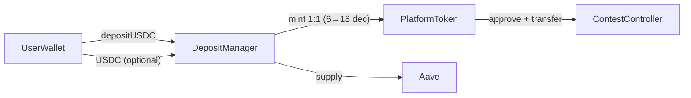

# Remove platformToken — Use USDC Directly

Remove the CUT/platformToken wrapper and DepositManager entirely. Contests, bets, and user balances would operate directly in USDC (6 decimals). ContestController already supports any ERC20 — the main work is eliminating the mint/burn layer and fixing decimal assumptions across ~30+ files.

## Current Architecture



Today the app uses a **two-token model**:

- **USDC** (`paymentTokenAddress`, 6 decimals) — external stablecoin, only used via `DepositManager` buy/sell
- **CUT** (`platformTokenAddress`, 18 decimals) — in-app currency; passed as `paymentToken` when creating contests

Key evidence: [`CreateContestForm.tsx`](client/src/components/contest/CreateContestForm.tsx) passes `platformTokenAddress` (not USDC) to `ContestFactory.createContest`, and deposit amounts use `1e18`.

## Target Architecture


- No `PlatformToken`, no `DepositManager`, no Aave integration
- Users fund wallet with USDC directly; contests hold and settle USDC
- All amounts in **6 decimals** (`$10` → `10_000_000` wei)

**Migration note:** Already-deployed contests have CUT baked into their constructor — they cannot be migrated on-chain. Only **new** contests would use USDC. Existing contests need to run to completion or be handled separately.

---

## Contract Changes

### Remove / stop deploying

| Component | Location | Action |
| --- | --- | --- |
| `PlatformToken.sol` | [`contracts/lib/yieldToken/src/PlatformToken.sol`](contracts/lib/yieldToken/src/PlatformToken.sol) | Remove from deploy; no longer needed |
| `DepositManager.sol` | [`contracts/lib/yieldToken/src/DepositManager.sol`](contracts/lib/yieldToken/src/DepositManager.sol) | Remove from deploy; handles USDC↔CUT mint/burn + Aave |
| `MockUSDC.sol` | [`contracts/src/mocks/MockUSDC.sol`](contracts/src/mocks/MockUSDC.sol) | Keep for Sepolia testnet only |

### No changes needed (already token-agnostic)

[`ContestController.sol`](contracts/lib/contestCatalyst/src/ContestController.sol) and [`ContestFactory.sol`](contracts/lib/contestCatalyst/src/ContestFactory.sol) accept any ERC20 as `paymentToken`. Pass the USDC address at creation time.

### Deploy script changes

- [`contracts/script/Deploy_sepolia.s.sol`](contracts/script/Deploy_sepolia.s.sol) — deploy `MockUSDC` + `ContestFactory` only; drop `PlatformToken`, `DepositManager`, `setDepositManager`
- [`contracts/script/Deploy_base.s.sol`](contracts/script/Deploy_base.s.sol) — use canonical Base USDC (`0x833589fCD6eDb6E08f4c7C32D4f71b54bdA02913`); deploy `ContestFactory` only
- Remove `aavePoolAddress` from config JSON if no longer referenced

### Config JSON updates (both chains)

Files: [`client/src/utils/contracts/base.json`](client/src/utils/contracts/base.json), [`server/src/contracts/base.json`](server/src/contracts/base.json), and sepolia equivalents.

- **Remove:** `platformTokenAddress`, `depositManagerAddress`, `aavePoolAddress`
- **Keep:** `paymentTokenAddress` (USDC / MockUSDC), `contestFactoryAddress`, referral contracts

### Ops scripts to remove/update

Under [`scripts/`](scripts/):

- Remove or archive: `depositUSDC.js`, `checkPlatformTokenBalance.js`, `emergencyWithdrawAll.js` (DepositManager-specific)
- Update [`scripts/deploy.js`](scripts/deploy.js) artifact copy list — drop `PlatformToken`, `DepositManager` ABIs
- Keep `mintPaymentToken.js` for Sepolia test funding

---

## Server Changes (small surface area)

Server contest/oracle flows **already read `paymentToken()` from each contest contract** — they never mint or route through CUT. Changes are mostly config cleanup and decimal fixes.

### Config / helpers

- [`server/src/lib/contractAddresses.ts`](server/src/lib/contractAddresses.ts) — remove `getPlatformTokenAddress()`
- Contract JSON files — remove `platformTokenAddress`, `depositManagerAddress`

### Decimal conversion (critical)

[`server/src/routes/contest.ts`](server/src/routes/contest.ts) line 425 hard-codes 18-decimal scaling:

```typescript
const primaryDepositAmountWei = BigInt(
  Math.floor(settings.primaryDeposit * 1e18),
).toString();
```

Change to `1e6` (or use `parseUnits(settings.primaryDeposit, 6)`).

Also review:

- [`server/src/lib/secondarySharePrice.ts`](server/src/lib/secondarySharePrice.ts) — uses `parseUnits("10", 18)`
- [`packages/secondary-pricing/`](packages/secondary-pricing/) — share price math assumes 18-decimal token units

### Admin

- [`server/src/routes/admin.ts`](server/src/routes/admin.ts) — replace `platformTokenBalanceWei` multicall with USDC `balanceOf` (6 decimals); rename field to `paymentTokenBalanceWei` or `usdcBalanceWei`

### Testnet minting

- [`server/src/services/mintUserTokens.ts`](server/src/services/mintUserTokens.ts) — already mints MockUSDC; no change needed except confirming it remains the sole funding path on Sepolia

### Unchanged

- Contest settlement (`settleContest.ts`), payout push (`pushContestPayouts.ts`), lock/close/activate — all use on-chain `paymentToken()` dynamically
- `OnchainPayment` ledger — generic `tokenAddress` + `amountWei`; no schema change

---

## Client Changes (largest effort, ~30 files)

### Transaction hooks — remove swap layer

These hooks auto-swap USDC→CUT via DepositManager before contest actions. Simplify to approve + spend USDC directly:

| File | Change |
| --- | --- |
| [`useContestantOperations.ts`](client/src/hooks/useContestantOperations.ts) | Remove DepositManager swap; approve USDC to contest; call `addPrimaryPosition` |
| [`useSpectatorOperations.ts`](client/src/hooks/useSpectatorOperations.ts) | Same for `addSecondaryPosition` |
| [`useTokenOperations.ts`](client/src/hooks/useTokenOperations.ts) | Remove `useBuyTokens`, `useSellTokens`; simplify send to USDC-only ERC20 transfer |
| [`useContestFactory.ts`](client/src/hooks/useContestFactory.ts) / [`CreateContestForm.tsx`](client/src/components/contest/CreateContestForm.tsx) | Pass `paymentTokenAddress` (USDC); deposit amounts in `1e6` |

### Auth / balance layer

[`AuthContext.tsx`](client/src/contexts/AuthContext.tsx):

- Remove `platformTokenBalance`, `platformTokenAddress`, `platformTokenSymbol`, `platformTokenDecimals`
- Remove `convertPaymentToPlatformTokens()` and `combinedSpendableWei`
- Single USDC balance drives all spend checks

### Balance checks in UI

Replace dual-balance + conversion logic with USDC-only checks in:

- [`LineupManagement.tsx`](client/src/components/contest/LineupManagement.tsx)
- [`PredictionEntryForm.tsx`](client/src/components/contest/PredictionEntryForm.tsx)
- [`useSideBetPlaceFlow.ts`](client/src/components/lineup/sideBet/place/useSideBetPlaceFlow.ts)

### UI removal / simplification

| Remove or repurpose | Reason |
| --- | --- |
| [`Buy.tsx`](client/src/components/user/Buy.tsx), [`Sell.tsx`](client/src/components/user/Sell.tsx) | DepositManager buy/sell gone |
| [`AccountCUTInfoPage.tsx`](client/src/pages/AccountCUTInfoPage.tsx), `/cut` route | CUT product page |
| CUT references in [`FAQPage.tsx`](client/src/pages/FAQPage.tsx), [`OnboardingPage.tsx`](client/src/pages/OnboardingPage.tsx), [`ChainWarning.tsx`](client/src/components/common/ChainWarning.tsx) | Copy update |

| Simplify | Change |
| --- | --- |
| [`TokenBalances.tsx`](client/src/components/user/TokenBalances.tsx), [`Navigation.tsx`](client/src/components/common/Navigation.tsx) | Show USDC balance only |
| [`Send.tsx`](client/src/components/user/Send.tsx) | USDC transfer only; remove internal/external mode |
| [`Receive.tsx`](client/src/components/user/Receive.tsx) | USDC-only deposit instructions |

### Decimal formatting (18 → 6)

Hardcoded `18` or `1e18` appears in:

- `useContestSettlementClaims.ts` (`DEFAULT_TOKEN_DECIMALS = 18`)
- `useContestPredictionData.ts`
- `ContestPayoutsModal.tsx`, `Sell.tsx`, admin balance cards
- All should use `paymentTokenDecimals` (6) or fetch dynamically from contract

### Admin / debug

- [`WalletTokenBalancesCard.tsx`](client/src/components/admin/WalletTokenBalancesCard.tsx) — remove CUT column
- [`AdminUsersPage.tsx`](client/src/pages/admin/AdminUsersPage.tsx) — rename balance field
- [`ContractsPage.tsx`](client/src/pages/ContractsPage.tsx), [`DebugPage.tsx`](client/src/pages/DebugPage.tsx) — remove platform token entries

### ABIs / config

- Remove imports of `PlatformToken.json`, `DepositManager.json` from hooks
- Update [`blockchainUtils.tsx`](client/src/utils/blockchainUtils.tsx) `ContractConfig` type — drop `platformTokenAddress`, `depositManagerAddress`

### Existing contests (client-side)

[`ContestSettings.tsx`](client/src/components/contest/ContestSettings.tsx) already reads `paymentToken()` on-chain per contest. During transition, old CUT contests and new USDC contests can coexist — formatting must use the token's actual decimals per contest, not a global constant.

---

## Risk Summary

| Risk | Mitigation |
| --- | --- |
| Decimal mismatch (18 vs 6) | Audit every `1e18`, `formatUnits(x, 18)`, `parseUnits(x, 18)` across client, server, and `packages/secondary-pricing` |
| Existing CUT contests | Let them run to completion; new contests use USDC; per-contest decimal handling in UI |
| User CUT balances | Communicate migration; users must sell/withdraw CUT before decommissioning contracts |
| Aave yield loss | Acceptable per decision to remove DepositManager entirely |
| Secondary pricing math | `packages/secondary-pricing` may need re-basing if share prices were calibrated for 18-decimal units |

---

## Suggested Implementation Order

1. **Contracts** — new deploy scripts, redeploy ContestFactory (and MockUSDC on Sepolia), update config JSON
2. **Shared decimals** — fix `packages/secondary-pricing` and server `contest.ts` wei conversion
3. **Client hooks** — simplify transaction hooks (biggest code change)
4. **Client UI** — remove Buy/Sell/CUT pages, simplify balances
5. **Server admin** — USDC balance reads
6. **Migration comms** — wind down existing CUT contests and DepositManager

---

## Tasks

- [ ] Update deploy scripts: remove PlatformToken + DepositManager, redeploy ContestFactory with USDC-only config
- [ ] Update base.json / sepolia.json on client and server — remove platformTokenAddress, depositManagerAddress, aavePoolAddress
- [ ] Fix server decimal assumptions (contest.ts 1e18 → 1e6, secondarySharePrice, admin balance reads)
- [ ] Simplify useContestantOperations, useSpectatorOperations, useTokenOperations — USDC approve/transfer only
- [ ] Remove platform token from AuthContext; delete Buy/Sell/CUT pages; simplify TokenBalances, Send, Receive
- [ ] Audit and fix all 18-decimal hardcoding across client and packages/secondary-pricing
- [ ] Plan wind-down for existing CUT contests and user CUT balances before decommissioning old contracts
