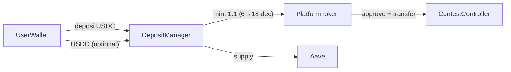
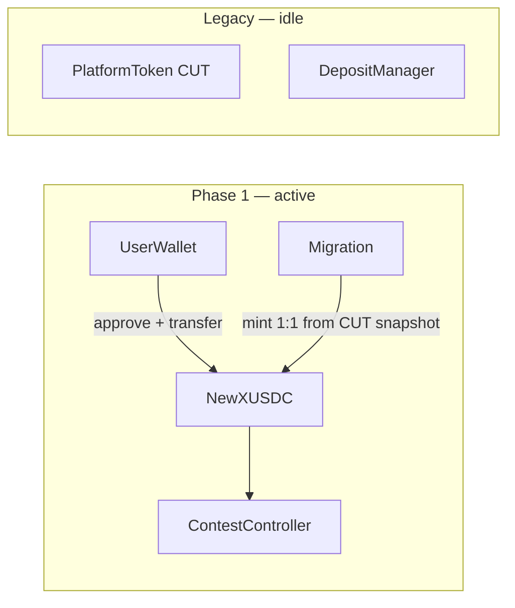

# Remove platformToken — Use xUSDC Directly (Base Sepolia)

Move the app to **xUSDC** ([`MockUSDC`](contracts/src/mocks/MockUSDC.sol), 6 decimals) on **Base Sepolia** in **two phases**: first redeploy xUSDC, mirror user CUT balances, and point the client at the new token; then delete the CUT/DepositManager conversion layer and related UI (cold paths after Phase 1).

ContestController already supports any ERC20 — Phase 1 is mostly a new token address + balance migration; Phase 2 is cleanup of ~30 files that assumed the two-token model.

## Scope

| In scope | Out of scope |
| --- | --- |
| **Base Sepolia** (chain id `84532`) — the only chain in use today | **Base mainnet** — not used; no live users or treasury |
| [`sepolia.json`](client/src/utils/contracts/sepolia.json) on client and server | [`base.json`](client/src/utils/contracts/base.json), [`Deploy_base.s.sol`](contracts/script/Deploy_base.s.sol), `scripts/base/` — repo/testing artifacts only; update only if keeping configs in sync |
| Phase 1: redeploy xUSDC + balance migration + client switch | Phase 2: CUT/DepositManager removal and conversion cleanup |
| xUSDC mint migration via token owner | Canonical mainnet USDC, treasury transfers, or non-mintable production stablecoins |
| Default env: `VITE_TARGET_CHAIN=testnet`, server Sepolia RPC | Mainnet RPC, canonical Base USDC (`0x8335…`) |

## Current Architecture



Today the app uses a **two-token model**:

- **xUSDC** (`paymentTokenAddress`, 6 decimals, `MockUSDC` on Sepolia) — test stablecoin, only used via `DepositManager` buy/sell
- **CUT** (`platformTokenAddress`, 18 decimals) — in-app currency; passed as `paymentToken` when creating contests

Key evidence: [`CreateContestForm.tsx`](client/src/components/contest/CreateContestForm.tsx) passes `platformTokenAddress` (not USDC) to `ContestFactory.createContest`, and deposit amounts use `1e18`.

## Target Architecture (end state — after Phase 2)


- No `PlatformToken`, no `DepositManager`, no Aave integration
- Users fund wallet with xUSDC directly (minted for test); contests hold and settle xUSDC
- All amounts in **6 decimals** (`$10` → `10_000_000` wei)

**Phase 1** reaches the same user-facing flow (approve + transfer new xUSDC) while legacy contracts and conversion code remain in the repo unused.

**Migration note:** Already-deployed Sepolia contests have CUT baked into their constructor — they cannot be migrated on-chain. Only **new** contests use xUSDC. Existing contests run to completion or are handled separately on testnet.

---

## Phased rollout

### Phase 1 — New xUSDC live (users keep balances)

**Goal:** Fresh `MockUSDC` deployment, 1:1 balance replication from CUT, client and server use the **new** `paymentTokenAddress` for all new activity. Old CUT / DepositManager contracts and conversion code can remain deployed and in the repo but are no longer on the hot path.



| Area | Phase 1 work |
| --- | --- |
| Contracts | Redeploy `MockUSDC` and `ContestFactory` on Base Sepolia; update `sepolia.json` `paymentTokenAddress` and `contestFactoryAddress`. New contests are created via the **new** factory with **new** xUSDC as `paymentToken`. Do **not** decommission old CUT/DepositManager or the old factory yet. |
| Balances | Snapshot every wallet’s CUT `balanceOf`; batch-mint equivalent xUSDC on the **new** contract ([`mintUserTokens.ts`](server/src/services/mintUserTokens.ts) / batch script, idempotent per user). |
| Client | Switch spend/create flows to new `paymentTokenAddress` and `contestFactoryAddress`: approve + transfer xUSDC, `1e6` deposits, new contests via **new** factory. Per-contest formatting still respects on-chain `paymentToken()` for old CUT contests. |
| Server | New contest creation uses `1e6` / `parseUnits(..., 6)` when payment token is xUSDC; oracle/settlement unchanged (reads `paymentToken()` per contest). |
| Intentionally deferred | Removing DepositManager swap hooks, dual-balance checks, Buy/Sell/CUT pages, `platformTokenAddress` in config, deploy-script cuts for PlatformToken/DepositManager. |

After Phase 1, users hold spendable xUSDC on the new contract; new entries and contests do not call DepositManager or mint CUT.

### Phase 2 — Remove conversion layer (dead code)

**Goal:** Delete CUT↔xUSDC conversion paths, platform-token config, and DepositManager/PlatformToken deploy artifacts. Nothing here should run in production once Phase 1 ships.

| Area | Phase 2 work |
| --- | --- |
| Contracts | Update `Deploy_sepolia.s.sol` to drop `PlatformToken`, `DepositManager`, `setDepositManager`; remove `platformTokenAddress`, `depositManagerAddress`, `aavePoolAddress` from `sepolia.json`. |
| Client | Remove swap layer in hooks, `convertPaymentToPlatformTokens` / `combinedSpendableWei`, Buy/Sell/CUT UI, PlatformToken/DepositManager ABIs, global 18-dec assumptions where only xUSDC remains. |
| Server | Remove `getPlatformTokenAddress()`, CUT admin multicalls, any remaining 18-dec defaults for platform-only paths. |
| Ops | Archive DepositManager scripts; trim deploy artifact copy list. |

Old CUT contests may still exist on-chain until they finish; UI keeps per-contest decimals from `paymentToken()` — no need to keep conversion helpers for that.

---

## Contract Changes

### Phase 1 — Redeploy xUSDC

| Component | Action |
| --- | --- |
| `MockUSDC.sol` (xUSDC) | Redeploy on Base Sepolia; set new address as `paymentTokenAddress` in `sepolia.json` (client + server). Update mint scripts / `mintUserTokens.ts` to the new owner + address. |
| `ContestFactory` | Redeploy alongside xUSDC; set new address as `contestFactoryAddress` in `sepolia.json`. All **new** contests go through this factory with new xUSDC as `paymentToken`. |
| `PlatformToken`, `DepositManager`, old factory | Leave old deployments on-chain; no new traffic after client/config switch |

### Phase 2 — Remove / stop deploying

| Component | Location | Action |
| --- | --- | --- |
| `PlatformToken.sol` | [`contracts/lib/yieldToken/src/PlatformToken.sol`](contracts/lib/yieldToken/src/PlatformToken.sol) | Remove from deploy |
| `DepositManager.sol` | [`contracts/lib/yieldToken/src/DepositManager.sol`](contracts/lib/yieldToken/src/DepositManager.sol) | Remove from deploy |
| `MockUSDC.sol` (xUSDC) | [`contracts/src/mocks/MockUSDC.sol`](contracts/src/mocks/MockUSDC.sol) | Keep — sole payment token on Base Sepolia |

### No changes needed (already token-agnostic)

[`ContestController.sol`](contracts/lib/contestCatalyst/src/ContestController.sol) and [`ContestFactory.sol`](contracts/lib/contestCatalyst/src/ContestFactory.sol) accept any ERC20 as `paymentToken`. Pass the xUSDC (`MockUSDC`) address at creation time.

### Deploy script changes

**Phase 1:** Deploy `MockUSDC` + `ContestFactory` (e.g. via [`Deploy_sepolia.s.sol`](contracts/script/Deploy_sepolia.s.sol) or a slim migration script); write new `paymentTokenAddress` and `contestFactoryAddress` to `sepolia.json`.

**Phase 2:** Update [`Deploy_sepolia.s.sol`](contracts/script/Deploy_sepolia.s.sol) for ongoing deploys — `MockUSDC` + `ContestFactory` only; drop `PlatformToken`, `DepositManager`, `setDepositManager`. [`Deploy_base.s.sol`](contracts/script/Deploy_base.s.sol) remains an optional artifact.

### Config JSON updates (Sepolia — active)

Files: [`client/src/utils/contracts/sepolia.json`](client/src/utils/contracts/sepolia.json), [`server/src/contracts/sepolia.json`](server/src/contracts/sepolia.json).

| Phase | `sepolia.json` |
| --- | --- |
| **1** | Update `paymentTokenAddress` and `contestFactoryAddress` to new deployments; keep `platformTokenAddress` / `depositManagerAddress` until Phase 2 if anything still references legacy contest tooling |
| **2** | Remove `platformTokenAddress`, `depositManagerAddress`, `aavePoolAddress` |

`base.json` (client + server) — optional artifact sync in Phase 2 only.

### Ops scripts

| Phase | Scripts |
| --- | --- |
| **1** | `mintPaymentToken.js`, balance-migration batch — target **new** xUSDC address |
| **2** | Archive `depositUSDC.js`, `checkPlatformTokenBalance.js`, `emergencyWithdrawAll.js`; update [`scripts/deploy.js`](scripts/deploy.js) ABI copy list |

---

## Server Changes (small surface area)

Server contest/oracle flows **already read `paymentToken()` from each contest contract** — they never mint or route through CUT.

### Phase 1

- Update `paymentTokenAddress` and `contestFactoryAddress` in `sepolia.json`; point [`mintUserTokens.ts`](server/src/services/mintUserTokens.ts) at new xUSDC
- [`server/src/routes/contest.ts`](server/src/routes/contest.ts) — use `1e6` / `parseUnits(..., 6)` for **new** contests using xUSDC (see decimal section)
- Balance migration batch (CUT snapshot → mint on new xUSDC)

### Phase 2

- [`server/src/lib/contractAddresses.ts`](server/src/lib/contractAddresses.ts) — remove `getPlatformTokenAddress()`
- Contract JSON — remove `platformTokenAddress`, `depositManagerAddress`
- Admin: xUSDC-only `balanceOf`; drop CUT multicall

### Decimal conversion

[`server/src/routes/contest.ts`](server/src/routes/contest.ts) line 425 hard-codes 18-decimal scaling:

```typescript
const primaryDepositAmountWei = BigInt(
  Math.floor(settings.primaryDeposit * 1e18),
).toString();
```

Change to `1e6` (or use `parseUnits(settings.primaryDeposit, 6)`).

| Phase | Files |
| --- | --- |
| **1** | [`contest.ts`](server/src/routes/contest.ts) `1e18` → `1e6` for new xUSDC contests |
| **2** | [`secondarySharePrice.ts`](server/src/lib/secondarySharePrice.ts), [`packages/secondary-pricing/`](packages/secondary-pricing/) — re-base 18-dec assumptions if still global |

### Unchanged

- Contest settlement (`settleContest.ts`), payout push (`pushContestPayouts.ts`), lock/close/activate — all use on-chain `paymentToken()` dynamically
- `OnchainPayment` ledger — generic `tokenAddress` + `amountWei`; no schema change

### User balance migration (CUT → new xUSDC) — Phase 1

Replicate each user’s CUT balance on the **new** xUSDC contract before the client switches `paymentTokenAddress`. No manual sell/withdraw.

| Step | Detail |
| --- | --- |
| Snapshot | For every user wallet, read on-chain CUT (`platformToken`) `balanceOf` at a fixed block or migration timestamp |
| Convert | Map 1:1 on dollar value: CUT uses 18 decimals, xUSDC (`MockUSDC`) uses 6 — e.g. `100 CUT` → `100_000_000` xUSDC wei (`parseUnits(balance, 6)` from the human-readable CUT amount) |
| Credit | Mint xUSDC to the user’s wallet via `MockUSDC` owner — extend [`mintUserTokens.ts`](server/src/services/mintUserTokens.ts) / [`mintPaymentToken.js`](scripts/sepolia/mintPaymentToken.js); batch script with idempotency keys per user |
| Verify | Reconcile: CUT balance (human) ≈ xUSDC balance (human); log mint tx hashes; skip or flag zero-balance users |
| Comms | Notify test users balances were mirrored to the new xUSDC contract |

All steps run on **Base Sepolia** only.

**Phase 2:** Decommission old CUT/DepositManager contracts and remove Buy/Sell once nothing references them.

---

## Client Changes

### Phase 1 — Use new xUSDC (conversion code can stay)

Point all **new** spend and contest creation at `paymentTokenAddress` (new xUSDC). Approve + transfer xUSDC; deposits in `1e6`. Existing CUT contests: keep per-contest `paymentToken()` decimals in UI.

| File | Phase 1 change |
| --- | --- |
| [`useContestFactory.ts`](client/src/hooks/useContestFactory.ts) / [`CreateContestForm.tsx`](client/src/components/contest/CreateContestForm.tsx) | New `contestFactoryAddress` + `paymentTokenAddress` (xUSDC); `1e6` deposits |
| [`useContestantOperations.ts`](client/src/hooks/useContestantOperations.ts) | Spend **new** xUSDC for new contests (direct approve + transfer; skip DepositManager when payment token is xUSDC) |
| [`useSpectatorOperations.ts`](client/src/hooks/useSpectatorOperations.ts) | Same |
| [`AuthContext.tsx`](client/src/contexts/AuthContext.tsx) | Read new xUSDC balance for spend checks; may still load CUT balance for legacy display until Phase 2 |
| [`LineupManagement.tsx`](client/src/components/contest/LineupManagement.tsx), [`PredictionEntryForm.tsx`](client/src/components/contest/PredictionEntryForm.tsx), side-bet flows | Prefer xUSDC balance when contest `paymentToken` is xUSDC |

DepositManager / `convertPaymentToPlatformTokens` paths remain in tree but should not execute for Phase 1 flows.

### Phase 2 — Remove swap layer and CUT UI (~30 files)

Delete code that Phase 1 bypassed:

| File | Change |
| --- | --- |
| [`useContestantOperations.ts`](client/src/hooks/useContestantOperations.ts) | Remove DepositManager swap entirely |
| [`useSpectatorOperations.ts`](client/src/hooks/useSpectatorOperations.ts) | Same |
| [`useTokenOperations.ts`](client/src/hooks/useTokenOperations.ts) | Remove `useBuyTokens`, `useSellTokens`; xUSDC-only send |

[`AuthContext.tsx`](client/src/contexts/AuthContext.tsx): remove `platformTokenBalance`, `convertPaymentToPlatformTokens()`, `combinedSpendableWei`; single xUSDC balance.

Replace dual-balance checks in lineup, prediction, side-bet flows with xUSDC-only.

### UI removal / simplification (Phase 2)

| Remove or repurpose | Reason |
| --- | --- |
| [`Buy.tsx`](client/src/components/user/Buy.tsx), [`Sell.tsx`](client/src/components/user/Sell.tsx) | DepositManager buy/sell gone |
| [`AccountCUTInfoPage.tsx`](client/src/pages/AccountCUTInfoPage.tsx), `/cut` route | CUT product page |
| CUT references in [`FAQPage.tsx`](client/src/pages/FAQPage.tsx), [`OnboardingPage.tsx`](client/src/pages/OnboardingPage.tsx), [`ChainWarning.tsx`](client/src/components/common/ChainWarning.tsx) | Copy update |

| Simplify | Change |
| --- | --- |
| [`TokenBalances.tsx`](client/src/components/user/TokenBalances.tsx), [`Navigation.tsx`](client/src/components/common/Navigation.tsx) | Show xUSDC balance only |
| [`Send.tsx`](client/src/components/user/Send.tsx) | xUSDC transfer only; remove internal/external mode |
| [`Receive.tsx`](client/src/components/user/Receive.tsx) | xUSDC-only deposit instructions (testnet mint / faucet copy) |

### Decimal formatting (18 → 6) — mostly Phase 2

Phase 1: new contests and new xUSDC amounts use 6 decimals. Phase 2: audit globals still assuming CUT:

- `useContestSettlementClaims.ts` (`DEFAULT_TOKEN_DECIMALS = 18`)
- `useContestPredictionData.ts`
- `ContestPayoutsModal.tsx`, `Sell.tsx`, admin balance cards
- All should use `paymentTokenDecimals` (6) or fetch dynamically from contract

### Admin / debug (Phase 2)

Remove CUT column and platform token entries from admin/debug pages.

### ABIs / config (Phase 2)

Drop `PlatformToken.json`, `DepositManager.json`; slim `ContractConfig` in [`blockchainUtils.tsx`](client/src/utils/blockchainUtils.tsx).

### Existing contests (client-side)

[`ContestSettings.tsx`](client/src/components/contest/ContestSettings.tsx) already reads `paymentToken()` on-chain per contest. During transition on Sepolia, old CUT contests and new xUSDC contests can coexist — formatting must use the token's actual decimals per contest, not a global constant.

---

## Risk Summary

| Risk | Mitigation |
| --- | --- |
| Decimal mismatch (18 vs 6) | Audit every `1e18`, `formatUnits(x, 18)`, `parseUnits(x, 18)` across client, server, and `packages/secondary-pricing` |
| Existing CUT contests (Sepolia) | Let them run to completion; new contests use xUSDC; per-contest decimal handling in UI |
| User CUT balances | Phase 1: snapshot CUT, mint on **new** xUSDC; Phase 2: decommission old CUT contracts |
| Stale conversion code after Phase 1 | DepositManager paths unused; Phase 2 deletes them to avoid confusion |
| Aave yield loss | N/A on testnet — acceptable to remove DepositManager entirely |
| Secondary pricing math | `packages/secondary-pricing` may need re-basing if share prices were calibrated for 18-decimal units |

---

## Suggested Implementation Order

### Phase 1

1. Redeploy xUSDC (`MockUSDC`) and `ContestFactory`; update `paymentTokenAddress` and `contestFactoryAddress` in `sepolia.json` (client + server) and mint scripts
2. Snapshot CUT balances; batch-mint equivalent amounts on **new** xUSDC (idempotent, audit log)
3. Server: `contest.ts` wei conversion `1e6` for new contests
4. Client: new contests + entries use new xUSDC (approve/transfer, skip DepositManager on hot path)
5. Smoke-test: create contest, join, side bet using new xUSDC only
6. Comms: balances mirrored; old CUT contract idle

### Phase 2

1. Remove DepositManager swap and dual-balance logic from hooks and UI
2. Delete Buy/Sell/CUT pages; simplify TokenBalances, Send, Receive
3. Update `Deploy_sepolia.s.sol`; strip legacy fields from `sepolia.json`
4. Server admin + `secondary-pricing` decimal cleanup
5. Archive DepositManager ops scripts; wind down old CUT contests as needed

---

## Tasks

### Phase 1

- [ ] Redeploy xUSDC and ContestFactory on Base Sepolia; update `paymentTokenAddress` and `contestFactoryAddress` in client/server `sepolia.json` and mint tooling
- [ ] Replicate user CUT balances on new xUSDC: snapshot `platformToken` `balanceOf`, mint 1:1 (6-dec), idempotent batch + audit log
- [ ] Server: `contest.ts` and related paths use `1e6` for new xUSDC contests
- [ ] Client: new contests and spend flows use new `paymentTokenAddress` (direct xUSDC approve/transfer)
- [ ] Smoke-test end-to-end on Sepolia with new xUSDC only

### Phase 2

- [ ] Update `Deploy_sepolia.s.sol`: stop deploying PlatformToken + DepositManager
- [ ] Update `sepolia.json` — remove `platformTokenAddress`, `depositManagerAddress`, `aavePoolAddress`
- [ ] Remove DepositManager/CUT conversion from useContestantOperations, useSpectatorOperations, useTokenOperations
- [ ] Remove platform token from AuthContext; delete Buy/Sell/CUT pages; simplify TokenBalances, Send, Receive
- [ ] Audit and fix remaining 18-decimal hardcoding (client, server, `packages/secondary-pricing`)
- [ ] Archive DepositManager scripts; plan wind-down for legacy CUT contests still on-chain
