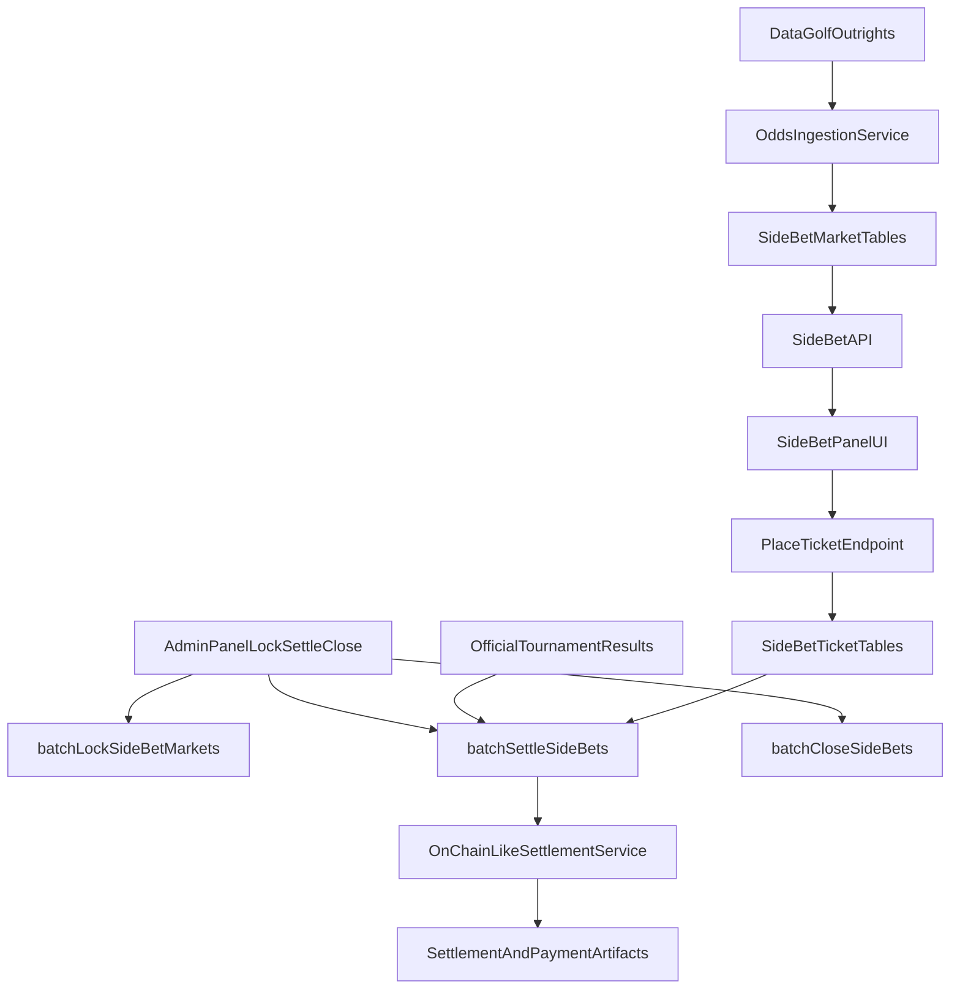

# Side Bet Production Plan

## Scope and Decisions

- **Live odds source:** DataGolf only — finish-position quotes come from the [`betting-tools/outrights`](https://datagolf.com/api-access) feed (Scratch Plus membership + API key; no alternate live odds provider for the grid).
- **Odds refresh cadence:** refresh ingested snapshots **every minute** for active tournament / lineup markets (scheduler + single-flight so concurrent refreshes do not stack).
- **Manual lifecycle (staff):** side-bet **state transitions are admin-driven only** — **Lock**, **Settle**, and **Close** each have a dedicated button on the admin panel and matching `POST` route under `/api/admin/bets/side/…` (same `requireAuth` + `requireAdmin` pattern as other batch tools). Staff run them in order when appropriate; no automatic promotion of markets/tickets between those stages without an explicit admin action (cron handles **odds refresh** only; see scheduler section).
- **Grading source:** Official tournament results persisted in the app (player finish position / cut / WD rules derived from data the product already trusts for contests), not the DataGolf odds feed or a sportsbook settlement API.
- **Conservative product rule (non-negotiable):** **Never** match players or events on names for any path that shows odds, accepts bets, or settles. Use **ID-backed joins only** (`pga_pgaTourId` ↔ DataGolf `player_num` from `field-updates`, then `dg_id` ↔ `outrights.odds`). If **anything** required for a safe quote is missing, mismatched, stale, or ambiguous — **do not** show a bettable grid, **do not** accept tickets, **do not** infer or fill gaps. Prefer a **graceful “unavailable / not open”** experience over partial grids, best-effort odds, or stale markets. Silent degradation is worse than a hard failure.
- Settlement rail: on-chain-like flow (persist transaction/payment artifacts similarly to contests).
- Frontend target: replace mock `SideBetPanel` grid with live market + placement + open/settled state.

## DataGolf live odds (API reference and integration plan)

Canonical documentation: [DataGolf API Access](https://datagolf.com/api-access).

**Endpoint (outrights / finish markets)**

- Base URL: `https://feeds.datagolf.com/betting-tools/outrights`
- Authentication: append `key=<DATAGOLF_API_KEY>` as a query parameter on every request.

**Query parameters (grid-relevant)**

| Parameter | Notes |
|-----------|--------|
| `market` | **Required.** For this feature use `top_5`, `top_10`, `top_20` (one request per market, or cache aggressively). Other values exist on the API (`win`, `make_cut`, `mc`, `frl`) but are out of scope for the Top 5/10/20 grid. |
| `tour` | Optional; default PGA-oriented usage: `tour=pga`. |
| `odds_format` | Use `decimal` for direct input into `calculateRoundRobinOdds` (american supported if we normalize first). |
| `file_format` | `json` |

**Example request**

`https://feeds.datagolf.com/betting-tools/outrights?tour=pga&market=top_10&odds_format=decimal&file_format=json&key=YOUR_API_KEY`

**Operational constraints**

- Global rate limit **45 requests per minute** per API key (documented on the access page); exceeding it triggers a short suspension. A **once-per-minute** refresh that performs **three requests** per cycle (one per market: `top_5`, `top_10`, `top_20`) for a given active context stays well under the cap; if multiple tournaments are refreshed in parallel, stagger or batch so aggregate DataGolf calls remain under 45/min. Use cache snapshots, single-flight refresh, and backoff on 429 if exposed.

**Player and event mapping**

- **No name matching:** `player_name` strings from DataGolf are for display or debugging only. They must **not** be used to join lineup players to odds rows.
- **ID path only:** `betting-tools/outrights` rows carry **`dg_id`** (no PGA id on the row). Build a bridge from **[`field-updates`](https://datagolf.com/api-access)** for the correct `tour` (`pga` vs `opp`, aligned with the tournament week): each field row has **`player_num`** (verified equivalent to **`Player.pga_pgaTourId`**) and **`dg_id`**. Map `pga_pgaTourId` → `dg_id` via that feed only.
- **Event alignment:** Before treating quotes as valid for a `Tournament`, confirm DataGolf’s field context matches the app’s week (e.g. compare `event_id` / `event_name` / schedule linkage to the row the user is in). If alignment cannot be verified, **fail closed** (no bettable market).
- **All four or nothing for the grid:** All lineup golfers must have a `pga_pgaTourId`, appear in `field-updates` for that event context, and have a matching `outrights.odds` row with **`dg_id`** for **each** of the three markets fetched in the same ingest pass (or same versioned snapshot). If any player fails any step, **do not** build or expose a partial round-robin grid for that lineup; market is unavailable until the next successful full ingest.
- Optional **`datagolf_dg_id`** (or similar) on `Player` is a **cache** populated from the same ID path — never a substitute for a fresh `field-updates` join when taking bets.

**Integration plan**

1. Add `DATAGOLF_API_KEY` to server env; implement `server/src/services/odds/dataGolfOutrightsClient.ts` (or a thin `providerClient.ts` that only calls DataGolf) to fetch and validate the three markets for the active tournament week, together with **`field-updates`** for the same tour/event context in one pipeline so mapping and odds are **consistent**.
2. Only if every lineup player resolves through **`pga_pgaTourId` → `player_num` → `dg_id` → outrights row** for all three markets: extract decimals, pass into `buildSideBetMarket` → `calculateRoundRobinOdds`. Otherwise persist **no** bettable snapshot (or explicit `UNAVAILABLE` / closed state with reason codes for support).
3. Persist snapshots on `SideBetMarket` / selections only for **fully valid** ingests; on any failure or partial mapping, **do not** offer odds — mark market closed/unavailable, log for ops, surface a clear UI state (no mixed real + placeholder cells).
4. Settlement jobs read **official** finishes from existing tournament/player state (same source as fantasy grading), not DataGolf odds.

## Data Model (Server + Prisma)

- Add side-bet domain models in [server/prisma/schema.prisma](server/prisma/schema.prisma):
  - `SideBetMarket` (tournament/lineup scoped market metadata, provider event IDs, status).
  - `SideBetSelection` (normalized selectable outcomes: `hitsRequired` x `finishThreshold` + provider odds).
  - `SideBetTicket` (user/wallet stake, selected cells, derived aggregate odds, status lifecycle).
  - `SideBetTicketLeg` (optional normalized per-leg storage for auditability and grading).
  - `SideBetSettlement` (snapshot of official grading inputs + settlement metadata + tx hash/reference).
- Keep lifecycle/status enums aligned with existing contest patterns (`OPEN`, `LOCKED`, `SETTLING`, `SETTLED`, `VOID`).
- Add migration and indices for common queries (`tournamentId`, `userId/wallet`, `status`, `createdAt`).

## Odds Ingestion + Round-Robin Pricing

- Implement **DataGolf outrights client** (`server/src/services/odds/dataGolfOutrightsClient.ts`, or `providerClient.ts` as a thin adapter that only calls DataGolf) with:
  - tournament/week context and **strict ID-only player mapping** via `field-updates` + `outrights` (see DataGolf section above),
  - three fetches per refresh for `market=top_5`, `top_10`, `top_20` (or equivalent single pipeline with caching), **plus** the matching `field-updates` fetch,
  - normalized decimal/american conversion helpers as needed.
- Ingest **per-player decimal (or american) odds per market** from DataGolf JSON only after the full four-player `dg_id` join succeeds; otherwise skip math and mark market unavailable (no alternate live odds source for the grid).
- Implement market builder (`server/src/services/odds/buildSideBetMarket.ts`) to map lineup's 4 golfers into selectable cells (`2/3/4 of 4` x `Top10/20/30`) **only** when all inputs are present and version-consistent.
- Implement round-robin aggregator (`server/src/services/odds/calculateRoundRobinOdds.ts`):
  - derive combo set for each row (C(4,2), C(4,3), C(4,4)),
  - compute combined odds per combo,
  - average combo implied return (or equivalent decimal averaging rule),
  - convert to final display odds string + stored decimal for settlement math.
- Persist fresh market snapshots **only** when ingest + mapping + event checks pass; otherwise persist **unavailable** state (not a stale partial quote users could confuse for live).
- Drive refreshes from a **1-minute** cron (or equivalent scheduler tick) in addition to any on-demand refresh after tournament data updates.

## API Surface

- Add route module [server/src/routes/bets.ts](server/src/routes/bets.ts), mounted in [server/src/routes/api.ts](server/src/routes/api.ts).
- Endpoints:
  - `GET /api/bets/side/lineup/:lineupId/market` - latest grid + status + user open tickets; when integrity checks fail, response indicates **unavailable** (no odds payload suitable for betting).
  - `POST /api/bets/side/tickets` - place ticket (selected cells, stake, wallet/user context).
  - `GET /api/bets/side/tickets` - list user tickets (open/settled).
- **Admin (manual lifecycle):** on [server/src/routes/admin.ts](server/src/routes/admin.ts), add three routes with `requireAuth` + `requireAdmin`, each delegating to the corresponding batch service and returning structured per-tournament / counts / failure rows for the UI:
  - `POST /api/admin/bets/side/lock` → `batchLockSideBetMarkets` (optional body e.g. `{ "tournamentId": "<id>" }` or product-defined scope).
  - `POST /api/admin/bets/side/settle` → `batchSettleSideBets` (same body conventions).
  - `POST /api/admin/bets/side/close` → `batchCloseSideBets` (same body conventions).
- All three must be **idempotent** and safe under retry (no double-settle, no illegal transitions); reject with clear errors when prerequisites are not met (e.g. settle requires locked markets and sufficient official results per conservative rules).
- Validation:
  - ensure lineup ownership/eligibility,
  - **reject** unless market status is **fully open** with a **current** market version and **all** selections backed by the latest successful ingest (no stale or partial snapshots),
  - reject locked, unavailable, or any market that failed ID mapping or event alignment checks,
  - validate selected cells against current market version and exact selection ids,
  - persist quote version/odds at placement for deterministic settlement,
  - **Placement is fail-closed:** if server cannot re-validate the same constraints atomically (race with refresh), return error and do not place.

## On-Chain-Like Settlement Flow

- Add batch services mirroring contest phases:
  - `server/src/services/batch/batchLockSideBetMarkets.ts`
  - `server/src/services/batch/batchSettleSideBets.ts`
  - `server/src/services/batch/batchCloseSideBets.ts`
- Add per-ticket settlement service (`server/src/services/betting/settleSideBetTicket.ts`) to:
  - resolve outcomes from **official tournament results** in the database (finish thresholds vs persisted positions / cut / WD rules),
  - resolve ticket win/loss/void,
  - compute payout from locked-in odds/stake,
  - execute settlement transaction via existing payment abstraction pattern,
  - persist payment artifacts (`txHash`, amount, metadata) in side-bet settlement records (and/or `OnchainPayment` with a new payment type).
- Trigger in scheduler [server/src/cron/scheduler.ts](server/src/cron/scheduler.ts):
  - run **DataGolf odds refresh every minute** for active side-bet contexts (in addition to any refresh tied to tournament pipeline updates),
  - **do not** auto-run lock, settle, or close from cron for side bets — those stages run only when staff invoke the **admin** routes (keeps lifecycle explicit and auditable). Admin actions must still tolerate concurrent odds refresh (idempotent transitions, no double-lock / double-settle).

## Frontend Integration

- **Admin:** extend [client/src/pages/AdminPage.tsx](client/src/pages/AdminPage.tsx) with a **Side bets** card containing **three** primary actions, each mirroring **Lock Winner Pool** (loading state, error alert, structured result summary):
  - **Lock side bets** → `POST` `/admin/bets/side/lock`
  - **Settle side bets** → `POST` `/admin/bets/side/settle`
  - **Close side bets** → `POST` `/admin/bets/side/close`  
  Use `apiClient` + `requiresAuth: true`. Optional shared `tournamentId` (or scope) field if all three routes use the same targeting. Order in UI should match intended ops flow (lock → settle → close); consider short inline copy per button so staff know prerequisites.
- Update [client/src/components/lineup/SideBetPanel.tsx](client/src/components/lineup/SideBetPanel.tsx):
  - convert from internal mock data to props/API-backed state,
  - when the API reports unavailable / incomplete mapping / stale: show a **clear non-bettable** state (copy + disabled actions), **not** a partial grid or last-known odds,
  - when fully valid: render provider-backed odds and market lock state,
  - wire CTA to place tickets only when the server marks the market open and bettable.
- Pass real data through [client/src/components/lineup/LineupContestCard.tsx](client/src/components/lineup/LineupContestCard.tsx) and lineup page fetch path ([client/src/pages/LineupListPage.tsx](client/src/pages/LineupListPage.tsx), [client/src/hooks/useLineupQueries.ts](client/src/hooks/useLineupQueries.ts)).
- Add typed contracts in [client/src/types/lineup.ts](client/src/types/lineup.ts) (or dedicated bet types file) for market, quote, ticket, and settlement statuses.
- Add React Query hooks for market fetch + ticket placement; **avoid** optimistic UI that implies a successful bet before server confirmation — refetch market after successful place only.

## Reliability and Operations

- Add DataGolf failure handling: retry/backoff on fetch, respect 45 req/min while honoring **1-minute** refresh targets. After retries, **fail closed** for that cycle (market unavailable), not degraded quotes.
- **No partial offering:** never return or cache a “best effort” subset of players or markets for user-facing odds or placement; either the full integrity checks pass or users see unavailable.
- Stale detection: if `last_updated` / snapshot age / version drifts beyond policy, treat as **not bettable** until refreshed successfully end-to-end.
- Add idempotency keys for placement and settlement jobs.
- Add audit logs around quote generation, placement, and **each admin lifecycle action** (lock / settle / close).
- Add feature flag to enable side bets per tournament/contest while rolling out.

## Testing and Verification

- Unit tests:
  - odds conversion + round-robin averaging math,
  - selection validation and payout calculations,
  - status transition guards.
- Integration tests:
  - market fetch/placement endpoints,
  - **fail-closed** cases: missing `pga_pgaTourId`, player absent from `field-updates`, `dg_id` missing from one of three outrights responses, event mismatch — assert **no** bettable grid and **409/503** (or product-chosen) on placement,
  - assert **no code path** uses `player_name` for joins (grep / contract tests as guardrail),
  - admin lifecycle: `POST /api/admin/bets/side/lock`, `…/settle`, `…/close` (authz, prerequisites, idempotency, illegal transition rejects),
  - mocked **DataGolf outrights JSON** for `top_5`, `top_10`, and `top_20` asserting grid output matches `calculateRoundRobinOdds` expectations,
  - **admin-triggered** settle (and close) against seeded tournament + **official results** in DB (no odds-feed settlement),
  - duplicate-settlement and idempotency cases.
- UI tests:
  - admin **Side bets** card: three actions each show loading / error / success summary,
  - panel renders live grid **only** when market is fully valid,
  - unavailable / error states (no phantom odds),
  - placement success/failure states,
  - open vs settled ticket display.

## Architecture Flow

## Implementation Order

1. Prisma models + migration + enums.
2. DataGolf outrights client + player/event mapping + market builder + round-robin math service.
3. Side-bet API endpoints + validation + ticket placement persistence.
4. Cron: **minute-level** DataGolf odds refresh **only** (no automatic lock/settle/close for side bets).
5. Admin routes `POST /api/admin/bets/side/lock`, `…/settle`, `…/close` + matching **Lock / Settle / Close** buttons on `AdminPage`.
6. Frontend wiring in lineup flow and `SideBetPanel`.
7. Tests + staged rollout flag.

## Worked Example: Side Bet Parlay Odds (Top 5/10/20)

**Production:** Per-player odds for the grid come from DataGolf `betting-tools/outrights` with `market=top_5`, `top_10`, and `top_20` (see [DataGolf live odds](#datagolf-live-odds-api-reference-and-integration-plan)). The Oddschecker links below are **illustrative only** of market shape for readers; they are not the live quote source.

Use these source markets for the event (illustrative):

- [Top 5 Finish](https://www.oddschecker.com/us/golf/truist-championship/top-5-finish)
- [Top 10 Finish](https://www.oddschecker.com/us/golf/truist-championship/top-10-finish)
- [Top 20 Finish](https://www.oddschecker.com/us/golf/truist-championship/top-20-finish)

Note: odds pages are dynamic; values below are an example snapshot to document the math pipeline.

### Example lineup (4 golfers)

- Scottie Scheffler
- Rory McIlroy
- Xander Schauffele
- Collin Morikawa

### Example market odds (American -> Decimal)

Top 5:
- Scheffler `+120` -> `2.20`
- McIlroy `+140` -> `2.40`
- Schauffele `+180` -> `2.80`
- Morikawa `+220` -> `3.20`

Top 10:
- Scheffler `-110` -> `1.9091`
- McIlroy `+100` -> `2.00`
- Schauffele `+125` -> `2.25`
- Morikawa `+150` -> `2.50`

Top 20:
- Scheffler `-275` -> `1.3636`
- McIlroy `-240` -> `1.4167`
- Schauffele `-210` -> `1.4762`
- Morikawa `-175` -> `1.5714`

Conversion formulas:

- If American > 0: `decimal = 1 + (american / 100)`
- If American < 0: `decimal = 1 + (100 / abs(american))`
- Combined parlay decimal for a combo: `D_combo = product(D_leg_i)`
- Unified row decimal: arithmetic mean of combo decimals in that row
- Decimal to American:
  - `D >= 2`: `american = +(D - 1) * 100`
  - `D < 2`: `american = -100 / (D - 1)`

### Top 5 row math

2 of 4 (6 combos):
- S+R: `2.20 * 2.40 = 5.2800` (`+428`)
- S+X: `2.20 * 2.80 = 6.1600` (`+516`)
- S+C: `2.20 * 3.20 = 7.0400` (`+604`)
- R+X: `2.40 * 2.80 = 6.7200` (`+572`)
- R+C: `2.40 * 3.20 = 7.6800` (`+668`)
- X+C: `2.80 * 3.20 = 8.9600` (`+796`)
- Unified 2 of 4: mean decimal `6.9733` -> `+597`

3 of 4 (4 combos):
- S+R+X: `14.7840` (`+1378`)
- S+R+C: `16.8960` (`+1590`)
- S+X+C: `19.7120` (`+1871`)
- R+X+C: `21.5040` (`+2050`)
- Unified 3 of 4: mean decimal `18.2240` -> `+1722`

4 of 4 (1 combo):
- S+R+X+C: `47.3088` -> `+4631`

### Top 10 row math

2 of 4:
- combo decimals: `3.8182, 4.2955, 4.7727, 4.5000, 5.0000, 5.6250`
- Unified 2 of 4: mean decimal `4.6686` -> `+367`

3 of 4:
- combo decimals: `8.5909, 9.5455, 10.7386, 11.2500`
- Unified 3 of 4: mean decimal `10.0312` -> `+903`

4 of 4:
- combo decimal: `21.4773`
- Unified 4 of 4: `+2048`

### Top 20 row math

2 of 4:
- combo decimals: `1.9318, 2.0130, 2.1429, 2.0913, 2.2262, 2.3197`
- Unified 2 of 4: mean decimal `2.1208` -> `+112`

3 of 4:
- combo decimals: `2.8517, 3.0357, 3.1633, 3.2863`
- Unified 3 of 4: mean decimal `3.0842` -> `+208`

4 of 4:
- combo decimal: `4.4813`
- Unified 4 of 4: `+348`

### Example UI grid output (unified odds)

- 4 of 4: `Top 5 +4631` | `Top 10 +2048` | `Top 20 +348`
- 3 of 4: `Top 5 +1722` | `Top 10 +903` | `Top 20 +208`
- 2 of 4: `Top 5 +597` | `Top 10 +367` | `Top 20 +112`

This is the exact output shape the `calculateRoundRobinOdds` service should produce for one lineup snapshot.
