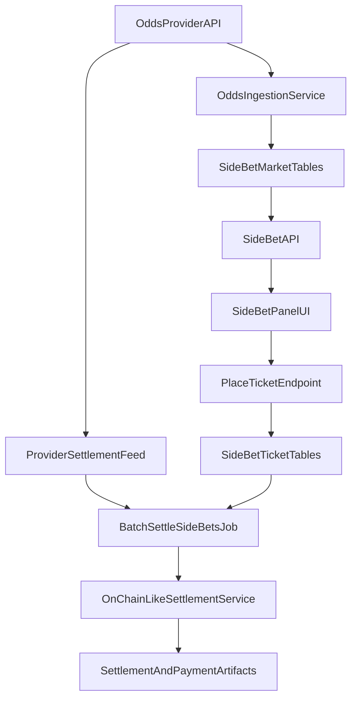

# Side Bet Production Plan

## Scope and Decisions

- Odds source: third-party sportsbook-style API.
- Grading source: same odds provider result/settlement feed.
- Settlement rail: on-chain-like flow (persist transaction/payment artifacts similarly to contests).
- Frontend target: replace mock `SideBetPanel` grid with live market + placement + open/settled state.

## Data Model (Server + Prisma)

- Add side-bet domain models in [server/prisma/schema.prisma](server/prisma/schema.prisma):
  - `SideBetMarket` (tournament/lineup scoped market metadata, provider event IDs, status).
  - `SideBetSelection` (normalized selectable outcomes: `hitsRequired` x `finishThreshold` + provider odds).
  - `SideBetTicket` (user/wallet stake, selected cells, derived aggregate odds, status lifecycle).
  - `SideBetTicketLeg` (optional normalized per-leg storage for auditability and grading).
  - `SideBetSettlement` (provider result payload + settlement metadata + tx hash/reference).
- Keep lifecycle/status enums aligned with existing contest patterns (`OPEN`, `LOCKED`, `SETTLING`, `SETTLED`, `VOID`).
- Add migration and indices for common queries (`tournamentId`, `userId/wallet`, `status`, `createdAt`).

## Odds Ingestion + Round-Robin Pricing

- Implement odds provider client (`server/src/services/odds/providerClient.ts`) with:
  - event lookup by tournament/player mapping,
  - per-player finish markets fetch,
  - normalized decimal/american conversion helpers.
- Implement market builder (`server/src/services/odds/buildSideBetMarket.ts`) to map lineup's 4 golfers into selectable cells (`2/3/4 of 4` x `Top10/20/30`).
- Implement round-robin aggregator (`server/src/services/odds/calculateRoundRobinOdds.ts`):
  - derive combo set for each row (C(4,2), C(4,3), C(4,4)),
  - compute combined odds per combo,
  - average combo implied return (or equivalent decimal averaging rule),
  - convert to final display odds string + stored decimal for settlement math.
- Persist fresh market snapshots and mark stale markets when provider data is unavailable.

## API Surface

- Add route module [server/src/routes/bets.ts](server/src/routes/bets.ts), mounted in [server/src/routes/api.ts](server/src/routes/api.ts).
- Endpoints:
  - `GET /api/bets/side/lineup/:lineupId/market` - latest grid + status + user open tickets.
  - `POST /api/bets/side/tickets` - place ticket (selected cells, stake, wallet/user context).
  - `GET /api/bets/side/tickets` - list user tickets (open/settled).
- Validation:
  - ensure lineup ownership/eligibility,
  - reject locked or stale markets,
  - validate selected cells against current market version,
  - persist quote version/odds at placement for deterministic settlement.

## On-Chain-Like Settlement Flow

- Add batch services mirroring contest phases:
  - `server/src/services/batch/batchLockSideBetMarkets.ts`
  - `server/src/services/batch/batchSettleSideBets.ts`
  - `server/src/services/batch/batchCloseSideBets.ts`
- Add per-ticket settlement service (`server/src/services/betting/settleSideBetTicket.ts`) to:
  - pull provider settlement/result feed,
  - resolve ticket win/loss/void,
  - compute payout from locked-in odds/stake,
  - execute settlement transaction via existing payment abstraction pattern,
  - persist payment artifacts (`txHash`, amount, metadata) in side-bet settlement records (and/or `OnchainPayment` with a new payment type).
- Trigger in scheduler [server/src/cron/scheduler.ts](server/src/cron/scheduler.ts):
  - run odds refresh after tournament update,
  - run lock/settle/close stages alongside existing contest lifecycle with non-overlap safeguards.

## Frontend Integration

- Update [client/src/components/lineup/SideBetPanel.tsx](client/src/components/lineup/SideBetPanel.tsx):
  - convert from internal mock data to props/API-backed state,
  - render provider-backed odds and market lock state,
  - wire CTA to place tickets.
- Pass real data through [client/src/components/lineup/LineupContestCard.tsx](client/src/components/lineup/LineupContestCard.tsx) and lineup page fetch path ([client/src/pages/LineupListPage.tsx](client/src/pages/LineupListPage.tsx), [client/src/hooks/useLineupQueries.ts](client/src/hooks/useLineupQueries.ts)).
- Add typed contracts in [client/src/types/lineup.ts](client/src/types/lineup.ts) (or dedicated bet types file) for market, quote, ticket, and settlement statuses.
- Add React Query hooks for market fetch + ticket placement + optimistic refresh.

## Reliability and Operations

- Add provider failure handling: retry/backoff, stale flags, partial-market suppression.
- Add idempotency keys for placement and settlement jobs.
- Add audit logs around quote generation, placement, and settlement transitions.
- Add feature flag to enable side bets per tournament/contest while rolling out.

## Testing and Verification

- Unit tests:
  - odds conversion + round-robin averaging math,
  - selection validation and payout calculations,
  - status transition guards.
- Integration tests:
  - market fetch/placement endpoints,
  - cron lock/settle jobs against seeded tournament + mocked provider feed,
  - duplicate-settlement and idempotency cases.
- UI tests:
  - panel renders live grid,
  - placement success/failure states,
  - open vs settled ticket display.

## Architecture Flow

## Implementation Order

1. Prisma models + migration + enums.
2. Odds provider client + market builder + round-robin math service.
3. Side-bet API endpoints + validation + ticket placement persistence.
4. Cron stages for lock/settle/close with provider result feed integration.
5. Frontend wiring in lineup flow and `SideBetPanel`.
6. Tests + staged rollout flag.

## Worked Example: Side Bet Parlay Odds (Top 5/10/20)

Use these source markets for the event:

- [Top 5 Finish](https://www.oddschecker.com/us/golf/truist-championship/top-5-finish)
- [Top 10 Finish](https://www.oddschecker.com/us/golf/truist-championship/top-10-finish)
- [Top 20 Finish](https://www.oddschecker.com/us/golf/truist-championship/top-20-finish)

Note: odds pages are dynamic; values below are an example snapshot to document the math pipeline.

### Example lineup (4 golfers)

- Scottie Scheffler
- Rory McIlroy
- Xander Schauffele
- Collin Morikawa

### Example market odds (American -> Decimal)

Top 5:
- Scheffler `+120` -> `2.20`
- McIlroy `+140` -> `2.40`
- Schauffele `+180` -> `2.80`
- Morikawa `+220` -> `3.20`

Top 10:
- Scheffler `-110` -> `1.9091`
- McIlroy `+100` -> `2.00`
- Schauffele `+125` -> `2.25`
- Morikawa `+150` -> `2.50`

Top 20:
- Scheffler `-275` -> `1.3636`
- McIlroy `-240` -> `1.4167`
- Schauffele `-210` -> `1.4762`
- Morikawa `-175` -> `1.5714`

Conversion formulas:

- If American > 0: `decimal = 1 + (american / 100)`
- If American < 0: `decimal = 1 + (100 / abs(american))`
- Combined parlay decimal for a combo: `D_combo = product(D_leg_i)`
- Unified row decimal: arithmetic mean of combo decimals in that row
- Decimal to American:
  - `D >= 2`: `american = +(D - 1) * 100`
  - `D < 2`: `american = -100 / (D - 1)`

### Top 5 row math

2 of 4 (6 combos):
- S+R: `2.20 * 2.40 = 5.2800` (`+428`)
- S+X: `2.20 * 2.80 = 6.1600` (`+516`)
- S+C: `2.20 * 3.20 = 7.0400` (`+604`)
- R+X: `2.40 * 2.80 = 6.7200` (`+572`)
- R+C: `2.40 * 3.20 = 7.6800` (`+668`)
- X+C: `2.80 * 3.20 = 8.9600` (`+796`)
- Unified 2 of 4: mean decimal `6.9733` -> `+597`

3 of 4 (4 combos):
- S+R+X: `14.7840` (`+1378`)
- S+R+C: `16.8960` (`+1590`)
- S+X+C: `19.7120` (`+1871`)
- R+X+C: `21.5040` (`+2050`)
- Unified 3 of 4: mean decimal `18.2240` -> `+1722`

4 of 4 (1 combo):
- S+R+X+C: `47.3088` -> `+4631`

### Top 10 row math

2 of 4:
- combo decimals: `3.8182, 4.2955, 4.7727, 4.5000, 5.0000, 5.6250`
- Unified 2 of 4: mean decimal `4.6686` -> `+367`

3 of 4:
- combo decimals: `8.5909, 9.5455, 10.7386, 11.2500`
- Unified 3 of 4: mean decimal `10.0312` -> `+903`

4 of 4:
- combo decimal: `21.4773`
- Unified 4 of 4: `+2048`

### Top 20 row math

2 of 4:
- combo decimals: `1.9318, 2.0130, 2.1429, 2.0913, 2.2262, 2.3197`
- Unified 2 of 4: mean decimal `2.1208` -> `+112`

3 of 4:
- combo decimals: `2.8517, 3.0357, 3.1633, 3.2863`
- Unified 3 of 4: mean decimal `3.0842` -> `+208`

4 of 4:
- combo decimal: `4.4813`
- Unified 4 of 4: `+348`

### Example UI grid output (unified odds)

- 4 of 4: `Top 5 +4631` | `Top 10 +2048` | `Top 20 +348`
- 3 of 4: `Top 5 +1722` | `Top 10 +903` | `Top 20 +208`
- 2 of 4: `Top 5 +597` | `Top 10 +367` | `Top 20 +112`

This is the exact output shape the `calculateRoundRobinOdds` service should produce for one lineup snapshot.
