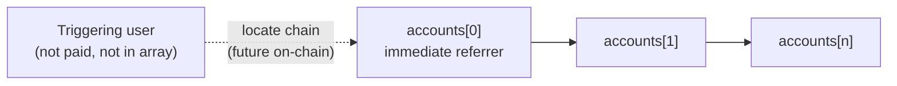
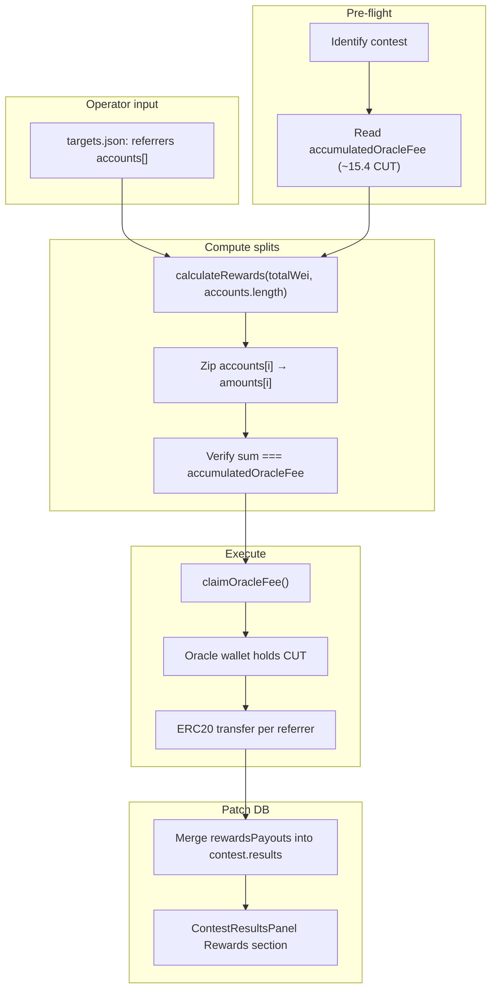

# Simulate Oracle Fee → Invite Network Payouts

Manual runbook for the current contest (~15.4 CUT in `accumulatedOracleFee`): claim oracle fees from the contest controller, split across operator-provided referrer wallets using `RewardCalculator` geometric decay, send ERC20 transfers from the oracle wallet, and patch `contest.results.rewardsPayouts` so the Results UI shows invite-network payouts.

The UI already labels oracle fees as **Invite Network** ([`client/src/components/contest/ContestPayoutsModal.tsx`](client/src/components/contest/ContestPayoutsModal.tsx)). Settlement does not distribute them yet. [`client/src/components/contest/ContestResultsPanel.tsx`](client/src/components/contest/ContestResultsPanel.tsx) renders `results.rewardsPayouts[]` when populated.

## What this run uses

| Component | Used? |
|-----------|-------|
| [`RewardCalculator.calculateRewards`](contracts/lib/referralTree/src/core/RewardCalculator.sol) | Yes — geometric split math |
| Manual ERC20 transfers from oracle wallet | Yes |
| DB patch of `contest.results.rewardsPayouts` | Yes |
| `ReferralGraph` | No |
| `RewardDistributor.distributeChainRewards` | No |

## Chain semantics

**Triggering user** — the wallet that caused the fee event (e.g. a contest depositor). Used only to locate the referrer chain in future on-chain integration (`ChainRewardData.user`). Not in the payout array; not paid.

**`accounts[]`** — ordered referrers only (max 10):

| Index | Meaning |
|-------|---------|
| 0 | Immediate referrer (largest geometric share) |
| 1 | Referrer's referrer |
| 2 | Next ancestor up |
| … | Up to 10 referrers |

The full oracle fee is split via `calculateRewards(totalWei, accounts.length)`. Index 0 gets weight 10000 (largest share); remainder wei goes to index 0.



### Referral submodule and Sepolia deploy

| Layer | Commit | Notes |
|-------|--------|-------|
| `contracts/lib/referralTree` | `ad112ac` | Matches `origin/main` |
| Sepolia `RewardDistributor` deploy | Submodule at `7886218` when parent was `d76cd2a` | One commit behind; uses old 80/20 split |

| Model | Triggering user paid? | Recipient list |
|-------|----------------------|----------------|
| Deployed Sepolia (`7886218`) | Yes — fixed 80% | On-chain graph |
| Checked-in `ad112ac` `RewardDistributor.sol` | Yes — largest geometric share at `chain[0]` | `[triggerUser, ref1, …]` — does not match intended referrers-only model |
| **This manual run** | **No** | **`[ref1, ref2, …]` referrers only** |

Checked-in [`RewardDistributor.sol`](contracts/lib/referralTree/src/core/RewardDistributor.sol) at `ad112ac` still pays `chain[0]` (the triggering user). This runbook follows referrers-only semantics. Updating the submodule (`_getReferralChain` / `_calculateChainRewards`) is a prerequisite before live `distributeChainRewards` integration.

## Split math

From [`RewardCalculator.sol`](contracts/lib/referralTree/src/core/RewardCalculator.sol):

```solidity
uint256[10] memory weights = [10000, 6000, 3600, 2160, 1296, 777, 466, 279, 167, 100];
uint256[11] memory cumSums = [0, 10000, 16000, 19600, 21760, 23056, 23833, 24299, 24578, 24745, 24845];
// amounts[i] = totalReward * weights[i] / cumSums[numRecipients]
// remainder → amounts[0]
```

Script logic:

1. `numRecipients = accounts.length` (referrers only, max 10)
2. `amounts = calculateRewards(totalWei, numRecipients)`
3. `recipients[i] = accounts[i]`

Example (3 referrers, 10,000 CUT): ≈ 5,102 / 3,061 / 1,837 to `accounts[0]` / `[1]` / `[2]`.

Implementation: TypeScript port of `calculateRewards` for `--dry-run`, or `eth_call` to Sepolia `RewardDistributor.rewardCalculator()` (`0x344C21c7DAffB5Fb9442b27e1E53051aE7faf926`).

## End-to-end flow



## Phase 1 — Pre-flight

- Identify contest (`contestId` or controller address); confirm **SETTLED** (oracle fee claim is independent of payout push).
- Read `accumulatedOracleFee()` — expect ~15.4 CUT (`15400000000000000000` wei for 18-decimal token).
- Read `paymentToken()` and `decimals()` from the contest contract.
- Record `chainId` for transfers and DB patch.

## Phase 2 — Operator config

File: e.g. [`scripts/invite-rewards-targets.json`](scripts/invite-rewards-targets.json) (create at run time; not committed with real addresses).

```json
{
  "triggeringUser": "0xDepositorWhoCausedFee…",
  "accounts": [
    "0xImmediateReferrer…",
    "0xReferrerLevel2…",
    "0xReferrerLevel3…"
  ]
}
```

- `accounts`: 1–10 referrer addresses, ordered from immediate referrer upward.
- Do not include the triggering user/depositor in `accounts[]`.
- `triggeringUser` is optional audit metadata only.
- Script computes amounts from `accumulatedOracleFee`; no amounts in config.

## Phase 3 — Compute splits (`--dry-run`)

1. `totalWei = accumulatedOracleFee`
2. `amounts = calculateRewards(totalWei, accounts.length)`
3. Print recipient table; assert `sum(amounts) === totalWei`
4. Resolve `username` / `userColor` from DB for patch preview

Operator reviews dry-run output before execute.

## Phase 4 — Claim oracle fees

```bash
pnpm run claim-oracle-fee -- <contestControllerAddress>
```

Or [`server/src/services/contest/claimOracleFee.ts`](server/src/services/contest/claimOracleFee.ts). Record tx hash as `claimOracleFeeTx` in results patch.

## Phase 5 — Manual ERC20 transfers

For each `(account, amountWei)` from Phase 3: `ERC20(paymentToken).transfer(account, amountWei)`. Save audit JSON with per-recipient tx hashes.

## Phase 6 — Patch contest results

Follow [`server/src/scripts/pushContestPayouts.ts`](server/src/scripts/pushContestPayouts.ts): read → merge → `prisma.contest.update`.

Add to [`server/src/services/shared/types.ts`](server/src/services/shared/types.ts):

```typescript
export interface RewardsPayoutResult {
  walletAddress: string;
  amountWei: string;
  username: string;
  userColor?: string;
}

// ContestResults additions:
rewardsPayouts?: RewardsPayoutResult[];
rewardsDistributionTxs?: { hash: string }[];
claimOracleFeeTx?: { hash: string };
```

No client changes required — [`ContestResultsPanel`](client/src/components/contest/ContestResultsPanel.tsx) already consumes `rewardsPayouts`.

## Recommended script

**[`server/src/scripts/distributeContestInviteRewards.ts`](server/src/scripts/distributeContestInviteRewards.ts)** (to implement):

| Flag | Behavior |
|------|----------|
| `--contest-id <id>` | Load contest from DB |
| `--targets <path>` | Operator JSON with ordered `accounts[]` |
| `--dry-run` | Print split table; no txs, no DB write |
| `--claim` | Call `claimOracleFee` only |
| `--distribute` | Send transfers from dry-run / audit file |
| `--patch` | Write `rewardsPayouts` + tx hashes to `contest.results` |

Shared helper: **`calculateGeometricRewards(totalWei, numRecipients)`** — TS port of [`RewardCalculator.calculateRewards`](contracts/lib/referralTree/src/core/RewardCalculator.sol).

## Verification checklist

| Check | How |
|-------|-----|
| Split math | TS output matches on-chain `calculateRewards` for same inputs |
| On-chain fee claimed | `accumulatedOracleFee() === 0` |
| Transfers | Sum of sent amounts = claimed amount |
| UI | Results → Rewards rows; payout modal Invite Network total ≈ 15.4 CUT |

## Risks

| Risk | Mitigation |
|------|------------|
| Wrong account order | Index 0 = immediate referrer; review dry-run |
| Wrong token decimals | Read `paymentToken.decimals()` per contest |
| Double send / double patch | Require `--dry-run` first; idempotency key = contestId + totalWei |
| Account count > 10 | Script rejects; calculator caps at 10 |

## Out of scope for this run

- ReferralGraph registration or deposit tx scanning
- On-chain `RewardDistributor` calls
- Submodule fix for referrers-only `_calculateChainRewards`
- Automatic wiring into [`settleContest.ts`](server/src/services/contest/settleContest.ts)

## Implementation tasks

- [ ] Identify contest; verify `accumulatedOracleFee` ≈ 15.4 CUT
- [ ] Prepare referrers-only `accounts[]` JSON
- [ ] Implement `distributeContestInviteRewards.ts` with `--dry-run`
- [ ] Claim oracle fees
- [ ] Execute ERC20 transfers; save audit JSON
- [ ] Add `RewardsPayoutResult` to server types; patch `contest.results`
- [ ] Verify Contest Results UI Rewards section

### Relevant files

- [`client/src/components/contest/ContestPayoutsModal.tsx`](client/src/components/contest/ContestPayoutsModal.tsx) — Invite Network display (oracle fee slice)
- [`client/src/components/contest/ContestResultsPanel.tsx`](client/src/components/contest/ContestResultsPanel.tsx) — `rewardsPayouts` display
- [`server/src/services/contest/claimOracleFee.ts`](server/src/services/contest/claimOracleFee.ts) — claim service
- [`scripts/sepolia/claimOracleFee.js`](scripts/sepolia/claimOracleFee.js) — claim CLI
- [`contracts/lib/referralTree/src/core/RewardCalculator.sol`](contracts/lib/referralTree/src/core/RewardCalculator.sol) — split math
