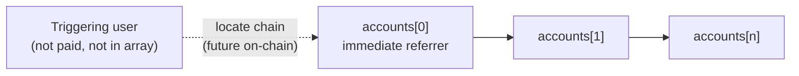
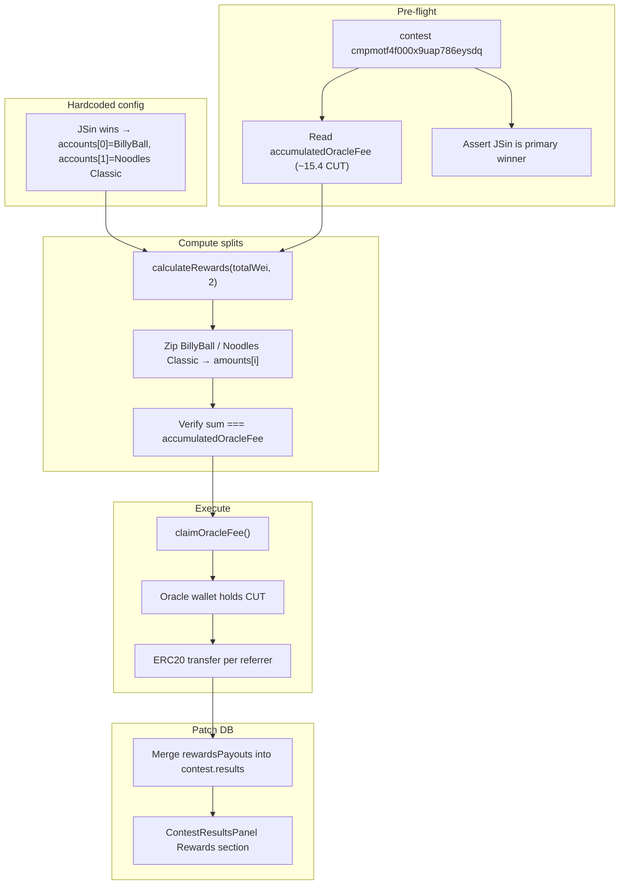

# Simulate Oracle Fee → Invite Network Payouts (legacy manual runbook)

**Superseded for new contests:** referral network fees are taken in `settleContest`, indexed into `OnchainPayment` (`REFERRAL`), and shown on the Results panel from `GET /contests/:id` → `onchainPayments`. Use this document only for the one-off Charles Schwab / pre–ContestCatalyst migration scenario below.

One-time manual runbook for the Charles Schwab contest (~15.4 CUT in `accumulatedOracleFee`). When **JSin** wins primary payout, claim oracle fees from the contest controller, split across two hardcoded referrer wallets (**BillyBall**, then **Noodles Classic**) using `RewardCalculator` geometric decay, send ERC20 transfers from the oracle wallet, and patch `contest.results.rewardsPayouts` so the Results UI shows invite-network payouts.

## Hardcoded run (Charles Schwab / JSin wins)

This scenario runs once. Contest, trigger user, and referrer order are fixed in the script — no operator JSON at run time.

| Field | Value |
|-------|-------|
| Contest | Charles Schwab (`cmpmotf4f000x9uap786eysdq`) |
| Controller | `0x2aa88f560f24F71eFEeBa0b2EebF27658fF5dF4b` |
| `chainId` | `84532` (Base Sepolia) |
| **When to run** | JSin is the primary payout winner (`results.winningEntries[0]` owner) |
| `triggeringUser` | **JSin** (`cmp60py770045zo0h4scx1949`) — audit only; not paid |
| JSin smart wallet | `0xc7389e4d457aca184942a494b2aebc01fa67824c` |
| `accounts[0]` | **BillyBall** — smart wallet `0x4a3b0878549a68b05d890a623b805d3be6f646f9` |
| `accounts[1]` | **Noodles Classic** — smart wallet `0x6569e9ba175fa46fff13bc649e0d92813e507a06` |
| `totalWei` | `15400000000000000000` (~15.4 CUT, 18 decimals) |

Payouts go to **Privy smart wallets** (same addresses the app uses for deposits and payouts via [`pickEvmWallet`](server/src/lib/privyUserProvisioning.ts) / [`useEffectiveWalletAddress`](client/src/hooks/useEffectiveWalletAddress.ts)). Do not send to EOAs (`0xbc4c…`, `0x9a83…`, `0xac52…`).

JSin’s stored `referrerAddress` is BillyBall’s smart wallet — confirms referrer order for this run.

### Expected split (2 referrers, 15.4 CUT)

| Index | Username | Smart wallet | Share | Amount (CUT) | `amountWei` |
|-------|----------|--------------|-------|--------------|-------------|
| 0 | BillyBall | `0x4a3b0878549a68b05d890a623b805d3be6f646f9` | 10000/16000 | 9.625 | `9625000000000000000` |
| 1 | Noodles Classic | `0x6569e9ba175fa46fff13bc649e0d92813e507a06` | 6000/16000 | 5.775 | `5775000000000000000` |

Remainder wei (if any) goes to `accounts[0]` (BillyBall).

### `rewardsPayouts` patch shape

Same order as on-chain transfers — BillyBall first, Noodles Classic second:

```json
[
  {
    "walletAddress": "0x4a3b0878549a68b05d890a623b805d3be6f646f9",
    "amountWei": "9625000000000000000",
    "username": "BillyBall",
    "userColor": "#0a73eb"
  },
  {
    "walletAddress": "0x6569e9ba175fa46fff13bc649e0d92813e507a06",
    "amountWei": "5775000000000000000",
    "username": "Noodles Classic",
    "userColor": "#A3A3A3"
  }
]
```

## What this run uses

| Component | Used? |
|-----------|-------|
| [`RewardCalculator.calculateRewards`](contracts/lib/referralTree/src/core/RewardCalculator.sol) | Yes — geometric split math |
| Manual ERC20 transfers from oracle wallet | Yes |
| DB patch of `contest.results.rewardsPayouts` | Yes |
| `ReferralGraph` | No |
| `RewardDistributor.distributeChainRewards` | No |

## Chain semantics

**Triggering user** — the wallet that caused the fee event (e.g. a contest depositor). Used only to locate the referrer chain in future on-chain integration (`ChainRewardData.user`). Not in the payout array; not paid.

**`accounts[]`** — ordered referrers only (max 10):

| Index | Meaning |
|-------|---------|
| 0 | Immediate referrer (largest geometric share) |
| 1 | Referrer's referrer |
| 2 | Next ancestor up |
| … | Up to 10 referrers |

The full oracle fee is split via `calculateRewards(totalWei, accounts.length)`. Index 0 gets weight 10000 (largest share); remainder wei goes to index 0.



### Referral submodule and Sepolia deploy

| Layer | Commit | Notes |
|-------|--------|-------|
| `contracts/lib/referralTree` | `ad112ac` | Matches `origin/main` |
| Sepolia `RewardDistributor` deploy | Submodule at `7886218` when parent was `d76cd2a` | One commit behind; uses old 80/20 split |

| Model | Triggering user paid? | Recipient list |
|-------|----------------------|----------------|
| Deployed Sepolia (`7886218`) | Yes — fixed 80% | On-chain graph |
| Checked-in `ad112ac` `RewardDistributor.sol` | Yes — largest geometric share at `chain[0]` | `[triggerUser, ref1, …]` — does not match intended referrers-only model |
| **This manual run** | **No** | **`[ref1, ref2, …]` referrers only** |

Checked-in [`RewardDistributor.sol`](contracts/lib/referralTree/src/core/RewardDistributor.sol) at `ad112ac` still pays `chain[0]` (the triggering user). This runbook follows referrers-only semantics. Updating the submodule (`_getReferralChain` / `_calculateChainRewards`) is a prerequisite before live `distributeChainRewards` integration.

## Split math

From [`RewardCalculator.sol`](contracts/lib/referralTree/src/core/RewardCalculator.sol):

```solidity
uint256[10] memory weights = [10000, 6000, 3600, 2160, 1296, 777, 466, 279, 167, 100];
uint256[11] memory cumSums = [0, 10000, 16000, 19600, 21760, 23056, 23833, 24299, 24578, 24745, 24845];
// amounts[i] = totalReward * weights[i] / cumSums[numRecipients]
// remainder → amounts[0]
```

Script logic:

1. `numRecipients = accounts.length` (referrers only, max 10)
2. `amounts = calculateRewards(totalWei, numRecipients)`
3. `recipients[i] = accounts[i]`

Example (2 referrers, 15.4 CUT — this run): ≈ 9.625 / 5.775 to BillyBall / Noodles Classic.

Example (3 referrers, 10,000 CUT): ≈ 5,102 / 3,061 / 1,837 to `accounts[0]` / `[1]` / `[2]`.

Implementation: TypeScript port of `calculateRewards` for `--dry-run`, or `eth_call` to Sepolia `RewardDistributor.rewardCalculator()` (`0x344C21c7DAffB5Fb9442b27e1E53051aE7faf926`).

## End-to-end flow



## Phase 1 — Pre-flight

- Load contest `cmpmotf4f000x9uap786eysdq` (Charles Schwab, controller `0x2aa88f560f24F71eFEeBa0b2EebF27658fF5dF4b`, `chainId` 84532); confirm **SETTLED** (oracle fee claim is independent of payout push).
- Confirm **JSin** is the primary payout winner in `contest.results.winningEntries`; abort if not.
- Read `accumulatedOracleFee()` — expect ~15.4 CUT (`15400000000000000000` wei for 18-decimal token).
- Read `paymentToken()` and `decimals()` from the contest contract.
- Optional sanity check: Privy `smart_wallet` for BillyBall / Noodles Classic still matches hardcoded addresses below.

## Phase 2 — Hardcoded referrer config

Constants at top of [`server/src/scripts/distributeContestInviteRewards.ts`](server/src/scripts/distributeContestInviteRewards.ts) (no external JSON):

```typescript
const CHARLES_SCHWAB_CONTEST_ID = "cmpmotf4f000x9uap786eysdq";
const CONTEST_CONTROLLER = "0x2aa88f560f24F71eFEeBa0b2EebF27658fF5dF4b" as const;
const CHAIN_ID = 84532;

const TRIGGER_USER_ID = "cmp60py770045zo0h4scx1949"; // JSin
const TRIGGER_SMART_WALLET = "0xc7389e4d457aca184942a494b2aebc01fa67824c" as const;

/** Referrers only — ordered for calculateRewards / ERC20 transfer / rewardsPayouts */
const REFERRER_ACCOUNTS = [
  {
    userId: "cmnovcrkn0012c0w25gq4ml06",
    username: "BillyBall",
    smartWallet: "0x4a3b0878549a68b05d890a623b805d3be6f646f9",
    userColor: "#0a73eb",
  },
  {
    userId: "cmnncvo990001b4vlvpbzsye3",
    username: "Noodles Classic",
    smartWallet: "0x6569e9ba175fa46fff13bc649e0d92813e507a06",
    userColor: "#A3A3A3",
  },
] as const;
```

- `accounts[]` for transfers: BillyBall smart wallet first, Noodles Classic smart wallet second.
- Do not include JSin in `accounts[]` (triggering user only).
- Script computes amounts from `accumulatedOracleFee`; expected ~9.625 / ~5.775 CUT for this fee total.

## Phase 3 — Compute splits (`--dry-run`)

1. `totalWei = accumulatedOracleFee` (expect `15400000000000000000`)
2. `amounts = calculateRewards(totalWei, 2)`
3. Print BillyBall / Noodles Classic table; assert `sum(amounts) === totalWei`
4. Assert primary winner userId === JSin
5. Print hardcoded smart-wallet recipients and `userColor` values for patch preview

Operator reviews dry-run output before execute.

## Phase 4 — Claim oracle fees

```bash
pnpm run claim-oracle-fee -- 0x2aa88f560f24F71eFEeBa0b2EebF27658fF5dF4b
```

Or [`server/src/services/contest/claimOracleFee.ts`](server/src/services/contest/claimOracleFee.ts). Record tx hash as `claimOracleFeeTx` in results patch.

## Phase 5 — Manual ERC20 transfers

For each `(smartWallet, amountWei)` from Phase 3: `ERC20(paymentToken).transfer(smartWallet, amountWei)` to BillyBall then Noodles Classic. Save audit JSON with per-recipient tx hashes.

## Phase 6 — Patch contest results

Follow [`server/src/scripts/pushContestPayouts.ts`](server/src/scripts/pushContestPayouts.ts): read → merge → `prisma.contest.update`.

Add to [`server/src/services/shared/types.ts`](server/src/services/shared/types.ts):

```typescript
export interface RewardsPayoutResult {
  walletAddress: string;
  amountWei: string;
  username: string;
  userColor?: string;
}

// ContestResults additions:
rewardsPayouts?: RewardsPayoutResult[];
rewardsDistributionTxs?: { hash: string }[];
claimOracleFeeTx?: { hash: string };
```

No client changes required — [`ContestResultsPanel`](client/src/components/contest/ContestResultsPanel.tsx) already consumes `rewardsPayouts`.

## Recommended script

**[`server/src/scripts/distributeContestInviteRewards.ts`](server/src/scripts/distributeContestInviteRewards.ts)** (to implement):

| Flag | Behavior |
|------|----------|
| `--dry-run` | Print BillyBall / Noodles Classic split; verify JSin won; no txs, no DB write |
| `--claim` | Call `claimOracleFee` on Charles Schwab contest only |
| `--distribute` | Send two ERC20 transfers (BillyBall, then Noodles Classic) |
| `--patch` | Write `rewardsPayouts` + tx hashes to `contest.results` |

Defaults: `contestId = cmpmotf4f000x9uap786eysdq`, referrers BillyBall → Noodles Classic. No `--targets` file.

Shared helper: **`calculateGeometricRewards(totalWei, numRecipients)`** — TS port of [`RewardCalculator.calculateRewards`](contracts/lib/referralTree/src/core/RewardCalculator.sol).

## Verification checklist

| Check | How |
|-------|-----|
| Split math | TS output matches on-chain `calculateRewards` for same inputs |
| On-chain fee claimed | `accumulatedOracleFee() === 0` |
| Transfers | Sum of sent amounts = claimed amount |
| UI | Results → Rewards: BillyBall (~9.625 CUT), Noodles Classic (~5.775 CUT); modal Invite Network total ≈ 15.4 CUT |

## Risks

| Risk | Mitigation |
|------|------------|
| Wrong recipient address | Transfers must hit smart wallets above, not EOAs |
| Wrong account order | Index 0 = BillyBall smart wallet, index 1 = Noodles Classic smart wallet; review dry-run |
| Run without JSin win | Script aborts unless primary winner is JSin |
| Wrong token decimals | Read `paymentToken.decimals()` per contest |
| Double send / double patch | Require `--dry-run` first; idempotency key = contestId + totalWei |
| Account count > 10 | Script rejects; calculator caps at 10 |

## Out of scope for this run

- ReferralGraph registration or deposit tx scanning
- On-chain `RewardDistributor` calls
- Submodule fix for referrers-only `_calculateChainRewards`
- Automatic wiring into [`settleContest.ts`](server/src/services/contest/settleContest.ts)

## Implementation tasks

- [ ] Implement `distributeContestInviteRewards.ts` with hardcoded Charles Schwab / JSin / BillyBall / Noodles Classic constants
- [ ] `--dry-run`: assert JSin is primary winner; verify split ≈ 9.625 / 5.775 CUT
- [ ] Claim oracle fees on `cmpmotf4f000x9uap786eysdq`
- [ ] Execute ERC20 transfers to BillyBall, then Noodles Classic; save audit JSON
- [ ] Add `RewardsPayoutResult` to server types; patch `contest.results.rewardsPayouts` in that order
- [ ] Verify Contest Results UI Rewards section (BillyBall first, Noodles Classic second)

### Relevant files

- [`client/src/components/contest/ContestPayoutsModal.tsx`](client/src/components/contest/ContestPayoutsModal.tsx) — Invite Network display (oracle fee slice)
- [`client/src/components/contest/ContestResultsPanel.tsx`](client/src/components/contest/ContestResultsPanel.tsx) — `rewardsPayouts` display
- [`server/src/services/contest/claimOracleFee.ts`](server/src/services/contest/claimOracleFee.ts) — claim service
- [`scripts/sepolia/claimOracleFee.js`](scripts/sepolia/claimOracleFee.js) — claim CLI
- [`contracts/lib/referralTree/src/core/RewardCalculator.sol`](contracts/lib/referralTree/src/core/RewardCalculator.sol) — split math
