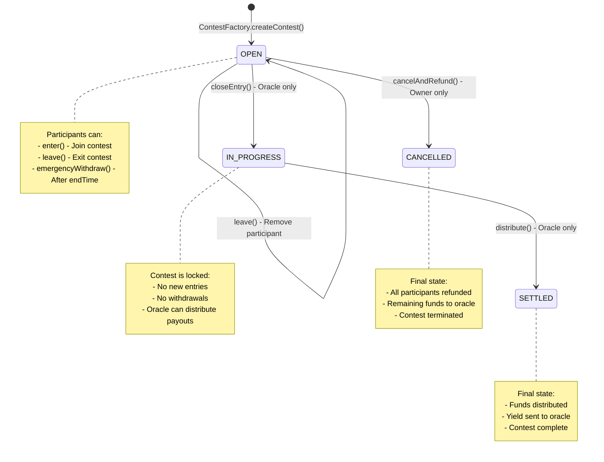

# Contest Contract State Change Diagram

## Overview

The Contest contract has four distinct states that represent the lifecycle of a fantasy sports contest. This diagram shows all possible state transitions, the functions that trigger them, and the conditions that must be met.

## States

- **OPEN**: Contest is accepting entries from participants
- **IN_PROGRESS**: Contest is no longer accepting entries, competition is active
- **SETTLED**: Contest has been settled and funds distributed to winners
- **CANCELLED**: Contest was cancelled and participants refunded

## State Transition Diagram

## Detailed State Transitions

### Initial State: OPEN

**Entry Point**: `ContestFactory.createContest()`

- **State**: ContestState.OPEN
- **Description**: Contest is created and ready to accept participants
- **Allowed Functions**:
  - `enter()` - Participants can join
  - `leave()` - Participants can exit
  - `emergencyWithdraw()` - After contest end time
  - `closeEntry()` - Oracle can close entries
  - `cancelAndRefund()` - Owner can cancel contest

### Transition: OPEN → IN_PROGRESS

**Function**: `closeEntry()`

- **Caller**: Oracle only
- **Conditions**:
  - State must be OPEN
  - Oracle must be authorized
- **Actions**:
  - Sets state to ContestState.IN_PROGRESS
  - Emits EntryClosed event
- **Result**: Contest no longer accepts new entries

### Transition: OPEN → CANCELLED

**Function**: `cancelAndRefund()`

- **Caller**: Contest owner only
- **Conditions**:
  - State must be OPEN
  - Caller must be owner
- **Actions**:
  - Sets state to ContestState.CANCELLED
  - Withdraws all funds from Aave
  - Refunds all participants their entry fees
  - Transfers remaining funds to oracle
  - Emits ContestCancelled and ParticipantRefunded events
- **Result**: Contest is terminated, all participants refunded

### Transition: IN_PROGRESS → SETTLED

**Function**: `distribute(uint256[] payouts)`

- **Caller**: Oracle only
- **Conditions**:
  - State must be IN_PROGRESS
  - Oracle must be authorized
  - Payouts array length must match participant count
  - Total basis points must equal 10000
- **Actions**:
  - Withdraws all funds from Aave
  - Calculates payouts based on initial deposits
  - Distributes payouts to participants
  - Transfers remaining yield to oracle
  - Sets state to ContestState.SETTLED
  - Emits PayoutsDistributed event
- **Result**: Contest is settled, winners paid

## Function Access by State

| Function              | OPEN     | IN_PROGRESS | SETTLED | CANCELLED |
| --------------------- | -------- | ----------- | ------- | --------- |
| `enter()`             | ✅       | ❌          | ❌      | ❌        |
| `leave()`             | ✅       | ❌          | ❌      | ❌        |
| `emergencyWithdraw()` | ✅\*     | ✅\*        | ❌      | ❌        |
| `closeEntry()`        | ✅\*\*   | ❌          | ❌      | ❌        |
| `distribute()`        | ❌       | ✅\*\*      | ❌      | ❌        |
| `cancelAndRefund()`   | ✅\*\*\* | ❌          | ❌      | ❌        |

\*Only after `block.timestamp > details.endTime`
**Oracle only \***Owner only

## State-Specific Behaviors

### OPEN State

- **Participant Management**: Participants can enter and leave freely
- **Fund Management**: Entry fees are deposited to Aave for yield generation
- **Access Control**: Oracle can close entries, owner can cancel
- **Emergency Withdrawal**: Available after contest end time

### IN_PROGRESS State

- **Participant Management**: No new entries or withdrawals allowed
- **Fund Management**: Funds remain in Aave earning yield
- **Access Control**: Only oracle can distribute payouts
- **Emergency Withdrawal**: Still available after contest end time

### SETTLED State

- **Participant Management**: No participant actions allowed
- **Fund Management**: All funds distributed, yield sent to oracle
- **Access Control**: No further actions possible
- **Final State**: Contest lifecycle complete

### CANCELLED State

- **Participant Management**: All participants refunded
- **Fund Management**: Entry fees returned, remaining funds to oracle
- **Access Control**: No further actions possible
- **Final State**: Contest terminated

## Events Emitted by State

### OPEN State Events

- `ContestEntered(address participant)` - When participant joins
- `ContestLeft(address participant)` - When participant leaves
- `EntryClosed()` - When oracle closes entries
- `ContestCancelled()` - When owner cancels contest
- `ParticipantRefunded(address participant, uint256 amount)` - When participants refunded

### IN_PROGRESS State Events

- No state-specific events (participant actions disabled)

### SETTLED State Events

- `PayoutsDistributed(uint256[] payouts)` - When payouts distributed

### CANCELLED State Events

- `ContestCancelled()` - When contest cancelled
- `ParticipantRefunded(address participant, uint256 amount)` - For each refunded participant

## Security Considerations

### Access Control

- **Oracle Functions**: `closeEntry()`, `distribute()`
- **Owner Functions**: `cancelAndRefund()`
- **Participant Functions**: `enter()`, `leave()`, `emergencyWithdraw()`

### State Validation

- All state transitions include proper state checks
- Functions use modifiers to enforce state requirements
- Reentrancy protection via OpenZeppelin's ReentrancyGuard

### Fund Safety

- External calls made last in `distribute()` function
- Aave integration for secure yield generation
- Proper fund accounting with `totalInitialDeposits` tracking
