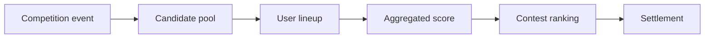

# New competition fit guide

**Audience:** External — partners, collaborators, and anyone evaluating whether a competition format fits the platform.

Play The Cut is built to add competition **domains** quickly — but **speed of implementation only matters if the format actually fits the product**. This guide is for evaluating a candidate *before* anyone opens a plugin package or writes ingestion code.

Candidates fall into three buckets:

| Bucket | Source of truth | Examples |
|--------|-----------------|----------|
| **External** | Real-world leagues, markets, ceremonies | PGA Tour, NFL week, Oscars |
| **External-shaped** | Real world, but reframed to fit | F1 as race weekends, Survivor as episode weeks |
| **Platform-native** | Play The Cut designs and runs the competition | Community lists, promo tournaments, voting challenges |

For technical setup after a format passes review, see [architecture.md](../platform/architecture.md), [spec/platform/README.md](../../spec/platform/README.md), and [spec/platform/add-sport-checklist.md](../../spec/platform/add-sport-checklist.md).

For brainstormed external domains (markets, awards, esports, etc.), see [shape-ideas.md](shape-ideas.md).

---

## What this tool is shaped for

The platform is a **pick-and-rank competition engine**. Users:

1. Choose a competition domain (still `sport` in code today)
2. See the **one active event** for that domain (this week's tournament, slate, race, or platform-run challenge)
3. Build a **lineup** — a small roster picked from that event's **candidate pool**
4. Enter that lineup into **contests** (public or inside a league)
5. Watch **aggregated lineup scores** move on a live leaderboard until the event ends and contests settle

Everything below flows from that shape. A format that needs a different mental model can still be forced in — but the cost rises fast, and the experience usually suffers.

**Platform-native competitions** use the same pipeline when the platform seeds the field, runs the rounds, and publishes scores. No external API — the event *is* the product feature.



| Platform assumption | What it means in practice |
|---------------------|---------------------------|
| **Event-scoped** | All picks come from one competition instance. No cross-event rosters. |
| **One active event per domain** | The app highlights a single "this week" event per domain. |
| **Bounded candidate pool** | Users pick from a defined field (golfers, stocks, nominees, restaurants on a list), not an open universe. |
| **Numeric lineup score** | Each pick produces a number; the platform sums (or otherwise aggregates) them into one lineup total. |
| **Clear ranking** | Lineups order cleanly: higher or lower wins, with tie-break rules when totals match. |
| **Discrete lifecycle** | `SCHEDULED → LIVE → COMPLETE`. Contests activate when play starts and settle when the event is final. |
| **Periodic score sync** | Live scores refresh on a cron cadence (~5 minutes), not second-by-second. |
| **Contest-scoped lineups** | Each lineup optionally belongs to one contest (`Lineup.contestId`). Copy/clone reuses picks across contests for the same event. |
| **Shared wallet & leagues** | Same account and league groups work across domains; domain is chosen per contest via the event. |

**PGA Golf is the reference external fit.** Four golfers, Stableford totals summed into a lineup score, one tournament per week, field sync before tee-off, live leaderboard through Sunday, winning-score prediction as a tie-break.

**Platform-native fits** use the same roster → aggregate → rank flow, but the platform owns the prompt, candidate list, voting or reveal schedule, and final scoring. See [Platform-native competitions](#platform-native-competitions) below.

---

## The fit question in one sentence

> Can players pick a small roster from this event's field, get a single score per pick, sum those into a lineup total, and rank lineups when the event ends — with outcomes we can determine reliably (external feed or platform rules)?

If the honest answer is no, stop here or redesign the format before investing in a plugin.

---

## Evaluation worksheet

Copy this table for each candidate format. Score each row **Strong / Partial / Weak / N/A**, then read the decision framework at the end. Platform-native events: see [extra questions](#platform-native-evaluation-extra-questions); row 7 is N/A when the platform is the data source.

| # | Question | Strong fit looks like | Your answer | Notes |
|---|----------|----------------------|-------------|-------|
| 1 | **Is there a clear event?** | A named instance with start, end, and status (tournament, slate, race, match day). | | |
| 2 | **Is the field bounded?** | A list of participants users can browse and pick from before or as play begins. | | |
| 3 | **Does each participant produce one score?** | One number (or a structure that collapses to one number) per competitor per event. | | |
| 4 | **Does lineup scoring aggregate simply?** | Sum of picks is meaningful and fun (golf Stableford, fantasy points). | | |
| 5 | **Is the winner obvious?** | Higher or lower total wins; ties are rare enough to handle with a prediction tie-break. | | |
| 6 | **Does cadence match weekly/daily events?** | Natural "this week on Play The Cut" rhythm; not a six-month season narrative. | | |
| 7 | **Can we get the data?** | Licensed or public APIs; field lists and live results on a useful schedule. **Platform-native:** we operate the field and scoring (N/A). | | |
| 8 | **Do withdrawals/DNPs have a rule?** | Injured, WD, DNP — a clear policy (zero points, replacement window, etc.). | | |
| 9 | **Is the picker experience fun at roster size 4–12?** | Users can make informed picks without being domain experts. | | |
| 10 | **Does live leaderboard drama work?** | Scores move during play; a 5-minute refresh still feels engaging. | | |
| 11 | **Can contests open before play and settle after?** | Entry window before start; final results within hours of completion (not weeks of appeals). | | |
| 12 | **Do leagues make sense?** | Friends want the same recurring pool across weeks; cross-sport leagues are a bonus, not a requirement. | | |

**Rough scoring:** Mostly Strong → proceed. Several Partial → prototype the hard parts first. Any Weak on rows 1–5 → likely a poor fit without rethinking the format.

---

## 1. Event shape — does the calendar fit?

The platform thinks in **events**, not seasons.

| Fits well | Fits poorly |
|-----------|-------------|
| Weekly NFL slate | Season-long fantasy league |
| Four-day golf tournament | Full tennis season rankings |
| Race weekend (qualifying + race) | Year-long F1 championship chase as one "event" |
| Single matchday in a cup round | Daily micro-markets on individual at-bats |
| Olympics day/session | Draft combine with no live scoring |

**Questions to answer:**

- What is the `externalId` for one event? (e.g. `R2026033`, `2025-W14`, `monaco-gp-2026`)
- How long is the event wall-clock? Hours, days, or a week is ideal. Months is not.
- Can exactly one event be **active** per sport at a time, or do users expect overlapping events?
- When does the event transition `SCHEDULED → LIVE → COMPLETE`? Who decides "final"?

If the sport's natural unit is a **season**, ask whether you can productize **slices** of that season (weekly slates, race weekends, matchdays) as events. That reframing is often the difference between fit and misfit.

---

## 2. Candidate pool — what are users picking?

Users do not pick abstract teams or season narratives. They pick **participants in this event** from a pool the platform can list, search, and sort.

**Data you need for the picker:**

| Data need | Purpose | Golf example |
|-----------|---------|--------------|
| **Identity** | Stable ID, display name | PGA Tour player ID, name |
| **Field membership** | Who is in this event | Tournament entry list |
| **Sort/filter signals** | Help users choose | OWGR, DataGolf rank |
| **Display metadata** | Rows in the lineup builder | Photo, country, tee time |
| **Pre-event status** | Injured, withdrawn, alternate | WD before Round 1 |
| **Live status** | Playing, done, cut | Leaderboard position, thru |

**Questions to answer:**

- How many participants are in a typical field? Dozens to low hundreds is comfortable. Thousands (e.g. full tour roster) needs aggressive filtering.
- Are there **position or role constraints** (QB/RB/WR slots) or a flat pool (pick any four golfers)?
- Is the field known **before** users must lock lineups? Late additions and alternates need a policy.
- What makes a pick **interesting** to a casual user — stars, value plays, storylines, home-town ties?

If the pool cannot be enumerated before lock, the lineup-building UX breaks down.

---

## 3. Scoring — how does a lineup win?

The platform stores one **`total` per event participant** and aggregates lineup scores from those totals. The sport plugin owns the math; the platform owns ranking and settlement.

**Questions to answer:**

| Topic | Decide upfront |
|-------|----------------|
| **Unit of score** | Fantasy points, Stableford, finishing position points, stage time — what is the number? |
| **Aggregation** | Sum of picks (default), average, best-ball, worst-ball? |
| **Direction** | Higher wins or lower wins? |
| **Partial scoring** | Do picks accrue score during play, or only at the end? |
| **Bonuses & penalties** | Cut bonuses, position bonuses, DNFs — baked into participant `total` or separate? |
| **Transparency** | Can users see *why* a pick scored what it did (scorecard, stat line)? |

**Golf reference:** Each golfer's `total` = Stableford across rounds + cut bonus + position bonus. Lineup score = sum of four golfer totals. Higher wins.

**NFL fantasy reference (planned):** Each player's `total` = fantasy points for the week. Lineup score = sum across nine roster slots (with position validation). Higher wins.

Write the scoring rules in plain English before writing code. If you cannot explain lineup scoring in two sentences to a friend, the format is not ready.

### Tie-breaking

When lineup totals tie, the platform applies a fixed order:

1. Aggregated score (descending or ascending per sport)
2. **Prediction distance** — user submits a sport-specific prediction with their lineup (golf: winning Stableford score)
3. Earlier entry time

**Question:** Is there a natural, fun prediction users can make before play starts? If not, ties may decide payouts by entry timestamp — which is legal but unsatisfying.

---

## 4. Live experience — does the leaderboard work?

During `LIVE`, cron pulls scores and updates contest lineups. Users refresh or wait for the next poll; there is no sub-minute websocket feed.

**Questions to answer:**

- Does the sport produce **moving leaderboard drama** with 5-minute updates?
- Is per-participant detail worth showing (golf scorecard, football stat line)?
- Are there natural **status labels** users understand (thru 14, Q3, lap 42)?
- What happens at **mid-event milestones** (golf cut, halftime) — any bonus scoring or just narrative?

Sports where nothing changes for hours, or where outcome is effectively decided in the first minutes, make poor live products.

---

## 5. Data sourcing — can we actually run this?

Implementation is easy when the data is not. Before committing, inventory sources and risks.

| Data category | Required? | Questions |
|---------------|-----------|-----------|
| **Schedule / event list** | Yes | How do we discover upcoming events? |
| **Field / entries** | Yes | When is the field final? How often does it change? |
| **Live results** | Yes for live contests | API latency, rate limits, cost, terms of use |
| **Historical / context** | Nice to have | Rankings, projections, odds — for sort keys and copy |
| **Media** | Nice to have | Headshots, logos — licensing? |
| **Official vs unofficial** | Risk | What happens when the feed disagrees with the official result? |

**Red flags:**

- No API; manual CSV every week
- Results finalized days later (video review, protests)
- Scoring requires proprietary or subjective judgment
- Feed cost scales linearly with user count in a way that breaks unit economics

---

## 6. Roster rules — how big, how hard?

Roster rules live on the `Sport` row (`slotCount`, `minPicks`, `maxPicks`, `allowDuplicates`) and in plugin validation.

**Questions to answer:**

- How many picks? **4** is the golf default — small enough for casual play, large enough for strategy. Many sports land between 4 and 12.
- Position slots (fantasy) vs open pool (golf)?
- Duplicate picks allowed?
- Minimum picks required if the field shrinks (withdrawals)?

The roster size should match **how much attention users will give the event**. A Sunday golf tournament earns four thoughtful picks. A single NFL game day might earn more; a season does not.

---

## 7. Contest & money fit

Contests are paid competitions with on-chain entry, optional secondary market, and oracle settlement. The sport does not change the contract layer — but it must support sensible contest timing.

**Questions to answer:**

| Topic | Fit check |
|-------|-----------|
| **Entry window** | Can users join contests before play starts and feel they had a fair shot? |
| **Activation** | Does "contest goes live when play starts" match the sport? |
| **Settlement** | Are final results available within hours, not weeks? |
| **Disputes** | Any history of reversed results after settlement? |
| **Secondary market** | Does in-contest trading add excitement, or is the event too short / too deterministic? |
| **Side bets / props** | Optional — does the sport offer parlay-friendly markets (golf top-20, etc.)? |

---

## 8. League & social fit

Leagues are cross-sport friend groups. A new sport fits socially when people already run informal pools with the same shape.

**Questions to answer:**

- Do friend groups already run a pool in this format (office golf pool, NFL pick'em variant)?
- Is there a natural weekly ritual ("our league does the Masters and the Super Bowl slate")?
- Does the format benefit from **the same league hosting multiple domains**, or is it isolated?

---

## Platform-native competitions

Competitions that **exist only on Play The Cut** — no PGA Tour, no NYSE feed, no Oscar telecast required. The platform designs the prompt, seeds or grows the field, runs the schedule, promotes the event, and publishes scores. These are a growth and engagement lever, not just a plugin for someone else's calendar.

### Why they matter

| Benefit | Example |
|---------|---------|
| **Fill the calendar** | Run a culture-list challenge the week after Masters when no golf event is active |
| **Differentiate** | Formats no generic DFS site offers |
| **Promote partners & locales** | "Best tacos in Austin" with local sponsors |
| **Low data dependency** | No API contract, rate limits, or rights negotiations |
| **League glue** | A friends league runs golf *and* monthly platform challenges |
| **Format R&D** | Test scoring and engagement before chasing a hard external integration |

### How they differ from external competitions

| Question | External | Platform-native |
|----------|----------|-----------------|
| Who defines the field? | League, tour, market index | Platform (or league admin with platform tools) |
| Who scores? | External feed + plugin transform | Platform rules + user actions (votes, reveals, admin) |
| Why do users show up? | They already care about Masters / NFL | Prompt, prizes, social, FOMO on a finite event |
| Data risk | API cost, delays, disputes | Moderation, Sybil votes, rule clarity |
| Repeatability | Follows real-world calendar | Platform chooses cadence (weekly, monthly, one-off) |

Native competitions still use leagues, contests, wallets, and settlement. The `SportModule` pattern applies: a plugin (or platform-core handler) implements field, scoring, and lifecycle — the data layer is just internal tables instead of PGA APIs.

### Mapping to the engine

Strong platform-native formats still follow **pick → aggregate → rank**:

| Concept | Platform model |
|---------|----------------|
| Prompt / theme | Event `metadata` + marketing copy |
| Pool entries | `Participant` / `EventParticipant` |
| User lineup | N picks from the seeded field before lock |
| Score updates | Platform rules during `LIVE` (votes, reveals, admin publishes ranks) |
| Per-pick `total` | Vote share, survival points, placement — must collapse to one number |
| Lineup score | Sum of pick totals (default) |
| Tie-break | Prediction before lock (e.g. final list size, top vote %) |

**Favor:** bounded editorial or curated pools, clear lock time, numeric scoring rules, finite event window.

**Stretch the engine:** dynamic fields that grow after lock, multi-phase economies separate from contest entry, formats where the primary outcome is a shared artifact rather than ranked lineups. Prototype those on paper before committing.

### Platform-native ideas (lineup-shaped)

| Idea | Event | Pool | Scoring | Engagement hook |
|------|-------|------|---------|-------------------|
| **Weekly culture list** | 7-day window | 30 albums / films / memes | Points if pick makes published top 10 | Community vote + reveal post |
| **City scene challenge** | Weekend | 40 local venues (editorial seed) | Points by final rank on group list | Local promo, partner league |
| **Pre-Oscars warm-up** | Before real ceremony | Platform nominee list | Points per real Oscar win | Bridges to external Oscars domain later |
| **Discord / league insider** | League-only event | Members nominate → admin curates field | Vote share or final rank points | League admin runs prompt for their group |
| **Rookie reviewer** | Month | Critics' picks from staff seed list | Distance from staff final ranking | Content marketing |
| **Hot take bracket** | 3-day | 16 "takes" | Points if take wins public vote % | Social sharing, low stakes |

### Platform-native evaluation (extra questions)

Add these to the worksheet when there is no external data source:

| # | Question | Strong fit |
|---|----------|------------|
| N1 | **Is the prompt fun in one sentence?** | "Pick the restaurants that'll make the group's top 10" |
| N2 | **Can we bound the pool before lineup lock?** | Seeded list or curated nominations — not unbounded user spam |
| N3 | **Does voting produce numeric scores?** | Vote share, rank, survival — collapses to `total` per item |
| N4 | **Is the event worth promoting?** | Clear hook for email, push, league CTAs |
| N5 | **Sybil risk manageable?** | One account per human, league-only entry, or low stakes |
| N6 | **Moderation path clear?** | Bad nominations, ties, disputed outcomes |
| N7 | **Repeatable without fatigue?** | New prompt cadence; not same list every week |
| N8 | **Bridges to external domains later?** | Optional — e.g. culture list → Oscars domain |

### Data sourcing for platform-native events

Row 7 of the main worksheet ("Can we get the data?") becomes **N/A — we are the data**.

| Category | Platform-native approach |
|----------|-------------------------|
| **Field** | Admin UI, CSV import, or nomination → editorial review workflow |
| **Live updates** | Vote tallies in DB; cron or realtime after vote close |
| **Finals** | Admin publish or rule-based auto-finalize |
| **Context** | Editorial copy, images — no rights-heavy media required |
| **Disputes** | Published rules + admin override before `settleContest` |

**Red flags:** Unbounded user-generated nominations with no review; voting open to anonymous users at money stakes; subjective outcomes with no tie-break rule.

---

## Archetypes

### Strong fits — external (proceed to technical planning)

| Sport pattern | Event unit | Pool | Scoring |
|---------------|------------|------|---------|
| **Tournament golf** | 4-day tournament | ~150 golfers | Sum Stableford / fantasy points |
| **Weekly fantasy football** | NFL week | Players on slate | Sum fantasy points with positions |
| **Race weekend** | Qualifying + race | ~20 drivers | Points by finish / stage results |
| **Single-day cricket / rugby** | Match | Starting XI + key players | Fantasy or performance points |
| **Olympics session** | Day or session | Athletes in events | Medal / placement points |

### Strong fits — platform-native

| Pattern | Event unit | Pool | Scoring |
|---------|------------|------|---------|
| **Community vote slate** | Multi-day vote window | 20–50 seeded items | Sum of item points from vote rounds / final rank |
| **Staff vs crowd** | Week | Curated nominees | Points vs published staff ranking |
| **League nomination pool** | League-scoped week | Member nominations → curated | Consensus or admin-final rank |
| **Promo showcase** | Weekend | Partner-provided list (venues, tracks) | Rank by community vote or editorial reveal |
| **Popularity scoring (golf, etc.)** | Event week | Same external field as parent sport | External performance + optional popularity bonus on picks | Strong | Path 1 — see [consensus-axis.md](../platform/consensus-axis.md); distinct from predict-the-consensus |

### Adaptable with reframing

| Idea | Reframe to fit |
|------|----------------|
| F1 championship | One **race weekend** per event, not the season |
| Tennis major | **Tournament round** or daily slate of matches, not full draw |
| March Madness | **Daily slate** of that day's games (player props) or a simplified round pool — not a 63-game bracket engine |
| Horse racing | **Race card** as event; pick horses across races — validate aggregation rules carefully |

### Poor fits (platform fights you)

| Pattern | Why it breaks |
|---------|---------------|
| Season-long fantasy | No discrete event; roster changes all year |
| Survivor / pick-one-team | Elimination, not aggregation |
| Head-to-head only | No shared candidate pool ranking |
| Pure prediction (winner only) | No roster, no participant totals |
| Subjective judging (figure skating) | Disputes, delayed finals |
| In-play-only micro betting | Wrong cadence and UX |
| Draft-based formats | Different product — draft room, not lineup builder |
| **Open-ended UGC list** | Unbounded pool; moderation and scoring chaos |
| **Real-time debate / chat game** | Wrong cadence; not pick-and-rank |
| **Proposal-and-chip economies** | Separate game loop from lineup lock → aggregate → rank |

---

## Decision framework

After completing the worksheet:

### Go

- Rows 1–6 are Strong (or N1–N6 for platform-native)
- Data sourcing has a credible plan — **external API or platform ops playbook**
- Scoring is explainable in two sentences
- At least one person on the team is genuinely excited to play it

→ Write a one-page brief (event unit, pool size, scoring, data/ops) and hand off to [spec/platform/plugins.md](../../spec/platform/plugins.md).

### Adapt

- The sport is popular but the default format does not fit
- Reframing (weekly slate, race weekend, daily card) solves most Weak answers

→ Prototype the reframed format on paper. Run it past three potential users before building.

### Pass (for now)

- No bounded event or no enumerable field
- No reliable participant-level scoring
- Season-long or elimination-only mechanics at the core
- Data costs or legal terms block sustainability

→ Park the idea. The platform will not get meaningfully faster at the wrong shape.

---

## Competition brief template

When a format passes review, capture decisions in a short brief before implementation:

```markdown
# [Name] — competition brief

## Type
External | Platform-native | Hybrid

## One-liner
[How a user plays this on Play The Cut in one sentence]

## Event unit
- External ID pattern:
- Typical duration:
- Active events: one per domain / overlapping?
- SCHEDULED → LIVE → COMPLETE triggers:
- Prompt (platform-native): 

## Candidate pool
- Typical field size:
- Roster rules (slots, positions, duplicates):
- Field lock timing:
- Withdrawal / DNP policy:
- Seeding (platform-native): editorial | nominations | import

## Scoring
- Per-participant total:
- Lineup aggregation:
- Direction (higher/lower wins):
- Tie-break prediction:

## Data & ops
- Field source: API | admin | votes in DB
- Live scoring source:
- Refresh expectations:
- Moderation / Sybil (platform-native):
- Known gaps / manual ops:

## Promotion (platform-native)
- Hook for leagues / email / social:
- Repeat cadence:

## UX notes
- Picker sort keys: declare in competition brief; implement in sport package `build*Candidates` + `candidateSortConfig` (`picker` context). Golf: OWGR → DataGolf → name (rankings order even during live events).
- Field / lineup list sort keys: `fieldLeaderboard` and `lineupPicks` contexts use `scheduled` (name) vs `active` (live leaderboard order) key lists.
- Live display (what users see per pick):
- Fun factor / why users care:

## Out of scope (v1)
- [What we are explicitly not doing first]
```

---

## Related docs

| Doc | Use when |
|-----|----------|
| [architecture.md](../platform/architecture.md) | Full platform model, data schema, plugin interface |
| [spec/platform/README.md](../../spec/platform/README.md) | Product overview and technical add-sport checklist |
| [spec/platform/plugins.md](../../spec/platform/plugins.md) | `SportModule` / `SportUIPlugin` contracts |
| [spec/cross-layer.md](../../spec/cross-layer.md) | End-to-end flows (lineup → contest → settlement) |
| [shape-ideas.md](shape-ideas.md) | Brainstorm — competition domains in the same shape |
