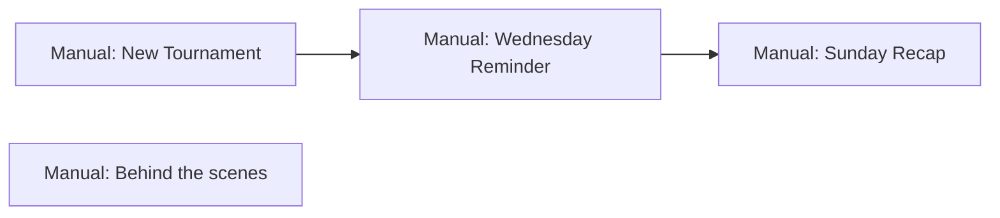

# Email program — Play The Cut

Product spec for transactional and lifecycle emails.

## Sending model (v1)

All product emails are **manual** in v1: an operator runs `script:send-blast` (or a future admin action) when content is ready. **`initTournament` does not send email** — it only loads tournament data (including `summarySections`) into the database. Signup does not send email.

| Email | v1 trigger |
|-------|------------|
| Welcome | **Manual** |
| New Tournament | **Manual** |
| Reminder — played, not entered | **Manual** (target: Wednesday 10 AM ET) |
| Tournament Recap | **Manual** (target: Sunday ~7 PM ET) |
| Behind the scenes | **Manual** (target: 1st Tuesday monthly, 10 AM ET) |

Scheduled cron for tournament emails is deferred until manual sends are stable.

---

## Weekly rhythm (overview)

Tournament-week emails:

| Phase | Product focus | Day | Email |
|-------|----------------|-----|-------|
| **1 — Parlay / tournament open** | Event, field, odds, history | **Manual** (when ready) | New Tournament |
| **2 — Contest reminder** | Open contests for engaged non-entrants | **Wednesday** | Reminder — played, not entered |
| **Wrap** | Results, all action | **Sunday PM** | Tournament Recap |

Outside tournament week:

| Email | Cadence |
|-------|---------|
| **Welcome** | **Manual** (operator; e.g. after signup campaigns) |
| **Behind the scenes** | **First Tuesday of each month**, 10:00 AM ET |

---

## Email catalog

| # | Email | Day / cadence | Primary audience | Status |
|---|--------|---------------|------------------|--------|
| 1 | Welcome | **Manual** (operator) | All users with email not yet sent `WELCOME` | Planned |
| 2 | New Tournament | Manual (operator) | All users with email | Planned |
| 3 | Reminder — played, not entered | Manual; target Wed 10 AM ET | Segment: active in last 3 tournaments, **no** contest entries this week | Planned |
| 4 | Tournament Recap | Manual; target Sun ~7 PM ET | All users with email (or contest entrants) | Planned |
| 5 | Behind the scenes | Manual; target 1st Tue monthly, 10 AM ET | All users with email (opt-in recommended at scale) | Planned |

**Mid-week:** one email only — the conditional Wednesday reminder (#3). New Tournament (#2) carries the broad weekly CTA (lineups / contests) for all users when the operator sends it.

---

## Per-email detail

### 1. Welcome

| Field | Detail |
|-------|--------|
| **Purpose** | Orient new user after account creation; set expectations (fantasy + contests + CUT). |
| **Trigger** | **Manual:** operator runs send script when ready. **Not** sent from signup or `initTournament`. |
| **Send window** | Operator-chosen. |
| **Audience** | All users with email who have not already received `WELCOME` (per-user idempotency). |
| **Content** | Welcome; weekly curated experience + live updates; three wagering types (Parlays, Contest Rules, Winner Pool); deposit/withdraw (self-custody, crypto, P2P); CTAs to app and Account funds. |
| **Skip if** | No email; already logged `WELCOME` for `userId`. |
| **Idempotency** | Log `userId` + `WELCOME`. |

---

### 2. New Tournament (manual — Parlay)

| Field | Detail |
|-------|--------|
| **Purpose** | Open the week: event, field, odds; primary weekly touch for **all** users. |
| **Trigger** | **Manual:** operator runs send script or admin action when the week is ready. Not tied to `initTournament`. Send **once per tournament** unless an explicit resend path is used. |
| **Send window** | Whenever the operator sends—typically early in the tournament week after init and summary JSON are in place. |
| **Audience** | All users with email (v1). |
| **Content pillars** | Tournament name, dates, course / location; **full `summarySections`** (same content as in-app tournament summary); CTA: build lineup / browse open contests. |
| **Data sources** | `Tournament` row for `manualActive` tournament: `summarySections` (from DB), dates, course, location. `initTournament` only populates DB; it does not send. |
| **Skip if** | No email on user; already logged `NEW_TOURNAMENT` for this `tournamentId` (unless resend). |
| **Idempotency** | Log `tournamentId` + `NEW_TOURNAMENT`. |
| **Notes** | Preview HTML before send (`script:email-preview`). Optional `--dry-run` on send script. |

---

### 3. Reminder — played recently, no contest entry (Wednesday)

| Field | Detail |
|-------|--------|
| **Purpose** | Mid-week nudge for engaged users who have not entered a contest this week. |
| **Trigger** | **Manual:** operator sends when ready. Target **Wednesday 10:00 AM** `America/New_York`. Segment evaluated at send time. **At most once per user per tournament**. |
| **Send window** | Operator-chosen; Wednesday morning ET is the intended slot. |
| **Audience** | **Segment only:** played in **at least one of the last 3 tournaments** AND **zero contest entries** for **current** tournament. |
| **Content pillars** | Short nudge; **your leagues / open contests** (buy-ins, pools); lineup lock countdown; CTA: enter a contest. |
| **Skip if** | Not in segment; no email; already entered contest this week; already sent `REMINDER_NO_CONTEST` for this `tournamentId`. |
| **Idempotency** | Log `tournamentId` + `REMINDER_NO_CONTEST` + `userId`. |

**Segment definition (for engineering):**

- “Played last 3 tournaments” = `TournamentLineup` or `ContestLineup` tied to any of the previous 3 tournament IDs (exact query TBD).
- “No contests” = no `ContestLineup` (or paid entry) for current `tournamentId`.

---

### 4. Tournament Recap (Sunday evening)

| Field | Detail |
|-------|--------|
| **Purpose** | Close the week: results, payouts, all action. |
| **Trigger** | **Manual:** operator sends after the week is **COMPLETED** and results are settled. |
| **Send window** | Operator-chosen; Sunday ~7:00 PM `America/New_York` is the intended slot (post-settlement). |
| **Audience** | All users with email, or contest entrants + lineup owners (TBD). |
| **Content pillars** | Final standings; your results; winners; recap; next week teaser. |
| **Idempotency** | Log `TOURNAMENT_RECAP`. |

---

### 5. Behind the scenes

| Field | Detail |
|-------|--------|
| **Purpose** | Irregular **product digest**: how the whole product is coming together, plans, what shipped, what’s next — not tied to a single tournament. |
| **Trigger** | **Manual:** operator sends on or near the **first calendar Tuesday of each month**, **10:00 AM America/New_York** (special editions anytime). |
| **Why this slot** | **Tuesday** avoids inbox competition with **tournament-week sends** (New Tournament, Wednesday reminder, Sunday recap). **Mid-month Tuesday** is a common newsletter window with solid opens. **Monthly** keeps it digest-sized without weekly fatigue. **10 AM ET** hits US morning before the workday deep-end. |
| **Audience** | All users with email (v1); add **marketing opt-in** before large lists. |
| **Content pillars** | Build-in-public notes; feature snapshots; roadmap hints; ask for feedback; optional metrics (“contests this month”). |
| **Skip if** | No email; user unsubscribed from product digest (when preferences exist). |
| **Idempotency** | Log `campaignId` or `YYYY-MM` + `BEHIND_THE_SCENES`. |
| **Notes** | Editor composes body (not fully automated v1). Manual send only in v1. |

---

## Editorial themes (content map)

Mid-week contest energy is split: **New Tournament** = everyone (event + CTA); **Wednesday** = segment reminder only.

### New Tournament (all users, manual send)

1. Tournament history & location  
2. Field  
3. Player odds  
4. CTA: lineups / open contests  

### Wednesday — Reminder (segment only)

1. League context (if user belongs to leagues with open contests)  
2. Open contests & buy-ins for this week  
3. Lock countdown  

### Sunday evening — Tournament Recap

- Recap all action; your results; next week teaser  

---

## Trigger summary (engineering)

| Email | Tournament status | v1 send | One-time key |
|-------|-------------------|---------|----------------|
| Welcome | — | **Manual** | `userId` |
| New Tournament | `manualActive` (typically `UPCOMING`) | **Manual** | `tournamentId` + `NEW_TOURNAMENT` |
| Reminder no contest | `UPCOMING` | **Manual** (target Wed 10 AM ET) | `tournamentId` + `REMINDER_NO_CONTEST` + `userId` |
| Tournament Recap | `COMPLETED` | **Manual** (target Sun ~7 PM ET) | `tournamentId` + `TOURNAMENT_RECAP` |
| Behind the scenes | — | **Manual** (target 1st Tue monthly) | `YYYY-MM` + `BEHIND_THE_SCENES` |

**Active tournament:** `Tournament.manualActive === true`.

**Default timezone:** `America/New_York` for all sends unless noted.

---

## Open decisions

- [ ] Tournament Recap audience: all users vs. entrants only?
- [ ] Behind the scenes: require opt-in before sending to full user base?
- [ ] Exact “last 3 tournaments” query for reminder segment

---

## Unsubscribe (stop-gap)

- All emails include a simple unsubscribe link.
- Link format: `GET /api/unsubscribe?email=<email>&token=<token>`.
- Token is an HMAC over normalized email using server secret material (no new env var required).
- Unsubscribe state is stored at `User.settings.marketingUnsubscribed = true`.
- Email audience loaders skip users with `marketingUnsubscribed === true`.

---

## Related docs

- [Email implementation](./email-implementation.md) — engineering status, module layout, preview commands
- [Product growth funnel](./PRODUCT_GROWTH_FUNNEL.md) — stages 6–8 (retention, reminders, post-contest)
- [Onboarding content plan](../spec/onboarding-content-plan.md) — welcome tone and product terms
