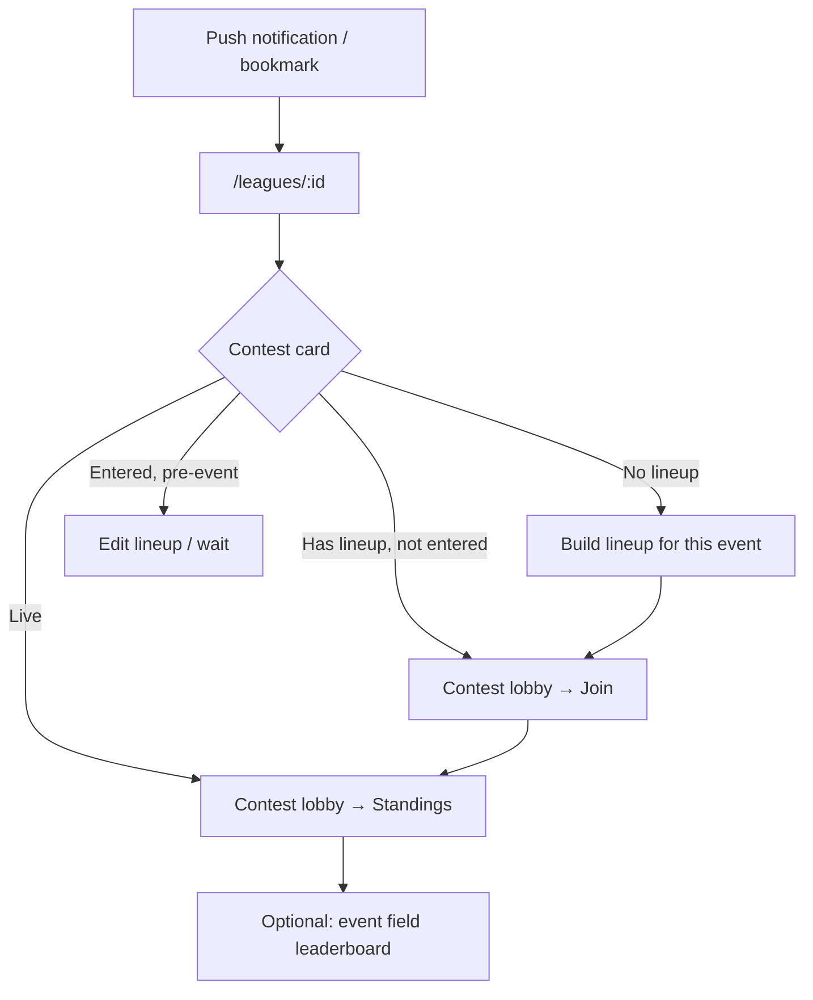

# Navigation & information architecture (in progress)

**Audience:** Internal team only. Not for external partners or public distribution.

Working discussion — not a finalized spec. Captures UX direction for multi-sport navigation, league-first vs sport-first entry, and mobile considerations.

**Related (internal):** [architecture.md](../platform/architecture.md) · [spec/client/architecture.md](../../spec/client/architecture.md)

Competition fit and domain brainstorming for external audiences live in [fit-guide.md](../competitions/fit-guide.md) and [shape-ideas.md](../competitions/shape-ideas.md) — intentionally separate from this IA work.

---

## Status

| Item | State |
|------|--------|
| Problem framing | Draft |
| Persona IA | Draft |
| Recommended direction | Draft — leaning league-first for retained users |
| Implementation | In progress — pragmatic nav pass (see below) |
| Spec migration | Pending decision |

---

## What is IA?

**Information Architecture (IA)** is how destinations are organized, labeled, and connected so users can find what they need and understand where they are.

It is not visual design (colors, typography) or interaction design (animations, gestures). It answers:

- What are the main destinations? (screens, sections)
- How are they grouped and labeled? (nav, tabs, breadcrumbs)
- What is the hierarchy? (home → league → contest → lineup)
- What path does each user type take? (persona flows)

Good IA feels invisible. Bad IA forces everyone through the same front door when their job-to-be-done differs.

---

## Current structure (v4)

| Area | Behavior |
|------|----------|
| Default landing | `/` → `/contests` (multi-sport live contests hub) |
| Desktop primary nav | Live Contests · User menu (Sign In when logged out) |
| Mobile nav | Hamburger — Live Contests; leagues in menu |
| Leagues | Cross-sport by design; in user menu / hamburger |
| Sport context | `sportId` from URL on sport routes or `contest.event` on lobby — no global provider |
| Live Contests | `/contests` — all active events across sports; public + member league contests merged per event |
| Field leaderboard | **Field** tab on contest lobby (scoped to contest event); share links at `/sports/:sportId/leaderboard` |
| Lineups | **Lineups** tab on contest lobby (contest-scoped); each contest shows only its own drafts and entries |
| Event context | Explicit event sources; page-local headers on contest lobby + `/sports/:sportId/leaderboard` only |
| Sport picker | Not in global header; sport implied by contest/event groups on `/contests` |
| Sport hub | `/sports/:sportId` remains for deep links (legacy bookmarks) |

**Resolved tension (partial):** Live Contests and field leaderboard no longer depend on a global sport picker or golf-default routes. League-first default home, bottom-tab nav, and persona-based redirects remain future work.

---

## Pragmatic pass (shipped / in progress)

Near-term nav changes without conditional routing or persona-based home redirects:

| Change | Route / surface |
|--------|-----------------|
| Live Contests multi-sport | `/contests` — `GroupedContestList` by event; same public + league merge per event |
| Field leaderboard in lobby | `/contest/:address` → **Field** tab |
| Lineups in lobby | `/contest/:address` → **Lineups** tab (first tab; default pre-round) |
| My Lineups route removed | `/lineups` page removed — manage rosters from contest lobby |
| Leaderboard removed from header | Standalone route for shares only |
| Contest event header local | `/contest/:address` — `EventSummary` in lobby |
| Leaderboard event header local | `/sports/:sportId/leaderboard` only; legacy `/leaderboard` removed |
| Sport picker removed from header | Sport on contest cards and event group headers |
| Internal share links | `/sports/:sportId/leaderboard?playerId=…` |

**Deferred:** default home by league membership, leagues as primary tab, bottom tab bar, cross-event lineup index page, `lastVisitedLeagueId`.

---

## Two mental models

| | **Sport-first** (DraftKings-ish) | **League-first** (Sleeper/ESPN-ish) |
|---|---|---|
| User thinks… | “I want to play golf this week” | “What’s happening in our league?” |
| Home | Sport hub / lobby | League dashboard |
| Sport selection | Global — “which sport am I in?” | Local — implied by the contest they tapped |
| Best for | Public contests, discovery | Invited friends, recurring groups |
| Multi-sport | Needs sticky sport context everywhere | Mostly solves itself — league shows all sports |

Play The Cut is **both**. The invite → league → contest → lineup path is likely the retention loop. Public hub is acquisition and overflow.

---

## Personas

| | **Jordan** — League member | **Sam** — Public player |
|---|---|---|
| How they arrive | Friend’s invite link | Search, social, word of mouth |
| Primary question | “What do I need to do for our pool this week?” | “What contests can I enter right now?” |
| Social context | Strong — league name, rivals | Weak — strangers, public lobby |
| Sport awareness | Low — “it’s the Masters pool” | Higher — “I want golf this week” |
| Return visit | Same league, new event each week | Browse what’s open |
| League | Core | Optional / never |

---

## Target IA — Jordan (league-first)

### Mental model

> “I’m in **Matt’s League**. There’s a **contest this week**. I need a **lineup**, then I check **how I’m doing**.”

Sport is a label on the contest, not a mode switched in global nav.

### Site map

```
Home (default: last league, or league list)
├── League detail                    ← Jordan's real "homepage"
│   ├── Overview (contests grouped by event/sport)
│   ├── Members
│   └── Manage (admin only)
├── Contest lobby (/contest/:address) — Lineups tab (contest-scoped rosters)
└── Account
    ├── Wallet / funds
    ├── Contest history
    └── Settings
```

### Proposed primary nav (mobile)

| Tab | Use |
|-----|-----|
| **League** | Default home — group’s contests |
| **Lineups** | “Did I build my roster yet?” |
| **Account** | Balance, history |

Leaderboard and public contests are **not** top-level for Jordan. Standings live in the **contest lobby**; field scores are linked from there or from lineup.

### Weekly flow



### Screen map

| Screen | Route (today / target) | Purpose | Sport picker? |
|--------|------------------------|---------|---------------|
| League home | `/leagues/:id` (target default) | This week’s contests; sport badges on groups | No |
| Contest lobby | `/contest/:address` | Enter, lineups, standings, timeline, payout | Badge only (“PGA · Masters”) |
| Lineup builder | Lineups tab on `/contest/:address` | Pick roster + prediction; contest-scoped | No — sport from contest |
| Event leaderboard | Field tab on `/contest/:address`; shares at `/sports/:sportId/leaderboard` | Field scores | From contest or sport-scoped share link |
| Account | `/account` | Wallet, profile | No |

### What Jordan should not need

- Global “which sport am I in?” dropdown in the header
- Landing on `/sports/pga-golf` after every visit
- Choosing golf vs NFL before seeing their league

---

## Target IA — Sam (sport-first / discovery)

### Mental model

> “What’s **live** this week? I’ll **browse contests**, **build a lineup**, and **enter**.”

League is invisible until they create or join one.

### Site map

```
Home (default: Play / public contest hub)
├── Sport hub (/sports/:sportId)
│   ├── Active event header
│   ├── Public contest list
│   └── CTA → build lineup
├── Contest lobby
├── Lineup builder
├── Event leaderboard
├── Leagues (secondary)
└── Account
```

### Proposed primary nav

| Tab | Use |
|-----|-----|
| **Play** | Browse public contests by sport |
| **Lineups** | Manage rosters |
| **Leagues** | After joining one |
| **Account** | Wallet, history |

### Discovery flow

```mermaid
flowchart TD
  A[Lands on site] --> B["/sports/pga-golf or /play"]
  B --> C[Sport segment: Golf | NFL | …]
  C --> D[See public contests for active event]
  D --> E{Interested?}
  E -->|Yes| F[Build lineup]
  F --> G[Contest lobby → Join + pay]
  E -->|Maybe later| H[Browse leaderboard / leave]
  G --> I[Return via Play tab during event]
```

### Screen map

| Screen | Purpose | Sport picker? |
|--------|---------|---------------|
| Play hub | Public contests, active event context | **Yes** — tabs or segmented control |
| Contest lobby | Same as Jordan | Badge |
| Lineup builder | Same as Jordan | Implicit from hub |
| Leaderboard | Explore field before/during picking | Scoped to sport hub’s active event |
| Leagues | Start / join — growth path | No |

Sport selection lives **only on Play** (and maybe Lineups as a filter). Not on league screens, contest lobby, or account.

---

## Unified model — one app, two front doors

```
                    ┌─────────────────────────────────┐
                    │         Play The Cut            │
                    └─────────────────────────────────┘
                              │
            ┌─────────────────┴─────────────────┐
            ▼                                   ▼
   JORDAN (league-first)              SAM (play-first)
            │                                   │
            ▼                                   ▼
    /leagues/:id                         /play or /sports/:id
    "Matt's League"                      "Live Contests"
            │                                   │
            ▼                                   ▼
    Contest card                         Sport: Golf | NFL
    "Masters · PGA"                              │
            │                                   ▼
            └──────────────┬────────────────────┘
                           ▼
                  /contest/:address
                  (shared experience)
                           │
                           ▼
                  Lineup → Live → Settled
```

Contest lobby and below are **shared**. Front door and primary nav **diverge**.

### Routing defaults (proposed)

| User state | Default home | Primary nav emphasis |
|------------|--------------|----------------------|
| Logged out | Marketing or Play hub | Play · Sign In |
| Logged in, in a league | Last league (`/leagues/:id`) | League · Lineups · Account |
| Logged in, no league | Play hub | Play · Lineups · Leagues · Account |
| Logged in, both | Last league (Jordan wins) | League · Play · Lineups · Account |

**Play** = today’s `/sports/:sportId` hub with sport segments.  
**League** = today’s league detail.  
**Lineups** = contest lobby **Lineups** tab, contest-scoped; copy from another contest reuses picks into a new lineup row. Cross-event index deferred — use `/contests` → pick event → enter a contest.

### Mobile nav (4 items max — proposed)

```
[ League ]  [ Play ]  [ Lineups ]  [ Account ]
     ↑          ↑
  Jordan's    Sam's
   default    default
   (if in     (if no
   league)     league)
```

Sport picker: **inside Play only** (segmented control), plus optional chips on Lineups. Not in global header or hamburger.

---

## UX patterns considered

### 1. League as default home

Authenticated users land on last-visited league or league list. Public hub is secondary.

**Pros:** Matches invite flow; cross-sport leagues feel natural; no global sport-state problem.  
**Cons:** Public discovery needs a clear “Browse contests” path.

### 2. “This week” action inbox (longer-term)

Single home: open items across leagues and public play (“lineup due”, “live — you’re 3rd”, “public $50 — 2 spots left”). Sport is a badge per row.

**Pros:** Unifies league + public; scales to multi-sport; mobile-friendly.  
**Cons:** New surface to design and build.

### 3. Contextual sport, no global picker (pragmatic middle ground)

Sport on contest cards, lineup headers, lobby breadcrumbs. Switcher only on public sport hub. League entry CTAs already deep-link to `/sports/:sportId/lineup`.

**Pros:** Aligns with existing league → contest flow; avoids picker-reset bug for league users.  
**Cons:** Public browsing still needs sport segmentation somewhere.

### 4. Sport hub as “Play” tab, not home

League tab + Play tab + Lineups + Account. Sport picker inside Play.

**Pros:** Familiar mobile pattern; clear home for sport selection.  
**Cons:** Two places to find contests (league vs public).

---

## Where sport selection belongs

| Surface | Sport selection |
|---------|-----------------|
| League detail | None — sport on each contest group |
| Contest lobby | Read-only badge |
| Lineup builder | Implicit from event |
| Public contest hub (Play) | **Yes** — tabs or segmented control |
| Mobile | Segment control on Play screen, not hamburger |

Hamburger / account menu = account-level destinations. Sport = activity-level context.

---

## Today vs target

| Area | Current | Jordan (target) | Sam (target) |
|------|---------|-----------------|--------------|
| `/` redirect | `/contests` | `/leagues/:lastId` | `/contests` ✓ |
| Leagues in nav | User menu / mobile only | Primary tab | Secondary |
| Sport picker | Removed from header | None globally | Event groups on `/contests` |
| Leaderboard | Contest lobby Field tab; sport-scoped share route | From contest | From contest / share |
| Lineups | Global, implicit golf | Grouped by event | Grouped by event |
| Cross-sport league | Data model ✓ | UI groups by event ✓ | N/A until joined |

---

## Labels (user-facing copy)

| Internal / today | Jordan-friendly | Sam-friendly |
|------------------|-----------------|--------------|
| Live Contests | “This week’s pool” (on league card) | Play · Browse contests |
| My Leagues | My League (if singular) | Leagues |
| Sport hub | — | Play |
| User Group | League | League |
| Lineup | My picks / My roster | Build lineup |
| Contest lobby | Standings / Pool | Contest |

---

## Open decisions

1. What share of weekly actives are league-only vs public-only vs both?
2. Do users typically have one league or many? (Default to one league vs league list.)
3. Is public contest discovery a growth channel or nice-to-have?
4. ~~Should Leaderboard be global, event-scoped, or contest-scoped?~~ **Decided:** contest lobby Field tab (event-scoped); `/sports/:sportId/leaderboard` for share links only.
5. How common is multi-sport in a single league? (Stress test for global sport UI.)
6. Session-persisted sport vs sport-in-URL vs no global sport at all?
7. Bottom tab bar on mobile — which four tabs?
8. When does this graduate from discussion doc to `spec/client/architecture.md`?

---

## Stress test (not yet wireframed)

Jordan’s league home during a **multi-sport week** — e.g. Masters pool + NFL Week 14 in the same league. `GroupedContestList` already groups by event with sport name. Question: is any global sport switcher needed, or do contest cards carry enough context?

---

## Next steps (when ready)

- [ ] Decide default home routing by auth + league membership
- [ ] Promote leagues to primary nav (desktop + mobile)
- [x] Multi-sport Live Contests at `/contests`; remove header sport picker
- [x] Field leaderboard on contest lobby; sport-scoped share route
- [ ] Scope Lineups by event (or group by event)
- [ ] Add `lastVisitedLeagueId` (localStorage or user settings)
- [ ] Update `spec/client/architecture.md` once direction is locked
