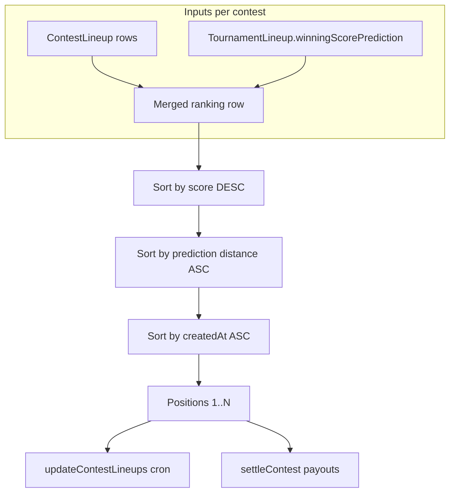
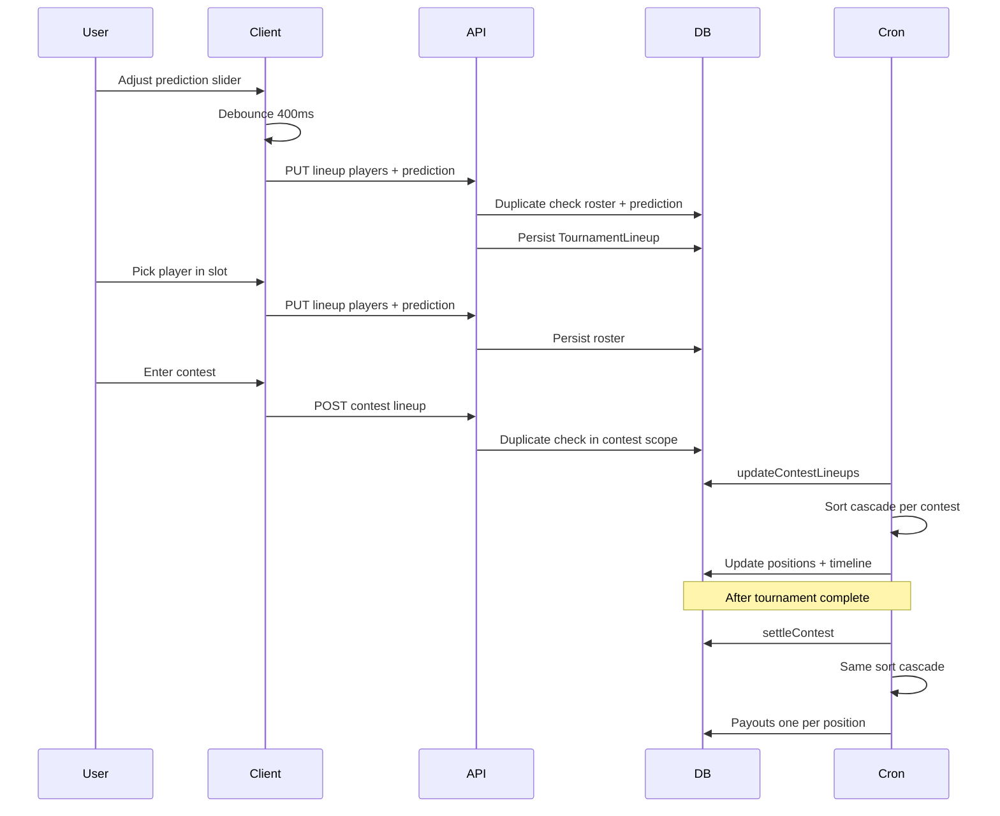

# Lineup tie-breaker — Play The Cut

Product and engineering spec for **winning score prediction**: how users set it, how duplicates work, and how contests rank lineups and pay winners when fantasy scores tie.

Related references: [server API — lineups](../spec/server/api.md), [data models — TournamentLineup](../spec/server/data-models.md), user-facing copy on the FAQ (“How are ties handled?”).

---

## Purpose

Fantasy contests rank lineups by **Stableford total** (sum of the four golfers on the roster). When two or more entries finish with the same fantasy score, the product needs a deterministic way to assign **unique positions** (1, 2, 3, …) and **one payout per position**—no shared ranks and no pooled tie splits.

Each **tournament lineup** carries a **winning score prediction**: the user’s guess at the **highest lineup score that will win that contest** (again, sum of four golfers’ Stableford points). That number is **not** the PGA Tour leader’s stroke total or course par.

The prediction serves two roles:

1. **Uniqueness** — Two lineups with the same four players can coexist if their predictions differ.
2. **Tie-breaking** — When fantasy scores tie, the entry whose prediction is closest to the contest’s actual winning score ranks higher; if still tied, earlier contest entry time wins.

---

## Concepts

| Term | Meaning |
| --- | --- |
| **Tournament lineup** | User’s reusable roster for a tournament (`TournamentLineup`), up to four players. |
| **Contest lineup** | That roster entered into a specific contest (`ContestLineup`); has score, position, `createdAt`. |
| **Fantasy score** | Sum of roster players’ tournament Stableford totals (`ContestLineup.score`). |
| **Winning score prediction** | Integer 1–250 on `TournamentLineup`; user’s guess of the winning lineup’s fantasy total in a contest. |
| **Contest winning score** | `max(ContestLineup.score)` across all entries in that contest at ranking time. |
| **Prediction distance** | `abs(winningScorePrediction − contestWinningScore)`; lower is better. |

---

## Data model

| Field | Model | Type | Notes |
| --- | --- | --- | --- |
| `winningScorePrediction` | `TournamentLineup` | `Int?` | Valid range **1–250** when set. Stored on the tournament lineup, not per contest entry. |
| `score` | `ContestLineup` | `Int` | Live and final fantasy total. |
| `position` | `ContestLineup` | `Int` | Unique rank within the contest (1 = best). |
| `createdAt` | `ContestLineup` | `DateTime` | When the lineup was entered into the contest; final tie-break key. |

**Defaults**

| Event | Prediction value |
| --- | --- |
| New lineup via API without body field | Random integer in **125–175** (`randomWinningScorePrediction()`). |
| Bootstrap `"Lineup #1"` for new users | Same random range on create. |
| Legacy rows before field existed | Backfilled once in migration to random **125–175**. |
| Client before server value loads | Deterministic placeholder from lineup id (`defaultWinningScorePredictionForLineup`) so the slider does not flicker. |

---

## Duplicate lineups

A lineup is a duplicate only when **both** the normalized player set **and** `winningScorePrediction` match another lineup for the same user in the same scope.

Player sets are compared after sorting ids (`normalizePlayerSet`).

| Condition | Result |
| --- | --- |
| Same players, same prediction | **Reject** |
| Same players, different prediction | **Allow** |
| Empty roster (`players.length === 0`) | Never treated as duplicate |

**Scopes**

| Check | When | Error message (representative) |
| --- | --- | --- |
| Tournament | `POST` / `PUT` `/api/lineup/...` | “You already have a lineup with these players and winning score prediction for this tournament” |
| Contest | `POST` `/api/contests/:id/lineups` | “You already have a lineup with these players and winning score prediction in this contest” |

The client runs the same roster + prediction check before save (slot editor and slider) so users see errors without a round trip when possible; the server is authoritative.

---

## User interface

**Surface:** `LineupContestCard` → **Players** tab, bottom of the panel when the user can edit slots (`canEditSlots`: editable tournament + lineup id present).

**Control:** `LineupWinningScoreSlider`

- Label: “Predicted winning lineup score”
- Helper: explains it breaks ties
- Range **1–250** with live numeric readout

**Save behavior**

| Action | Request |
| --- | --- |
| Change slider | Debounced **~400 ms** → `PUT /api/lineup/:lineupId` with current `players` + `winningScorePrediction` |
| Add/swap/remove player | Immediate save via slot editor with current `winningScorePrediction` |

Slider and roster saves share the same API shape so prediction and players stay in sync. Inline error under the slider on duplicate or API failure.

---

## API contract

Base path: `/api/lineup` (auth required; tournament must be editable for writes).

### `POST /api/lineup/:tournamentId`

| Field | Required | Notes |
| --- | --- | --- |
| `players` | Yes | 0–4 player ids |
| `name` | No | Default `"My Lineup"` |
| `winningScorePrediction` | No | 1–250; if omitted, server assigns random 125–175 |

### `PUT /api/lineup/:lineupId`

| Field | Required | Notes |
| --- | --- | --- |
| `players` | Yes | Full roster replacement (0–4) |
| `name` | No | |
| `winningScorePrediction` | No | Updates prediction when provided; otherwise keeps existing |

### `GET` (list and detail)

Response lineups include `winningScorePrediction` (number or `null`).

Example body:

```json
{
  "players": ["cuid1", "cuid2", "cuid3", "cuid4"],
  "name": "Lineup #1",
  "winningScorePrediction": 142
}
```

Contest entry (`POST /api/contests/:id/lineups`) does not accept prediction in the body; it uses the value already on the `TournamentLineup` when checking duplicates.

---

## Ranking and payouts

Every contest ranks **all** `ContestLineup` rows with one strict sort. There is no tied-group logic and no splitting prize pools across equal fantasy scores.

### Sort cascade

For a given contest, compute `contestWinningScore = max(score)` over entries, then sort descending priority:

1. **Fantasy score** — higher `ContestLineup.score` wins.
2. **Prediction distance** — lower `abs(winningScorePrediction − contestWinningScore)` wins.
3. **Contest entry time** — earlier `ContestLineup.createdAt` wins.

Assign positions **1 … N** in sort order (no gaps, no shared position numbers).



### Missing prediction

If `winningScorePrediction` is null at rank time, distance is treated as **infinity** (worst). Entries with a set prediction always beat null predictions on distance. If both lack a prediction, step 3 (entry time) still separates them.

### Payout structure (settlement)

After sorting, `settleContest` maps position to basis points **without** pooling tied scores:

| Contest size | Position 1 | Position 2 | Position 3 |
| --- | --- | --- | --- |
| Fewer than 10 entries | 100% | — | — |
| 10 or more entries | 70% | 20% | 10% |

Each position receives at most one winner; remainder dust rules apply to the first paid slot so total basis points sum to 10,000.

### Live leaderboard

`updateContestLineupsForEvent` (cron pipeline, every 5 minutes when the sport reports live scoring) recalculates scores from participant totals, then applies the **same sort cascade** and writes unique `position` values per contest. Timeline snapshots record score and position after each run.

---

## End-to-end flows



---

## Implementation map

| Concern | Location |
| --- | --- |
| Schema | `server/prisma/schema.prisma` — `TournamentLineup.winningScorePrediction` |
| Random default / validation helpers | `server/src/utils/winningScorePrediction.ts` |
| Duplicate checks | `server/src/utils/lineupValidation.ts` |
| Sort cascade | `server/src/utils/lineupTiebreaker.ts` |
| Lineup HTTP | `server/src/routes/lineup.ts` |
| Contest entry HTTP | `server/src/routes/contest.ts` |
| Live positions | `server/src/services/updateContestLineups.ts` |
| Settlement | `server/src/services/contest/settleContest.ts` |
| Bootstrap lineups | `server/src/services/bootstrapTournamentLineups.ts` |
| Slider UI | `client/src/components/lineup/LineupWinningScoreSlider.tsx` |
| Card + debounced save | `client/src/components/lineup/LineupContestCard.tsx` |
| Slot saves + client duplicate check | `client/src/hooks/useLineupSlotEditor.ts` |
| Mutations / cache | `client/src/hooks/useLineupMutations.ts`, `useLineupData.ts` |
| Client defaults / copy | `client/src/utils/winningScorePrediction.ts` |

---

## Tests

Server unit tests (Vitest):

| File | Covers |
| --- | --- |
| `server/src/utils/lineupValidation.test.ts` | Roster normalization; duplicate = same players + same prediction |
| `server/src/utils/lineupTiebreaker.test.ts` | Cascade ordering; unique sort order |
| `server/src/services/contest/settleContest.payouts.test.ts` | One payout slot per position; no tie splits |

```bash
cd server && pnpm test:run \
  src/utils/lineupValidation.test.ts \
  src/utils/lineupTiebreaker.test.ts \
  src/services/contest/settleContest.payouts.test.ts
```

---

## Decisions

| Decision | Rationale |
| --- | --- |
| Prediction lives on `TournamentLineup`, not `ContestLineup` | One slider per roster; same lineup reused across contests carries one guess unless the user edits it. |
| Duplicates include prediction | Allows intentional “same players, different contest entries” only when the user changes the tie-break guess. |
| Unique positions everywhere | Simplifies leaderboard display and on-chain settlement; users always see a single rank. |
| Contest winning score = max entry score | Tie-break measures closeness to “what it took to win this contest,” not a fixed cap or par. |
| Entry time is contest `createdAt` | Rewards earlier commitment when score and prediction distance still tie. |

---

## Open decisions

None at this time.
