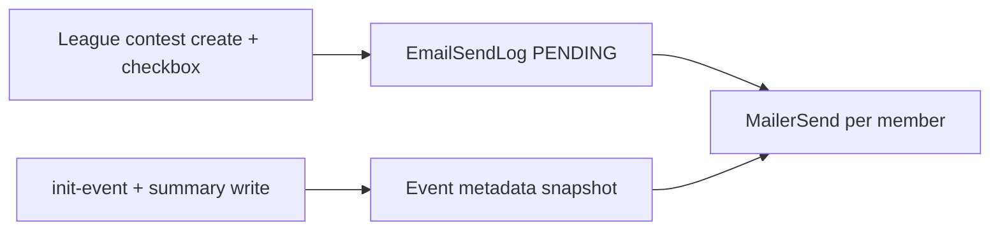

# Email program — Play The Cut

Product spec for outbound email.

## Sending model

The live send path is **contest announcement**: a league admin creates a contest and emails opted-in league members. MailerSend delivers one message per member. `service:init-event` and tournament-summary writes **prepare** announcement copy on the event; they do not send. Signup does not send email.

Player-withdrawal is a transactional template (preview / test send only; no live trigger yet).

---

## Catalog

| Email | Trigger | Audience | Status |
|-------|---------|----------|--------|
| Contest announcement | League admin creates a contest with **Email contest to league members** checked (default on) | League members with email who are not marketing-unsubscribed | Live |
| Player withdrawal | None (template + preview only) | Lineup owners affected by a WD | Template only |

---

## Contest announcement

| Field | Detail |
|-------|--------|
| **Purpose** | Tell league members a contest is open for the week's event, with tournament preview copy and a link to that contest. |
| **Trigger** | `POST /api/contests` with `userGroupId` and `notifyLeagueMembers: true`. Public contests ignore the flag. |
| **Prepare** | `prepareEventAnnouncementEmail` runs at the end of `service:init-event` and after `script:write-tournament-summary`. Snapshot: `CompetitionEvent.metadata.emailAnnouncement`. Send uses the snapshot when present, otherwise compiles live from the sport adapter (or platform fallback). |
| **Audience** | `UserGroupMember`s whose user is `userType=USER`, has a non-empty email, and `settings.marketingUnsubscribed !== true`. Includes league admins. Members without email are skipped. |
| **Content** | League name + buy-in (or Free); event announcement card from the sport adapter (PGA: course, dates, quotes and summary sections; F1: circuit and race dates; commodities: session dates); CTA to the contest lobby (`/contest/{address\|id}`). |
| **Skip if** | MailerSend not configured; no eligible members; checkbox off. Contest create still succeeds. |
| **Idempotency** | One row per member: `CONTEST_ANNOUNCEMENT:{contestId}:{userId}`. |

Delivery is best-effort after the contest row is persisted: PENDING outbox rows are written, then flushed in-process. The 5-minute score pipeline retries leftover PENDING/FAILED rows (capped attempts).

---

## Player withdrawal

| Field | Detail |
|-------|--------|
| **Purpose** | Tell a user a golfer was removed from their lineup. |
| **Trigger** | Not wired. Preview: `script:email-preview player-withdrawal`. |
| **Unsubscribe** | Transactional — no marketing footer. |

---

## Unsubscribe

- Contest announcement (marketing) includes an unsubscribe link.
- Link format: `GET /api/unsubscribe?email=<email>&token=<token>`.
- Token is an HMAC over normalized email using server secret material.
- State is stored at `User.settings.marketingUnsubscribed = true`.
- Audience loaders and `sendEmail` skip those addresses.

There is no in-app email preference toggle.

---

## Related docs

- [Email implementation](./email-implementation.md) — module layout, preview commands, env
- [Golf event activation](../sports/golf/event-activation-runbook.md) — init, summary, then league contest create
