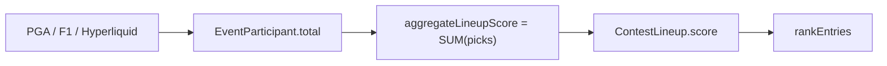

# Uniqueness scoring

How contest pick rates feed an optional scoring adjustment on lineup totals. **Uniqueness** is a first-class primitive in the sport package — configured on `ScoringRules`, applied during `aggregateLineupScore`, and overridable per sport.

**Status:** Design spec. Not implemented in production scoring today.

---

## Current state



| Layer | Today |
|-------|-------|
| Lineup score | Sum of `EventParticipant.total` per pick — no contest context |
| `ScoringRules` | `{ aggregation: "sum", direction: "higher_wins" }` only |
| Ownership UI | `ownershipPercentage` on `ParticipantRow` — never populated |

Orchestration: [`updateContestLineups.ts`](../../server/src/services/updateContestLineups.ts) → `SportModule.aggregateLineupScore(eventId, eventParticipantIds)`.

---

## The primitive

**Uniqueness** measures how distinctive a lineup's picks are relative to other entries in the same contest.

| Term | Definition |
|------|------------|
| **Pick rate** `o(i)` | Fraction of contest lineups that include participant *i* |
| **Uniqueness** | Low pick rate; summarized at pick or roster level for scoring and UI |
| **Uniqueness weight** | Dial on `ScoringRules`; `0` = disabled, non-zero = apply adjustment |

**Pick rate** (field ownership) is distinct from on-chain **entry ownership** (secondary market shares).

### Where it lives

Uniqueness belongs in the basic sport scoring contract — same layer as `aggregation` and `direction`:

```
Sport.scoringRules.uniqueness   → default for all events of that sport
Event.metadata.uniqueness       → optional override
Contest settings                → optional override
SportModule                     → optional override of how adjustment is computed
```

A sport that does not use uniqueness sets `weight: 0` (or omits the field). A sport that scores entirely from contest pick behavior implements that inside its own `aggregateLineupScore` and also leaves `weight: 0` — the crowd signal is already in the pick scores; a second uniqueness pass would double-count.

### Sport package contract (target)

```typescript
type UniquenessMode = "multiplicative" | "additive";

interface UniquenessRules {
  /** 0 = off. Positive rewards low-owned picks; negative rewards high-owned picks. */
  weight: number;
  /** Amplitude scaler. Default: 1. */
  strength: number;
  /** Max raw bonus weight before bonus-shift floor. Default: 2. */
  cap: number;
  /** How bonus applies to positive pick scores. Default: "multiplicative". */
  mode: UniquenessMode;
  /** Min contest entries before pick rates are computed. Default: 5. */
  minEntryFloor: number;
}

interface ScoringRules {
  aggregation: ScoringAggregation;
  direction: ScoringDirection;
  uniqueness?: UniquenessRules;
}
```

`SportModule.aggregateLineupScore` gains contest context (at minimum `contestId`) so pick rates are contest-scoped. Sports may override the default uniqueness adjustment; the platform provides a shared default when `weight ≠ 0`.

Adjustment is always **per-pick** — each pick is adjusted individually, then summed. No roster-level bonus scope.

No separate scoring-path taxonomy. Each sport declares how pick scores are produced and whether uniqueness adjusts them.

### Default config per sport

| Sport | `weight` | `strength` | `cap` | `mode` |
|-------|----------|------------|-------|--------|
| **PGA golf** | `0.5` | `1` | `2` | `multiplicative` |
| **F1** | `0` | — | — | — |
| **Commodities** | `0` | — | — | — |

Omit `uniqueness` or set `weight: 0` for sports that do not use the primitive.

---

## Pick rates

Computed **per contest** from locked lineups:

```
o(i) = lineups_with_pick_i / total_lineups
```

Returns `0` (uniqueness disabled) when `total_lineups < minEntryFloor` (default **5**).

### Live scoring

Lineups lock when the contest activates. During play, the cron pipeline recomputes lineup scores on the regular schedule (every 5 minutes) — external pick totals (`e_i`) and uniqueness bonuses together. Pick rates are derived from the locked contest field each pass; once lineups are locked the rates are stable, but the pipeline does not cache a one-time snapshot.

### Roster summary

For UI and tie-breaking:

| Metric | Formula |
|--------|---------|
| **Geometric mean** `C_geo` | `(Π o(i))^(1/n)` |
| **Uniqueness index** `U` | `1 - C_geo` — 0 = all chalk, 1 = all unique |

`U` is always computed and exposed when pick rates are available.

---

## Design invariant: bonus-only

When uniqueness adjusts scores, it is always a **bonus on top of full pick performance**, never a tax that reduces raw totals.

**Why:** Player optics — chalk users keep every point their pick earned; contrarian users see an explicit bonus. No one watches a 22 become an 11.

### Per-pick adjustment

For each pick *i* with positive external total `e_i` and `weight ≠ 0`:

```
signal_i  = 1 - 2×o_i
raw_w_i   = clamp(weight × strength × signal_i, -cap, +cap)
w_floor   = clamp(weight × strength × (-sign(weight)), -cap, +cap)
bonus_i   = raw_w_i - w_floor          -- always ≥ 0

adjusted_i = e_i                                           when e_i ≤ 0 or weight = 0
           = e_i × (1 + bonus_i)                            when mode = "multiplicative"
           = e_i + bonus_i                                  when mode = "additive"

finalScore = Σ adjusted_i
```

`bonus_i` is always ≥ 0. The worst case on the dial (100% owned when weight > 0, or 0% owned when weight < 0) gets exactly zero bonus. Negative pick totals pass through unchanged.

**Display:** show `baseScore` + `uniquenessBonus`. Never show negative adjustments to players.

---

## Sport examples

| Sport | Pick scores (`e_i`) from | `uniqueness.weight` | Notes |
|-------|--------------------------|---------------------|-------|
| **PGA golf** | Stableford via external feed | `0.5` | Bonus for contrarian picks on top of Stableford |
| **F1** | OpenF1 points | `0` | Pure external sum |
| **Commodities** | Market returns | `0` | Pure external sum |
| **Predict-the-consensus** | Pick-frequency points at lock | `0` | Crowd signal is already `e_i`; see [shape-ideas.md](../competitions/shape-ideas.md) |

---

## Score decomposition

When uniqueness is active, lineup scoring exposes:

| Field | Meaning |
|-------|---------|
| `baseScore` | Sum of unadjusted pick totals |
| `uniquenessBonus` | `finalScore - baseScore` |
| `finalScore` | Ranked total |
| `uniquenessIndex` | `U` — display and tie-break |
| `pickRates[]` | Per-pick `o(i)` and `bonus_i` for UI |

### Storage

**Today:** `EventParticipant.total` holds the external pick score `e_i` (event-scoped). `ContestLineup.score` holds a single lineup total. No uniqueness fields anywhere.

Per-pick uniqueness is **contest-scoped**, not event-scoped. Scottie's pick rate in a 500-entry public contest differs from a 12-person league — so it cannot live on `EventParticipant`, which is shared across all contests for that event.

Three layers:

| Layer | Model | Stores |
|-------|-------|--------|
| **External pick score** | `EventParticipant` | `total` (`e_i`) — already exists; same for every contest |
| **Contest pick adjustment** | `ContestParticipant` *(new)* | Per-pick uniqueness for one contest: `pickRate`, `bonus`, `adjustedScore` |
| **Lineup total** | `ContestLineup` | Roster aggregates only: `baseScore`, `uniquenessBonus`, `score`, `uniquenessIndex` |

#### `ContestParticipant` (new)

One row per `(contestId, eventParticipantId)` — the contest-scoped scoring view of a field member.

| Field | Type | Purpose |
|-------|------|---------|
| `contestId` | FK | Contest scope |
| `eventParticipantId` | FK | Field member |
| `pickRate` | `Float` | `o(i)` — fraction of contest lineups with this pick |
| `baseScore` | `Int?` | Denormalized `EventParticipant.total` at write time |
| `bonus` | `Int?` | Uniqueness bonus applied to this pick |
| `adjustedScore` | `Int?` | `baseScore` + bonus (or multiplicative equivalent, rounded) |

Computed once per contest per cron pass. Every lineup that includes this pick reads the same `adjustedScore` — no duplication across `ContestLineup` rows.

```prisma
model ContestParticipant {
  id                 String @id @default(cuid())
  contestId          String
  eventParticipantId String
  pickRate           Float
  baseScore          Int?
  bonus              Int?
  adjustedScore      Int?

  contest          Contest          @relation(...)
  eventParticipant EventParticipant @relation(...)

  @@unique([contestId, eventParticipantId])
}
```

#### `ContestLineup` (aggregates)

| Field | Type | Purpose |
|-------|------|---------|
| `score` | `Int?` | `finalScore` — rank, settle, timeline |
| `baseScore` | `Int?` | `Σ EventParticipant.total` for this lineup's picks |
| `uniquenessBonus` | `Int?` | `score - baseScore` |
| `uniquenessIndex` | `Float?` | `U` — tie-break + UI |

Lineup totals are the **sum of `ContestParticipant.adjustedScore`** (and `baseScore`) for picks in that lineup — not a separate per-pick blob on the lineup row.

When `uniqueness.weight = 0`: skip `ContestParticipant` writes (or set `bonus = 0`, `adjustedScore = baseScore`). `ContestLineup.baseScore = score`.

#### UI reads

| Surface | Join path |
|---------|-----------|
| **Lineup card slots** | `LineupPick` → `ContestParticipant` (by contest + eventParticipantId) for `baseScore`, `bonus`, `pickRate` |
| **Candidate picker / field** | `ContestParticipant` for all event participants in contest — ownership % on each row |
| **Leaderboard** | `ContestLineup` for `baseScore` + `uniquenessBonus` + `score` |

**Cron write** (`updateContestLineupsForEvent`):

1. Compute pick rates → upsert `ContestParticipant` rows for the contest field.
2. For each `ContestLineup`, sum its picks' `ContestParticipant` values → write lineup aggregates.

**Timeline** (`ContestLineupTimeline`): `score` only (final total). Per-pick detail lives on `ContestParticipant`; lineup decomposition on `ContestLineup`.

---

## Ranking tie-break

When `rankEntries` breaks ties after fantasy score and prediction distance, **uniqueness index `U`** is the tertiary key — higher `U` wins. This replaces contest entry timestamp (`createdAt`).

Sort cascade:

1. **Fantasy score** — higher `finalScore` wins.
2. **Prediction distance** — lower `abs(prediction − contestWinningScore)` wins.
3. **Uniqueness index** — higher `U` wins.

See [lineup-tie-breaker.md](lineup-tie-breaker.md) for the full ranking and payout spec.

---

## Related docs

- [architecture.md](architecture.md) — platform scoring pipeline
- [lineup-tie-breaker.md](lineup-tie-breaker.md) — prediction tie-break and ranking cascade
- [shape-ideas.md](../competitions/shape-ideas.md) — predict-the-consensus
- [fit-guide.md](../competitions/fit-guide.md) — competition format evaluation
