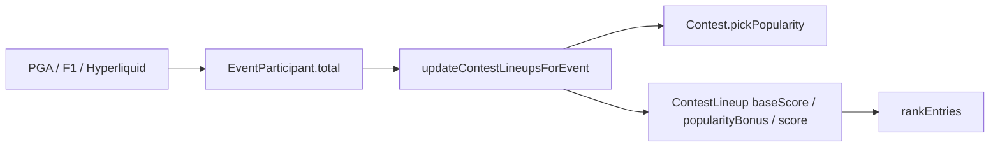
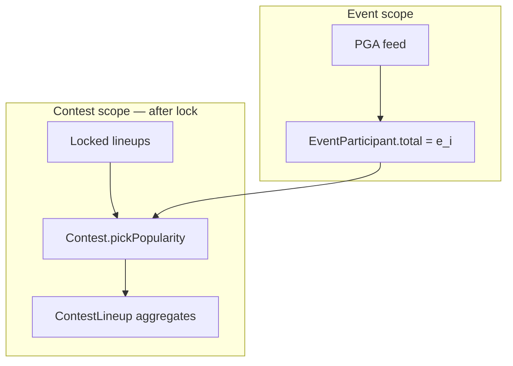

# Popularity scoring

How contest pick rates modulate per-pick scores after lineups lock. **Popularity adjustment** is a scoring primitive — configured on `ScoringRules`, applied by the platform during lineup aggregation with contest context. It does **not** affect lineup building or the candidate picker.

**Status:** Implemented. All sports seed `popularity.weight: 0` (no adjustment until weight is raised).

---

## Pipeline



| Layer | Behavior |
|-------|----------|
| Lineup score | Sum of pick totals; after lock, optional popularity bonus when `weight ≠ 0` |
| `ScoringRules` | `{ aggregation, direction, popularity? }` |
| Popularity | Platform applies in [`updateContestLineups.ts`](../../server/src/services/updateContestLineups.ts) using `@cut/sport-sdk` helpers. Sports still return raw `EventParticipant.total` sums via `aggregateLineupScore`. |

---

## When popularity applies

Popularity is **scoring-only**. It runs after the contest locks — not while users are building lineups.

| Phase | Contest status | Popularity |
|-------|----------------|------------|
| Entry open | `OPEN` | Off — users pick from the field with no ownership or popularity signal |
| Locked / live | `ACTIVE` and later | On — pick rates computed from locked lineups; cron adjusts scores when `weight ≠ 0` |

Pick rates `o(i)` are an internal input to the scoring formula. They are **not** shown in the candidate picker or field list during entry.

---

## The primitive

**Popularity adjustment** rewards or penalizes each pick based on how often that participant appears among **locked** lineups in the same contest.

| Term | Definition |
|------|------------|
| **Pick rate** `o(i)` | Fraction of locked contest lineups that include participant *i* |
| **Popularity weight** | Dial on `ScoringRules.popularity`; `0` = disabled, non-zero = apply per-pick adjustment |

### Where it lives

Popularity adjustment belongs in the basic sport scoring contract — same layer as `aggregation` and `direction`:

```
Sport.scoringRules.popularity   → default for all events of that sport
Event.metadata.popularity       → optional override (not wired yet)
Contest settings                → optional override (not wired yet)
```

A sport that does not use popularity adjustment sets `weight: 0` (or omits the field). A sport that scores entirely from contest pick behavior implements that inside its own `aggregateLineupScore` and also leaves `weight: 0` — the crowd signal is already in the pick scores; a second popularity pass would double-count.

### Sport package contract

```typescript
type PopularityMode = "multiplicative" | "additive";

interface PopularityRules {
  /** 0 = off. Positive rewards low-owned picks; negative rewards high-owned picks. */
  weight: number;
  /** Amplitude scaler. Default: 1. */
  strength: number;
  /** Max raw bonus weight before bonus-shift floor. Default: 2. */
  cap: number;
  /** How bonus applies to positive pick scores. Default: "multiplicative". */
  mode: PopularityMode;
  /** Min contest entries before pick rates are computed. Default: 5. */
  minEntryFloor: number;
}

interface ScoringRules {
  aggregation: ScoringAggregation;
  direction: ScoringDirection;
  popularity?: PopularityRules;
}
```

`SportModule.aggregateLineupScore` remains a raw sum of pick totals. The platform orchestrator loads per-pick `e_i`, applies shared popularity math from `@cut/sport-sdk` (`computePickRates`, `adjustPickScore`, `buildPickPopularityMap`, `sumLineupScores`), and writes contest/lineup fields.

Adjustment is always **per-pick** — each pick is adjusted individually, then summed. No roster-level bonus scope.

### Default config per sport

All sports ship with weight **0** until deliberately enabled. Defaults for the other dials when present:

| Sport | `weight` | `strength` | `cap` | `mode` | `minEntryFloor` |
|-------|----------|------------|-------|--------|-----------------|
| **PGA golf** | `0` | `1` | `2` | `multiplicative` | `5` |
| **F1** | `0` | `1` | `2` | `multiplicative` | `5` |
| **Commodities** | `0` | `1` | `2` | `multiplicative` | `5` |

Raise `weight` (e.g. PGA → `0.5`) via `Sport.scoringRules` seed/DB to enable the primitive for that sport.

Omit `popularity` or set `weight: 0` for sports that do not use the primitive.

---

## Pick rates

Computed **per contest** from **locked** lineups at contest activation (and stable thereafter):

```
o(i) = lineups_with_pick_i / total_lineups
```

Returns no adjustment when `total_lineups < minEntryFloor` (default **5**).

### Live scoring

When the contest activates, lineups lock and pick rates are computed once from the contest field. During play, the cron pipeline recomputes lineup scores on the regular schedule (every 5 minutes) — external pick totals (`e_i`) update each pass; `o(i)` stays fixed from the locked field.

---

## Design invariant: bonus-only

When popularity adjustment is active, it is always a **bonus on top of full pick performance**, never a tax that reduces raw totals.

**Why:** Player optics — chalk users keep every point their pick earned; contrarian users see an explicit bonus. No one watches a 22 become an 11.

### Per-pick adjustment

For each pick *i* with positive external total `e_i` and `weight ≠ 0`:

```
signal_i  = 1 - 2×o_i
raw_w_i   = clamp(weight × strength × signal_i, -cap, +cap)
w_floor   = clamp(weight × strength × (-sign(weight)), -cap, +cap)
bonus_i   = raw_w_i - w_floor          -- always ≥ 0

adjusted_i = e_i                                           when e_i ≤ 0 or weight = 0
           = e_i × (1 + bonus_i)                            when mode = "multiplicative"
           = e_i + bonus_i                                  when mode = "additive"

finalScore = Σ adjusted_i
```

`bonus_i` is always ≥ 0. The worst case on the dial (100% owned when weight > 0, or 0% owned when weight < 0) gets exactly zero bonus. Negative pick totals pass through unchanged.

**Display (post-lock only):** show `baseScore` + `popularityBonus` on leaderboard and lineup views. Never show negative adjustments to players.

---

## Sport examples

| Sport | Pick scores (`e_i`) from | `popularity.weight` | Notes |
|-------|--------------------------|---------------------|-------|
| **PGA golf** | Stableford via external feed | `0` (raise to enable) | Bonus for contrarian picks on top of Stableford when weight > 0 |
| **F1** | OpenF1 points | `0` | Pure external sum |
| **Commodities** | Market returns | `0` | Pure external sum |
| **Predict-the-consensus** | Pick-frequency points at lock | `0` | Crowd signal is already `e_i`; see [shape-ideas.md](../competitions/shape-ideas.md) |

---

## Score decomposition

When popularity adjustment is active (contest locked), lineup scoring exposes:

| Field | Meaning |
|-------|---------|
| `baseScore` | Sum of unadjusted pick totals |
| `popularityBonus` | `finalScore - baseScore` (popularity bonus aggregate) |
| `finalScore` | Ranked total |

Per-pick `bonus` and `adjustedScore` are available post-lock via `Contest.pickPopularity` — not during picking.

### Storage

`EventParticipant.total` holds the external pick score `e_i` (event-scoped). Contest-scoped popularity and lineup aggregates:

Per-pick popularity is **contest-scoped**, not event-scoped — stored on `Contest.pickPopularity`, not `EventParticipant`.

| Layer | Model | Stores |
|-------|-------|--------|
| **External pick score** | `EventParticipant` | `total` (`e_i`) — unchanged |
| **Player popularity** | `Contest.pickPopularity` | Per-player `pickRate`, `bonus`, `adjustedScore` for this contest |
| **Lineup rollup** | `ContestLineup` | `baseScore`, `popularityBonus`, `score` only |



#### `EventParticipant` (unchanged)

`total` only. No popularity fields.

#### `Contest` — player popularity cache

Written when the contest locks for scoring. One JSON map per contest — no join table.

| Field | Type | Purpose |
|-------|------|---------|
| `pickPopularity` | `Json?` | Per-player popularity — see shape below |
| `pickPopularityLockedAt` | `DateTime?` | When pick rates were snapshotted from locked lineups |

```prisma
model Contest {
  id                     String    @id @default(cuid())
  eventId                String
  status                 String
  settings               Json?
  pickPopularity         Json?
  pickPopularityLockedAt DateTime?
  // ...
}
```

**`pickPopularity` shape** — keyed by `eventParticipantId`:

```json
{
  "clxyz_ep_scottie": {
    "pickRate": 0.42,
    "bonus": 3,
    "adjustedScore": 25
  }
}
```

| Key | Meaning |
|-----|---------|
| `pickRate` | `o(i)` — fraction of locked contest lineups with this pick; stable after lock |
| `bonus` | Popularity bonus for this pick at write time |
| `adjustedScore` | Scored value for this pick in this contest |

Include entries for players that appear in at least one locked lineup. When `popularity.weight = 0`, omit `pickPopularity` or set every `bonus` to `0` and `adjustedScore` to `e_i`.

#### `ContestLineup` — aggregates only

| Field | Type | Purpose |
|-------|------|---------|
| `score` | `Int?` | `finalScore` — rank, settle, timeline |
| `baseScore` | `Int?` | `Σ EventParticipant.total` for this lineup's picks |
| `popularityBonus` | `Int?` | `score - baseScore` |

No per-lineup breakdown JSON. Lineup totals are the sum of each pick's `pickPopularity[id].adjustedScore` (and `baseScore` from `EventParticipant.total`).

When `popularity.weight = 0`: omit `pickPopularity`; `ContestLineup.baseScore = score`, `popularityBonus = 0`.

#### UI reads (post-lock only)

| Surface | Join path |
|---------|-----------|
| **Lineup card slots** | `LineupPick` → `Contest.pickPopularity[eventParticipantId]` for `bonus`, `adjustedScore`; `EventParticipant.total` for base |
| **Leaderboard** | `ContestLineup` for `baseScore` + `popularityBonus` + `score` |

#### Implementation note: tournament vs contest display

Popularity is a **contest scoring** layer. Tournament views stay on raw `EventParticipant.total`; contest views show the adjustment after lock.

| Surface | Popularity | What to show |
|---------|------------|--------------|
| **Player detail** (`SportParticipantDetailModal`, sport `ParticipantDetail`) | No | Unadjusted tournament performance — Stableford/points, scorecard, leaderboard position. Same data as today. |
| **Field leaderboard** (`EventLeaderboardPanel`) | No | Event field order and raw totals — not contest-adjusted. |
| **Candidate picker** (`CandidatePicker`, `CandidateRow`) | No | Raw field data during entry; no ownership or bonus. |
| **Lineup card slots** (`LineupContestCard` → `SportLineupPickRow`) | Yes, post-lock | Base (`EventParticipant.total`) + popularity bonus from `Contest.pickPopularity[id]`; or adjusted total. |
| **Contest leaderboard** | Yes, post-lock | `ContestLineup.baseScore`, `popularityBonus`, `score`. |

While contest is `OPEN`, lineup card slots show raw `EventParticipant.total` only — same as picking phase.

Use a **lineup-slot row variant** for adjusted display on the contest card. Do not add popularity to shared `ParticipantRow` used by the field list and picker — those surfaces remain event-scoped.

Player detail answers “how is this golfer doing in the tournament?” Lineup card answers “how is this pick scoring in my contest entry?”

#### Cron write (`updateContestLineupsForEvent`)

Per contest:

1. If contest not yet locked for scoring (`OPEN`), score lineups as raw `Σ EventParticipant.total` only.
2. On lock: compute `o(i)` from locked lineups → write `Contest.pickPopularity` and `pickPopularityLockedAt`.
3. Each cron pass: refresh `bonus` and `adjustedScore` in `pickPopularity` as `e_i` updates; `pickRate` unchanged.
4. For each `ContestLineup`: sum pick values → write `baseScore`, `score`, `popularityBonus`.

**Timeline** (`ContestLineupTimeline`): `score` only. Per-pick detail on `Contest.pickPopularity`; lineup decomposition on `ContestLineup`.

Ranking and tie-breaking are unchanged — see [lineup-tie-breaker.md](lineup-tie-breaker.md).

---

## Related docs

- [architecture.md](architecture.md) — platform scoring pipeline
- [lineup-tie-breaker.md](lineup-tie-breaker.md) — prediction tie-break and ranking
- [shape-ideas.md](../competitions/shape-ideas.md) — predict-the-consensus
- [fit-guide.md](../competitions/fit-guide.md) — competition format evaluation
