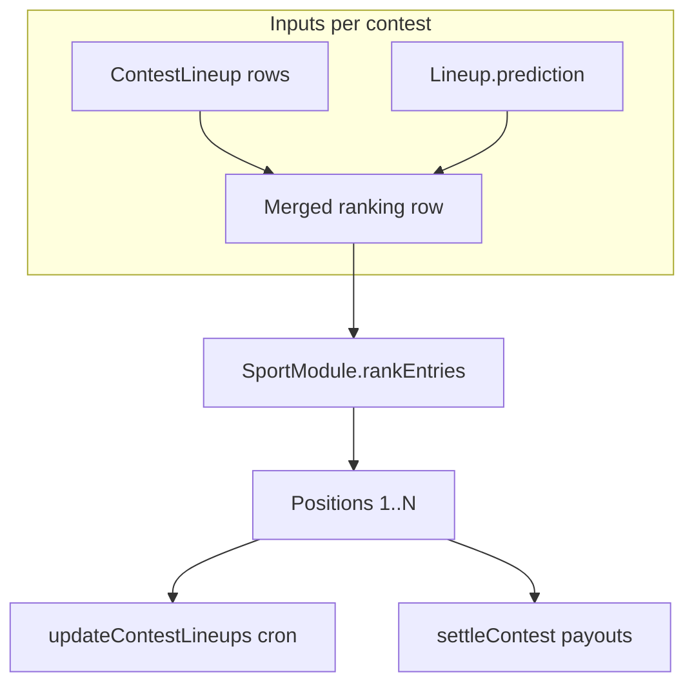
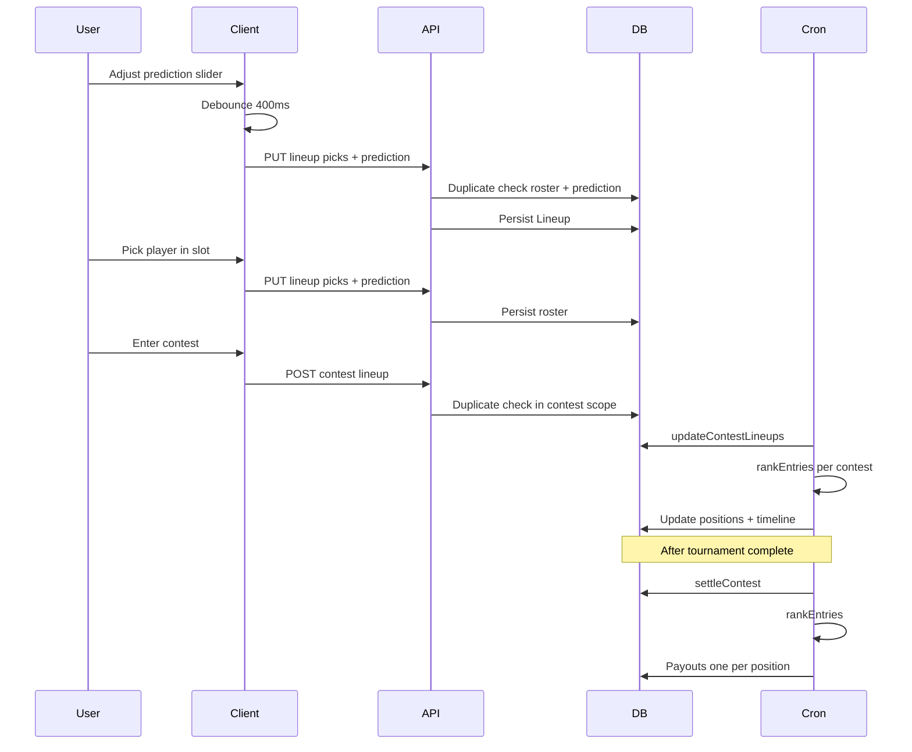

# Lineup tie-breaker — Play The Cut

Product and engineering spec for **lineup total prediction**: how users set it, how duplicates work, and how contests rank lineups and pay winners when fantasy scores tie.

Related references: [server API — lineups](../../spec/server/api.md), [data models — Lineup](../../spec/server/data-models.md), user-facing copy on the FAQ (“How are ties handled?”).

---

## Purpose

Fantasy contests rank lineups by **Stableford total** (sum of the four golfers on the roster). When two or more entries finish with the same fantasy score, the product needs a deterministic way to assign **unique positions** (1, 2, 3, …) and **one payout per position**—no shared ranks and no pooled tie splits.

Each **lineup** carries a **winning lineup total prediction**: the user’s guess at the **highest lineup score that will win that contest** (sum of roster participants’ event totals). For golf that is Stableford points; for F1 it is championship points. That number is **not** the PGA Tour leader’s stroke total or course par.

The prediction serves two roles:

1. **Uniqueness** — Two lineups with the same four players can coexist if their predictions differ.
2. **Tie-breaking** — When fantasy scores tie, the entry whose prediction is closest to the contest’s actual winning score ranks higher; if still tied, earlier contest entry time wins.

---

## Concepts

| Term | Meaning |
| --- | --- |
| **Lineup** | User’s roster for an event (`Lineup`), up to four picks keyed by `eventParticipantId`. |
| **Contest lineup** | That roster entered into a specific contest (`ContestLineup`); has score, position, `createdAt`. |
| **Fantasy score** | Sum of roster participants’ event totals (`ContestLineup.score`). |
| **Winning lineup total prediction** | Integer in `Lineup.prediction` (`{ type: "winningLineupTotal", value }`); user’s guess of the winning lineup total in a contest. Valid range comes from `Sport.predictionRules`. |
| **Contest winning score** | `max(ContestLineup.score)` across all entries in that contest at ranking time. |
| **Prediction distance** | `abs(prediction value − contestWinningScore)`; lower is better. |

---

## Data model

| Field | Model | Type | Notes |
| --- | --- | --- | --- |
| `prediction` | `Lineup` | `Json?` | `{ type: "winningLineupTotal", value: number }`. Range from `Sport.predictionRules` (golf: 1–250; F1: 1–120). Stored on the lineup, not per contest entry. |
| `predictionRules` | `Sport` | `Json` | `{ min, max, defaultRandomMin, defaultRandomMax }` — per-sport slider range and server random defaults. |
| `eventParticipantId` | `LineupPick` | `String` | Pick identity for roster slots. |
| `score` | `ContestLineup` | `Int` | Live and final fantasy total. |
| `position` | `ContestLineup` | `Int` | Unique rank within the contest (1 = best). |
| `createdAt` | `ContestLineup` | `DateTime` | When the lineup was entered into the contest; final tie-break key. |

**Defaults**

| Event | Prediction value |
| --- | --- |
| New lineup via API without body field | Random integer in sport `defaultRandomMin`–`defaultRandomMax` (`randomLineupPrediction(rules)`). |
| Client before server value loads | Deterministic placeholder from lineup id (`defaultLineupPredictionForLineupId`) so the slider does not flicker. |

---

## Duplicate lineups

A lineup is a duplicate only when **both** the normalized participant set **and** prediction value match another lineup for the same user in the same scope.

Participant sets are compared after sorting underlying `participantId` values derived from picks (`normalizePlayerSet`).

| Condition | Result |
| --- | --- |
| Same participants, same prediction | **Reject** |
| Same participants, different prediction | **Allow** |
| Empty roster (`picks.length === 0`) | Never treated as duplicate |

**Scopes**

| Check | When | Error message (representative) |
| --- | --- | --- |
| Contest (when `contestId` set) | `POST` / `PUT` `/api/lineups/...` | “You already have a lineup with these players and winning lineup total prediction for this contest” |
| Contest | `POST` `/api/contests/:id/lineups` | Same roster + prediction check in contest scope |

The client runs the same roster + prediction check before save (slot editor and prediction field) so users see errors without a round trip when possible; the server is authoritative.

---

## User interface

**Surface:** `LineupContestCard` → **Players** tab, bottom of the panel when the user can edit slots (`canEditSlots`: editable event + lineup id present).

**Control:** `SportPredictionField` → sport plugin `PredictionField` (golf: `LineupWinningScoreSlider`; F1: custom range slider)

- Label: sport-specific (e.g. “Predicted winning lineup score” for golf)
- Range from `Sport.predictionRules` via `useSportPredictionRules`

**Save behavior**

| Action | Request |
| --- | --- |
| Change slider | Debounced **~400 ms** → `PUT /api/lineups/:lineupId` with current `picks` + `prediction` |
| Add/swap/remove player | Immediate save via slot editor with current `prediction` |

Slider and roster saves share the same API shape so prediction and picks stay in sync. Inline error under the slider on duplicate or API failure.

**Slot editor:** `CandidatePicker` opens from `SportLineupPickRow` edit buttons; `useLineupSlotEditor` saves `eventParticipantId[]` directly.

---

## API contract

Base path: `/api/lineups` (auth required; event must be editable for writes).

### `POST /api/lineups/:eventId`

| Field | Required | Notes |
| --- | --- | --- |
| `picks` | Yes | 0–4 `eventParticipantId` values |
| `name` | No | Default `"My Lineup"` |
| `prediction` | No | `{ type: "winningLineupTotal", value }` within sport `predictionRules` range; if omitted, server assigns random default |

### `PUT /api/lineups/:lineupId`

| Field | Required | Notes |
| --- | --- | --- |
| `picks` | Yes | Full roster replacement (0–4 `eventParticipantId` values) |
| `name` | No | |
| `prediction` | No | Updates prediction when provided; otherwise keeps existing |

### `GET` (list and detail)

Response lineups include `prediction` (object or `null`).

Example body:

```json
{
  "picks": ["cuid1", "cuid2", "cuid3", "cuid4"],
  "name": "Lineup #1",
  "prediction": { "type": "winningLineupTotal", "value": 142 }
}
```

Contest entry (`POST /api/contests/:id/lineups`) does not accept prediction in the body; it uses the value already on the `Lineup` when checking duplicates.

---

## Ranking and payouts

Every contest ranks **all** `ContestLineup` rows with one strict sort. There is no tied-group logic and no splitting prize pools across equal fantasy scores.

Ranking is implemented by the sport plugin’s `SportModule.rankEntries`. Golf uses `rankGolfEntries` in `packages/sport-pga-golf/src/ranking.ts`.

### Sort cascade

For a given contest, compute `contestWinningScore = max(score)` over entries, then sort descending priority:

1. **Fantasy score** — higher `ContestLineup.score` wins.
2. **Prediction distance** — lower `abs(prediction value − contestWinningScore)` wins.
3. **Contest entry time** — earlier `ContestLineup.createdAt` wins.

Assign positions **1 … N** in sort order (no gaps, no shared position numbers).



### Missing prediction

If prediction is null or unparseable at rank time, distance is treated as **infinity** (worst). Entries with a set prediction always beat null predictions on distance. If both lack a prediction, step 3 (entry time) still separates them.

### Payout structure (settlement)

After sorting, `settleContest` maps position to basis points **without** pooling tied scores:

| Contest size | Position 1 | Position 2 | Position 3 |
| --- | --- | --- | --- |
| Fewer than 10 entries | 100% | — | — |
| 10 or more entries | 70% | 20% | 10% |

Each position receives at most one winner; remainder dust rules apply to the first paid slot so total basis points sum to 10,000.

### Live leaderboard

`updateContestLineupsForEvent` (cron pipeline, every 5 minutes when the sport reports live scoring) recalculates scores from participant totals, then calls `requireSportModule(sportId).rankEntries` and writes unique `position` values per contest. Timeline snapshots record score and position after each run.

---

## End-to-end flows



---

## Implementation map

| Concern | Location |
| --- | --- |
| Schema | `server/prisma/schema.prisma` — `Lineup.prediction`, `Sport.predictionRules`, `LineupPick.eventParticipantId` |
| Parse / serialize / validation | `packages/sport-sdk/src/lineupPrediction.ts` |
| Sport-aware server helpers | `server/src/utils/sportPrediction.ts` |
| Duplicate message | `server/src/utils/lineupPrediction.ts` |
| Duplicate checks | `server/src/utils/lineupValidation.ts` |
| Golf ranking cascade | `packages/sport-pga-golf/src/ranking.ts` (`rankGolfEntries`) |
| Registry | `server/src/sports/registry.ts` (`requireSportModule`) |
| Lineup HTTP | `server/src/routes/lineups.ts` |
| Contest entry HTTP | `server/src/routes/contest.ts` |
| Live positions | `server/src/services/updateContestLineups.ts` |
| Settlement | `server/src/services/contest/settleContest.ts` |
| Prediction UI | `client/src/components/platform/SportPredictionField.tsx` → sport `PredictionField` |
| Prediction rules hook | `client/src/hooks/useSportPredictionRules.ts` |
| Client helpers | `client/src/lib/sportPrediction.ts` |
| Duplicate message | `client/src/utils/lineupPrediction.ts` |

---

## Tests

Server unit tests (Vitest):

| File | Covers |
| --- | --- |
| `server/src/utils/lineupValidation.test.ts` | Roster normalization; duplicate = same participants + same prediction |
| `server/src/services/contest/settleContest.payouts.test.ts` | `rankEntries` ordering; one payout slot per position; no tie splits |

```bash
cd server && pnpm test:run \
  src/utils/lineupValidation.test.ts \
  src/services/contest/settleContest.payouts.test.ts
```

---

## Decisions

| Decision | Rationale |
| --- | --- |
| Prediction lives on `Lineup`, not `ContestLineup` | One slider per lineup row; each contest-scoped lineup carries its own guess. |
| Duplicates include prediction | Allows intentional “same players, different contest entries” only when the user changes the tie-break guess. |
| Unique positions everywhere | Simplifies leaderboard display and on-chain settlement; users always see a single rank. |
| Contest winning score = max entry score | Tie-break measures closeness to “what it took to win this contest,” not a fixed cap or par. |
| Entry time is contest `createdAt` | Rewards earlier commitment when score and prediction distance still tie. |
| Ranking in sport plugin | Each sport can define its own tie-break keys; platform calls `rankEntries` for live positions and settlement. |

---

## Open decisions

None at this time.
