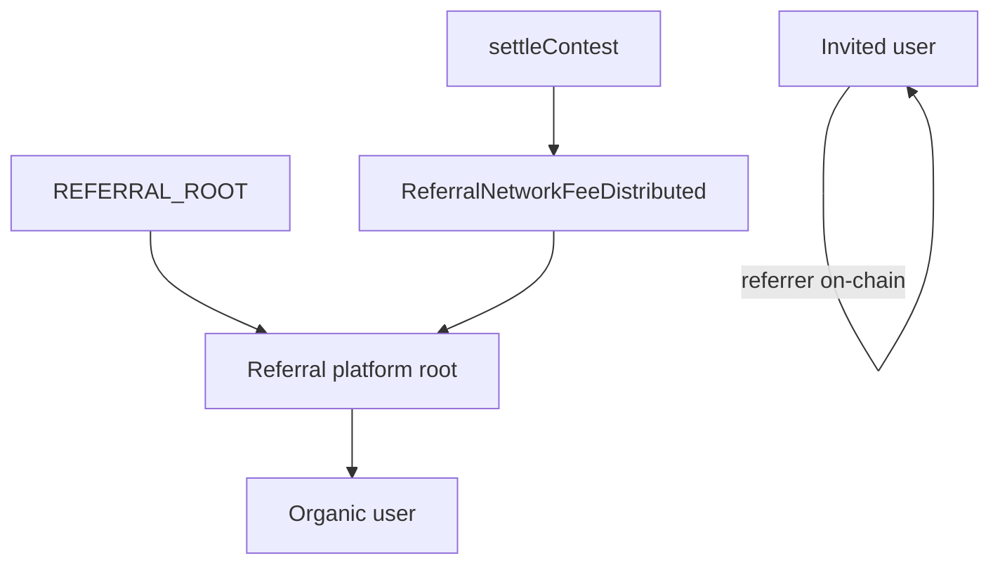

# Referral network (on-chain)

Contest **referral network fees** (typically 5% of gross TVL at settlement, `referralNetworkBps = 500`) are deducted once during `settleContest`. `ContestController` resolves the winning entry owner's referrer chain via `ReferralGraph` + `RewardCalculator` and transfers the fee from contest balance, or restores unallocated fee proportionally to the primary and secondary prize pools when no payable referrer exists.

Contract design: [`contracts/lib/contestCatalyst/docs/ReferralNetworkIntegration.md`](../../contracts/lib/contestCatalyst/docs/ReferralNetworkIntegration.md). Cron: [`spec/server/cron.md`](../../spec/server/cron.md).

---

## Tree policy

The **cold referral platform root** (`referralPlatformRootAddress` in chain JSON) registers once under `REFERRAL_ROOT` (`0x0000000000000000000000000000000000000001`). It is **not** a contest role. The hot **operator** (`OPERATOR_PK`) signs `register` / `batchRegister` and acts as ContestFactory `operator`, but is **not** a graph ancestor.

**Invariant:** platform root ≠ operator. Settlement referral-network fees credit the platform root when it is on the payout chain. The operator key lives on web and cron; those funds must not land on that hot wallet. Forge deploys (`ReferralDeployGuard`) revert if `REFERRAL_PLATFORM_ROOT_ADDRESS` is missing, zero, or equal to the operator, then register the root on-chain and write it to client/server JSON.

| User | DB `referrerAddress` | On-chain parent |
|------|----------------------|-----------------|
| Referral platform root | `null` | `REFERRAL_ROOT` |
| Organic (no invite) | `null` | Platform root address |
| Invited | Inviter wallet | Inviter (must already be on-chain) |

**Signup vs graph:** Postgres stores the invite at `POST /auth/session` even when the inviter is not yet `isRegistered` on ReferralGraph. Cron registers the invitee only after the parent is on-chain. A missing or unresolved `ref` does not block account creation.

**Settlement:** `getReferrer(winner, groupId)` must be non-zero and not `REFERRAL_ROOT` for a payable chain. The server blocks settle if the winner is not `isRegistered` when `referralNetworkBps > 0`. The contest calls `getPayoutChain(payoutAnchor, groupId, 10)` and `RewardCalculator.calculateRewards`, then transfers each share (geometric split; the winner is never a fee recipient). The platform root is always an ancestor for organics in this model.

**Settlement events:**

| Event | Meaning |
|-------|---------|
| `ReferralNetworkFeeDistributed` | Wallet transfer to a referrer in the payout chain (indexed as `OnchainPayment` kind `REFERRAL`) |
| `ReferralNetworkFeeToPrimary` | Unallocated referral fee restored to prize pools — not a wallet payment |
| `UnallocatedBalanceAllocated` | Push-batch dust credited into winner pools — not a referral fee |

`ReferralNetworkFeeToPrimary` is the contract safety net for an unregistered winner / empty chain and must not occur in normal operation.



---

## Fees

```text
referralFee = totalGross * referralNetworkBps / 10_000
netPools    = gross * (1 - referralNetworkBps / 10_000)
```

| Winner tree | Who receives `referralFee` |
|-------------|----------------------------|
| `PlatformRoot → Winner` | Platform root only (~100% via calculator) |
| `PlatformRoot → Alice → Winner` | Alice + platform root (geometric decay) |
| Deeper invite chains | Referrers + platform-root ancestor slice |

Indexing: `OnchainPayment` rows with type `REFERRAL` ([`recordSettlementReferralPayments.ts`](../../server/src/services/contest/recordSettlementReferralPayments.ts)). Results UI: `GET /contests/:id` → `onchainPayments`.

---

## Contest lobby annotation

Signed-in viewers see which **other** contest entries sit in their invite tree. If that lineup is the contest’s **primary winner**, settlement pays the viewer a share of the referral-network fee. Finishing in the money alone does not.

`GET /contests/:id/lobby` may attach a viewer-only field on each `contestLineups[]` item:

```ts
referralStake?: { depth: number }  // 1 = direct invitee, 2–10 = nested
```

Rules:

- Anonymous payloads omit the field.
- Contests with `referralNetworkBps` (or legacy `oracleFeeBps`) of `0` omit the field.
- The viewer’s own entries are never flagged (the winner is not a fee recipient).
- Depth matches `GET /auth/referrals/summary`: `referredByUserId` edges, same `referralChainId` + `referralGroupId`, max 10.
- The flag is computed from the Postgres invite tree (what cron syncs onto `ReferralGraph`). It does not expose a named downline list.

The overlay runs after the slim lobby payload is built. It does not join referral columns onto `contest.findFirst`. Empty downlines skip the ancestor CTE. The 15s lobby cache stores the annotated payload, so cache hits do not re-query.

The client shows a currency-dollar icon on contest standings, the entry detail modal, and the winner-pool odds list. Tooltip copy distinguishes a direct invite from a nested network level.

---

## Contract addresses

Read from `server/src/contracts/{sepolia,base}.json` and `client/src/utils/contracts/{sepolia,base}.json`. ContestFactory holds `referralGraph`, `rewardCalculator`, and `referralGroupId` as immutables; every contest inherits them.

---

## Deploy graph (new environment or redeploy)

Minimal Sepolia redeploy (keeps existing MockUSDC):

```bash
# contracts/.env: DEPLOYER_PK, OPERATOR_PK, BASE_SEPOLIA_RPC_URL, REFERRAL_GROUP_ID,
# PAYMENT_TOKEN_ADDRESS, REFERRAL_GRAPH_ADDRESS, REWARD_CALCULATOR_ADDRESS (factory-only)
pnpm run sepolia:deploy-referral
pnpm run sepolia:deploy-contest-factory
```

Patch `referralGraphAddress`, `rewardCalculatorAddress`, and `contestFactoryAddress` in both `sepolia.json` files (leave `paymentTokenAddress` unchanged). Then `pnpm run deploy:copy-artifacts`.

`ReferralGraph` authorizes the hot OPS address per `REFERRAL_GROUP_ID`. `RewardCalculator` is stateless. Settlement: operator calls `settleContest(winningEntries, payoutBps, secondaryWinner)`.

---

## Bootstrap and steady state

### Environment (`server/.env`)

| Variable | Purpose |
|----------|---------|
| `REFERRAL_GROUP_ID` | `bytes32` — same on graph and factory |
| `OPERATOR_PK` | Signs `register` / `batchRegister` and contest operator txs |
| `OPERATOR_ADDRESS` | Optional; pins the operator address instead of deriving from `OPERATOR_PK` |
| `REFERRAL_SYNC_CHAIN_ID` | Optional; prod `8453`; scripts default `84532` |

Platform root lives in `server/src/contracts/{base,sepolia}.json` as `referralPlatformRootAddress` (written at contract deploy). Web and cron do not take it as env. `REFERRAL_PLATFORM_ROOT_ADDRESS` is required in `contracts/.env` at deploy; optional env fallback for rematerialize scripts only. No platform-root private key is accepted by web or cron.

### After deploy

Canonical rebuild (Sepolia or Base — set `REFERRAL_SYNC_CHAIN_ID` to `84532` or `8453`):

```bash
pnpm --filter server run script:rematerialize-referral-graph --dry-run
pnpm --filter server run script:rematerialize-referral-graph --reset-hashes
```

| Script | Role |
|--------|------|
| `rematerializeReferralGraph.ts` | Phase 0 optional hash reset → platform root → organics → invite waves → parent audit |
| `bootstrapReferralRoot.ts` | Thin helper: `register(referralRoot, REFERRAL_ROOT, groupId)` |
| `registerUsersUnderReferralRoot.ts` | Organics only (`referredByUserId` and `referrerAddress` null) |
| `batchSyncReferralGraph.ts` | Ongoing cron: pending `referralOnchainTxHash: null`; fails on parent mismatch |

Setup services expose `referralRoot` (the platform-root address).

**Do not** register invited users under the referral root as “missing parents.” ReferralGraph cannot re-parent.

---

## Relevant files

| Concern | Path |
|---------|------|
| Referral config | `server/src/lib/referralConfig.ts` |
| Lobby referral-stake overlay | `server/src/services/referral/referralStakeForViewer.ts` |
| Platform root env (deploy only) | `contracts/env.example` / forge `ReferralDeployGuard` |
| Graph setup / rematerialize | `server/src/services/referral/` |
| Settlement indexing | `server/src/services/contest/recordSettlementReferralPayments.ts` |

### Checklist

- [ ] `REFERRAL_PLATFORM_ROOT_ADDRESS` set at contract deploy (≠ operator) and registered under `REFERRAL_ROOT`
- [ ] `referralPlatformRootAddress` present in client/server chain JSON
- [ ] `REFERRAL_GROUP_ID` matches factory + graph
- [ ] OPS authorized as ReferralGraph oracle for the group
- [ ] Organics rematerialized under platform root
