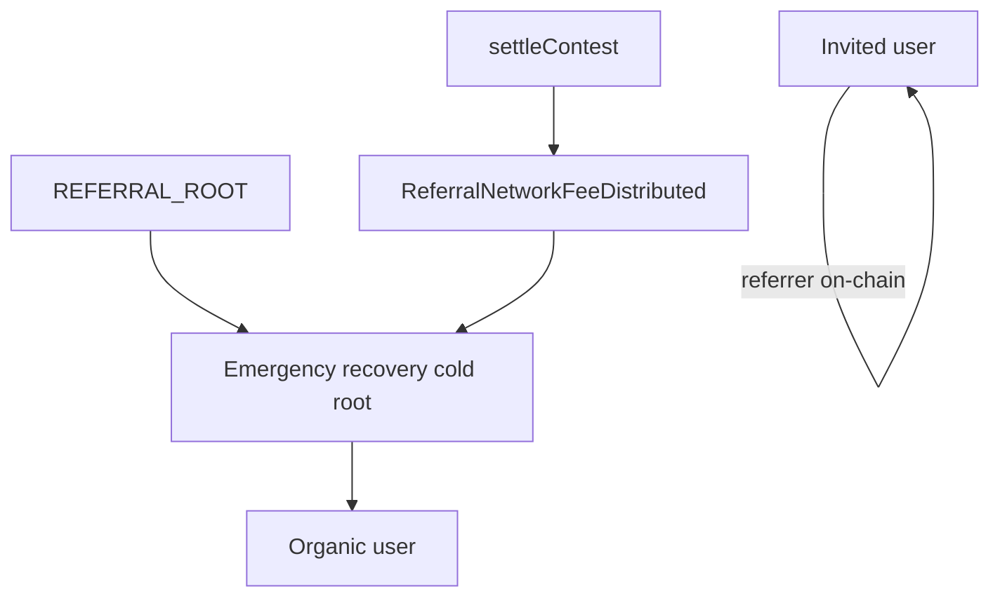

# Referral network (on-chain)

Contest **referral network fees** (typically 5% of gross TVL at settlement, `referralNetworkBps = 500`) are deducted once during `settleContest`. `ContestController` resolves the winning entry owner's referrer chain via `ReferralGraph` + `RewardCalculator` and transfers the fee from contest balance, or returns unallocated fee to the primary prize pool when no payable referrer exists.

Contract design: [`contracts/lib/contestCatalyst/ReferralNetworkIntegration.md`](../../contracts/lib/contestCatalyst/ReferralNetworkIntegration.md). Cron job 7: [`spec/server/cron.md`](../../spec/server/cron.md).

---

## Tree policy

The **cold emergency-recovery address** (`EMERGENCY_RECOVERY_ADDRESS` / `VITE_EMERGENCY_RECOVERY_ADDRESS`) registers once under `REFERRAL_ROOT` (`0x0000000000000000000000000000000000000001`). The hot **OPS_ORACLE** signs `register` / `batchRegister` but is **not** a graph ancestor. Every user with a wallet on the contest chain is on the graph:

| User | DB `referrerAddress` | On-chain parent |
|------|----------------------|-----------------|
| Emergency recovery (referral root) | `null` | `REFERRAL_ROOT` |
| Organic (no invite) | `null` | Emergency recovery address |
| Invited | Inviter wallet | Inviter (must already be on-chain) |

**Settlement:** `getReferrer(winner, groupId)` must be non-zero and not `REFERRAL_ROOT` for a payable chain. The server blocks settle if the winner is not `isRegistered` when `referralNetworkBps > 0`. The contest calls `getPayoutChain(payoutAnchor, groupId, 10)` and `RewardCalculator.calculateRewards`, then transfers each share (geometric split; the winner is never a fee recipient). The emergency-recovery root is always an ancestor for organics in this model.

**Settlement events:**

| Event | Meaning |
|-------|---------|
| `ReferralNetworkFeeDistributed` | Wallet transfer to a referrer in the payout chain (indexed as `OnchainPayment` kind `REFERRAL`) |
| `ReferralNetworkFeeToPrimary` | Unallocated referral fee returned to the primary prize pool — not a wallet payment |
| `UnallocatedBalanceCleared` | Residual dust to the hot oracle after push batches — accounting cleanup, not a referral fee |

`ReferralNetworkFeeToPrimary` is the contract safety net for an unregistered winner / empty chain and must not occur in normal operation.



---

## Fees

```text
referralFee = totalGross * referralNetworkBps / 10_000
netPools    = gross * (1 - referralNetworkBps / 10_000)
```

| Winner tree | Who receives `referralFee` |
|-------------|----------------------------|
| `Recovery → Winner` | Emergency recovery only (~100% via calculator) |
| `Recovery → Alice → Winner` | Alice + emergency recovery (geometric decay) |
| Deeper invite chains | Referrers + emergency-recovery ancestor slice |

Indexing: `OnchainPayment` rows with type `REFERRAL` ([`recordSettlementReferralPayments.ts`](../../server/src/services/contest/recordSettlementReferralPayments.ts)). Results UI: `GET /contests/:id` → `onchainPayments`.

---

## Contract addresses

Read from `server/src/contracts/{sepolia,base}.json` and `client/src/utils/contracts/{sepolia,base}.json`. Contests store `referralGraph`, `rewardCalculator`, `referralGroupId`, and `emergencyRecovery` at `createContest` (immutable for that controller).

---

## Deploy graph (new environment or redeploy)

Minimal Sepolia redeploy (keeps existing MockUSDC):

```bash
# contracts/.env: DEPLOYER_PK, OPS_ORACLE_PK, BASE_SEPOLIA_RPC_URL, REFERRAL_GROUP_ID
pnpm run sepolia:deploy-referral
pnpm run sepolia:deploy-contest-factory
```

Patch `referralGraphAddress`, `rewardCalculatorAddress`, and `contestFactoryAddress` in both `sepolia.json` files (leave `paymentTokenAddress` unchanged). Then `pnpm run deploy:copy-artifacts`.

`ReferralGraph` authorizes the hot oracle per `REFERRAL_GROUP_ID`. `RewardCalculator` is stateless (no constructor args). Settlement does not sign fees — the contest oracle alone may call `settleContest(winningEntries, payoutBps)`.

---

## Bootstrap and steady state

### Environment (`server/.env`)

| Variable | Purpose |
|----------|---------|
| `REFERRAL_GROUP_ID` | `bytes32` — same on graph and contests |
| `EMERGENCY_RECOVERY_ADDRESS` | Cold address-only referral root under `REFERRAL_ROOT`; receives its referral share; calls `emergencyRecoverFunds()` after expiry |
| `OPS_ORACLE_PK` | Signs `register` / `batchRegister` and contest lifecycle txs |
| `OPS_ORACLE_ADDRESS` | Optional; pins the OPS_ORACLE address instead of deriving from `OPS_ORACLE_PK` |
| `REFERRAL_SYNC_CHAIN_ID` | Optional; scripts default `84532` |

Client: `VITE_EMERGENCY_RECOVERY_ADDRESS` must match server `EMERGENCY_RECOVERY_ADDRESS`. No recovery private key is accepted by web or cron.

### After deploy

Canonical rebuild (Sepolia or Base — set `REFERRAL_SYNC_CHAIN_ID` to `84532` or `8453`):

```bash
pnpm --filter server run script:rematerialize-referral-graph --dry-run
pnpm --filter server run script:rematerialize-referral-graph --reset-hashes
```

| Script | Role |
|--------|------|
| `rematerializeReferralGraph.ts` | Phase 0 optional hash reset → referral root → organics → invite waves (inviter primary wallet) → parent audit |
| `bootstrapReferralRoot.ts` | Thin helper: `register(referralRoot, REFERRAL_ROOT, groupId)` |
| `registerUsersUnderReferralRoot.ts` | Organics only (`referredByUserId` and `referrerAddress` null) |
| `batchSyncReferralGraph.ts` | Ongoing cron: pending `referralOnchainTxHash: null`; fails on parent mismatch |

Setup services expose `referralRoot` (the emergency-recovery address), not an oracle root.

**Do not** register invited users under the referral root as “missing parents.” ReferralGraph cannot re-parent.

**Multi-wallet users:** Parent resolution uses the inviter’s `isPrimary` wallet on the target chain (`pickWalletForChain`). If sync stays deferred, the inviter needs a primary wallet row on that chain.

### Ongoing

| Path | Behavior |
|------|----------|
| Organic signup | `registerOrganicUserOnReferralGraph` in `privyUserProvisioning.ts` |
| Invited signup | DB fields from `?ref=`; cron sync when referrer is on-chain |
| Cron (every 5 min) | Pipeline job 6 — defer until referrer is registered |
| Settlement | `settleContest(winners, payoutBps)`; winner must be on-graph |
| Fresh graph / Base cutover | `script:rematerialize-referral-graph --reset-hashes` |

---

## Cutover runbook (emergency recovery as referral root)

ReferralGraph cannot re-parent existing wallets. Moving the tree root off the hot oracle requires a full rebuild:

1. Choose a fresh `REFERRAL_GROUP_ID` (and redeploy `ReferralGraph` if the current deployment cannot authorize a clean cutover for that group).
2. Update server, client, swarm, and contracts env to the new group id and `EMERGENCY_RECOVERY_ADDRESS`.
3. Bootstrap the cold emergency-recovery address under `REFERRAL_ROOT`:

   ```bash
   pnpm --filter server run script:bootstrap-referral-root
   ```

4. Rematerialize all users from DB invite edges onto the new graph:

   ```bash
   pnpm --filter server run script:rematerialize-referral-graph --dry-run
   pnpm --filter server run script:rematerialize-referral-graph --reset-hashes
   ```

   Organics descend from emergency recovery; invited users descend from their inviter wallets.

5. Clear or rewrite stale `referralOnchainTxHash` / `referralGroupId` / `referralChainId` markers as needed so cron sync does not treat old-group registrations as complete.
6. **Settle-guard:** confirm every wallet that can win is `isRegistered` for the contest `referralGroupId` before settling contests with `referralNetworkBps > 0`. Run `script:rematerialize-referral-graph --dry-run` and confirm parent audit is clean (`deferred: 0`).
7. Old-group contests and graphs are abandoned; legacy contests on old factory/ABI are out of scope for automated recovery.

See also [wallet-roles-cashflows.md](../operations/wallet-roles-cashflows.md).

---

## Key code

| Area | File |
|------|------|
| Config / addresses | `server/src/lib/referralConfig.ts` |
| Emergency recovery env | `server/src/lib/emergencyRecovery.ts` |
| Register / batch | `server/src/services/referral/referralGraph.ts` |
| Bootstrap helpers | `server/src/services/referral/referralGraphSetup.ts` |
| Parent resolver | `server/src/services/referral/resolveReferralParent.ts` |
| Full rematerialize | `server/src/services/referral/rematerializeReferralGraph.ts` |
| Cron sync | `server/src/services/batch/batchSyncReferralGraph.ts` |
| Settlement | `server/src/services/contest/settleContest.ts` |
| Settlement guard | `server/src/services/referral/assertWinnerRegisteredOnGraph.ts` |
| Payment indexing | `server/src/services/contest/recordSettlementReferralPayments.ts` |
| Deploy script | `contracts/script/Deploy_sepolia_referral.s.sol` |

---

## Before first settlement on a new graph

- [ ] `REFERRAL_GROUP_ID` set; hot oracle authorized on graph
- [ ] `EMERGENCY_RECOVERY_ADDRESS` set and bootstrapped under `REFERRAL_ROOT`
- [ ] Bootstrap, register-all, and sync complete (`deferred: 0`)
- [ ] Every wallet that can win is `isRegistered` for the contest `referralGroupId`
- [ ] Test settlement emits `ReferralNetworkFeeDistributed`, not `ReferralNetworkFeeToPrimary`

---

## Risks

| Risk | Mitigation |
|------|------------|
| Winner not on graph | `settleContest` pre-check; register missing wallets |
| `ReferralNetworkFeeToPrimary` | Treat as incident; fix registration |
| Referrer not on-chain before invitee | Cron defer + retry |
| Multiple wallets per user | Register each chain wallet used in invites |
