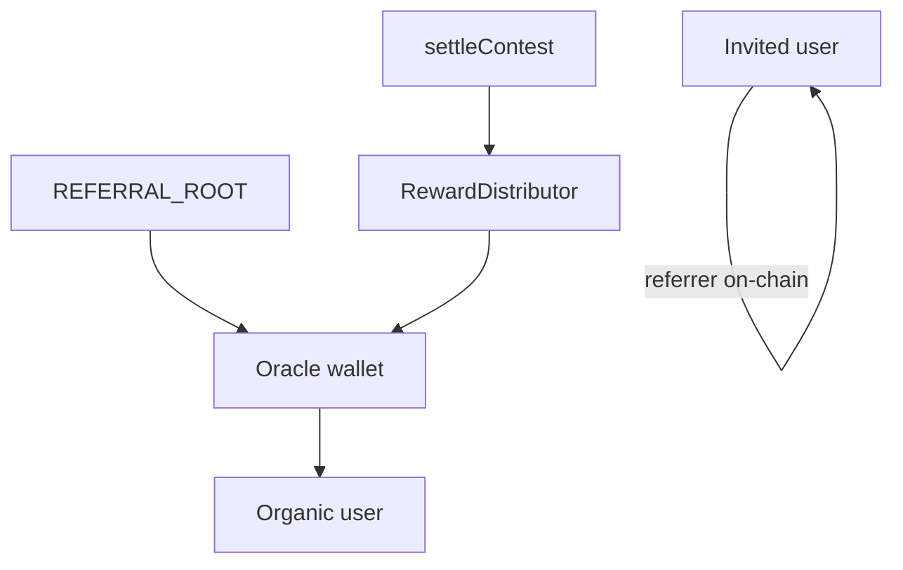

# Referral network (on-chain)

Contest **referral network fees** (typically 5% of gross TVL at settlement, `referralNetworkBps = 500`) flow through a shared `ReferralGraph` and `RewardDistributor` at settlement via `distributeChainRewards`.

Contract design: [`contracts/lib/contestCatalyst/ReferralNetworkIntegration.md`](../contracts/lib/contestCatalyst/ReferralNetworkIntegration.md). Cron job 7: [`spec/server/cron.md`](../spec/server/cron.md).

---

## Tree policy

The **contest oracle wallet** registers once under `REFERRAL_ROOT` (`0x0000000000000000000000000000000000000001`). Every user with a wallet on the contest chain is on the graph:

| User | DB `referrerAddress` | On-chain parent |
|------|----------------------|-----------------|
| Oracle | `null` | `REFERRAL_ROOT` |
| Organic (no invite) | `null` | Oracle wallet |
| Invited | Inviter wallet | Inviter (must already be on-chain) |

**Settlement:** `getReferrer(winner, groupId)` must be non-zero and not `REFERRAL_ROOT`. The server blocks settle if the winner is not `isRegistered` when `referralNetworkBps > 0`. Fees go through `RewardDistributor` (geometric split up to 10 ancestors from `payoutAnchor = getReferrer(winner)`; the winner is never paid). The oracle is always an ancestor in this model.

`ReferralNetworkFeeToOracle` on `ContestController` is a contract safety net for an unregistered winner and must not occur in normal operation.



---

## Fees

```text
referralFee = totalGross * referralNetworkBps / 10_000
netPools    = gross * (1 - referralNetworkBps / 10_000)
```

| Winner tree | Who receives `referralFee` |
|-------------|----------------------------|
| `Oracle → Winner` | Oracle only (~100% via distributor) |
| `Oracle → Alice → Winner` | Alice + oracle (geometric decay) |
| Deeper invite chains | Referrers + oracle ancestor slice |

Indexing: `OnchainPayment` rows with type `REFERRAL` ([`recordSettlementReferralPayments.ts`](../server/src/services/contest/recordSettlementReferralPayments.ts)). Results UI: `GET /contests/:id` → `onchainPayments`.

---

## Contract addresses

Read from `server/src/contracts/{sepolia,base}.json` and `client/src/utils/contracts/{sepolia,base}.json`. Contests store graph and distributor addresses at `createContest` (immutable for that controller).

---

## Deploy graph (new environment or redeploy)

Minimal Sepolia redeploy (keeps existing MockUSDC):

```bash
# contracts/.env: PRIVATE_KEY, BASE_SEPOLIA_RPC_URL, REFERRAL_GROUP_ID, REFERRAL_ORACLE
pnpm run sepolia:deploy-referral
pnpm run sepolia:deploy-contest-factory
```

Patch `referralGraphAddress`, `rewardDistributorAddress`, and `contestFactoryAddress` in both `sepolia.json` files (leave `paymentTokenAddress` unchanged). Then `pnpm run deploy:copy-artifacts`.

Constructors authorize the oracle per `REFERRAL_GROUP_ID` on both `ReferralGraph` and `RewardDistributor`. Settlement signs a 5-field `ChainRewardData` hash (`user`, `totalAmount`, `rewardToken`, `groupId`, `eventId`) — no `timestamp` or `nonce`.

---

## Bootstrap and steady state

### Environment (`server/.env`)

| Variable | Purpose |
|----------|---------|
| `REFERRAL_GROUP_ID` | `bytes32` — same on graph and contests |
| `REFERRAL_ORACLE_ROOT_ADDRESS` | Oracle root wallet (defaults to `ORACLE_ADDRESS`) |
| `REFERRAL_SYNC_CHAIN_ID` | Optional; scripts default `84532` |
| `ORACLE_PRIVATE_KEY` | Signs `register` / `batchRegister` |

### After deploy

```bash
pnpm --filter server run script:bootstrap-referral-oracle-root
pnpm --filter server run script:register-users-under-oracle-root -- --dry-run
pnpm --filter server run script:register-users-under-oracle-root
pnpm --filter server run service:batch-sync-referral-graph   # repeat until deferred: 0
```

| Script | Role |
|--------|------|
| `bootstrapReferralOracleRoot.ts` | `register(oracle, REFERRAL_ROOT, groupId)` |
| `registerUsersUnderOracleRoot.ts` | Organic users + invite chain heads → parent oracle |
| `batchSyncReferralGraph.ts` | Invited users → `batchRegister` under inviter |

**Multi-wallet users:** Invite links may use a different chain wallet than the user’s primary row. If sync stays deferred, register every wallet on that chain used as a referrer (oracle parent if organic, inviter parent when invited).

### Ongoing

| Path | Behavior |
|------|----------|
| Organic signup | `registerOrganicUserOnReferralGraph` in `privyUserProvisioning.ts` |
| Invited signup | DB fields from `?ref=`; cron sync when referrer is on-chain |
| Cron (every 5 min) | Pipeline job 7 — defer until referrer is registered |
| Settlement | `buildSettlementReferralArgs` + `settleContest`; winner must be on-graph |

---

## Key code

| Area | File |
|------|------|
| Config / addresses | `server/src/lib/referralConfig.ts` |
| Register / batch | `server/src/services/referral/referralGraph.ts` |
| Bootstrap helpers | `server/src/services/referral/referralGraphSetup.ts` |
| Cron sync | `server/src/services/batch/batchSyncReferralGraph.ts` |
| Settlement args | `server/src/services/contest/buildSettlementReferralArgs.ts` |
| Settlement guard | `server/src/services/referral/assertWinnerRegisteredOnGraph.ts` |
| Payment indexing | `server/src/services/contest/recordSettlementReferralPayments.ts` |
| Deploy script | `contracts/script/Deploy_sepolia_referral.s.sol` |

---

## Before first settlement on a new graph

- [ ] `REFERRAL_GROUP_ID` set; oracle authorized on graph and distributor
- [ ] Bootstrap, register-all, and sync complete (`deferred: 0`)
- [ ] Every wallet that can win is `isRegistered` for the contest `referralGroupId`
- [ ] Test settlement emits `ReferralNetworkFeeDistributed`, not `ReferralNetworkFeeToOracle`

---

## Risks

| Risk | Mitigation |
|------|------------|
| Winner not on graph | `settleContest` pre-check; register missing wallets |
| `ReferralNetworkFeeToOracle` | Treat as incident; fix registration |
| Referrer not on-chain before invitee | Cron defer + retry |
| Multiple wallets per user | Register each chain wallet used in invites |
