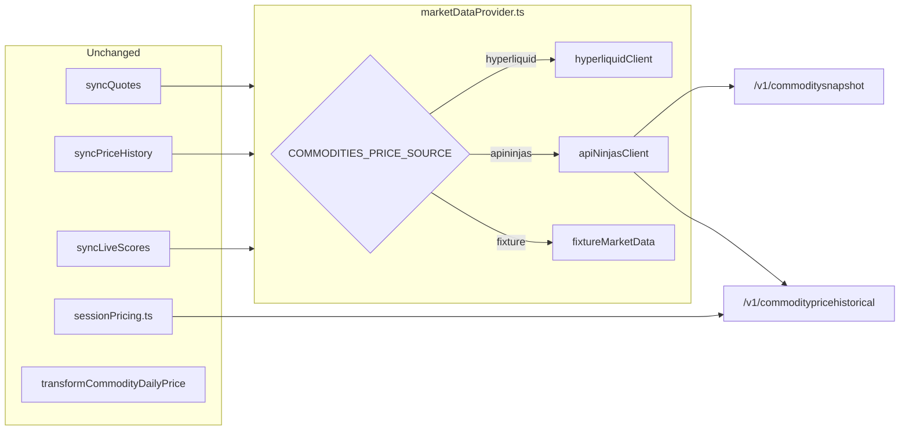
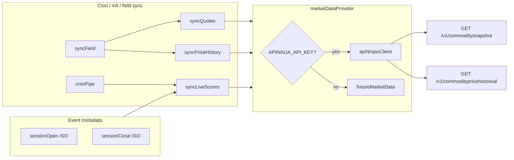

--- Historical plan — under reconsideration. Production today uses Hyperliquid; see [data-sources.md](../data-sources.md). ---
# Commodity Picks — API Ninjas integration plan

**Status:** Under reconsideration (July 2026). Shipped on [Hyperliquid HIP-3](../data-sources.md) with an 8-ticker pool; API Ninjas is the path to expand beyond HL coverage.

**Related:** [competition brief](../competition-brief.md) · [data sources](../data-sources.md) · [COMMODITIES_HYPERLIQUID_PLAN.md](COMMODITIES_HYPERLIQUID_PLAN.md) · [API Ninjas Commodity Price API](https://api-ninjas.com/api/commodityprice)

---

## Fresh analysis (July 2026)

This section reflects what the commodities sport actually needs after shipping on Hyperliquid — not the assumptions in the original plan (single-session % scoring, 5 picks, 24→30 pool).

### What production needs today

| Data point | When fetched | Used for |
|------------|--------------|----------|
| **Live mark** | Every init + 5-min cron | Picker quote, `currentPrice` during LIVE, provisional active leg |
| **Week open** | First LIVE sync; locked thereafter | D1 start price (Mon open or `sessionOpen` if later) |
| **Five day closes** | Each cron; settled legs locked via `mergeLockedDayClosePrices` | D1–D5 leg boundaries (Mon 16:30 → Fri 16:30 ET grid) |
| **Week close** | On COMPLETE | Final leg anchor when event ends before Fri close |
| **Intraday candles** | Init + cron | Session sparkline on picker; same series feeds day-close resolution |
| **Health gate** | At init / field sync | Drop illiquid symbols before freezing `fieldSnapshot` |

Scoring is **five daily legs** (Mon–Fri close-to-close with asymmetric loss weighting), **3 picks**, **ISO-week events** (`2026-W27`). See [competition-brief.md](../competition-brief.md).

The provider must supply timestamped OHLCV for an arbitrary Mon 09:30 → Fri 16:30 window plus a current quote. That is the same shape Hyperliquid already satisfies via `marketDataProvider.ts` + `sessionPricing.ts` — not a different scoring model.

### API Ninjas fit

| Need | API Ninjas endpoint | Notes |
|------|---------------------|-------|
| All quotes in one call | `GET /v1/commoditysnapshot` | 30 commodities; includes `volume`, `change_24h`, `updated` |
| Week + intraday OHLCV | `GET /v1/commoditypricehistorical` | Premium only; periods `1m`…`1d`; `start`/`end` Unix seconds; **all prices returned in USD** |
| Single quote fallback | `GET /v1/commodityprice` | Batch `names=` requires Business+ tier |
| Contract discovery | `GET /v1/commoditycontractlist` | Business+ only; not required if catalog is static |

**Coverage:** 30 CME/NYMEX/ICE rolling futures (energy, precious, base metals, grains, softs, livestock). Expands the pool from HL’s 8 HIP-3 markets to wheat, corn, coffee, hogs, etc.

**Unit handling:** Snapshot quotes use native units (`USD` or `USX` cents). Historical OHLCV is always USD major units. Normalize snapshot `USX` (÷100) before scoring so ag and energy contracts are comparable. Store native `unit` on participant metadata for future display.

**Tier:** Developer ($39/mo, 100k req/mo) covers live snapshot + historical. Business ($99/mo) adds batch `names=` and contract endpoints — optional unless we want multi-name quotes without snapshot.

### Integration shape

Replace the Hyperliquid backend inside the existing provider boundary; keep sync modules and client scoring unchanged.



| Layer | Change |
|-------|--------|
| `packages/sport-commodities/src/catalog.ts` | Expand allowlist to 30 entries; add `apiNinjaName`; drop `hlCoin`/`hlDex` when API Ninjas is sole source |
| `apiNinjasClient.ts` (new) | Snapshot + historical fetch; map response → `{ t, c }` candles; USX normalization on quotes |
| `marketDataProvider.ts` | Route on `COMMODITIES_PRICE_SOURCE=apininjas`; reuse `resolvePriceAtTimestamp`, `selectCandleInterval`, `buildSessionDayCloseTimestamps` |
| `hyperliquidCatalog.ts` | Retained for HL mode; replaced at init by static catalog builder when on API Ninjas |
| `marketHealth.ts` | Replace HL OI/volume checks with snapshot `volume` threshold (and optional “no historical bars in 48h” probe) |
| Client icons | 22 new avatar assets for expanded pool |

Field entry at init becomes static (no `perpDexs` resolution). `metadata.commodities.fieldSnapshot` still freezes the resolved catalog per event.

### API call budget

Naïve approach — 1 snapshot + 30 historical fetches every 5 minutes — is ~8,900 calls/day and exhausts a 100k/mo Developer quota in ~11 days.

| Call type | Cadence | Calls/week (30 symbols) |
|-----------|---------|-------------------------|
| Snapshot (quotes) | Every 5 min while event active | ~2,000 |
| Historical (full week window) | Once per symbol per hour | ~5,040 |
| Historical (day-close only) | Once per symbol when a leg settles | ~150 |
| **Recommended mix** | Snapshot every 5 min + historical hourly + on leg lock | **~3,500–4,500/week** |

Caching rules:

- Snapshot TTL ~4 min (align with cron).
- Historical series keyed by `apiNinjaName + sessionOpen + sessionClose + period`; TTL 1 hr during LIVE; fetch once on COMPLETE for final close.
- Reuse one weekly candle fetch for day closes, week boundaries, and sparklines (same pattern as HL `getSessionPriceSnapshot` today).

At ~15k–20k calls/month the integration fits Developer tier with headroom.

### Hyperliquid vs API Ninjas

| | Hyperliquid (shipped) | API Ninjas |
|--|----------------------|------------|
| **Pool** | 8 HIP-3 perps | 30 exchange futures |
| **Cost** | Free, no key | ~$39–99/mo |
| **Price basis** | Crypto perp mark (may diverge from CME) | CME/NYMEX/ICE rolling futures |
| **Catalog** | Dynamic dex resolution + liquidity filter | Static 30-item catalog + volume filter |
| **Liquidity signal** | Day volume + open interest + recent candles | Session `volume` + historical availability |
| **Batch quotes** | One `metaAndAssetCtxs` per dex | One `commoditysnapshot` |
| **Candles** | `candleSnapshot` 1m–4h | `commoditypricehistorical` 1m–1d |
| **Ops risk** | HL HIP-3 listing changes | API quota; Premium required for historical |

**Why reconsider:** HL cannot list wheat, corn, coffee, livestock, softs, or most ag markets. API Ninjas is the straightforward way to run “pick 3 from 30” without building a second price aggregator.

**Why keep HL as an option:** Zero cost, already wired, sufficient for a metals/energy-only product slice. A `COMMODITIES_PRICE_SOURCE` env switch preserves both paths for dev spike scripts.

### Catalog (30 commodities)

Same mapping as the table below. Tickers should stay short canonical IDs (`CL`, `GC`, `ZW`) — not `CL=F` — to match existing `Participant.externalId` conventions. Map `apiNinjaName` on field entries and participant metadata.

Roster stays **3 picks** from the expanded pool. Icon work is the main client-side cost (22 new assets).

### Revised implementation checklist

- [ ] Add `COMMODITIES_PRICE_SOURCE` (`hyperliquid` | `apininjas` | fixture via existing flag)
- [ ] Expand catalog to 30 with `apiNinjaName`; update client catalog + icons
- [ ] Implement `apiNinjasClient.ts` (snapshot, historical, USX normalize, 429 backoff)
- [ ] Wire `marketDataProvider` API Ninjas branch; map historical bars to `{ t: ms, c: string }`
- [ ] Replace HL health filter with snapshot volume + historical probe for API Ninjas mode
- [ ] Add historical caching layer (symbol + session window + period)
- [ ] Update `data-sources.md`, `competition-brief.md` (pool 30, source switch), `.env.example`
- [ ] Spike script: `script:commodities-data-spike --live` validates 30/30 on API Ninjas
- [ ] Unit tests: USX normalization, candle mapping, period selection reuse, cache TTL

### Open decisions

| Question | Options |
|----------|---------|
| **HL coexistence** | Env switch (recommended) vs full replacement |
| **Health threshold** | Minimum snapshot `volume` per commodity (TBD after spike) |
| **Tier** | Developer sufficient if caching holds; Business if batch `names=` needed |
| **Ticker scheme** | CME roots (`CL`, `GC`, `ZW`) vs uppercase slugs (`CRUDE_OIL`) |

---

## Alternative data sources (July 2026)

Survey of commodity-pricing APIs against the [data requirements](#what-production-needs-today) above. Criteria are **wants**, not hard blockers: exchange-grade futures, batch live quotes, intraday OHLCV with timestamp resolution, ~30-symbol catalog, ~$40–100/mo at ~15–20k calls/month.

### Fit matrix

| Provider | Exchange futures | Batch snapshot | Intraday 1m–1h | 30+ ag/softs/livestock | ~$40–100/mo |
|----------|------------------|----------------|----------------|------------------------|-------------|
| [Tiingo](https://www.tiingo.com/about/pricing) | CME/CBOT/NYMEX/ICE | No | Yes | Yes | **Yes** ($30–50 flat) |
| [Commodities-API](https://commodities-api.com) | Mixed (broad) | Partial | **Yes** (1m–1d) | Yes (700+) | **Yes** ($50 + usage) |
| [Twelve Data](https://twelvedata.com/commodities) | Mixed (CFD/continuous) | Partial | **Yes** | Yes | **Yes** (mid-tier) |
| [omkar.cloud](https://github.com/omkarcloud/commodity-price-api) | CME/NYMEX/CBOT | No | No (price + timestamp) | **Yes** (30+) | **Yes** ($48 / 15k) |
| [API Ninjas](https://api-ninjas.com/api/commodityprice) | Rolling futures | **Yes** (30 in one call) | **Yes** (Premium; 1m–1d) | Yes (30) | **Yes** ($39 / 100k) |
| [Databento](https://databento.com/futures) | **CME/ICE (best)** | Flexible | **Yes** (tick-level) | Yes | No (venue licensing) |
| [Xignite](https://www.xignite.com/product/XigniteGlobalFutures/) | CME/NYMEX/ICE | **Yes** | Varies | Yes | No (enterprise) |
| [Polygon.io](https://polygon.io) futures | CME (select) | Partial | Yes | Partial | No (~$199 RT) |
| [OilPriceAPI](https://www.oilpriceapi.com) | NYMEX/ICE energy | **Yes** | Yes (min/hour) | No | Maybe (energy-only) |
| [Finnhub](https://finnhub.io) | Mixed futures | Partial | Yes | Partial | No (~$292/mo) |

**Note on API Ninjas:** Some third-party summaries list daily-only history; the [official API](https://api-ninjas.com/api/commodityprice) includes Premium `commoditypricehistorical` with `1m`…`1d` periods and a single-call `commoditysnapshot` for all 30 symbols — making it a stronger fit than the “daily MVP” tier suggests.

### Top-fit candidates

**Tiingo** — Best cost/coverage balance for intraday CME futures at $30–50/mo flat. Symbol-by-symbol calls; verify exact commodity list, rate limits at 5-min × 30 symbols, and 16:30 ET close resolution.

**Commodities-API** — Explicit intraday intervals (1m–1d) and OHLC endpoints. Broad catalog (700+). Intraday/OHLC are one symbol per request; UTC-day framing may need careful mapping to Mon–Fri ET session closes. ~$50/mo + per-call overage.

**Twelve Data** — Robust intraday OHLCV and broad commodity catalog. Confirm whether symbols are continuous/CFD vs exchange front-month before committing to % scoring.

**omkar.cloud** — 30+ CME/NYMEX/CBOT symbols at ~$48/mo (15k calls). Real-time price + timestamp only — no intraday candles. Viable if timestamp resolution can be approximated from last-update time; weak for precise day-close boundaries.

**API Ninjas** — 30 rolling futures, one snapshot call, Premium intraday historical. Already mapped in this doc. Main risk is per-symbol historical call volume without caching (see [API call budget](#api-call-budget)).

### Institutional tier (above budget)

**Databento** — Licensed CME/ICE tick/OHLCV; best timestamp and contract fidelity. Live commercial use typically exceeds $100/mo once venue fees apply.

**Xignite** — Batch global futures quotes; enterprise pricing. Delayed tier may work if contest rules tolerate 10–15 min lag.

**Polygon.io** — Clean futures API; real-time tier ~$199/mo; commodity symbol set narrower than 30-target list.

### Niche / partial

**OilPriceAPI** — Energy-only (WTI, Brent, nat gas); batch latest + minute/hour history. Not a full-pool solution.

**Finnhub** — Solid futures API; premium tier ~$3,500/yr — above target.

### Short list for ≤$100/mo + 30 symbols + intraday

| Priority | Provider | Why |
|----------|----------|-----|
| 1 | **Tiingo** | Flat $30–50, exchange futures, intraday bars |
| 2 | **API Ninjas** | 30-in-one snapshot + intraday historical; already specced here |
| 3 | **Commodities-API** | Best interval docs; validate ET session-close mapping |
| 4 | **Twelve Data** | Broad catalog; validate contract type |
| 5 | **omkar.cloud** | Cheapest 30+ breadth; only if intraday want is relaxed |

### Pre-commit validation

Run these checks (docs or support ticket) before selecting a vendor:

1. **Session mapping** — Can candles be fetched for `Mon 09:30 ET → Fri 16:30 ET`, or are bars UTC-day only?
2. **Contract roll** — Front-month continuous vs specific expiry; roll behavior affects cross-commodity % comparability.
3. **Snapshot batching** — Multi-symbol latest-call limits for 5-min cron × 30 symbols within monthly quota.
4. **Liquidity fields** — Volume and/or open interest exposed for init-time health filter.

---

## Summary (original plan — June 2026)

The sections below predate the Hyperliquid ship and the five-leg weekly scoring model. Use **Fresh analysis** above for current requirements; keep the catalog table and endpoint reference.

Integrate API Ninjas Commodity Price API (paid tier) as the live market data source. Expand the catalog to all 30 API-supported commodities (drop nickel/lead/zinc), keep fixture fallback for offline dev, and wire snapshot + historical endpoints into the existing sync pipeline.

**Depends on:** Configurable session bounds (Phase A) — `metadata.commodities.sessionOpen` / `sessionClose` are authoritative for contest lifecycle. Phase B adds **intraday scoring** at those exact timestamps.

**Pool size:** 24 → **30** contracts. Roster stays **5 picks** (unchanged seed rules).

---

## Session bounds and data requirements

Each event stores ISO `sessionOpen` and `sessionClose` in `metadata.commodities` (set at init via `--open`/`--close` or env defaults). Contest activation/settlement already uses these timestamps.

| Concern | Phase A (shipped) | Phase B (this integration) |
|---------|-------------------|----------------------------|
| Lifecycle | `sessionOpen` → LIVE; `sessionClose` → COMPLETE | Unchanged |
| Scoring window | Anchor-date daily OHLC (fixture) | Intraday OHLC at session bounds |
| `openPrice` | Daily bar open for `sessionDate` | Price at/before `sessionOpen` |
| `currentPrice` (LIVE) | Daily bar close / quote | Snapshot `price` |
| `closePrice` (COMPLETE) | Daily bar close | Price at/before `sessionClose` |

API Ninjas `/v1/commoditypricehistorical` supports intraday OHLCV with `period` values `1m`, `5m`, `15m`, `30m`, `1h`, `4h`, `1d` and `start`/`end` Unix timestamps (Premium tier).

---

## Assumptions (paid tier)

- **Premium+** access: live prices, `/v1/commoditysnapshot`, `/v1/commoditypricehistorical` (including intraday periods)
- Auth via `APININJA_API_KEY` → header `X-Api-Key` (see `server/.env.example`)
- **Full API catalog:** use all 30 commodities API Ninjas supports
- Intraday historical covers arbitrary session windows (sub-day, full day, cross-midnight)

---

## Implementation tasks

- [ ] Expand catalog to all 30 API Ninjas commodities with `apiNinjaName` mapping (server + client + icons + brief); remove `NI` / `LED` / `ZNC`
- [ ] Create `apiNinjasClient.ts` with snapshot + historical fetch, USX normalization, caching, 429 backoff
- [ ] Add `selectHistoricalPeriod(sessionOpen, sessionClose)` — pick finest `period` that fits window (`1m`…`4h`, fallback `1d`)
- [ ] Add `resolveBarAtTimestamp(bars, targetUnix)` — nearest bar open/close for session boundary
- [ ] Create `marketDataProvider.ts` routing API vs fixture; shared `MarketQuote` / `SessionSnapshot` types
- [ ] Update `syncQuotes`, `syncPriceHistory`, `syncLiveScores` + dry-run field count (30) to use `marketDataProvider`
- [ ] Wire `syncLiveScores` to event metadata bounds (not anchor-date daily bar only)
- [ ] Extend `fixtureMarketData.ts` with timestamp-keyed synthetic bars for dev/CI when API key absent
- [ ] Update data-spike (`--live`), local-eval, `.env.example`; add API Ninjas docs
- [ ] Unit tests for client normalization, period selection, boundary price resolution, provider routing
- [ ] Update `data-sources.md`, `competition-brief.md` (pool size 30, intraday scoring), event runbook, journal

---

## Full 30-commodity catalog

`apiNinjaName` is the API `?name=` slug. `symbol` is our display/futures-style ticker. `externalId` = symbol without `=F`.

| # | Display name | `apiNinjaName` | `symbol` | Sector |
|---|--------------|----------------|----------|--------|
| 1 | Crude Oil | `crude_oil` | `CL=F` | energy |
| 2 | Brent Crude | `brent_crude_oil` | `BZ=F` | energy |
| 3 | Natural Gas | `natural_gas` | `NG=F` | energy |
| 4 | Heating Oil | `heating_oil` | `HO=F` | energy |
| 5 | Gasoline | `gasoline_rbob` | `RB=F` | energy |
| 6 | Gold | `gold` | `GC=F` | precious |
| 7 | Silver | `silver` | `SI=F` | precious |
| 8 | Platinum | `platinum` | `PL=F` | precious |
| 9 | Palladium | `palladium` | `PA=F` | precious |
| 10 | Micro Gold | `micro_gold` | `MGC=F` | precious |
| 11 | Micro Silver | `micro_silver` | `SIL=F` | precious |
| 12 | Copper | `copper` | `HG=F` | metals |
| 13 | Aluminum | `aluminum` | `ALI=F` | metals |
| 14 | Wheat | `wheat` | `ZW=F` | ag |
| 15 | Corn | `corn` | `ZC=F` | ag |
| 16 | Soybeans | `soybean` | `ZS=F` | ag |
| 17 | Soybean Oil | `soybean_oil` | `ZL=F` | ag |
| 18 | Soybean Meal | `soybean_meal` | `ZM=F` | ag |
| 19 | Lumber | `lumber` | `LBS=F` | ag |
| 20 | Lean Hogs | `lean_hogs` | `HE=F` | ag |
| 21 | Live Cattle | `live_cattle` | `LE=F` | ag |
| 22 | Feeder Cattle | `feeder_cattle` | `GF=F` | ag |
| 23 | Class III Milk | `class_3_milk` | `DC=F` | ag |
| 24 | Rice | `rough_rice` | `ZR=F` | ag |
| 25 | Oats | `oat` | `ZO=F` | ag |
| 26 | Cotton | `cotton` | `CT=F` | softs |
| 27 | Coffee | `coffee` | `KC=F` | softs |
| 28 | Sugar | `sugar` | `SB=F` | softs |
| 29 | Cocoa | `cocoa` | `CC=F` | softs |
| 30 | Orange Juice | `orange_juice` | `OJ=F` | softs |

**Removed:** Nickel (`NI`), Lead (`LED`), Zinc (`ZNC`).

**Files to update:** `server/src/sports/commodities/commodityCatalog.ts`, `client/src/sports/commodities/catalog.ts`, `docs/sports/commodities/competition-brief.md`, `client/src/sports/commodities/icons.tsx` (9 new icon keys), `server/src/scripts/commoditiesDryRun.ts` (`fieldCount !== 30`).

---

## Architecture



### New files (`server/src/sports/commodities/`)

| File | Role |
|------|------|
| `apiNinjasClient.ts` | Typed HTTP client (pattern: `server/src/sports/f1/openf1Client.ts`) |
| `marketDataProvider.ts` | Single entry point for sync modules; API vs fixture |
| `sessionScoring.ts` | Period selection + boundary price resolution from historical bars |

### Keep as fallback

`server/src/sports/commodities/fixtureMarketData.ts` — offline/CI when key is missing or `COMMODITIES_USE_FIXTURE_PRICES=true`. Extend with timestamp-keyed bars for intraday session windows.

---

## Catalog mapping

```ts
export type CommodityCatalogEntry = {
  displayName: string;
  symbol: string;        // e.g. CL=F → externalId CL
  apiNinjaName: string;  // e.g. crude_oil
  sector: CommoditySector;
  iconKey: string;
};
```

**Snapshot sync:** one `GET /v1/commoditysnapshot` returns all 30; index response by `value` slug and map to catalog rows.

---

## API client (`apiNinjasClient.ts`)

**Base URL:** `https://api.api-ninjas.com`

| Method | Endpoint | Used for |
|--------|----------|----------|
| `fetchCommoditySnapshot()` | `GET /v1/commoditysnapshot` | All 30 picker quotes in one call |
| `fetchCommodityHistorical(name, { period, start, end })` | `GET /v1/commoditypricehistorical` | Session boundary prices + 30-day sparklines |

**Historical `period` selection** (`sessionScoring.ts`):

| Session duration | Preferred `period` |
|------------------|-------------------|
| ≤ 1 hour | `1m` or `5m` |
| ≤ 4 hours | `15m` or `30m` |
| ≤ 1 day | `1h` or `4h` |
| Multi-day | `4h` or `1d` |

Pass `start` / `end` as Unix seconds from `metadata.commodities.sessionOpen` / `sessionClose`.

**Normalization** (`normalizeApiNinjaPrice`):

- `currency_unit === "USX"` → divide by 100 (major units for consistent % scoring)
- Optional `unit` on `CommodityParticipantMetadata` for future display
- Map to internal `MarketQuote` type

**Resilience:** snapshot cache 4 min; historical cache 1 hr per symbol+window; 429 backoff; missing symbol → DNP (0 points).

---

## Scoring model

Rule: **% return session open → current/close** (`packages/sport-commodities/src/live-scores.ts`).

| Phase | openPrice | currentPrice | closePrice |
|-------|-----------|--------------|------------|
| **LIVE** | Historical bar at `sessionOpen` (persist on first sync) | Snapshot `price` | `null` |
| **COMPLETE** | Stored `openPrice` | Snapshot `price` | Historical bar at `sessionClose` |

Boundary resolution: fetch intraday OHLCV for `[sessionOpen, sessionClose]`; use bar `open` at first bar ≥ open time; use bar `close` at last bar ≤ close time. If no exact bar, use nearest prior bar (document DNP policy if gap > one period).

**Sparklines:** separate daily `period=1d` fetch (30 points) for picker display — unchanged from original plan.

---

## Sync module changes

- `server/src/sports/commodities/syncQuotes.ts` — `marketDataProvider.getQuotes()` from snapshot
- `server/src/sports/commodities/syncPriceHistory.ts` — 30 daily historical fetches once/event (cached) for sparklines
- `server/src/sports/commodities/syncLiveScores.ts` — `getSessionSnapshots(sessionOpen, sessionClose)` with intraday boundary prices
- `server/src/sports/commodities/syncField.ts` — upsert 30 `EventParticipant` rows; store `apiNinjaName` on metadata

Log messages: `N/30` not `N/24`.

---

## Environment

```
APININJA_API_KEY=
COMMODITIES_USE_FIXTURE_PRICES=false
```

Session defaults (`COMMODITIES_SESSION_*`) remain env-only fallbacks when init omits `--open`/`--close`. Stored metadata bounds drive scoring window.

**Scripts:**

- `server/src/scripts/commoditiesDataSpike.ts` — `--live` validates 30/30
- `server/src/scripts/commoditiesLocalEval.ts` — refresh via API when key set

---

## Tests and docs

- `apiNinjasClient.test.ts` — USX normalization, snapshot indexing by `value`, historical date match
- `sessionScoring.test.ts` — period selection, boundary bar resolution, cross-midnight windows
- `marketDataProvider.test.ts` — API vs fixture routing
- Update `docs/sports/commodities/data-sources.md`, `docs/sports/commodities/competition-brief.md` (pool size 30, intraday scoring), event runbook, journal status

---

## Rollout checklist

1. Set `APININJA_API_KEY` in `server/.env`
2. `pnpm --filter server run script:commodities-data-spike -- --live 2025-06-27` — confirm 30/30
3. Init with custom window: `pnpm --filter server run service:init-event commodities 2025-06-27 --open 10:00 --close 14:00`
4. Confirm intraday scores match boundary prices (not daily bar)
5. `pnpm --filter server run script:commodities-local-eval` — re-init field + quotes
6. Browse picker — 30 candidates with live prices

**DB cleanup:** Orphaned participants (`NI`, `LED`, `ZNC`) remain inert; new rows upserted on field sync. Optional one-off delete of orphaned `Participant` rows.

---

## Out of scope

- Forward curve / contract endpoints (`/v1/commodityforwardcurve`)
- Free-tier workarounds (plan assumes paid)
- Price unit labels in UI (bushel vs barrel) — normalized numbers for now
- Changing roster from 5 picks (still 5 of 30)
