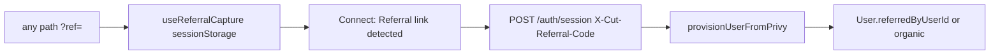

# Referral signup-tree e2e

Agent runbook for the **signup invite tree** (opaque `?ref=` codes). Product and on-chain policy: [referral-network.md](../platform/referral-network.md). Sharing brief: [drive-referrals.md](../internal/drive-referrals.md).

This run does **not** cover league join dual-capture, contest lobby stake icons, ReferralGraph sync, or settlement fees.

## Goals

- A new Cut user opened with a valid `?ref=` attaches to the inviter (`User.referredByUserId`, `referrerAddress`).
- Organic signup (missing, invalid, `0x`, or unknown code) still creates an account and does not fail `POST /auth/session`.
- Existing Cut users are not re-parented if they later open someone else's link.
- Referral Network shows the viewer's named downline tree (not emails) and total earned from `GET /auth/referrals/summary`.
- Connect shows **Referral link detected** only when a valid 8-character invite code is in the URL or `sessionStorage` (`cut_referral_code`).

## Code paths



| Step | Where |
|------|--------|
| Parse `?ref=` (reject `0x`, wrong length/alphabet; preserve case) | `client/src/lib/referralCapture.ts` |
| Persist `cut_referral_code` on every route | `client/src/App.tsx` `ReferralQueryCapture` |
| Banner on Sign in / Create Account | `client/src/components/auth/Connect.tsx` |
| Header only on first Cut user create (`NEEDS_PROVISIONING` → `POST /auth/session`) | `client/src/contexts/AuthContext.tsx` |
| Best-effort resolve; never blocks after valid JWT | `server/src/lib/referralCode.ts`, `server/src/lib/privyUserProvisioning.ts` |
| Named downline tree + earned | `GET /auth/referrals/summary` (`getReferralSummary.ts`) |

Attachment is write-once at `User` create. `sessionStorage` is cleared after a successful session POST, not on logout.

## UI

| Surface | Route | This run |
|---------|-------|----------|
| Connect banner | `/connect` | Yes |
| Onboarding (`Skip for now`) | `/onboarding` | Gate only |
| Share link + named downline tree + earned | `/account/referrals` | Yes |
| FAQ invite-network copy | `/faq#referral-network` | No |
| League invite URL `?ref=` + admin member icon | `/leagues/...` | No |
| Contest lobby / entry stake icon | contest lobby | No |

## Testers

Four Privy dashboard test accounts, fetched by the agent (never pasted into chat or committed):

```sh
node .cursor/skills/privy-test-login/scripts/get-test-credentials.mjs --all
```

| Index | Role |
|-------|------|
| `[0]` A | Organic (no `ref`) |
| `[1]` B | Invited by A |
| `[2]` C | Invited by B |
| `[3]` D | Valid-alphabet unknown `ref` → organic |

Login: [privy-test-login](../../.cursor/skills/privy-test-login/SKILL.md). Chrome on `http://localhost:5173`. If `--all` returns fewer than four identities, stop.

Prerequisite: **User management → Authentication → Advanced → Enable test accounts** with at least four static `test-…@privy.io` emails. Same `PRIVY_APP_ID` as `VITE_PRIVY_APP_ID`.

## Environment

- Operator runs `pnpm run db:reset` (migrate + seed). Agent does not run destructive Prisma. Privy identities survive; Cut users do not — required so attachment happens on first `POST /auth/session`.
- App up: Postgres, API `:3000`, client `:5173`.
- `REFERRAL_GROUP_ID` valid in `server/.env`.
- No wallet funding, cron, or ReferralGraph for this run.

## Scenarios

1. **Capture (logged out).** `?ref=short`, `?ref=0x…`, missing `ref` → no banner. Valid-looking unknown 8-char code → banner.
2. **A organic.** Login A with no stored code → skip onboarding → `/account/referrals` → `referredByUserId` null; record A's `referralCode`.
3. **B invited.** Logout → `/?ref={A}` → banner → login B → skip onboarding → B parented to A; A's Referrals tree shows B's name as a direct node.
4. **C nested.** Logout → `/?ref={B}` → login C → A's tree shows B under You and C under B; B's tree shows C as a direct node.
5. **D unknown code.** Logout → `/?ref=` plus a valid-alphabet code that is not A/B/C → login D → organic.
6. **No re-parent.** Login B again with C's or A's `?ref=` → still parented to A.
7. **Self-link.** A visits `?ref={A}` while already provisioned → still organic.

Checks: Connect/Referrals UI plus Postgres (`referredByUserId`, `referrerAddress`, `referralCode`) and `GET /auth/referrals/summary` while that user is logged in. Logout via Account → Settings. New users: **Skip for now** on onboarding.
