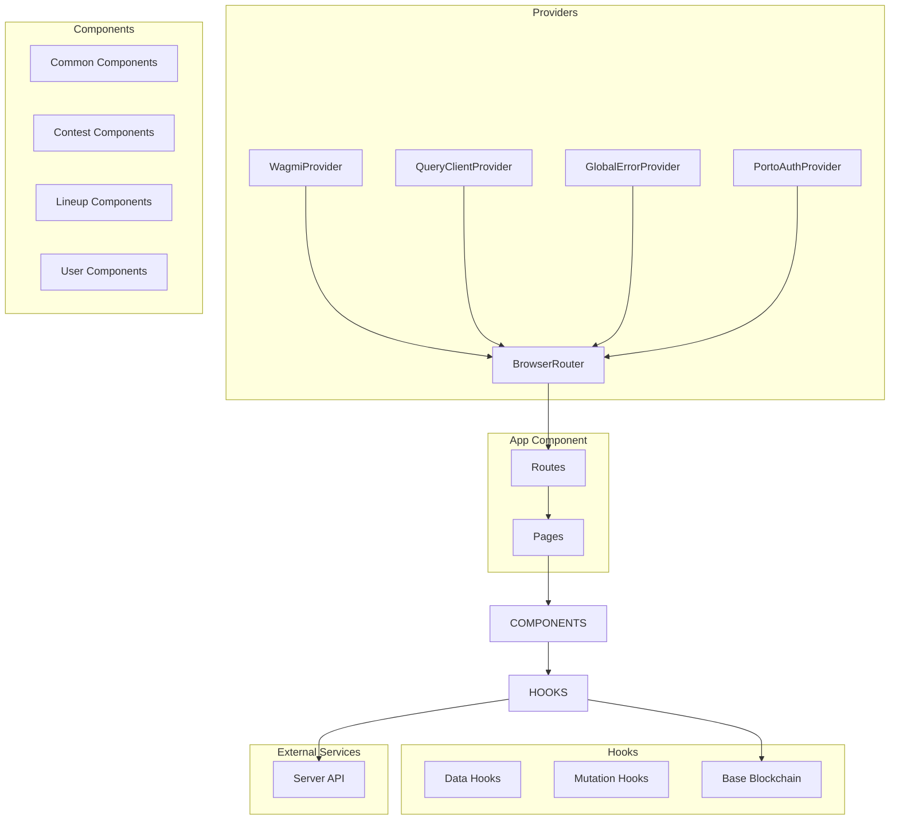
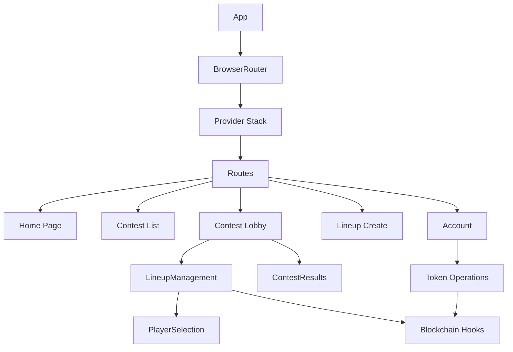
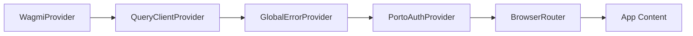
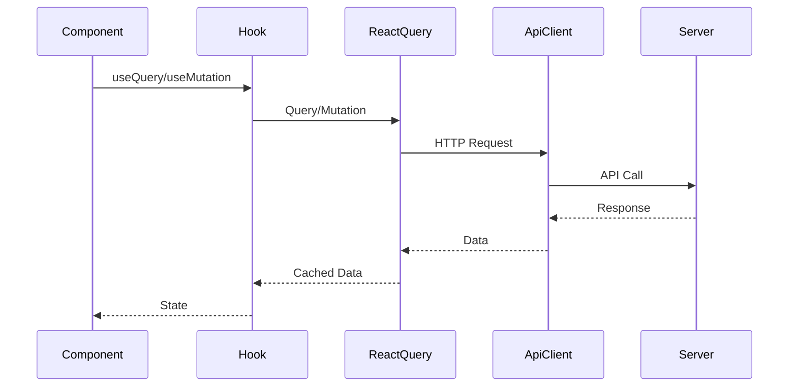
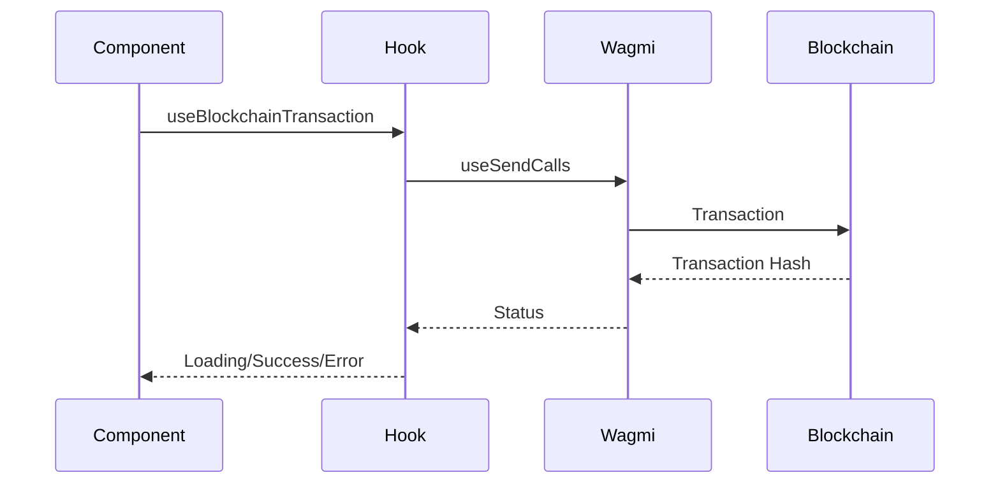

# Client Architecture

## High-Level Architecture

## Component Hierarchy

## Provider Stack

## Data Flow Patterns

### Server Data Flow

### Blockchain Data Flow

## Key Architectural Patterns

### Provider Pattern
- **WagmiProvider**: Blockchain wallet and contract access
- **QueryClientProvider**: React Query for server state
- **GlobalErrorProvider**: Centralized error handling
- **PortoAuthProvider**: Authentication state
- **BrowserRouter**: Client-side routing

### Custom Hooks Pattern
- Encapsulate data fetching logic
- Reusable across components
- Type-safe with TypeScript
- Handle loading/error states

### Component Composition
- Small, focused components
- Composition over inheritance
- Props for configuration
- Context for shared state

### Separation of Concerns
- **Pages**: Route-level components
- **Components**: Reusable UI
- **Hooks**: Data and logic
- **Utils**: Pure functions
- **Contexts**: App-wide state

## State Management Architecture

### Server State (React Query)
- **Queries**: Read operations (GET)
- **Mutations**: Write operations (POST, PUT, DELETE)
- **Caching**: Automatic caching and invalidation
- **Refetching**: Automatic refetch on focus/reconnect

### Client State (Context API)
- **PortoAuthContext**: User authentication state
- **GlobalErrorContext**: Error messages and handling
- **Component State**: Local component state (useState)

### Blockchain State (Wagmi)
- **Account State**: Connected wallet, chain ID
- **Contract Reads**: Contract state queries
- **Transaction State**: Pending, confirmed, failed

## Key Design Decisions

### Why React Query?
- **Automatic Caching**: Reduces API calls
- **Background Updates**: Keeps data fresh
- **Optimistic Updates**: Better UX
- **Error Handling**: Built-in retry logic
- **DevTools**: Great debugging experience

### Why Wagmi?
- **Type Safety**: Full TypeScript support
- **Hooks-Based**: React-friendly API
- **Multi-Chain**: Easy chain switching
- **Transaction Management**: Built-in transaction handling

### Why Context API?
- **Simple**: No external dependencies
- **Built-in**: Part of React
- **App-Level State**: Perfect for auth and errors
- **Performance**: Fine for low-frequency updates

### Why Component Organization?
- **Pages**: Clear route boundaries
- **Components**: Reusable UI pieces
- **Hooks**: Reusable logic
- **Separation**: Easy to find and maintain

## Performance Considerations

### Code Splitting
- Route-based code splitting (React Router)
- Lazy loading for heavy components
- Dynamic imports where appropriate

### Caching Strategy
- React Query: 1 minute stale time, 5 minute cache
- Token balances: 30 second polling
- Tournament data: Prefetched on app load

### Optimization
- React.memo for expensive components
- useMemo for computed values
- useCallback for stable function references
- Virtualization for long lists (if needed)

## Security Considerations

### Authentication
- SIWE (Sign-In With Ethereum) for wallet auth
- JWT tokens in HTTP-only cookies
- Automatic token refresh

### Input Validation
- Yup/Zod schemas for form validation
- Server-side validation (never trust client)
- Sanitization of user input

### XSS Prevention
- React's built-in XSS protection
- No dangerous HTML rendering
- Sanitize any user-generated content

## Scalability Considerations

### Current Architecture
- Single-page application
- Client-side routing
- API-based backend communication

### Future Considerations
- **Code Splitting**: Already implemented
- **Lazy Loading**: Can add more
- **Service Workers**: For offline support
- **CDN**: Static assets can be CDN-hosted
- **Micro-Frontends**: Could split into modules if needed

