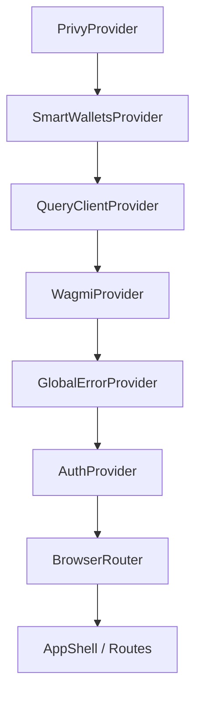
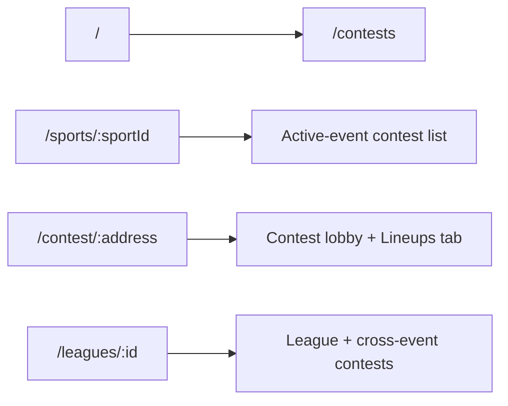
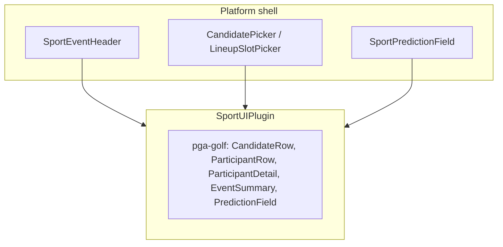

# Client architecture (v4)

---

## Provider stack

```mermaid
graph TB
  PRIVY[PrivyProvider] --> SW[SmartWalletsProvider]
  SW --> RQ[QueryClientProvider]
  RQ --> WAGMI[WagmiProvider]
  WAGMI --> ERR[GlobalErrorProvider]
  ERR --> AUTH[AuthProvider]
  AUTH --> ROUTER[BrowserRouter]
  ROUTER --> APP[AppShell / Routes]
```

| Provider | Role |
|----------|------|
| `PrivyProvider` | Login, embedded wallet, `getAccessToken` |
| `SmartWalletsProvider` | Paymaster config for gas sponsorship |
| `QueryClientProvider` | Server state cache |
| `WagmiProvider` | Contract reads/writes on Base / Base Sepolia |
| `GlobalErrorProvider` | App-wide error surfacing |
| `AuthProvider` | Cut user from `/auth/me`, balances, connect flow |

Event and sport scope are provided at **page boundaries** — `ContestEventScopeProvider` on contest lobby; leaderboard passes `sportId` from the URL into `useSportActiveEvent` directly (no scope provider).

---

## Routing model

```mermaid
flowchart LR
  ROOT["/"] --> CONTESTS["/contests"]
  HUB["/sports/:sportId"] --> HUB_LIST[Active-event contest list]
  LOBBY["/contest/:address"] --> CONTEST[Contest lobby + Lineups tab]
  LEAGUES["/leagues/:id"] --> LEAGUE[League + cross-event contests]
```

- **Default home** (`/contests`) — multi-sport live contests hub.
- **Sport hub** (`SportHubPage`) — contest list for the active event of `sportId` in the URL.
- **Contest lobby** is keyed by **contract address**; lineups are managed on the lobby **Lineups** tab (no `/lineups` route).
- **Leagues** are sport-agnostic; each contest carries `eventId` → sport via server.
- Legacy `/user-groups/*` and `/sports/:sportId/contests/:id` redirect to canonical paths.

---

## Sport and event scope

**Sport** — explicit at route boundary:

- `/sports/:sportId/*` → `useParams().sportId`
- `/contest/:address` → `contest.event.sportId` via `ContestEventScopeProvider`
- Create-contest forms → first enabled sport from `GET /sports` (local form state)

**Event** — `useSportActiveEvent(sportId)` or `useContestEvent(contest)`; see [README](README.md).

Plugin hooks (`useSportUIPlugin`) resolve `sportId` from an explicit argument or `EventScopeContext`.

---

## Plugin boundary

```mermaid
flowchart TB
  subgraph platform[Platform shell]
    Header[SportEventHeader]
    Picker[CandidatePicker / LineupSlotPicker]
    Pred[SportPredictionField]
  end
  subgraph plugin[SportUIPlugin]
  Golf[pga-golf: CandidateRow, ParticipantRow, ParticipantDetail, EventSummary, PredictionField]
  end
  Header --> plugin
  Picker --> plugin
  Pred --> plugin
```

`client/src/sports/registry.ts` maps `sportId` → `SportUIPlugin`. Platform components call `requireSportUIPlugin(sportId)` for sport-specific rendering (row layout, scorecard, prediction input).

Only **pga-golf** is registered today. Adding a sport = new package folder + registry entry (server plugin must exist first).

---

## Data layers

| Layer | Tool | Examples |
|-------|------|----------|
| Server state | React Query | events, lineups, contests, side bets |
| Auth state | Context | user, balances, `startAuthFlow` |
| Chain state | Wagmi | contest contract, token balances |
| Local UI | useState | modals, form drafts |

See [data-flow.md](data-flow.md) and [state-management.md](state-management.md).

---

## Type system

All production UI uses platform types:

| Type | Source | Used for |
|------|--------|----------|
| `Candidate` | `@cut/sport-sdk` | Picker, rows, detail modal |
| `ActiveEventResponse` | `types/event.ts` | Event metadata + status |
| `PlatformLineup` | `types/event.ts` | User lineups (`picks`, `score`) |
| `ContestLineup` | `types/lineup.ts` | Contest entries (`score`, `position`) |

Golf scorecard shapes (`RoundData`, `TournamentPlayerData`) live in `sports/pga-golf/types.ts` — plugin-internal only.

Some query keys and admin types still expose `tournamentId` aliases; new code should use `eventId`.

---

## Loading gate

`useAppLoadingGate` + `GlobalLoadingOverlay` block the shell until Privy auth settles, reducing flash of empty state on first paint.

`OnboardingRedirectGate` sends new users through `/onboarding` when settings indicate incomplete onboarding.

---

## Security

- API: short-lived Privy bearer tokens via `registerAuthTokenHandlers` in `AuthProvider`
- Routes: `ProtectedRoute` for authenticated pages; `AdminRoute` for staff
- Forms: client-side Yup/Zod; server is authoritative
- No secrets in client bundle beyond public Privy app id and RPC URLs

---

## Performance defaults

| Data | staleTime / poll |
|------|------------------|
| Sports list | 24h |
| Active event | 5 min + refetch on focus |
| Candidates | 5 min |
| Token balances | ~30s poll in AuthContext |

Route-based code splitting is available; heavy admin/debug pages are natural lazy-load candidates.
