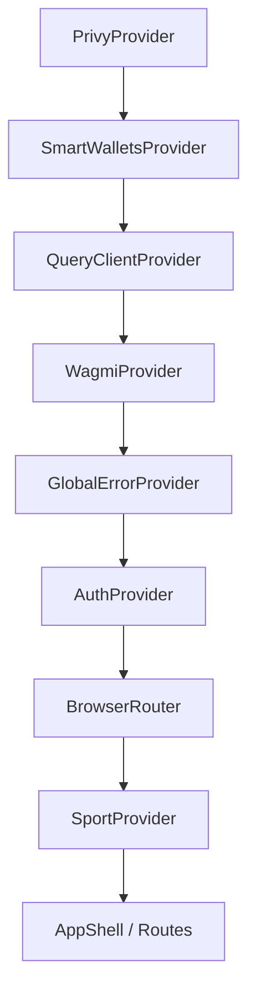
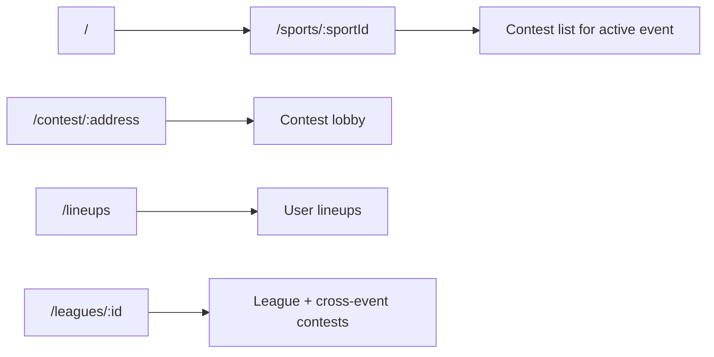
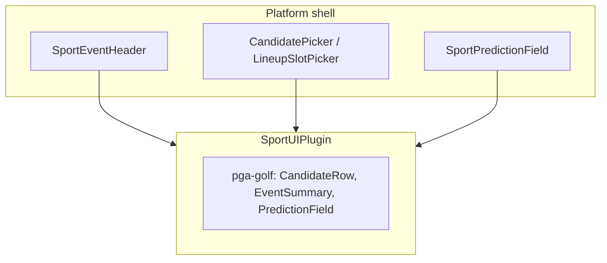

# Client architecture (v4)

---

## Provider stack

```mermaid
graph TB
  PRIVY[PrivyProvider] --> SW[SmartWalletsProvider]
  SW --> RQ[QueryClientProvider]
  RQ --> WAGMI[WagmiProvider]
  WAGMI --> ERR[GlobalErrorProvider]
  ERR --> AUTH[AuthProvider]
  AUTH --> ROUTER[BrowserRouter]
  ROUTER --> SPORT[SportProvider]
  SPORT --> APP[AppShell / Routes]
```

| Provider | Role |
|----------|------|
| `PrivyProvider` | Login, embedded wallet, `getAccessToken` |
| `SmartWalletsProvider` | Paymaster config for gas sponsorship |
| `QueryClientProvider` | Server state cache |
| `WagmiProvider` | Contract reads/writes on Base / Base Sepolia |
| `GlobalErrorProvider` | App-wide error surfacing |
| `AuthProvider` | Cut user from `/auth/me`, balances, connect flow |
| `SportProvider` | `sportId` from `/sports/:sportId` or default `pga-golf` |

On mount, `App` prefetches the active event via `prefetchActiveTournament` (wraps `prefetchActiveEvent`).

---

## Routing model

```mermaid
flowchart LR
  ROOT["/"] --> HUB["/sports/:sportId"]
  HUB --> CONTESTS[Contest list for active event]
  LOBBY["/contest/:address"] --> CONTEST[Contest lobby]
  LINEUPS["/lineups"] --> MY[User lineups]
  LEAGUES["/leagues/:id"] --> LEAGUE[League + cross-event contests]
```

- **Sport hub** (`SportHubPage`) renders the contest list for the active event of the selected sport.
- **Contest lobby** is keyed by **contract address**, not database id.
- **Leagues** are sport-agnostic; each contest carries `eventId` → sport via server.
- Legacy `/user-groups/*` and `/sports/:sportId/contests/:id` redirect to canonical paths.

---

## Sport context

`SportContext` exposes `sportId`:

- From route param `:sportId` when present
- Parsed from `/sports/{id}/...` pathname
- Falls back to `DEFAULT_SPORT_ID` (`pga-golf`)

Hooks like `useActiveEventQuery(sportId)` and `useSportEventHeader` read this context so nav and pages stay in sync when switching sports via `SportPicker`.

---

## Plugin boundary

```mermaid
flowchart TB
  subgraph platform[Platform shell]
    Header[SportEventHeader]
    Picker[CandidatePicker / LineupSlotPicker]
    Pred[SportPredictionField]
  end
  subgraph plugin[SportUIPlugin]
  Golf[pga-golf: CandidateRow, EventSummary, PredictionField]
  end
  Header --> plugin
  Picker --> plugin
  Pred --> plugin
```

`client/src/sports/registry.ts` maps `sportId` → `SportUIPlugin`. Platform components call `requireSportUIPlugin(sportId)` for sport-specific rendering (row layout, scorecard, prediction input).

Only **pga-golf** is registered today. Adding a sport = new package folder + registry entry (server plugin must exist first).

---

## Data layers

| Layer | Tool | Examples |
|-------|------|----------|
| Server state | React Query | events, lineups, contests, side bets |
| Auth state | Context | user, balances, `startAuthFlow` |
| Chain state | Wagmi | contest contract, token balances |
| Local UI | useState | modals, form drafts |

See [data-flow.md](data-flow.md) and [state-management.md](state-management.md).

---

## Legacy bridge

Until Phase 10 cleanup, two parallel type systems coexist:

| Platform (target) | Bridge (transitional) |
|-------------------|----------------------|
| `ActiveEventResponse` | `Tournament` via `golfEventToTournament*` |
| `Candidate` | `PlayerWithTournamentData` via `candidateToPlayer` |
| `PlatformLineup` | `TournamentLineup` via adapter |
| `eventId` | sometimes still named `tournamentId` in query keys |

`useActiveTournament` is the main entry point for components that have not migrated.

---

## Loading gate

`useAppLoadingGate` + `GlobalLoadingOverlay` block the shell until Privy auth and initial sport/event prefetch settle, reducing flash of empty state on first paint.

`OnboardingRedirectGate` sends new users through `/onboarding` when settings indicate incomplete onboarding.

---

## Security

- API: short-lived Privy bearer tokens via `registerAuthTokenHandlers` in `AuthProvider`
- Routes: `ProtectedRoute` for authenticated pages; `AdminRoute` for staff
- Forms: client-side Yup/Zod; server is authoritative
- No secrets in client bundle beyond public Privy app id and RPC URLs

---

## Performance defaults

| Data | staleTime / poll |
|------|------------------|
| Sports list | 24h |
| Active event | 5 min + refetch on focus |
| Candidates | 5 min |
| Token balances | ~30s poll in AuthContext |

Route-based code splitting is available; heavy admin/debug pages are natural lazy-load candidates.
