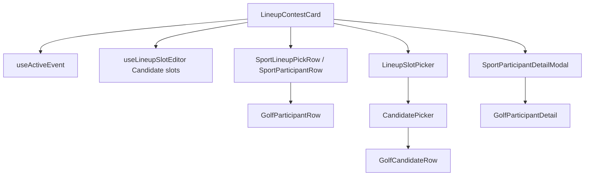

# Client component structure (v4)

Components are grouped by **platform vs sport** and by **feature domain**. Pages compose feature components; feature components call hooks.

**Sport UI boundaries (detailed):** [sport-ui-plugins.md](sport-ui-plugins.md)

---

## Platform shell (`components/platform/`)

Sport-agnostic building blocks. They accept platform types (`Candidate`, `EventStatus`) and delegate visual details to `SportUIPlugin`.

| Component | Purpose |
|-----------|---------|
| `SportEventHeader` | Event name, dates, status bar → plugin `EventSummary` |
| `SportEventContextBar` | Route-gated hero in `AppLayout` |
| `SportParticipantRow` | Wrapper → plugin `ParticipantRow` (defaults `status` from `useActiveEvent`) |
| `SportParticipantDetailModal` | Dialog chrome → plugin `ParticipantDetail` (scorecard modal) |
| `SportLineupPickRow` | Thin wrapper around `SportParticipantRow` for editable lineup slots |
| `CandidatePicker` | Search/sort over `Candidate[]` → plugin `CandidateRow` |
| `LineupSlotPicker` | Bridges participant IDs ↔ `CandidatePicker` |
| `SportPredictionField` | Wrapper → plugin `PredictionField` |

Used by: leaderboard, lineup list/card, contest entry list/modal, contest lobby slot editor.

---

## Sport chrome (`components/sport/`)

| Component | Purpose |
|-----------|---------|
| `SportPicker` | Nav dropdown — lists enabled sports from `GET /sports` |

---

## Sport plugins (`sports/pga-golf/`)

Registered via `pgaGolfUIPlugin` in `sports/pga-golf/index.tsx`. See [sport-ui-plugins.md](sport-ui-plugins.md) for props, usage map, and conventions.

| Export | Purpose |
|--------|---------|
| `CandidateRow` | Picker only (scheduled card; live/complete → `ParticipantRow`) |
| `ParticipantRow` | All display lists |
| `ParticipantDetail` | Scorecard detail modal (header, round tabs, hole table) |
| `EventSummary` | Tournament preview in event header |
| `EventDetails` | Course/weather (used inside `EventSummary`, not on interface) |
| `PredictionField` | Winning-score prediction slider |

Plugin interface: `packages/sport-sdk/src/sport-ui-plugin.ts` (`SportUIPlugin`).

---

## Contest (`components/contest/`)

| Component | Purpose |
|-----------|---------|
| `ContestList` | Grid/list of contests for an event |
| `GroupedContestList` | Contests grouped by event (league view) |
| `CreateContestEventPicker` | Pick `eventId` when creating from a league |
| `ContestEntryList` / `ContestEntryModal` | Entry roster via `SportParticipantRow` |
| `LineupManagement` | Join contest flow (text player names; not plugin rows) |
| Contest cards, timeline, secondary market UI | Lobby sub-components |

Pages: `SportHubPage` (via `ContestListPage`), `ContestLobbyPage`, `ContestCreatePage`.

---

## Lineup (`components/lineup/`)

| Component | Purpose |
|-----------|---------|
| `LineupContestCard` | Primary lineup UI — plugin rows, slot picker, prediction |
| `LineupManagement` | Contest lobby join/leave — `SportParticipantRow` for roster |

Pages: `LineupListPage`, contest lobby.

**Deleted:** `LineupCard`, `PlayerSelectionModal`, `PlayerSelectionButton`, `PlayerSelectionCard`.

---

## Legacy (`components/tournament/`, `components/player/`)

See [sport-ui-plugins.md § Legacy inventory](sport-ui-plugins.md#legacy-inventory).

| Component | Status |
|-----------|--------|
| `TournamentSummaryModal`, `TournamentInfoPanel` | ✅ `useActiveEvent` |
| `PlayerScorecard` | `ScoreDisplay` / `StablefordDisplay` primitives for `InfoScorecard` demo |

---

## Leagues (`components/userGroup/`)

| Component | Purpose |
|-----------|---------|
| `LeagueCreateContestForm` | Create contest scoped to league + event |
| Group cards, member lists | Standard league CRUD UI |

Pages: `UserGroupListPage`, `UserGroupDetailPage`, etc. Routes under `/leagues/*`.

---

## Common (`components/common/`)

| Component | Purpose |
|-----------|---------|
| `AppLayout` | Nav, footer, sport picker |
| `ProtectedRoute` | Requires Privy session |
| `AdminRoute` | Requires `ADMIN` / `SUPER_ADMIN` |
| `OnboardingRedirectGate` | Onboarding funnel |
| `GlobalLoadingOverlay` | Initial load blocker |
| Modals, toasts, error boundaries | Shared UX |

Nav tabs defined in `lib/navTabs.ts` — contests tab points to `/sports/{defaultSport}`.

---

## Routing helpers (`components/routing/`)

| Component | Purpose |
|-----------|---------|
| `LegacyRedirects` | `/user-groups/*` → `/leagues/*`, old contest URLs |

---

## Composition example: lineup edit

---

## Adding a new sport (client)

1. Create `client/src/sports/{sport-id}/` implementing `SportUIPlugin`
2. Register in `sports/registry.ts`
3. Reuse platform shell components — no changes to `CandidatePicker` unless roster rules differ structurally
4. Ensure server `SportModule` is registered and sport appears in `GET /sports`

See [sport-ui-plugins.md](sport-ui-plugins.md) for `CandidateRow` vs `ParticipantRow` rules.

