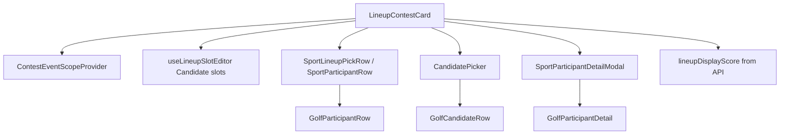

# Client component structure (v4)

Components are grouped by **platform vs sport** and by **feature domain**. Pages compose feature components; feature components call hooks.

**Sport UI boundaries (detailed):** [sport-ui-plugins.md](sport-ui-plugins.md)

---

## Platform shell (`components/platform/`)

Sport-agnostic building blocks. They accept platform types (`Candidate`, `EventStatus`) and delegate visual details to `SportUIPlugin`.

| Component | Purpose |
|-----------|---------|
| `SportEventHeader` | Event hero on leaderboard — `sportId` prop → `useSportActiveEvent` → plugin `EventSummary` |
| `SportParticipantRow` | Wrapper → plugin `ParticipantRow` (`status` required; `eventMetadata` optional) |
| `SportParticipantDetailModal` | Dialog chrome → plugin `ParticipantDetail` (scorecard modal) |
| `SportLineupPickRow` | Thin wrapper around `SportParticipantRow` for editable lineup slots |
| `CandidatePicker` | Search/sort over `Candidate[]` → plugin `CandidateRow` |
| `SportPredictionField` | Wrapper → plugin `PredictionField` |

Used by: leaderboard, lineup card, contest entry list/modal, contest lobby slot editor.

Event heroes on contest lobby are rendered in `ContestLobbyView` (plugin `EventSummary`), not in `AppLayout`.

---

## Sport chrome (`components/sport/`)

| Component | Purpose |
|-----------|---------|
| `SportPicker` | Lists enabled sports from `GET /sports` (inline on create-contest forms; not in TopNav) |

---

## Sport plugins (`sports/pga-golf/`)

Registered via `pgaGolfUIPlugin` in `sports/pga-golf/index.tsx`. See [sport-ui-plugins.md](sport-ui-plugins.md) for props, usage map, and conventions.

| Export / module | Purpose |
|-----------------|---------|
| `CandidateRow` | Picker only (scheduled card; live/complete → `ParticipantRow`) |
| `ParticipantRow` | All display lists |
| `ParticipantDetail` | Scorecard detail modal (header, round tabs, hole table) |
| `EventSummary` | Event hero on lobby + leaderboard |
| `EventDetails` | Course/weather (used inside `EventSummary`, not on interface) |
| `PredictionField` | Winning-score prediction slider |
| `scorecard/` | Hole table, score chips, round utils (plugin-internal) |
| `types.ts` | Golf scorecard metadata shapes |
| `eventMedia.ts` | Hero image fallback URL |
| `utils.ts` | Candidate/event metadata parsing |

Plugin interface: `packages/sport-sdk/src/sport-ui-plugin.ts` (`SportUIPlugin`).

---

## Contest (`components/contest/`)

| Component | Purpose |
|-----------|---------|
| `ContestList` | Grid/list of contests for an event |
| `GroupedContestList` | Contests grouped by event (league view) |
| `CreateContestEventPicker` | Pick `eventId` when creating from a league |
| `ContestEntryList` / `ContestEntryModal` | Entry roster via `SportParticipantRow`; totals from `lineup.score` |
| `LineupManagement` | Join contest flow — `SportParticipantRow` for roster |
| `ContestLobbyView` | Lobby shell — plugin `EventSummary`, tabs (entries, lineups, etc.) |
| Contest cards, timeline, secondary market UI | Lobby sub-components |

Pages: `ContestListPage` (`/contests`), `SportHubPage`, `ContestLobbyPage`, `ContestCreatePage`.

---

## Lineup (`components/lineup/`)

| Component | Purpose |
|-----------|---------|
| `LineupContestCard` | Primary lineup UI — plugin rows, slot picker, prediction, server lineup score |
| `LineupWinningScoreSlider` | Tie-breaker range input (wrapped by golf `PredictionField`) |
| Side bet subfolder | Platform-owned betting UI |

Used on contest lobby Lineups tab (no standalone `/lineups` page).

---

## Leagues (`components/userGroup/`)

| Component | Purpose |
|-----------|---------|
| `LeagueCreateContestForm` | Create contest scoped to league + event |
| Group cards, member lists | Standard league CRUD UI |

Pages: `UserGroupListPage`, `UserGroupDetailPage`, etc. Routes under `/leagues/*`.

---

## Layout (`components/layout/`)

| Component | Purpose |
|-----------|---------|
| `AppLayout` | TopNav + page panel + footer (no global event bar) |
| `TopNav` | Primary nav tabs |
| `PageContentPanel` | Content width wrapper |

## Common (`components/common/`)

| Component | Purpose |
|-----------|---------|
| `ProtectedRoute` | Requires Privy session |
| `AdminRoute` | Requires `ADMIN` / `SUPER_ADMIN` |
| `OnboardingRedirectGate` | Onboarding funnel |
| `GlobalLoadingOverlay` | Initial load blocker |
| `CountdownTimer` | Generic countdown (contest lobby) |
| `InfoScorecard` | Home page marketing demo (imports plugin score chips) |
| Modals, toasts, error boundaries | Shared UX |

Nav tabs defined in `lib/navTabs.ts` — Contests tab → `/contests`.

---

## Routing helpers (`components/routing/`)

| Component | Purpose |
|-----------|---------|
| `LegacyRedirects` | `/user-groups/*` → `/leagues/*`, old contest URLs |

---

## Composition example: lineup edit (contest lobby)

---

## Adding a new sport (client)

1. Create `client/src/sports/{sport-id}/` implementing `SportUIPlugin`
2. Register in `sports/registry.ts`
3. Reuse platform shell components — no changes to `CandidatePicker` unless roster rules differ structurally
4. Ensure server `SportModule` is registered and sport appears in `GET /sports`

See [sport-ui-plugins.md](sport-ui-plugins.md) for `CandidateRow` vs `ParticipantRow` rules.
