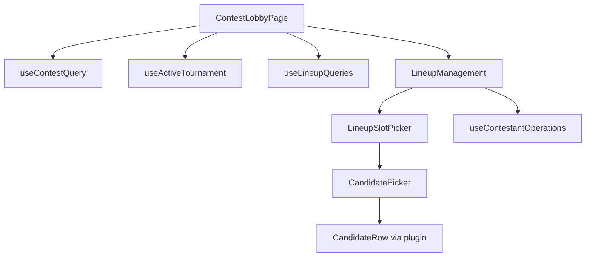

# Client component structure (v4)

Components are grouped by **platform vs sport** and by **feature domain**. Pages compose feature components; feature components call hooks.

---

## Platform shell (`components/platform/`)

Sport-agnostic building blocks. They accept platform types (`Candidate`, `ActiveEventResponse`) and delegate visual details to `SportUIPlugin`.

| Component | Purpose |
|-----------|---------|
| `SportEventHeader` | Event name, dates, status bar |
| `SportEventContextBar` | Compact context on sub-pages |
| `CandidatePicker` | Searchable candidate list for lineup build |
| `LineupSlotPicker` | Slot-based roster assembly |
| `SportLineupPickRow` | Single pick row with remove/replace |
| `SportPredictionField` | Wrapper → plugin prediction input |

Used by: lineup pages, contest lobby, onboarding.

---

## Sport chrome (`components/sport/`)

| Component | Purpose |
|-----------|---------|
| `SportPicker` | Nav dropdown — lists enabled sports from `GET /sports` |

---

## Sport plugins (`sports/pga-golf/`)

Registered via `pgaGolfUIPlugin` in `sports/pga-golf/index.tsx`:

| Export | Purpose |
|--------|---------|
| `CandidateRow` | Player row in picker (rank, name, status) |
| `PickDetail` | Expanded pick / scorecard modal content |
| `EventSummary` | Tournament preview sections |
| `EventDetails` | Course, weather, metadata panel |
| `PredictionField` | Winning-score prediction input |

Plugin interface: `packages/sport-sdk/src/ui-plugin.ts` (`SportUIPlugin`).

---

## Contest (`components/contest/`)

| Component | Purpose |
|-----------|---------|
| `ContestList` | Grid/list of contests for an event |
| `GroupedContestList` | Contests grouped by event (league view) |
| `CreateContestEventPicker` | Pick `eventId` when creating from a league |
| Contest cards, timeline, secondary market UI | Lobby sub-components |

Pages: `SportHubPage` (via `ContestListPage`), `ContestLobbyPage`, `ContestCreatePage`.

---

## Lineup (`components/lineup/`)

| Component | Purpose |
|-----------|---------|
| `LineupContestCard` | Lineup summary + linked contests |
| Lineup management in lobby | Join flow, pick editing |

Pages: `LineupListPage`, contest lobby.

---

## Tournament-named legacy (`components/tournament/`, `components/player/`)

Folders retain pre-v4 names but are fed by **adapters**, not `/api/tournaments`:

| Component | Data source |
|-----------|-------------|
| `TournamentInfoPanel` | `useActiveTournament` |
| `TournamentSummaryModal` | `summarySections` from event metadata |
| `PlayerDisplayRow` / `PlayerDisplayCard` | `PlayerWithTournamentData` from candidates |
| `PlayerDetailModal` | Candidate + live score fields |

These will shrink or rename in Phase 10.

---

## Leagues (`components/userGroup/`)

| Component | Purpose |
|-----------|---------|
| `LeagueCreateContestForm` | Create contest scoped to league + event |
| Group cards, member lists | Standard league CRUD UI |

Pages: `UserGroupListPage`, `UserGroupDetailPage`, etc. Routes under `/leagues/*`.

---

## Common (`components/common/`)

| Component | Purpose |
|-----------|---------|
| `AppLayout` | Nav, footer, sport picker |
| `ProtectedRoute` | Requires Privy session |
| `AdminRoute` | Requires `ADMIN` / `SUPER_ADMIN` |
| `OnboardingRedirectGate` | Onboarding funnel |
| `GlobalLoadingOverlay` | Initial load blocker |
| Modals, toasts, error boundaries | Shared UX |

Nav tabs defined in `lib/navTabs.ts` — contests tab points to `/sports/{defaultSport}`.

---

## Routing helpers (`components/routing/`)

| Component | Purpose |
|-----------|---------|
| `LegacyRedirects` | `/user-groups/*` → `/leagues/*`, old contest URLs |

---

## Composition example: contest lobby

---

## Adding a new sport (client)

1. Create `client/src/sports/{sport-id}/` implementing `SportUIPlugin`
2. Register in `sports/registry.ts`
3. Reuse platform shell components — no changes to `CandidatePicker` unless roster rules differ structurally
4. Ensure server `SportModule` is registered and sport appears in `GET /sports`
