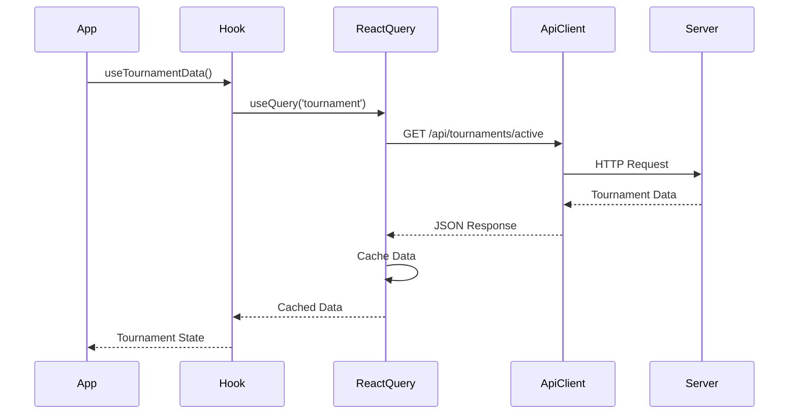
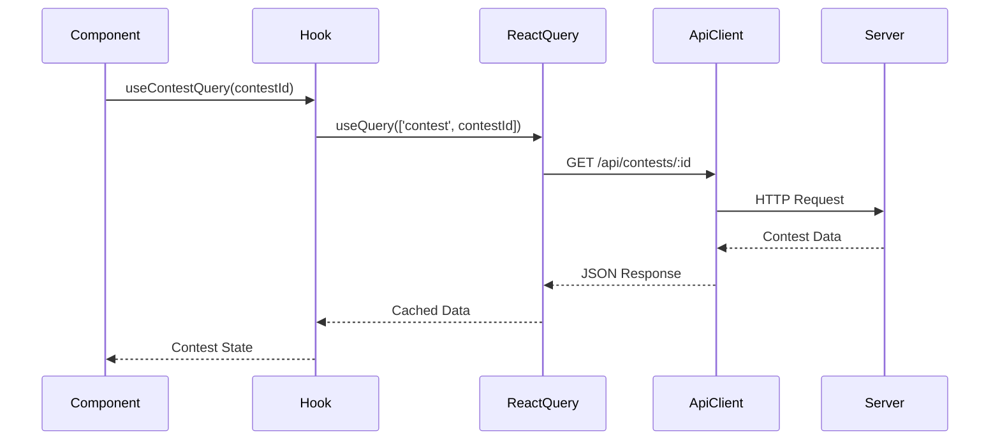
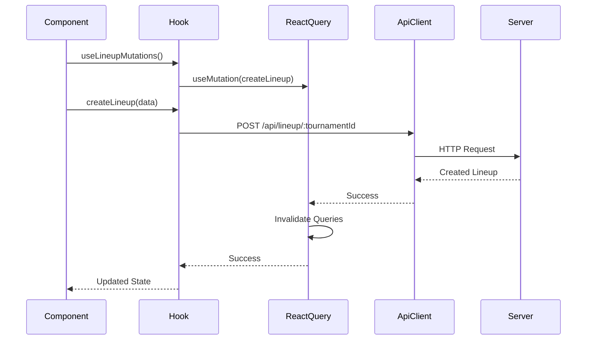
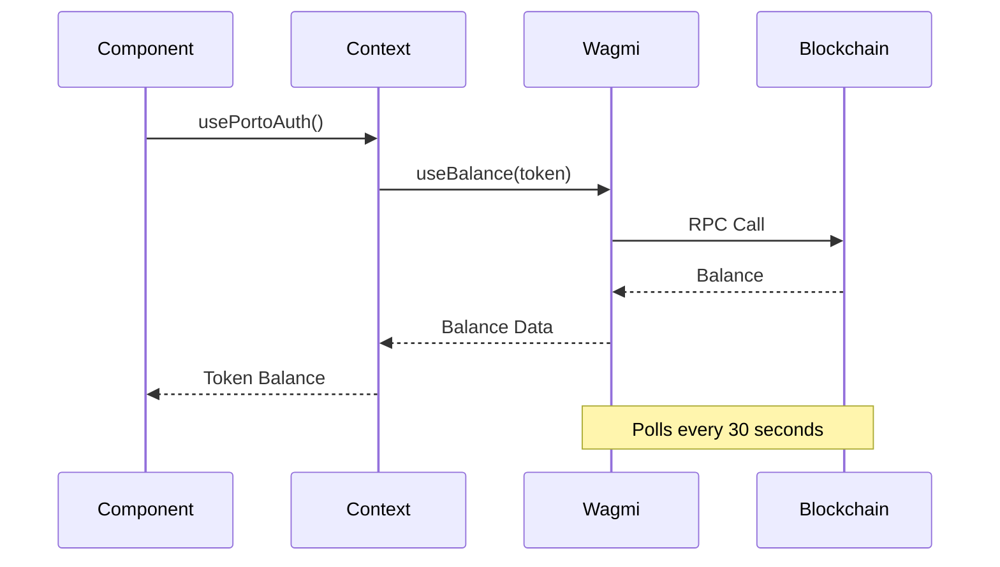
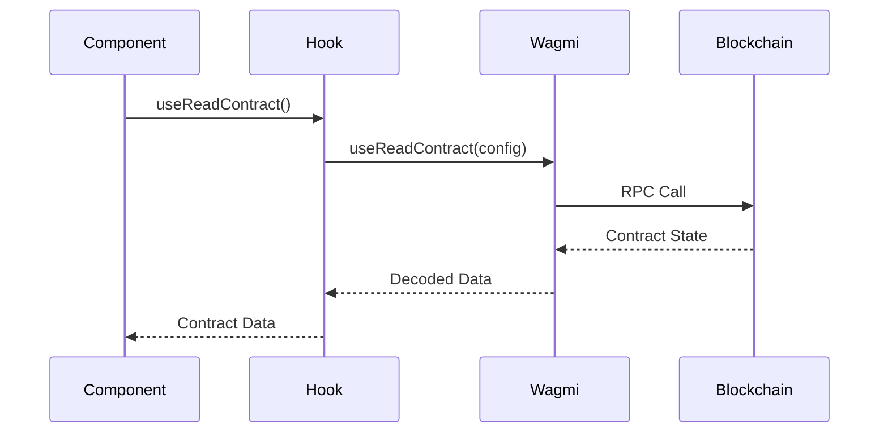
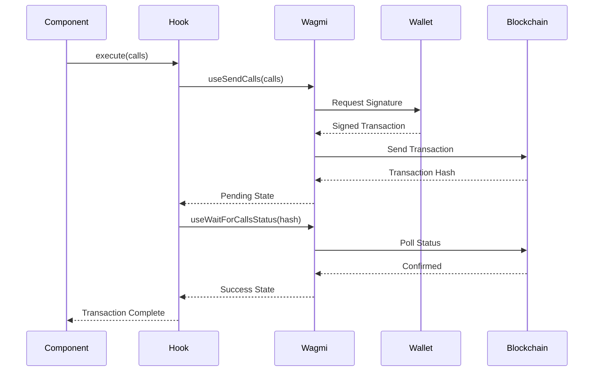
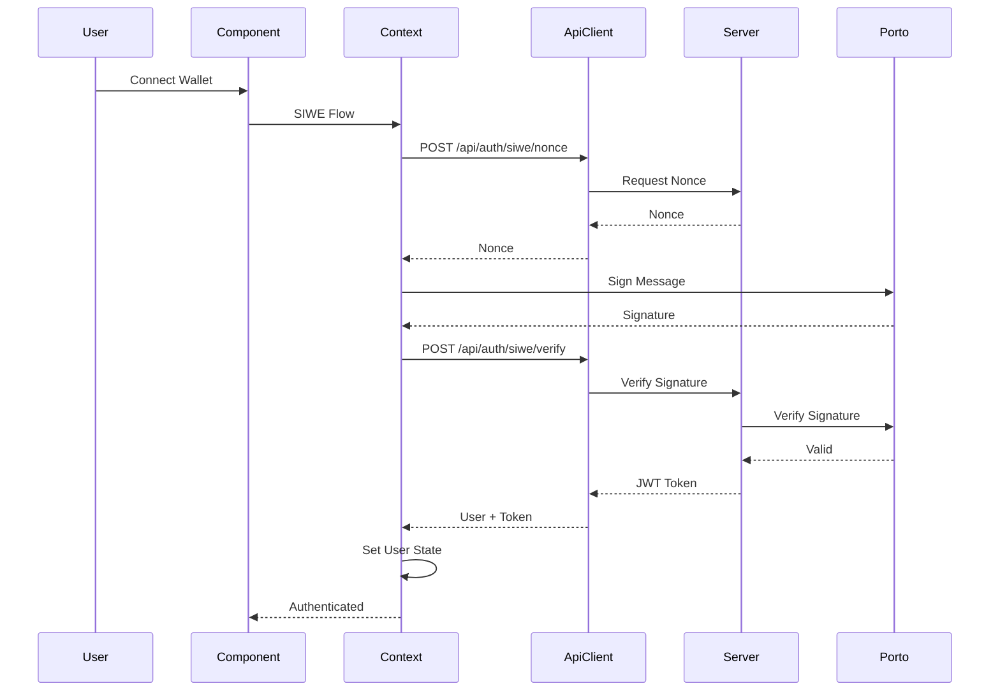
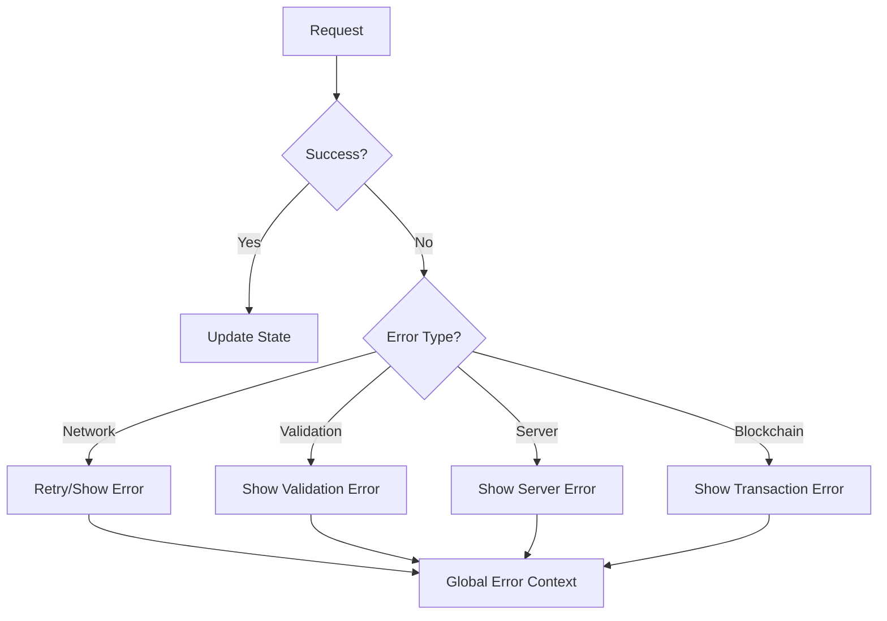

# Client Data Flow

## Data Flow Overview

The client receives data from two main sources:
1. **Server API**: Tournament data, contests, lineups, user data
2. **Blockchain**: Contract state, token balances, transactions

## Server Data Flow

### Tournament Data Flow

### Contest Data Flow

### Lineup Creation Flow

## Blockchain Data Flow

### Token Balance Flow

### Contract Read Flow

### Transaction Flow

## Authentication Flow

## Data Transformation

### Server Data → Component Props
1. **API Response**: Raw JSON from server
2. **React Query**: Cached and typed
3. **Custom Hook**: Transformed to component format
4. **Component**: Rendered in UI

### Blockchain Data → Component Props
1. **RPC Response**: Raw blockchain data
2. **Wagmi**: Decoded and typed
3. **Custom Hook**: Transformed to component format
4. **Component**: Rendered in UI

## Data Synchronization

### Server Data Sync
- **Automatic**: React Query refetches on focus/reconnect
- **Manual**: Invalidate queries after mutations
- **Polling**: Token balances polled every 30 seconds

### Blockchain Data Sync
- **Automatic**: Wagmi refetches on block updates
- **Polling**: Balances polled every 30 seconds
- **Events**: Contract events (if implemented)

## Cache Management

### React Query Cache
- **Key Structure**: `['resource', id]` or `['resource', params]`
- **Invalidation**: After mutations
- **Prefetching**: Tournament data on app load

### Wagmi Cache
- **Automatic**: Wagmi manages cache
- **Block-based**: Updates on new blocks
- **Configurable**: Can adjust cache settings

## Error Handling Flow

## Data Flow Patterns

### Read Pattern
1. Component requests data via hook
2. Hook checks cache
3. If cached and fresh, return cached data
4. If stale or missing, fetch from source
5. Update cache and return data

### Write Pattern
1. Component triggers mutation
2. Hook sends request to source
3. Source processes request
4. On success, invalidate related queries
5. Update UI with new data

### Optimistic Update Pattern
1. Component triggers mutation
2. Hook updates cache optimistically
3. Send request to source
4. On success, confirm update
5. On error, rollback and show error

## Performance Optimizations

### Prefetching
- Tournament data prefetched on app load
- Reduces initial load time
- Improves perceived performance

### Caching
- React Query caches server data
- Wagmi caches blockchain data
- Reduces redundant requests

### Polling Strategy
- Token balances: 30 seconds
- Tournament data: On focus/reconnect
- Contest data: On focus/reconnect

## Data Dependencies

### Tournament → Contests
- Contests depend on tournament data
- Invalidate contests when tournament updates

### Contest → Lineups
- Lineups depend on contest data
- Invalidate lineups when contest updates

### User → Everything
- Most data depends on user authentication
- Clear cache on logout

