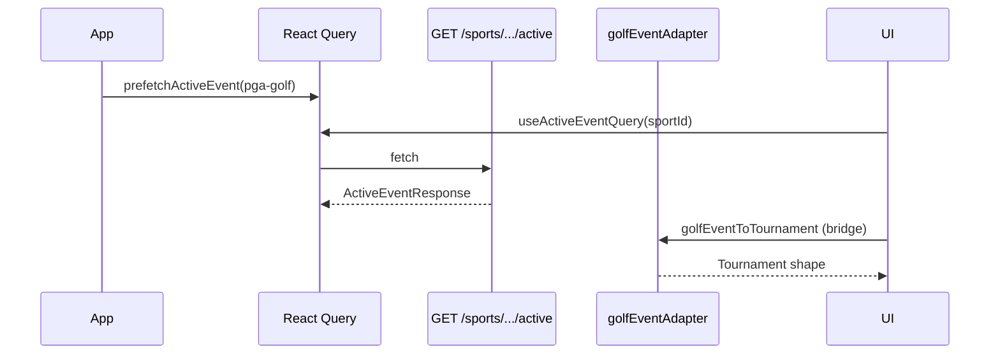
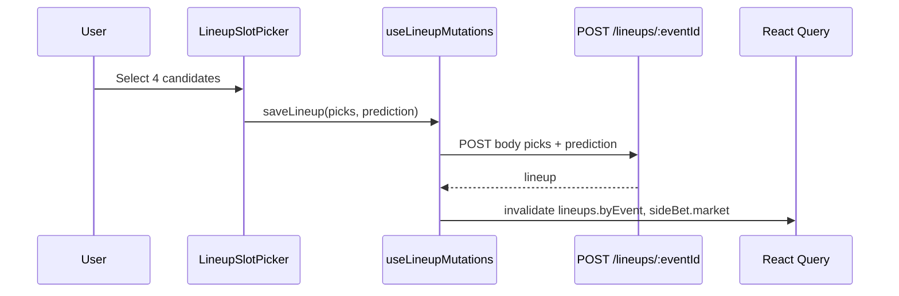
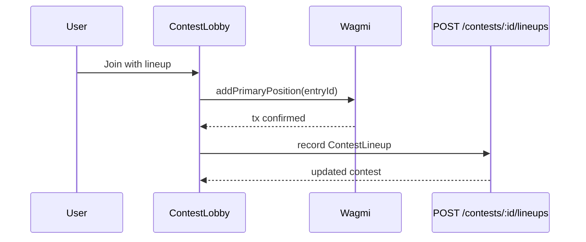
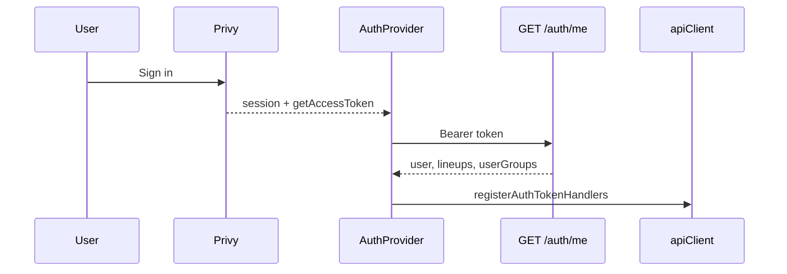

# Client data flow (v4)

---

## HTTP client

`utils/apiClient.ts`:

- Prefix: `/api`
- Attaches `Authorization: Bearer` from registered Privy `getAccessToken`
- Optional `X-Cut-Chain-Id` when chain-specific wallet resolution is needed
- Throws `ApiError` with `statusCode` for React Query error boundaries

---

## Query key conventions

`utils/queryKeys.ts` — invalidate by prefix:

| Key factory | API | Notes |
|-------------|-----|-------|
| `sports.list()` | `GET /sports` | |
| `sports.activeEvent(sportId)` | `GET /sports/:id/events/active` | |
| `sports.candidates(sportId, eventId)` | `GET .../candidates` | |
| `contests.byEvent(eventId, ...)` | `GET /contests?eventId=` | Replaces `byTournament` |
| `contests.byLobbyRoute(address)` | `GET /contests/:address` | |
| `lineups.byEvent(userId, eventId)` | `GET /lineups/:eventId` | User-scoped |
| `sideBet.market(lineupId)` | `GET /bets/side/lineup/:id/market` | |

Legacy `tournaments.*` keys remain for debug helpers only.

---

## Active event flow

```mermaid
sequenceDiagram
  participant App
  participant RQ as React Query
  participant API as GET /sports/.../active
  participant Adapter as golfEventAdapter
  participant UI

  App->>RQ: prefetchActiveEvent(pga-golf)
  UI->>RQ: useActiveEventQuery(sportId)
  RQ->>API: fetch
  API-->>RQ: ActiveEventResponse
  UI->>Adapter: golfEventToTournament (bridge)
  Adapter-->>UI: Tournament shape
```

`useActiveTournament` combines:

1. `useActiveEventQuery` — event metadata + status
2. `useEventCandidatesQuery` — field when `eventId` known
3. `mergeTournament` — shell + live fields

---

## Lineup save flow

```mermaid
sequenceDiagram
  participant User
  participant Picker as LineupSlotPicker
  participant Hook as useLineupMutations
  participant API as POST /lineups/:eventId
  participant RQ as React Query

  User->>Picker: Select 4 candidates
  Picker->>Hook: saveLineup(picks, prediction)
  Hook->>API: POST body picks + prediction
  API-->>Hook: lineup
  Hook->>RQ: invalidate lineups.byEvent, sideBet.market
```

Server validates roster via `SportModule.validateRoster` and marks side-bet quote stale.

---

## Contest join flow

```mermaid
sequenceDiagram
  participant User
  participant UI as ContestLobby
  participant Chain as Wagmi
  participant API as POST /contests/:id/lineups

  User->>UI: Join with lineup
  UI->>Chain: addPrimaryPosition(entryId)
  Chain-->>UI: tx confirmed
  UI->>API: record ContestLineup
  API-->>UI: updated contest
```

Order: **on-chain first**, then server indexes the entry. Server links `lineupId` + `entryId`.

---

## Contest list flow

`ContestListPage` / `SportHubPage`:

1. `useSportContext()` → `sportId`
2. `useActiveEventQuery(sportId)` → `eventId`
3. `useContestsQuery({ eventId, chainId, userGroupId? })` → `GET /contests?eventId=`

League detail uses `useUserGroupContestsQuery` → `GET /userGroups/:id/contests` (cross-event with `eventSummary`).

---

## Side bets (when enabled)

| Step | Hook / API |
|------|------------|
| Load market | `GET /bets/side/lineup/:lineupId/market` |
| Place ticket | `POST /bets/side/tickets` |
| User tickets | `GET /bets/side/tickets` |

Invalidate `sideBet.market(lineupId)` after lineup save.

---

## Auth flow

```mermaid
sequenceDiagram
  participant User
  participant Privy
  participant Auth as AuthProvider
  participant API as GET /auth/me

  User->>Privy: Sign in
  Privy-->>Auth: session + getAccessToken
  Auth->>API: Bearer token
  API-->>Auth: user, lineups, userGroups
  Auth->>apiClient: registerAuthTokenHandlers
```

`AuthProvider` polls token balances on an interval (~30s) for display in nav/account.

---

## Prefetch strategy

| When | What |
|------|------|
| App mount | `prefetchActiveEvent` for default sport |
| Contest lobby navigation | contest query by address |
| After mutation | targeted `queryClient.invalidateQueries` |

Stale times: sports 24h, active event/candidates 5m (see `useSportData.ts`).

---

## Error handling

- `ApiError` 404 on active event → UI shows "no active event" state
- React Query retries transient network errors
- `GlobalErrorContext` for user-visible fatal errors
- Wagmi tx errors surfaced in contest/token hooks with user-readable messages
