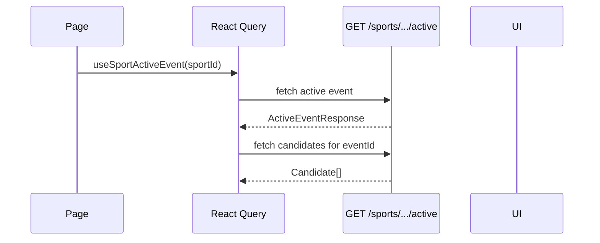
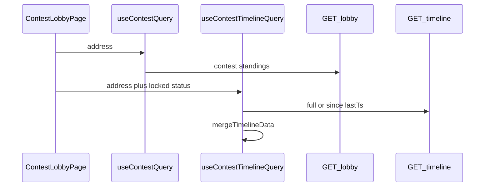
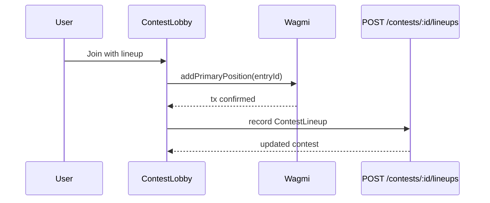
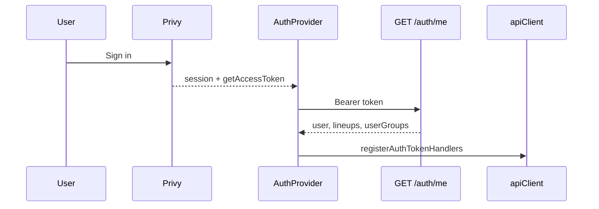

# Client data flow (v4)

---

## HTTP client

`utils/apiClient.ts`:

- Prefix: `/api`
- Attaches `Authorization: Bearer` from registered Privy `getAccessToken`
- Optional `X-Cut-Chain-Id` when chain-specific wallet resolution is needed
- Throws `ApiError` with `statusCode` for React Query error boundaries

---

## Query key conventions

`utils/queryKeys.ts` — invalidate by prefix:

| Key factory | API | Notes |
|-------------|-----|-------|
| `sports.list()` | `GET /sports` | |
| `sports.activeEvent(sportId)` | `GET /sports/:id/events/active` | |
| `sports.candidates(sportId, eventId)` | `GET .../candidates` | |
| `contests.byEvent(eventId, ...)` | `GET /contests?eventId=` | Replaces `byTournament` |
| `contests.directory(scope, ...)` | `GET /contests/directory?scope=` | Multi-sport hub list |
| `contests.byLobbyRoute(address)` | `GET /contests/:address/lobby` | Standings/status only — no timeline |
| `contests.timeline(address)` | `GET /contests/:address/timeline` | Chart history; refreshes use `?since=` |
| `lineups.byEvent(userId, eventId)` | `GET /lineups/:eventId` | User-scoped; response includes `PlatformLineup.score` |
| `sideBet.market(lineupId)` | `GET /bets/side/lineup/:id/market` | |

---

## Event data sources

Two explicit sources — no global active-event hook:

| Surface | Hook | API |
|---------|------|-----|
| Sport hub, leaderboard, onboarding | `useSportActiveEvent(sportId)` | `GET /sports/:sportId/events/active` + candidates |
| Contest lobby | `useContestEvent(contest)` via `ContestEventScopeProvider` | `contest.event` + `GET .../events/:eventId/candidates` |

```mermaid
sequenceDiagram
  participant Page
  participant RQ as React Query
  participant API as GET /sports/.../active
  participant UI

  Page->>RQ: useSportActiveEvent(sportId)
  RQ->>API: fetch active event
  API-->>RQ: ActiveEventResponse
  RQ->>API: fetch candidates for eventId
  API-->>RQ: Candidate[]
```

Contest lobby follows the same pattern with `useContestEvent` keyed on `contest.eventId`.

---

## Lineup save flow

```mermaid
sequenceDiagram
  participant User
  participant Picker as CandidatePicker
  participant Hook as useLineupMutations
  participant API as POST /lineups/:eventId
  participant RQ as React Query

  User->>Picker: Select 4 candidates
  Picker->>Hook: saveLineup(picks, prediction)
  Hook->>API: POST body picks + prediction
  API-->>Hook: lineup
  Hook->>RQ: invalidate lineups.byEvent, sideBet.market
```

`useLineupMutations` passes `eventParticipantId` picks directly to the API. Server validates roster via `SportModule.validateRoster` and marks side-bet quote stale.

---

## Contest lobby flow

`/contest/:address` loads two queries in parallel after the contest status is known:

| Hook | Key | API | Refresh |
|------|-----|-----|---------|
| `useContestQuery` | `contests.byLobbyRoute(address)` | `GET /contests/:address/lobby` | 5m poll + focus while ACTIVE/LOCKED |
| `useContestTimelineQuery` | `contests.timeline(address)` | `GET /contests/:address/timeline` (`?since=` on refresh) | Same cadence while ACTIVE/LOCKED; enabled only when primary entry is locked (`status !== OPEN`) |

Timeline `queryFn` merges deltas into the cached full series (`mergeTimelineData`). Lobby standings are replaced wholesale each fetch.

Join/leave optimistically patches `byLobbyRoute` and matching directory cache entries, then invalidates `contests.all` on success.

```mermaid
sequenceDiagram
  participant Page as ContestLobbyPage
  participant ContestQ as useContestQuery
  participant TimelineQ as useContestTimelineQuery
  participant LobbyAPI as GET_lobby
  participant TimelineAPI as GET_timeline

  Page->>ContestQ: address
  ContestQ->>LobbyAPI: contest standings
  Page->>TimelineQ: address plus locked status
  TimelineQ->>TimelineAPI: full or since lastTs
  TimelineQ->>TimelineQ: mergeTimelineData
```

---

## Contest join flow

```mermaid
sequenceDiagram
  participant User
  participant UI as ContestLobby
  participant Chain as Wagmi
  participant API as POST /contests/:id/lineups

  User->>UI: Join with lineup
  UI->>Chain: addPrimaryPosition(entryId)
  Chain-->>UI: tx confirmed
  UI->>API: record ContestLineup
  API-->>UI: updated contest
```

Order: **on-chain first**, then server indexes the entry. Server links `lineupId` + `entryId`.

---

## Contest list flow

**Multi-sport hub** (`/contests`): `useContestDirectory("all")` → `GET /contests/directory?scope=all` (upcoming / live / past sections). `staleTime: 15m`, focus refetch when stale; no interval poll.

**Sport hub** (`/sports/:sportId`):

1. `useParams().sportId`
2. `useSportActiveEvent(sportId)` → `eventId`
3. `useContestsQuery(eventId, ...)` → `GET /contests?eventId=`

League detail uses `useUserGroupContestsQuery` → `GET /userGroups/:id/contests` (cross-event with `eventSummary`).

---

## Side bets (when enabled)

| Step | Hook / API |
|------|------------|
| Load market | `GET /bets/side/lineup/:lineupId/market` |
| Place ticket | `POST /bets/side/tickets` |
| User tickets | `GET /bets/side/tickets` |

Invalidate `sideBet.market(lineupId)` after lineup save.

---

## Auth flow

```mermaid
sequenceDiagram
  participant User
  participant Privy
  participant Auth as AuthProvider
  participant API as GET /auth/me

  User->>Privy: Sign in
  Privy-->>Auth: session + getAccessToken
  Auth->>API: Bearer token
  API-->>Auth: user, lineups, userGroups
  Auth->>apiClient: registerAuthTokenHandlers
```

`AuthProvider` polls token balances on an interval (~30s) for display in nav/account.

---

## Cache strategy

| When | What |
|------|------|
| Route mount | React Query fetches on demand (no app-wide event prefetch) |
| Contest lobby navigation | Lobby standings + separate timeline query (timeline gated until entry locked) |
| After mutation | targeted `queryClient.invalidateQueries`; join/leave also optimistic-patch lobby + directory |

Stale times: sports 24h, active event/candidates 5m (see `useSportData.ts`). Lobby/timeline live poll matches server cron (`SERVER_SYNC_INTERVAL_MS`).

---

## Error handling

- `ApiError` 404 on active event → UI shows "no active event" state
- React Query retries transient network errors
- `GlobalErrorContext` for user-visible fatal errors
- Wagmi tx errors surfaced in contest/token hooks with user-readable messages
