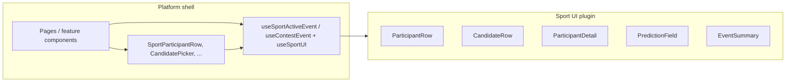

# Sport UI plugins — boundaries and conventions

How the v4 client splits **platform shell** (sport-agnostic) from **sport UI plugins** (presentation). This is the as-built reference for `ParticipantRow` / `CandidateRow` and remaining platform leaks.

**Related:** [Plugin system (server + client contracts)](../platform/plugins.md) · [Component structure](component-structure.md) · [Platform architecture](../../docs/platform-architecture.md)

---

## Mental model



| Layer | Owns | Does not own |
|-------|------|----------------|
| **Platform** | Routing, contest/lineup flows, `Candidate[]` fetching, `EventStatus`, lineup totals from API, when lists open modals | Player row layout, Stableford display, golf round thru/par, scorecard hole table, prediction input UX |
| **Sport plugin** | How a `Candidate` renders in each slot; sport metadata inside `candidate.metadata`; scorecard primitives | API calls, lineup save, contest join, global nav |

**Data rule:** Platform code passes `Candidate` + `EventStatus` (+ optional `eventMetadata`). It does not pass legacy player types or sport-specific presentation props. Golf reads `roundDisplay` from `eventMetadata` inside the plugin.

**Lineup rule:** Rosters are `lineup.picks[]` keyed by `eventParticipantId`. Resolve full `Candidate` rows via contest/sport event candidates and `candidatesByEventParticipantIdMap` ([`candidateUtils.ts`](../../client/src/lib/candidateUtils.ts)).

**Score rule:** Lineup totals come from the server — `ContestLineup.score` (contest entries) or `PlatformLineup.score` (sum of pick totals on lineup fetch). Platform uses [`lineupScore.ts`](../../client/src/lib/lineupScore.ts); it does not sum sport-specific points client-side.

---

## Contract: `SportUIPlugin`

**Interface:** [`packages/sport-sdk/src/sport-ui-plugin.ts`](../../packages/sport-sdk/src/sport-ui-plugin.ts)  
**Registry:** [`client/src/sports/registry.ts`](../../client/src/sports/registry.ts)  
**Golf:** [`client/src/sports/pga-golf/index.tsx`](../../client/src/sports/pga-golf/index.tsx) → `pgaGolfUIPlugin`

| Slot | Required | Props (summary) | Purpose |
|------|----------|-----------------|--------|
| `CandidateRow` | yes | `candidate`, `onSelect?`, `isSelected?`, `disabled?`, `status?`, `eventMetadata?` | **Picker only** — lineup slot selection UI |
| `ParticipantRow` | yes | `candidate`, `status`, `onClick?`, `ownershipPercentage?`, `eventMetadata?` | **Display lists** — read-only or clickable rows |
| `ParticipantDetail` | yes | `candidate`, `status`, `rowTrailing?`, `onShare?`, `eventMetadata?` | **Detail modal** — scorecard header, round tabs, hole table |
| `PredictionField` | no | `value`, `onChange`, `disabled?`, `error?` | Sport-specific tie-break / prediction input |
| `EventSummary` | no | `{ event: CompetitionEventShell }` | Event hero in page header |
| `candidateSortConfig` | yes | `CandidateSortConfig` from sport package | Sort key order for picker, leaderboard, and lineup pick lists |

### `CandidateRow` vs `ParticipantRow`

| | `CandidateRow` | `ParticipantRow` |
|--|----------------|------------------|
| **Used in** | `CandidatePicker` | Leaderboard, lineup cards, contest entries, live picker rows |
| **Interaction** | Select / deselect (optional button chrome) | Optional `onClick` (e.g. open detail modal) |
| **`status`** | Optional — plugin falls back to `EventScopeContext` on contest lobby, else `SCHEDULED` | **Platform passes** `status` (`SCHEDULED` \| `LIVE` \| `COMPLETE`) |
| **`eventMetadata`** | Optional — plugin falls back to `EventScopeContext` on contest lobby | Optional — `SportParticipantRow` passes explicit value or `EventScopeContext.metadata` |
| **Golf scheduled** | `CandidateSelectionCard` (rank, photo, OWGR card) | Name + country only |
| **Golf live/complete** | Delegates to `GolfParticipantRow` | Full leaderboard row (pos, thru, PTS, icons) |

Do not use `CandidateRow` in leaderboard or contest entry lists. Do not use `ParticipantRow` inside the picker without the `CandidateRow` wrapper (selection chrome lives in `GolfCandidateRow`).

---

## Platform shell components

Location: [`client/src/components/platform/`](../../client/src/components/platform/)

| Component | Resolves plugin | Used by |
|-----------|-----------------|---------|
| [`SportParticipantRow`](../../client/src/components/platform/SportParticipantRow.tsx) | `ParticipantRow` | Leaderboard, contest entry modal/list, lineup card (read-only slots) |
| [`SportParticipantDetailModal`](../../client/src/components/platform/SportParticipantDetailModal.tsx) | `ParticipantDetail` | Leaderboard, lineup card, contest entry modal (click row → scorecard) |
| [`SportLineupPickRow`](../../client/src/components/platform/SportLineupPickRow.tsx) | `SportParticipantRow` → `ParticipantRow` | Editable lineup slots on `LineupContestCard` |
| [`CandidatePicker`](../../client/src/components/platform/CandidatePicker.tsx) | `CandidateRow` | `LineupContestCard` slot editor |
| [`SportPredictionField`](../../client/src/components/platform/SportPredictionField.tsx) | `PredictionField` | `LineupContestCard` winning-score slider |
| [`SportEventHeader`](../../client/src/components/platform/SportEventHeader.tsx) | `EventSummary` | Leaderboard page only (`sportId` prop → `useSportActiveEvent`) |

Contest lobby renders plugin `EventSummary` directly in [`ContestLobbyView`](../../client/src/components/contest/lobby/ContestLobbyView.tsx) — not via `AppLayout`.

Hooks:

| Hook | Role |
|------|------|
| [`useSportActiveEvent`](../../client/src/hooks/useSportActiveEvent.ts) | Sport-scoped active event — hub, leaderboard, onboarding |
| [`useContestEvent`](../../client/src/hooks/useContestEvent.ts) | Contest-scoped event — lobby via `ContestEventScopeProvider` |
| [`useSportUIPlugin`](../../client/src/hooks/useSportUI.ts) | Resolve `SportUIPlugin` from explicit `sportId` or `EventScopeContext` |
| [`useCandidateSort`](../../client/src/hooks/useCandidateSort.ts) | Sort `Candidate[]` via plugin `candidateSortConfig` + `@cut/sport-sdk` `sortCandidates` |

---

## Golf plugin (`pga-golf`)

Registered slots and plugin-local modules:

| Path | Role |
|------|------|
| [`CandidateRow.tsx`](../../client/src/sports/pga-golf/CandidateRow.tsx) | Picker row; live/complete delegates to `ParticipantRow` |
| [`ParticipantRow.tsx`](../../client/src/sports/pga-golf/ParticipantRow.tsx) | Leaderboard / list row layout |
| [`ParticipantDetail.tsx`](../../client/src/sports/pga-golf/ParticipantDetail.tsx) | Detail modal — header, round tabs, scorecard |
| [`CandidateSelectionCard.tsx`](../../client/src/sports/pga-golf/CandidateSelectionCard.tsx) | Scheduled picker card body (internal) |
| [`PredictionField.tsx`](../../client/src/sports/pga-golf/PredictionField.tsx) | Winning-score prediction slider |
| [`EventSummary.tsx`](../../client/src/sports/pga-golf/EventSummary.tsx) | Event hero; embeds `EventDetails` |
| [`EventDetails.tsx`](../../client/src/sports/pga-golf/EventDetails.tsx) | Course / weather text (not on `SportUIPlugin` interface) |
| [`utils.ts`](../../client/src/sports/pga-golf/utils.ts) | Metadata parsing, per-player Stableford for row display |
| [`types.ts`](../../client/src/sports/pga-golf/types.ts) | `RoundData`, `TournamentPlayerData` (scorecard shapes) |
| [`eventMedia.ts`](../../client/src/sports/pga-golf/eventMedia.ts) | Hero image URL fallback |
| [`scorecard/ScoreDisplay.tsx`](../../client/src/sports/pga-golf/scorecard/ScoreDisplay.tsx) | Score vs par chips, Stableford cell display |
| [`scorecard/ParticipantScorecard.tsx`](../../client/src/sports/pga-golf/scorecard/ParticipantScorecard.tsx) | Hole-by-hole table for detail modal |
| [`scorecard/roundUtils.ts`](../../client/src/sports/pga-golf/scorecard/roundUtils.ts) | Round labels, tee times, thru/par formatting |

Golf `ParticipantRow` uses `parseGolfEventMetadata(eventMetadata).roundDisplay` for thru/par — **not** a prop from the platform beyond `eventMetadata`.

---

## Where plugin slots appear (production pages)

| UI surface | Row component | Data source |
|------------|---------------|-------------|
| [`LeaderboardPage`](../../client/src/pages/LeaderboardPage.tsx) | `SportParticipantRow` | `useSportActiveEvent(sportId).candidates` |
| [`LineupContestCard`](../../client/src/components/lineup/LineupContestCard.tsx) — view | `SportParticipantRow` | `lineup.picks` → `candidatesForPlatformLineup` |
| [`LineupContestCard`](../../client/src/components/lineup/LineupContestCard.tsx) — edit | `SportLineupPickRow` | `useLineupSlotEditor` slots (`Candidate[]`) |
| [`LineupContestCard`](../../client/src/components/lineup/LineupContestCard.tsx) — picker | `CandidatePicker` → `CandidateRow` | contest event candidates |
| [`ContestEntryList`](../../client/src/components/contest/ContestEntryList.tsx) / [`ContestEntryModal`](../../client/src/components/contest/ContestEntryModal.tsx) | `SportParticipantRow` | `contestLineup.lineup.picks` + candidates cache |
| [`PredictionLineupsList`](../../client/src/components/contest/PredictionLineupsList.tsx) | (text summary only) | `lineup.picks` + `participantLastName` — no row plugin |
| [`EventLineupsPanel`](../../client/src/components/platform/EventLineupsPanel.tsx) | `LineupContestCard` | contest-scoped lineups + create/copy |
| [`ContestLobbyView`](../../client/src/components/contest/lobby/ContestLobbyView.tsx) | `EventSummary` | `useContestEvent(contest)` |

Detail modal: [`SportParticipantDetailModal`](../../client/src/components/platform/SportParticipantDetailModal.tsx) → plugin `ParticipantDetail`.

Lineup header PTS: [`lineupDisplayScore`](../../client/src/lib/lineupScore.ts) from `ContestLineup.score` / `PlatformLineup.score`.

---

## Platform utilities (not plugins)

| Module | Purpose |
|--------|---------|
| [`candidateUtils.ts`](../../client/src/lib/candidateUtils.ts) | Map `lineup.picks` → `Candidate[]`, display names |
| [`candidateSorting.ts`](../../client/src/lib/candidateSorting.ts) | Display helpers (`participantLastName`, `externalIdFromCandidate`) |
| [`useCandidateSort`](../../client/src/hooks/useCandidateSort.ts) | Multi-sport list sorting via `sortKeys` + plugin config |
| [`lineupUtils.ts`](../../client/src/lib/lineupUtils.ts) | `platformLineupEventParticipantIds`, prediction helpers |
| [`lineupScore.ts`](../../client/src/lib/lineupScore.ts) | Display score from API — no client-side sport aggregation |
| [`sportPrediction.ts`](../../client/src/lib/sportPrediction.ts) | `{ type: "winningLineupTotal", value }` parse/serialize |
| [`useSportPredictionRules`](../../client/src/hooks/useSportPredictionRules.ts) | Per-sport slider range from `GET /sports` |

---

## Conventions for new code

1. **Fetch candidates once** per surface: `useSportActiveEvent(sportId)`, `useContestEvent(contest)`, or `useEventCandidatesQuery(sportId, eventId)`.
2. **Pass `status`** into `SportParticipantRow` — required; parent already has it from the event hook.
3. **Pass `eventMetadata`** when the parent has it; `SportParticipantRow` falls back to `EventScopeContext` on contest lobby.
4. **Contest lineups:** use `lineup.lineup.picks`. Use `contestLineupDisplayName(lineup)` for names.
5. **Lineup totals:** use `lineupDisplayScore(contestLineup)` or `lineup.score` / `platformLineup.score` — never import plugin utils for aggregation.
6. **Slot editor:** `useLineupSlotEditor` works in `Candidate[]`; saves `eventParticipantId[]`.
7. **New sport:** implement `SportUIPlugin` in `client/src/sports/{sport-id}/`, register in `registry.ts`. Populate `sortKeys` in `build*Candidates`, export `*CandidateSortConfig`, attach to plugin. Reuse platform shells unchanged.
8. **Do not** add presentation props to `ParticipantRowProps` for one-off UI. Round tab state lives inside `ParticipantDetail`.

---

## Remaining platform leaks

Golf-specific logic still in platform code. **Do not extend**; migrate when adding a second sport.

| Item | Location | Notes |
|------|----------|-------|
| Lineup total prediction | `lib/sportPrediction.ts`, `useSportPredictionRules`, `SportPredictionField` | Plugin wraps slider; platform owns canonical JSON shape |
| Event round display | `useSportActiveEvent` exposes `roundDisplay` | Golf metadata field on platform hook |
| Home demo | `InfoScorecard` imports plugin `ScoreDisplay` | Marketing-only cross-boundary import |

---

## Quick decision tree

```
Need to show a participant in a list?
  → SportParticipantRow(candidate, status, eventMetadata?)

Need to pick a participant for a lineup slot?
  → CandidatePicker → CandidateRow

Need editable lineup slot with edit button?
  → SportLineupPickRow

Need winning-score prediction?
  → SportPredictionField

Need hole-by-hole scorecard modal?
  → SportParticipantDetailModal → ParticipantDetail plugin

Need event hero on leaderboard?
  → SportEventHeader sportId={sportId}

Need event hero on contest lobby?
  → ContestLobbyView → plugin EventSummary

Need lineup total PTS?
  → lineupDisplayScore(contestLineup) or lineup.score from API
```
