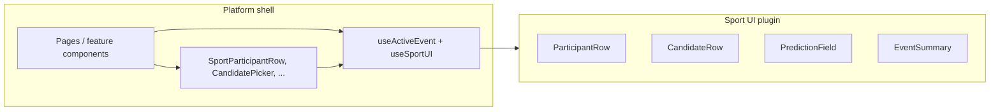

# Sport UI plugins — boundaries and conventions

How the v4 client splits **platform shell** (sport-agnostic) from **sport UI plugins** (presentation). This is the as-built reference for `ParticipantRow` / `CandidateRow` and what remains legacy.

**Related:** [Plugin system (server + client contracts)](../platform/plugins.md) · [Component structure](component-structure.md) · [PLATFORM_ARCHITECTURE.md](../../PLATFORM_ARCHITECTURE.md)

---

## Mental model



| Layer | Owns | Does not own |
|-------|------|----------------|
| **Platform** | Routing, contest/lineup flows, `Candidate[]` fetching, `EventStatus`, when lists open modals | Player names layout, Stableford display, golf round thru/par, prediction input UX |
| **Sport plugin** | How a `Candidate` renders in each slot; sport metadata inside `candidate.metadata` | API calls, lineup save, contest join, global nav |

**Data rule:** Platform code passes `Candidate` + `EventStatus`. It does not pass `PlayerWithTournamentData`, `roundDisplay`, or `scoringMode`. Golf reads `roundDisplay` from active event metadata inside the plugin via `useActiveEvent()`.

**Lineup rule:** Rosters are `lineup.picks[]` with `participant.id`. Resolve full `Candidate` rows via `useActiveEvent().candidates` and `candidatesByParticipantIdMap` ([`candidateUtils.ts`](../../client/src/lib/candidateUtils.ts)).

---

## Contract: `SportUIPlugin`

**Interface:** [`packages/sport-sdk/src/sport-ui-plugin.ts`](../../packages/sport-sdk/src/sport-ui-plugin.ts)  
**Registry:** [`client/src/sports/registry.ts`](../../client/src/sports/registry.ts)  
**Golf:** [`client/src/sports/pga-golf/index.tsx`](../../client/src/sports/pga-golf/index.tsx) → `pgaGolfUIPlugin`

| Slot | Required | Props (summary) | Purpose |
|------|----------|-----------------|--------|
| `CandidateRow` | yes | `candidate`, `onSelect?`, `isSelected?`, `disabled?` | **Picker only** — lineup slot selection UI |
| `ParticipantRow` | yes | `candidate`, `status`, `onClick?`, `ownershipPercentage?` | **Display lists** — read-only or clickable rows |
| `ParticipantDetail` | yes | `candidate`, `status`, `rowTrailing?`, `onShare?` | **Detail modal** — scorecard header, round tabs, hole table |
| `PredictionField` | no | `value`, `onChange`, `disabled?`, `error?` | Sport-specific tie-break / prediction input |
| `EventSummary` | no | `{ event: CompetitionEventShell }` | Event hero / preview in header |

`PickDetail` was removed. Lineup slots and all display lists use `ParticipantRow` (via platform shells).

### `CandidateRow` vs `ParticipantRow`

| | `CandidateRow` | `ParticipantRow` |
|--|----------------|------------------|
| **Used in** | `CandidatePicker` / `LineupSlotPicker` | Leaderboard, lineup cards, contest entries, live picker rows |
| **Interaction** | Select / deselect (optional button chrome) | Optional `onClick` (e.g. open detail modal) |
| **`status`** | Not passed — plugin reads `useActiveEvent()` internally for scheduled vs live picker mode | **Platform passes** `status` (`SCHEDULED` \| `LIVE` \| `COMPLETE`) |
| **Golf scheduled** | `CandidateSelectionCard` (rank, photo, OWGR card) | Name + country only |
| **Golf live/complete** | Delegates to `GolfParticipantRow` | Full leaderboard row (pos, thru, PTS, icons) |

Do not use `CandidateRow` in leaderboard or contest entry lists. Do not use `ParticipantRow` inside the picker without the `CandidateRow` wrapper (selection chrome lives in `GolfCandidateRow`).

---

## Platform shell components

Location: [`client/src/components/platform/`](../../client/src/components/platform/)

| Component | Resolves plugin | Used by |
|-----------|-----------------|---------|
| [`SportParticipantRow`](../../client/src/components/platform/SportParticipantRow.tsx) | `ParticipantRow` | Leaderboard, contest entry modal/list, lineup card (read-only slots) |
| [`SportParticipantDetailModal`](../../client/src/components/platform/SportParticipantDetailModal.tsx) | `ParticipantDetail` | Leaderboard, lineup card, contest entry modal (click row → scorecard) |
| [`SportParticipantDetailModal.stories.tsx`](../../client/src/components/platform/SportParticipantDetailModal.stories.tsx) | Storybook | Open + interactive modal |
| [`SportLineupPickRow`](../../client/src/components/platform/SportLineupPickRow.tsx) | `SportParticipantRow` → `ParticipantRow` | Editable lineup slots on `LineupContestCard` |
| [`CandidatePicker`](../../client/src/components/platform/CandidatePicker.tsx) | `CandidateRow` | `LineupSlotPicker` |
| [`LineupSlotPicker`](../../client/src/components/platform/LineupSlotPicker.tsx) | `CandidatePicker` | `LineupContestCard` slot editor |
| [`SportPredictionField`](../../client/src/components/platform/SportPredictionField.tsx) | `PredictionField` | `LineupContestCard` winning-score slider |
| [`SportEventHeader`](../../client/src/components/platform/SportEventHeader.tsx) | `EventSummary` | Hub, context bar |
| [`SportEventContextBar`](../../client/src/components/platform/SportEventContextBar.tsx) | `SportEventHeader` | `AppLayout` on sport-scoped routes |

Hooks:

| Hook | Role |
|------|------|
| [`useActiveEvent`](../../client/src/hooks/useActiveEvent.ts) | **Primary** — `eventId`, `status`, `candidates`, `isEventEditable` |
| [`useSportUIPlugin`](../../client/src/hooks/useSportUI.ts) | Resolve `SportUIPlugin` from `SportContext.sportId` |
| [`useSportEventHeader`](../../client/src/hooks/useSportEventHeader.ts) | Active event query + optional `EventSummary` component |

---

## Golf plugin (`pga-golf`)

| File | Export | Role |
|------|--------|------|
| [`CandidateRow.tsx`](../../client/src/sports/pga-golf/CandidateRow.tsx) | `GolfCandidateRow` | Scheduled: card + checkmark chrome; live/complete: `ParticipantRow` |
| [`ParticipantRow.tsx`](../../client/src/sports/pga-golf/ParticipantRow.tsx) | `GolfParticipantRow` | List row layout (ported from legacy `PlayerDisplayRow`) |
| [`ParticipantDetail.tsx`](../../client/src/sports/pga-golf/ParticipantDetail.tsx) | `GolfParticipantDetail` | Detail modal header, R1–R4/CUT/POS tabs, scorecard |
| [`ParticipantScorecard.tsx`](../../client/src/sports/pga-golf/ParticipantScorecard.tsx) | (internal) | Hole-by-hole table for `GolfParticipantDetail` |
| [`ParticipantDetail.stories.tsx`](../../client/src/sports/pga-golf/ParticipantDetail.stories.tsx) | Storybook | Live, scheduled, complete variants |
| [`CandidateSelectionCard.tsx`](../../client/src/sports/pga-golf/CandidateSelectionCard.tsx) | (internal) | Scheduled picker card body |
| [`PredictionField.tsx`](../../client/src/sports/pga-golf/PredictionField.tsx) | `GolfPredictionField` | Winning-score prediction slider |
| [`EventSummary.tsx`](../../client/src/sports/pga-golf/EventSummary.tsx) | `GolfEventSummary` | Header; embeds `GolfEventDetails` |
| [`EventDetails.tsx`](../../client/src/sports/pga-golf/EventDetails.tsx) | `GolfEventDetails` | Course / weather / metadata (not on `SportUIPlugin` interface — golf-only helper) |

Golf `ParticipantRow` uses `parseGolfEventMetadata(event?.metadata).roundDisplay` for thru/par — **not** a prop from the platform.

---

## Where plugin slots appear (production pages)

| UI surface | Row component | Data source |
|------------|---------------|-------------|
| [`LeaderboardPage`](../../client/src/pages/LeaderboardPage.tsx) | `SportParticipantRow` | `useActiveEvent().candidates` |
| [`LineupContestCard`](../../client/src/components/lineup/LineupContestCard.tsx) — view | `SportParticipantRow` | `lineup.picks` → `candidatesForPlatformLineup` |
| [`LineupContestCard`](../../client/src/components/lineup/LineupContestCard.tsx) — edit | `SportLineupPickRow` | `useLineupSlotEditor` slots (`Candidate[]`) |
| [`LineupContestCard`](../../client/src/components/lineup/LineupContestCard.tsx) — picker | `LineupSlotPicker` → `CandidateRow` | `useActiveEvent().candidates` |
| [`ContestEntryList`](../../client/src/components/contest/ContestEntryList.tsx) / [`ContestEntryModal`](../../client/src/components/contest/ContestEntryModal.tsx) | `SportParticipantRow` | `contestLineup.lineup.picks` + candidates cache |
| [`PredictionLineupsList`](../../client/src/components/contest/PredictionLineupsList.tsx) | (text summary only) | `lineup.picks` + `participantLastName` — no row plugin |
| [`LineupManagement`](../../client/src/components/contest/LineupManagement.tsx) | `SportParticipantRow` | `candidatesForPlatformLineup` |

Detail modal (click row → scorecard): [`SportParticipantDetailModal`](../../client/src/components/platform/SportParticipantDetailModal.tsx) → plugin `ParticipantDetail`.

---

## Platform utilities (not plugins)

| Module | Purpose |
|--------|---------|
| [`candidateUtils.ts`](../../client/src/lib/candidateUtils.ts) | Map `lineup.picks` → `Candidate[]`, display names |
| [`candidateSorting.ts`](../../client/src/lib/candidateSorting.ts) | Leaderboard sort (replaces `sortPlayersByLeaderboard` for candidates) |
| [`lineupUtils.ts`](../../client/src/lib/lineupUtils.ts) | `platformLineupParticipantIds`, optimistic picks |
| [`golfEventAdapter.ts`](../../client/src/lib/golfEventAdapter.ts) | **Legacy bridge** — `candidateToPlayer`, `golfEventToTournament` |

---

## Conventions for new code

1. **Fetch candidates once** per surface: `useActiveEvent().candidates` or `useEventCandidatesQuery(sportId, eventId)`.
2. **Pass `status`** into `SportParticipantRow` when the parent already has it; the shell defaults from `useActiveEvent()` if omitted.
3. **Contest lineups:** use `lineup.lineup.picks`, not `tournamentLineup.players`. Use `contestLineupDisplayName(lineup)` for names.
4. **Slot editor:** `useLineupSlotEditor` works in `Candidate[]`; saves `participantId[]`.
5. **New sport:** implement `SportUIPlugin` in `client/src/sports/{sport-id}/`, register in `registry.ts`. Reuse platform shells unchanged.
6. **Do not** add presentation props to `ParticipantRowProps` for one-off UI (e.g. selected scorecard round). Round tab state lives inside `ParticipantDetail`; the platform modal only passes `candidate` and `status`.

---

## Legacy inventory

Still in the tree for transitional or isolated use. **Do not extend** for new features.

### Hooks and adapters

| Item | Location | Still used by |
|------|----------|----------------|
| `useActiveTournament()` | [`useTournamentData.ts`](../../client/src/hooks/useTournamentData.ts) | `DebugPage` only |
| `useActiveTournamentRound()` | same | Storybook mock only (unused in app) |
| `candidateToPlayer()` | [`golfEventAdapter.ts`](../../client/src/lib/golfEventAdapter.ts) | `useTournamentData`, debug |
| `golfEventToTournament()` | same | `useActiveTournament` bridge |
| `platformLineupToTournamentLineup()` | same | Storybook fixtures only |
| `sortPlayersByLeaderboard()` | [`playerSorting.ts`](../../client/src/utils/playerSorting.ts) | Orphaned lineup components, storybook |

### Components (`components/player/`, `components/tournament/`)

| Component | Role | Migration target |
|-----------|------|------------------|
| `PlayerScorecard` | `ScoreDisplay` / `StablefordDisplay` chips for `InfoScorecard` demo | Keep in `components/player/` (shared primitives) |
| `TournamentSummaryModal` | Preview copy from event `metadata.summarySections` | ✅ uses `useActiveEvent` |
| `TournamentInfoPanel` | Link to summary modal | ✅ uses `useActiveEvent` |

### Orphaned lineup UI

**Deleted** (Track A): `LineupCard`, `PlayerSelectionModal`, `PlayerSelectionButton`, `PlayerSelectionCard`.

### Deprecated types / API fields

| Item | Notes |
|------|--------|
| `ContestLineup.tournamentLineup` | Use `lineup` (`PlatformLineup` or masked `{ id, name }`) |
| `ContestLineup.tournamentLineupId` | Use `lineupId` |
| `TournamentLineupListItem` | Use `PlatformLineupListItem` |
| `PlayerWithTournamentData` | `useTournamentData` bridge + debug |

### Server legacy (parallel path)

| Item | Notes |
|------|--------|
| `updateTournamentPlayerScores()` | Legacy `TournamentPlayer` table cron; shares transform with platform via `@cut/sport-pga-golf/live-scores` |
| `/api/tournaments` | 501 on v4 |

---

## Removed (do not reintroduce)

| Item | Replaced by |
|------|-------------|
| `PickDetail` | `ParticipantRow` + `SportLineupPickRow` |
| `PlayerDisplayRow` in platform shells | `SportParticipantRow` |
| `PlayerDisplayRow.tsx` | Deleted — logic lives in `GolfParticipantRow` |
| `PlayerDetailModal.tsx` / `PlayerDisplayCard.tsx` | Deleted — logic lives in `GolfParticipantDetail` |
| `roundDisplay` on `ParticipantRowProps` | Event metadata inside golf plugin |
| `enrichLineupListItem` / `platformLineupToPlayers` | `lineup.picks` + `candidatesForPlatformLineup` |

---

## Quick decision tree

```
Need to show a participant in a list?
  → SportParticipantRow(candidate, status)

Need to pick a participant for a lineup slot?
  → LineupSlotPicker → CandidatePicker → CandidateRow

Need editable lineup slot with edit button?
  → SportLineupPickRow (same row as ParticipantRow)

Need winning-score prediction?
  → SportPredictionField

Need hole-by-hole scorecard modal?
  → SportParticipantDetailModal → ParticipantDetail plugin

Need tournament preview prose?
  → TournamentSummaryModal (legacy hook) or EventSummary plugin
```
