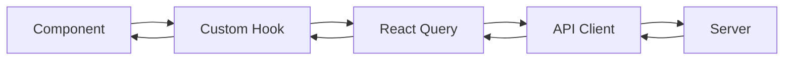
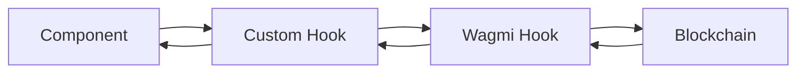
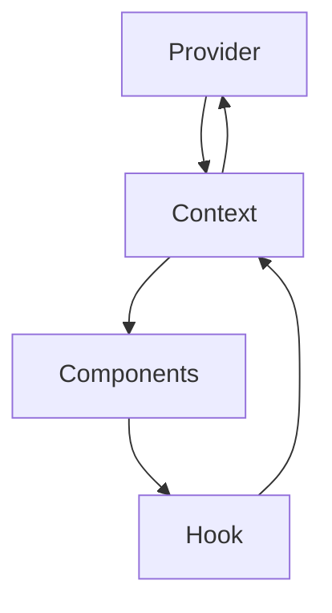

# Client State Management

## State Management Strategy

The client uses a multi-layered state management approach:

1. **Server State**: React Query (@tanstack/react-query)
2. **Client State**: React Context API
3. **Form State**: React Hook Form
4. **Blockchain State**: Wagmi hooks
5. **Local State**: React useState

## Server State (React Query)

### Configuration
- **staleTime**: 1 minute (data is fresh)
- **gcTime**: 5 minutes (cache time)
- **retry**: 1 (retry failed requests once)
- **refetchOnWindowFocus**: true
- **refetchOnReconnect**: true

### Query Patterns

#### Data Fetching
```typescript
const { data, isLoading, error } = useQuery({
  queryKey: ['tournament', tournamentId],
  queryFn: () => fetchTournament(tournamentId),
});
```

#### Mutations
```typescript
const mutation = useMutation({
  mutationFn: createContest,
  onSuccess: () => {
    queryClient.invalidateQueries(['contests']);
  },
});
```

### Custom Hooks
- **useTournamentData**: Tournament data fetching
- **useContestQuery**: Contest data fetching
- **useLineupData**: Lineup operations
- **useContestMutations**: Contest mutations

### Caching Strategy
- **Tournament Data**: Prefetched on app load
- **Contest Data**: Cached per contest ID
- **Lineup Data**: Cached per tournament/user
- **Token Balances**: Polled every 30 seconds

## Client State (Context API)

### PortoAuthContext
- **Purpose**: Authentication and user state
- **State**:
  - `user`: Current user object
  - `loading`: Authentication loading state
  - `platformTokenBalance`: CUT token balance
  - `paymentTokenBalance`: USDC balance
  - Token addresses and metadata
- **Methods**:
  - `updateUser()`: Update user profile
  - `updateUserSettings()`: Update user settings
  - `logout()`: Logout user
  - `isAdmin()`: Check if user is admin

### GlobalErrorContext
- **Purpose**: Global error handling
- **State**:
  - `errors`: Array of error messages
- **Methods**:
  - `showError()`: Display error message
  - `clearError()`: Clear error message

## Form State (React Hook Form)

### Form Management
```typescript
const { register, handleSubmit, formState: { errors } } = useForm({
  resolver: yupResolver(schema),
});
```

### Validation
- **Yup**: Schema validation
- **Zod**: Type validation (some forms)
- **Server Validation**: Always validate on server

## Blockchain State (Wagmi)

### Account State
- **useAccount**: Connected wallet, chain ID, status
- **useSwitchChain**: Chain switching
- **useDisconnect**: Wallet disconnection

### Contract Reads
- **useReadContract**: Read contract state
- **useBalance**: Token balances
- **Custom Hooks**: Wrap Wagmi for specific contracts

### Contract Writes
- **useSendCalls**: Send transactions
- **useWaitForCallsStatus**: Wait for transaction confirmation
- **useBlockchainTransaction**: Custom hook for transaction handling

## Local State (useState)

### Component State
- Form inputs (managed by React Hook Form)
- UI state (modals, dropdowns, etc.)
- Temporary calculations
- Component-specific flags

## State Flow Patterns

### Server Data Flow


### Blockchain Data Flow


### Context State Flow


## State Synchronization

### Server ↔ Client
- React Query handles synchronization
- Automatic refetching on focus/reconnect
- Manual invalidation after mutations

### Blockchain ↔ Client
- Wagmi handles synchronization
- Polling for balances (30 seconds)
- Event listening (if implemented)

### Context ↔ Components
- Context provides state to components
- Components update context via hooks
- Re-renders when context changes

## State Updates

### Optimistic Updates
- Some mutations use optimistic updates
- UI updates immediately
- Rollback on error

### Cache Invalidation
- After mutations, invalidate related queries
- Ensures fresh data
- Example: After creating contest, invalidate contest list

### Refetching
- Automatic refetch on window focus
- Automatic refetch on reconnect
- Manual refetch via `refetch()` function

## Performance Considerations

### Memoization
- `useMemo` for expensive calculations
- `useCallback` for stable function references
- `React.memo` for component memoization

### Query Optimization
- Query keys for precise cache targeting
- Selective refetching
- Background updates

### Context Optimization
- Split contexts by concern
- Avoid unnecessary re-renders
- Use refs for non-reactive values

## Error Handling

### Query Errors
- React Query handles retries
- Error states in components
- Global error context for critical errors

### Mutation Errors
- No automatic retry
- Error handling in components
- User-friendly error messages

### Blockchain Errors
- Transaction errors caught in hooks
- User-friendly error messages
- Retry logic for transient failures

## State Persistence

### Session Storage
- JWT token in HTTP-only cookie
- User preferences (if implemented)

### Local Storage
- Wallet connection state (via Wagmi)
- UI preferences (if implemented)

### No Persistence
- Server data: Fetched fresh on load
- Blockchain data: Fetched from chain
- Form data: Not persisted

## Testing State

### Unit Testing
- Test hooks in isolation
- Mock React Query
- Mock Wagmi hooks

### Integration Testing
- Test state updates
- Test cache invalidation
- Test error handling

