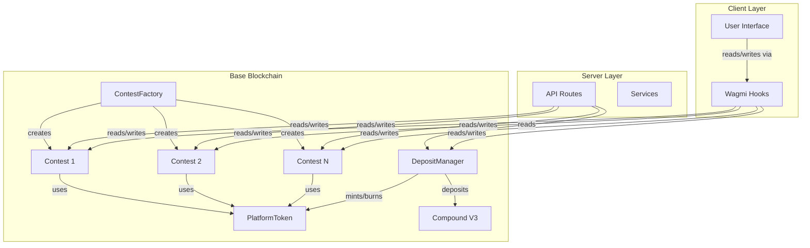

# Contracts Architecture

## High-Level Architecture

## Contract Relationships

### ContestFactory → Contest
- Factory creates Contest instances
- Each Contest is independent
- Factory tracks all created contests

### Contest → PlatformToken
- Contest uses PlatformToken for deposits
- Participants deposit PlatformToken to join
- Payouts are in PlatformToken

### DepositManager → PlatformToken
- DepositManager mints PlatformToken on USDC deposit
- DepositManager burns PlatformToken on USDC withdrawal
- 1:1 ratio maintained

### DepositManager → Compound V3
- USDC deposited to Compound V3 for yield
- Yield stays in contract (platform benefit)
- Fallback to direct storage if Compound unavailable

## Key Architectural Patterns

### Factory Pattern
- **ContestFactory** creates Contest instances
- Centralized creation and tracking
- Consistent initialization parameters

### State Machine Pattern
- **Contest** uses enum-based state machine
- States: OPEN, ACTIVE, LOCKED, SETTLED, CANCELLED, CLOSED
- State transitions controlled by oracle/admin
- Prevents invalid operations

### Three-Layer Architecture
- **Layer 0 (Oracle)**: External data provider
- **Layer 1 (Primary)**: Competition participants
- **Layer 2 (Secondary)**: Prediction market participants
- Unified in single Contest contract

### Economic Model
- **Oracle Fee**: 5% deducted at deposit time
- **Position Bonus**: 5% to entry owners
- **Cross-Subsidy**: Dynamic pool balancing (target 30% primary)
- **LMSR Pricing**: Logarithmic market scoring rule for secondary market

## Security Patterns

### Reentrancy Protection
- All contracts use OpenZeppelin's ReentrancyGuard
- External calls protected
- State changes before external calls

### Access Control
- Oracle/admin functions protected
- Ownable pattern for DepositManager
- Immutable parameters prevent changes

### Safe Token Handling
- SafeERC20 for all token transfers
- Proper approval patterns
- Error handling for failed transfers

## Data Structures

### Contest State
- `state`: Current contest state (enum)
- `entries[]`: Array of entry IDs
- `entryOwner`: Mapping of entry ID to owner
- `primaryDeposits`: Mapping of entry ID to deposit amount
- `secondaryPositions`: ERC1155 token balances for predictions

### Economic State
- `accumulatedOracleFee`: Total oracle fees collected
- `primaryPrizePool`: Primary participant prize pool
- `secondaryPrizePool`: Secondary market collateral
- `primaryPositionSubsidy`: Position bonuses per entry
- `primaryPrizePoolSubsidy`: Cross-subsidy to primary pool

## Key Functions

### Contest Lifecycle
- `addPrimaryPosition(entryId)`: Join contest as primary participant
- `removePrimaryPosition(entryId)`: Leave contest (OPEN state only)
- `activateContest()`: Start contest (oracle only)
- `lockContest()`: Lock secondary positions (oracle only)
- `settleContest(winningEntries, payouts)`: Settle contest (oracle only)
- `closeContest()`: Force distribution after expiry (oracle only)

### Secondary Market
- `addSecondaryPosition(entryId, amount)`: Add prediction
- `removeSecondaryPosition(entryId, tokens)`: Remove prediction (OPEN only)
- `calculateSecondaryPrice(entryId)`: Get current prediction price

### Claims
- `claimPrimaryPayout(entryId)`: Claim primary winnings
- `claimSecondaryPayout(entryId)`: Claim secondary winnings
- `claimOracleFee()`: Claim accumulated fees (oracle only)

## Design Decisions

### Why Single Contract for Contest?
- Unified state management
- Atomic operations across layers
- Simplified deployment
- Gas efficiency for common operations

### Why LMSR for Secondary Market?
- Provides liquidity without market makers
- Price discovery mechanism
- Prevents manipulation
- Well-established in prediction markets

### Why Cross-Subsidy?
- Maintains balance between primary and secondary markets
- Prevents one side from dominating
- Ensures both markets remain viable
- Configurable target ratio (30% primary)

### Why Compound V3 Integration?
- Generates yield on idle USDC
- Platform benefits from yield
- Users get 1:1 conversion regardless
- Fallback mechanism if Compound unavailable

