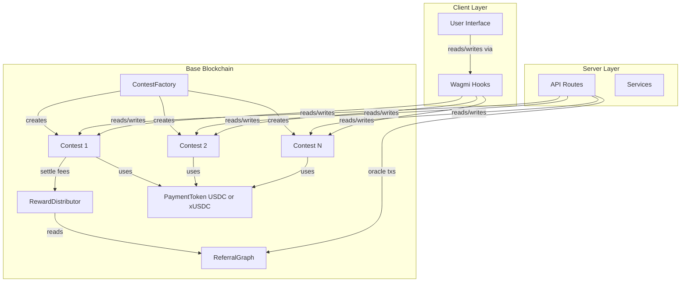

# Contracts Architecture

## High-Level Architecture

```mermaid
graph TB
    subgraph blockchain[Base Blockchain]
        CF[ContestFactory]
        C1[Contest 1]
        C2[Contest 2]
        CN[Contest N]
        RG[ReferralGraph]
        RD[RewardDistributor]
        PT[PaymentToken USDC or xUSDC]
    end

    subgraph server[Server Layer]
        API[API Routes]
        SVC[Services]
    end

    subgraph client[Client Layer]
        UI[User Interface]
        WAGMI[Wagmi Hooks]
    end

    CF -->|creates| C1
    CF -->|creates| C2
    CF -->|creates| CN

    C1 -->|uses| PT
    C2 -->|uses| PT
    CN -->|uses| PT
    C1 -->|settle fees| RD
    RD -->|reads| RG

    API -->|reads/writes| C1
    API -->|reads/writes| C2
    API -->|reads/writes| CN
    API -->|oracle txs| RG

    UI -->|reads/writes via| WAGMI
    WAGMI -->|reads/writes| C1
    WAGMI -->|reads/writes| C2
    WAGMI -->|reads/writes| CN
```

## Contract Relationships

### ContestFactory → ContestController
- Factory creates ContestController instances
- Each contest is independent
- Factory tracks created contests

### ContestController → Payment Token
- Contest uses ERC20 payment token for deposits (canonical USDC on Base; MockUSDC on Sepolia)
- Participants deposit to join; payouts return the same token

### ContestController → ReferralGraph / RewardDistributor
- Settlement routes `referralNetworkBps` fee through the distributor
- See [referral-network.md](../../docs/platform/referral-network.md)

## Key Architectural Patterns

### Factory Pattern
- **ContestFactory** creates ContestController instances
- Centralized creation and tracking

### State Machine Pattern
- States: OPEN, ACTIVE, LOCKED, SETTLED, CANCELLED, CLOSED
- State transitions controlled by oracle/admin

### Three-Layer Architecture
- **Layer 0 (Oracle)**: External data provider
- **Layer 1 (Primary)**: Competition participants
- **Layer 2 (Secondary)**: Prediction market participants
- Unified in a single ContestController

## Security Patterns

### Reentrancy Protection
- Contests use ReentrancyGuard on external value flows

### Access Control
- Oracle/admin functions protected
- Immutable parameters prevent changes after create

### Safe Token Handling
- SafeERC20 / SafeTransferLib patterns for token moves

## Data Structures

### Contest State
- `state`: Current contest state (enum)
- `entries[]`: Array of entry IDs
- `entryOwner`: Mapping of entry ID to owner
- `primaryDeposits`: Mapping of entry ID to deposit amount

See individual contract specs under `contracts/` for full field lists.
