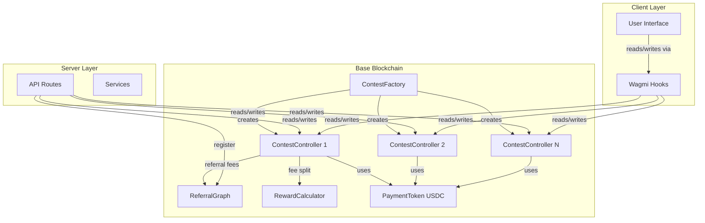

# Contracts Architecture

## High-Level Architecture

```mermaid
graph TB
    subgraph blockchain[Base Blockchain]
        CF[ContestFactory]
        C1[ContestController 1]
        C2[ContestController 2]
        CN[ContestController N]
        RG[ReferralGraph]
        RC[RewardCalculator]
        PT[PaymentToken USDC]
    end
    
    subgraph server[Server Layer]
        API[API Routes]
        SVC[Services]
    end
    
    subgraph client[Client Layer]
        UI[User Interface]
        WAGMI[Wagmi Hooks]
    end
    
    CF -->|creates| C1
    CF -->|creates| C2
    CF -->|creates| CN
    
    C1 -->|uses| PT
    C2 -->|uses| PT
    CN -->|uses| PT
    C1 -->|referral fees| RG
    C1 -->|fee split| RC
    
    API -->|reads/writes| C1
    API -->|reads/writes| C2
    API -->|reads/writes| CN
    API -->|register| RG
    
    UI -->|reads/writes via| WAGMI
    WAGMI -->|reads/writes| C1
    WAGMI -->|reads/writes| C2
    WAGMI -->|reads/writes| CN
```

## Contract Relationships

### ContestFactory → ContestController
- Factory creates ContestController instances
- Each contest is independent
- Factory tracks all created contests

### ContestController → PaymentToken
- Contests escrow the payment token (canonical USDC on Base, MockUSDC on Sepolia)
- Participants deposit payment token to join
- Payouts are in the same payment token

### ContestController → ReferralGraph / RewardCalculator
- Settlement skims `referralNetworkBps` and splits via RewardCalculator over ReferralGraph ancestors

## Key Architectural Patterns

### Factory Pattern
- **ContestFactory** creates ContestController instances
- Centralized creation and tracking
- Consistent initialization parameters

### State Machine Pattern
- **ContestController** uses enum-based state machine
- States: OPEN, ACTIVE, LOCKED, SETTLED, CANCELLED, CLOSED
- State transitions controlled by oracle/admin
- Prevents invalid operations

### Three-Layer Architecture
- **Layer 0 (Oracle)**: External data provider
- **Layer 1 (Primary)**: Competition participants
- **Layer 2 (Secondary)**: Prediction market participants
- Unified in single ContestController contract

### Economic Model
- **Referral network fee**: Skimmed from gross TVL at settlement
- **Cross-Subsidy**: Dynamic pool balancing
- **Bonding curve / LMSR-style pricing**: Secondary market shares

## Security Patterns

### Reentrancy Protection
- Controllers use ReentrancyGuard
- External calls protected
- State changes before external calls

### Access Control
- Oracle/admin functions protected (OPS_ORACLE)
- Immutable contest parameters after create

### Safe Token Handling
- SafeERC20 / SafeTransferLib for token transfers
- Proper approval patterns
- Error handling for failed transfers

## Key Functions

### Contest Lifecycle
- `addPrimaryPosition(entryId)`: Join contest as primary participant
- `removePrimaryPosition(entryId)`: Leave contest (OPEN state only)
- `activateContest()`: Start contest (oracle only)
- `lockContest()`: Lock secondary positions (oracle only; required before settle)
- `settleContest(winningEntries, payoutBps)`: Settle contest (oracle only; LOCKED)
- `closeContest()`: Force distribution after expiry (oracle only)

### Secondary Market
- `addSecondaryPosition(entryId, amount)`: Add prediction (ACTIVE only)
- `removeSecondaryPosition(entryId, tokens)`: Remove prediction (OPEN or CANCELLED only)

### Claims
- `claimPrimaryPayout(entryId)`: Claim primary winnings
- `claimSecondaryPayout(entryId)`: Claim secondary winnings
