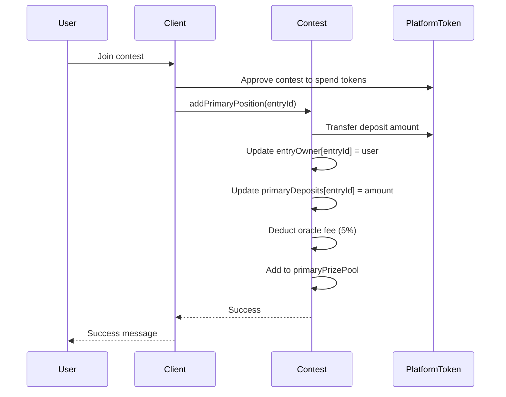
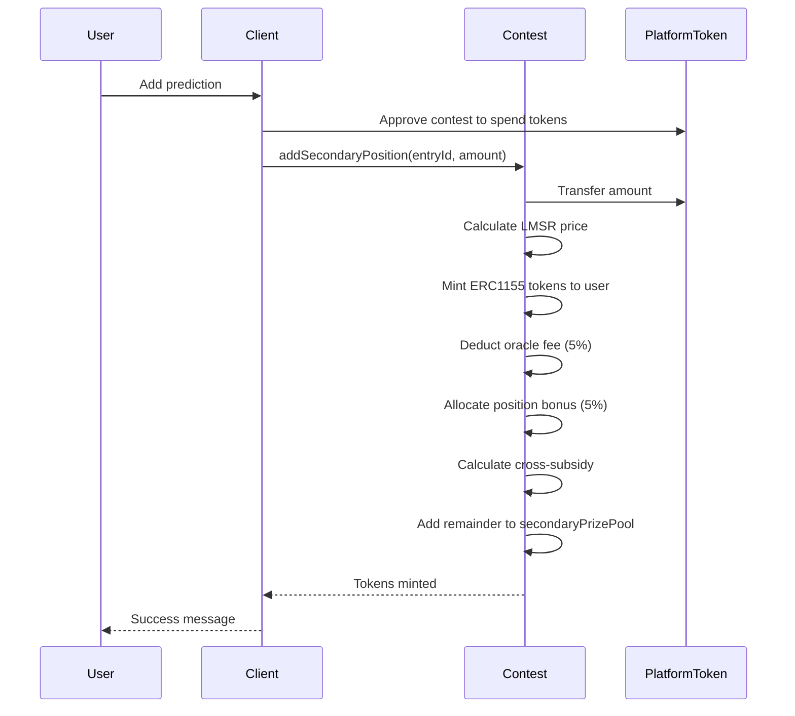
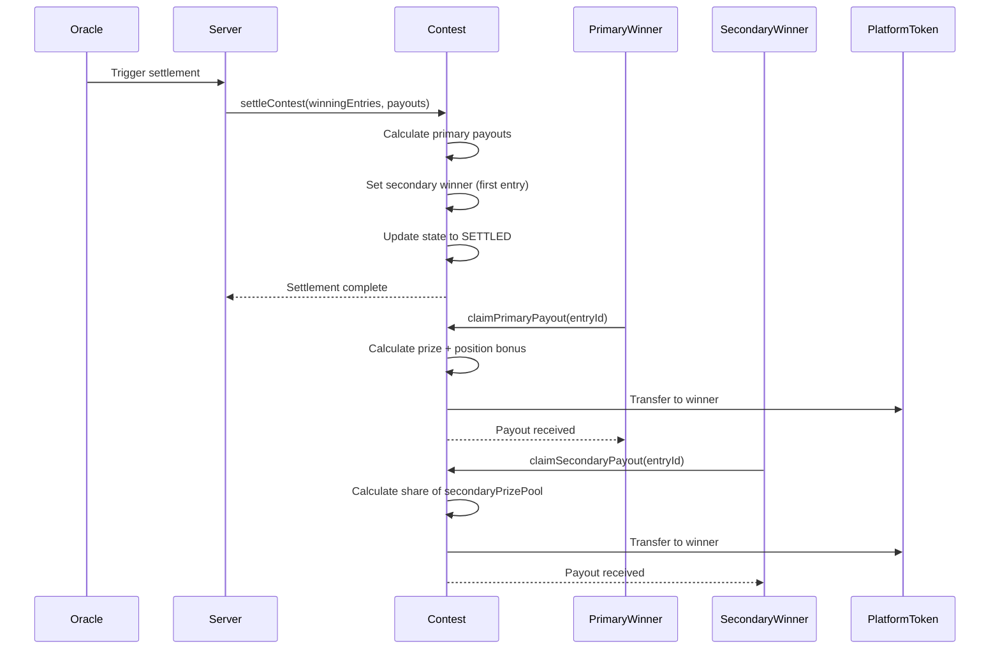
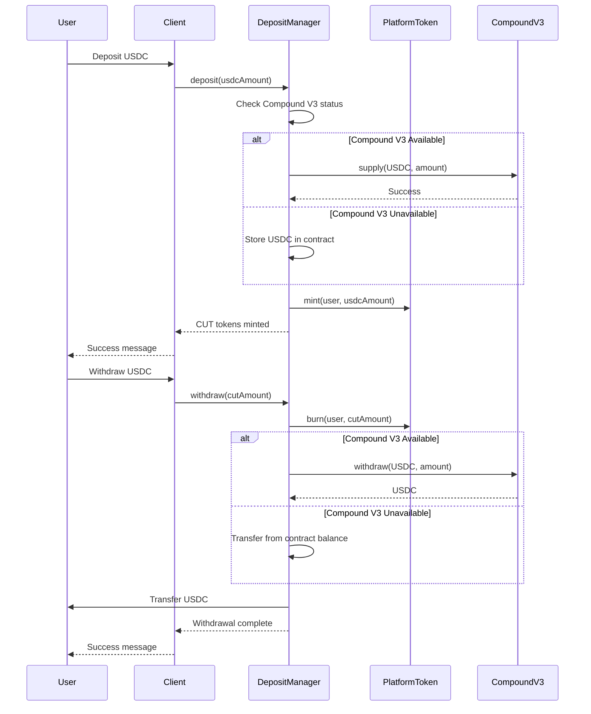
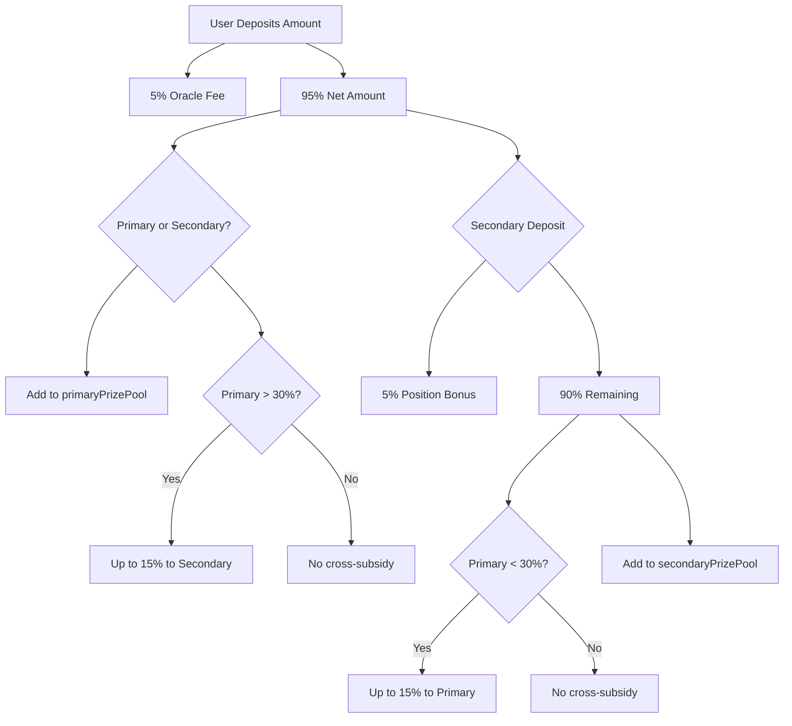
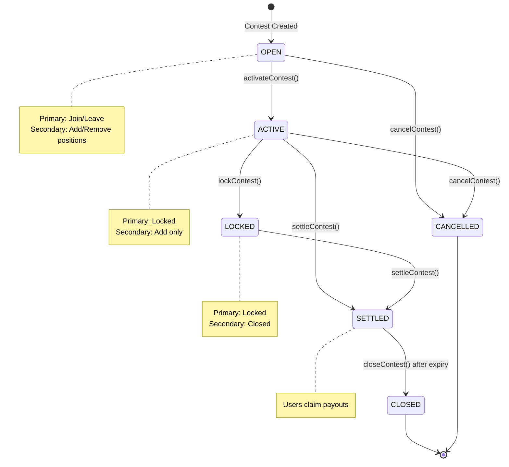

# Contracts Data Flow

## Primary Participant Flow



## Secondary Participant Flow



## Contest Settlement Flow



## Deposit/Withdrawal Flow



## Economic Flow (Deposit Processing)



## State Transition Flow



## Key Data Transformations

### Primary Deposit
```
Input: amount (PlatformToken)
├─ Oracle Fee: amount × 5% → accumulatedOracleFee
└─ Net: amount × 95%
   └─ Add to primaryPrizePool
      └─ Check cross-subsidy (if primary > 30% target)
```

### Secondary Deposit
```
Input: amount (PlatformToken), entryId
├─ Oracle Fee: amount × 5% → accumulatedOracleFee
└─ Net: amount × 95%
   ├─ Position Bonus: net × 5% → primaryPositionSubsidy[entryId]
   └─ Remaining: net × 90%
      ├─ Cross-Subsidy: up to 15% → primaryPrizePoolSubsidy (if primary < 30%)
      └─ Collateral: remainder → secondaryPrizePool
         └─ Mint ERC1155 tokens based on LMSR price
```

### Settlement Calculation
```
Primary Payout:
├─ Layer1Pool = primaryPrizePool + primaryPrizePoolSubsidy
├─ For each winner: payout = Layer1Pool × payoutBps[i] / 10000
└─ Position Bonus: primaryPositionSubsidy[entryId] (already allocated)

Secondary Payout:
├─ Winner = first entry in winningEntries[]
├─ Total winning tokens = balanceOf(winner, tokenId)
├─ User share = userTokens / totalWinningTokens
└─ Payout = userShare × secondaryPrizePool
```

